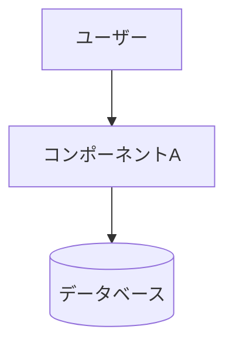

# Spec-Driven Development

**Output language rule: All user-facing output MUST be in Japanese.** EARS notation keywords (WHEN, THEN, SHALL, IF, WHILE, WHERE) remain in English.

You have been explicitly invoked with `/spec`. Start the spec-driven development workflow immediately.

## 起動時の動作

If the user provided a feature name or description after `/spec` (e.g. `/spec ユーザー認証`), use that as the starting point and skip directly to Phase 1 Step 1 clarification questions.

If invoked with no arguments (`/spec` only), ask in Japanese:
「どの機能のスペックを作成しますか？簡単に教えてください。」

---

## フォルダ構成

成果物は以下に保存する：

```
.specs/
└── <feature-name>/
    ├── requirements.md   ← Phase 1
    ├── design.md         ← Phase 2
    └── tasks.md          ← Phase 3
```

---

## Phase 1: 要件定義

**Goal**: Turn a vague idea into explicit user stories with acceptance criteria.

### Step 1 — Clarify intent

Ask the user in Japanese. Keep it to 2–3 targeted questions max:
- 「この機能を使うのは誰ですか？」
- 「どんな課題を解決したいですか？」
- 「技術的な制約（使用技術、既存システムなど）はありますか？」

### Step 2 — Generate requirements.md

Write `.specs/<feature-name>/requirements.md`:

```markdown
# 要件定義: <機能名>

## はじめに
<2〜3文：この機能が何か、なぜ必要か、誰が使うか>

## 要件

### 要件1: <短いタイトル>
**ユーザーストーリー：** <ロール>として、<目標>したい。なぜなら<理由>だから。

#### 受け入れ基準
1. WHEN <トリガー> THEN the system SHALL <ふるまい>
2. IF <条件> WHEN <トリガー> THEN the system SHALL <ふるまい>
3. WHILE <状態> the system SHALL <ふるまい>
```

EARS keywords stay in English; trigger/behavior descriptions in Japanese.

### Step 3 — Review

Ask: 「この要件定義で意図したことは網羅できていますか？追加・修正が必要な要件はありますか？」

Revise until approved, then move to Phase 2.

---

## Phase 2: 設計書

**Goal**: Translate requirements into a concrete technical architecture.

### Step 1 — Analyze the codebase

Read key files (package.json, main entry points) to understand the existing tech stack and conventions.

### Step 2 — Generate design.md

**Diagram rule: ALL diagrams MUST use Mermaid syntax. Never use ASCII art.**

Use:
- `flowchart TD/LR` — データフロー、コンポーネント関係
- `sequenceDiagram` — API呼び出し順序
- `erDiagram` — データモデル
- `classDiagram` — クラス・型の関係

Write `.specs/<feature-name>/design.md`:

```markdown
# 設計書: <機能名>

## 概要
<技術的アプローチの要約>

## アーキテクチャ

### コンポーネント
| コンポーネント | 責務 |
|--------------|------|
| `<名前>` | <何をするか> |

### データモデル
<型定義・DBスキーマ>

### API / インターフェース
<関数シグネチャ・エンドポイント>

## データフロー



## 実装方針
### <領域>
<技術的判断とその理由>

## 依存関係
| パッケージ | 用途 | 導入済み？ |
|----------|------|----------|

## トレードオフと検討した代替案
- **決定内容**：<何を決めたか> / **理由**：<なぜか>
```

### Step 3 — Traceability check

Every requirement must map to at least one design section.

### Step 4 — Review

Ask: 「この設計方針で問題ありませんか？」

**If requirements need to change:**
1. Update `requirements.md` first
2. Update `design.md` to match
3. Re-run traceability check on both
4. Show summary of changes in both files
5. Get re-approval of both before proceeding

Never update only one file when a change affects both.

---

## Phase 3: タスク一覧

**Goal**: Convert the design into a concrete, ordered implementation checklist.

### Step 1 — Generate tasks.md

Write `.specs/<feature-name>/tasks.md`:

```markdown
# タスク一覧: <機能名>

## 概要
<実装方針とクリティカルパスの要約>

合計タスク数：N件 ｜ 想定工数：X時間

## タスク

- [ ] **1. <タスクタイトル>**
  - 内容：<具体的な説明>
  - ファイル：`<path/to/file>`
  - 依存：なし
  - 完了条件：<どうなったら完了か>

- [ ] **2. <タスクタイトル>**
  - 内容：<具体的な説明>
  - ファイル：`<path/to/file>`
  - 依存：タスク1
  - 完了条件：<どうなったら完了か>
```

Task rules:
- 1タスク = 2時間以内に完了できる粒度
- 依存関係順に並べる
- 具体的なファイル名を書く
- 各タスクに完了条件を書く

### Step 2 — Traceability check

Every requirement → design section → at least one task.

### Step 3 — Start implementing

Ask: 「このタスク一覧で実装を始めましょうか？タスク1から順に進めていきます。」

After each task completes, update: `- [x] **1. <タイトル>**  ✓ 完了`

---

## カスケード更新ルール

変更が起きたとき、必ず以下のファイルをすべて更新すること：

| 変更タイミング | 更新対象 |
|---|---|
| Phase 1レビュー中 | `requirements.md` のみ |
| Phase 2レビュー中 | `requirements.md` → `design.md` |
| Phase 3レビュー中 | `requirements.md` → `design.md` → `tasks.md` |
| 実装中 | 影響するすべてのファイル |
