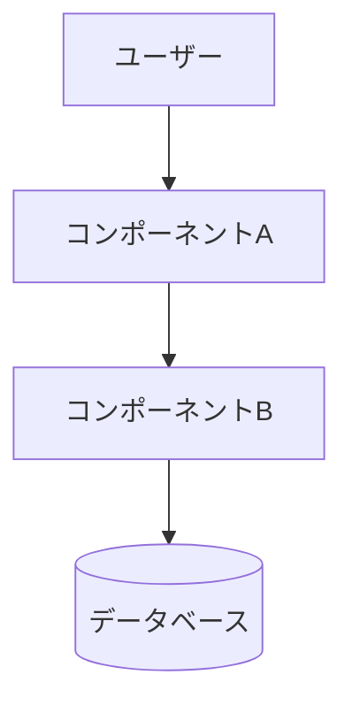

# Spec-Driven Development for Claude Code

Spec-driven development means: **write the spec first, then write the code.**

**Output language rule: All user-facing output MUST be in Japanese.** This includes questions asked to the user, generated spec documents, explanations, and progress updates. EARS notation keywords (WHEN, THEN, SHALL, IF, WHILE, WHERE) remain in English as they are technical syntax.

The workflow has three phases, each producing a Markdown file saved to `.specs/<feature-name>/`:

```
.specs/
└── <feature-name>/
    ├── requirements.md   ← Phase 1
    ├── design.md         ← Phase 2
    └── tasks.md          ← Phase 3
```

Work through phases in order. Always pause for user review between phases before proceeding.

---

## Phase 1: Requirements

**Goal**: Turn a vague idea into explicit user stories with acceptance criteria.

### Step 1 — Clarify intent

Ask the user in Japanese (if not already clear). Keep it to 2–3 targeted questions max. Example questions to adapt:
- 「この機能を使うのは誰ですか？」
- 「どんな課題を解決したいですか？」
- 「技術的な制約（使用技術、既存システムなど）はありますか？」

### Step 2 — Generate requirements.md

Write `.specs/<feature-name>/requirements.md` using this Japanese structure:

```markdown
# 要件定義: <機能名>

## はじめに
<2〜3文：この機能が何か、なぜ必要か、誰が使うか>

## 要件

### 要件1: <短いタイトル>
**ユーザーストーリー：** <ロール>として、<目標>したい。なぜなら<理由>だから。

#### 受け入れ基準
1. WHEN <トリガー> THEN the system SHALL <ふるまい>
2. WHEN <トリガー> AND <条件> THEN the system SHALL <ふるまい>
3. IF <前提条件> WHEN <トリガー> THEN the system SHALL <ふるまい>

### 要件2: <短いタイトル>
...
```

### EARS Notation Rules

EARS (Easy Approach to Requirements Syntax) keeps acceptance criteria unambiguous. Keywords stay in English; descriptions of triggers and behaviors should be written in Japanese.

| パターン | テンプレート | 使いどころ |
|---------|----------|----------|
| イベント駆動 | `WHEN <トリガー> THEN the system SHALL <応答>` | ユーザー操作、システムイベント |
| 条件付き | `IF <条件> WHEN <トリガー> THEN the system SHALL <応答>` | 文脈依存のふるまい |
| 禁止 | `IF <条件> THEN the system SHALL NOT <ふるまい>` | 制約、禁止事項 |
| 状態継続 | `WHILE <状態> the system SHALL <ふるまい>` | 継続中のふるまい |
| オプション | `WHERE <機能が有効> the system SHALL <ふるまい>` | オプション機能 |

**良い例：**
```
WHEN ユーザーがログインフォームを送信する THEN the system SHALL メール形式を検証する
IF メールが不正な形式の場合 WHEN ユーザーが送信する THEN the system SHALL インラインエラーを表示する
WHILE ログインリクエストが処理中 the system SHALL 送信ボタンを無効化する
```

**悪い例（避ける）：**
```
システムはフォームを検証する  ← トリガーが不明
ユーザーはエラーを見られる  ← 受動的、条件がない
```

### Step 3 — Review with user

Ask in Japanese:
- 「この要件定義で意図したことは網羅できていますか？」
- 「追加・修正が必要な要件はありますか？」

Revise until the user approves, then move to Phase 2.

---

## Phase 2: Design

**Goal**: Translate requirements into a concrete technical architecture.

### Step 1 — Analyze the codebase

Before writing anything, understand the existing project:
- Read key files (package.json, main entry points, existing patterns)
- Identify the tech stack, conventions, and relevant existing code
- Note what can be reused vs. what needs to be built new

### Step 2 — Generate design.md

**Diagram rule: ALL diagrams MUST use Mermaid syntax. Never use ASCII art (`→`, `├`, `└`) or plain text diagrams.**

Mermaid diagram types to use:
- `flowchart TD` / `flowchart LR` — データフロー、コンポーネント関係
- `sequenceDiagram` — API呼び出しの順序、ユーザーインタラクション
- `erDiagram` — データモデル・DB設計
- `classDiagram` — クラス・型の関係

Write `.specs/<feature-name>/design.md` using this Japanese structure:

```markdown
# 設計書: <機能名>

## 概要
<技術的アプローチと主要な設計判断の要約（1〜2段落）>

## アーキテクチャ

### コンポーネント

| コンポーネント | 責務 |
|--------------|------|
| `<コンポーネントA>` | <何をするか> |
| `<コンポーネントB>` | <何をするか> |

### データモデル
<主要なデータ構造・型・DBスキーマ>

### API / インターフェース
<主要な関数シグネチャ、APIエンドポイント、コンポーネントインターフェース>

## データフロー



## 実装方針

### <領域1（例：状態管理）>
<技術的判断とその理由>

### <領域2（例：エラーハンドリング）>
<技術的判断とその理由>

## 依存関係

| パッケージ | 用途 | 導入済み？ |
|----------|------|----------|
| `<package>` | <なぜ必要か> | はい / いいえ |

## トレードオフと検討した代替案
- **決定内容**：<何を決めたか>
  **理由**：<なぜそうしたか>
  **検討した代替案**：<何を検討して、なぜ採用しなかったか>
```

### Step 3 — Traceability check

Each requirement from `要件定義.md` should map to at least one design section. Verify nothing is missed.

### Step 4 — Review with user

Ask in Japanese: 「この設計方針で問題ありませんか？実装を進める前に修正したい点はありますか？」

**If the user wants to change requirements during design review:**

This is normal and expected. Follow this procedure:

1. Tell the user in Japanese:
   「要件の変更が必要ですね。`requirements.md` と `design.md` を両方同時に更新します。」

2. Update `requirements.md` first — add, remove, or modify the affected requirements and acceptance criteria.

3. Then update `design.md` to reflect the new requirements — adjust architecture, data models, or data flow as needed.

4. Run a traceability check on both files: every requirement must map to a design section, and no design section should reference a removed requirement.

5. Show the user a summary of what changed in both files:
   「以下を変更しました：
   - `requirements.md`：<変更内容>
   - `design.md`：<変更内容>」

6. Ask for re-approval of both files before moving to Phase 3.

**Rule: Never update only one file when a change affects both. requirements.md and design.md must always be kept in sync.**

Confirm both files are approved before moving to Phase 3.

---

## Phase 3: Tasks

**Goal**: Convert the design into a concrete, ordered implementation checklist.

### Step 1 — Generate tasks.md

Write `.specs/<feature-name>/tasks.md` using this Japanese structure:

```markdown
# タスク一覧: <機能名>

## 概要
<実装方針とクリティカルパスの要約（1段落）>

合計タスク数：N件 ｜ 想定工数：X時間

## タスク

- [ ] **1. <タスクタイトル>**
  - 内容：<何を作る・変更するかの具体的な説明>
  - ファイル：`<path/to/file.ts>`、`<path/to/other.ts>`
  - 依存：なし（または：タスクNの完了後）
  - 完了条件：<どうなったら完了か — 例：「単体テストがパスする」「エンドポイントが200を返す」>

- [ ] **2. <タスクタイトル>**
  - 内容：<具体的な説明>
  - ファイル：`<path/to/file.ts>`
  - 依存：タスク1
  - 完了条件：<どうなったら完了か>
```

### Task writing rules

- **1タスク = 1つの論理的な作業単位**（理想は2時間以内に完了できる粒度）
- **依存関係順に並べる** — 前のタスクが完了しなくても着手できる場合は独立タスクとして分ける
- **具体的なファイル名を書く** — 可能な限り実際のファイルパスを明記
- **タスクごとに完了条件を書く** — 「何となく実装した」を防ぐ
- **「後でクリーンアップ」タスクを作らない** — 品質は最初から各タスクに組み込む

### Step 2 — Traceability check

Verify: each requirement → design section → at least one task. Flag any orphaned requirements in Japanese.

### Step 3 — Review and start implementing

Ask in Japanese: 「このタスク一覧で実装を始めましょうか？タスク1から順に進めていきます。」

When the user confirms, begin with Task 1. After each task completes, update the checkbox:
```
- [x] **1. <タスクタイトル>**  ✓ 完了
```

---

## Key Principles

**Spec before code.** Never start implementing before requirements are approved. If the user tries to skip ahead, redirect them: 「まず要件定義を完成させてから実装に進みましょう。」

**One phase at a time.** Complete and review each phase before proceeding. The user may want to adjust requirements after seeing the design — that's fine and expected.

**Specs are living documents — cascade updates are mandatory.** When anything changes, update ALL affected files together. Never leave files in an inconsistent state:

| 変更が起きたフェーズ | 更新が必要なファイル |
|------------------|------------------|
| Phase 1レビュー中に要件変更 | `requirements.md` のみ更新 |
| Phase 2レビュー中に要件変更 | `requirements.md` → `design.md` を両方更新 |
| Phase 3レビュー中に要件変更 | `requirements.md` → `design.md` → `tasks.md` を全部更新 |
| 実装中に仕様変更 | 影響するすべてのファイルを更新 |

変更後は必ずトレーサビリティチェックを再実行し、「要件→設計→タスク」のつながりが保たれていることを確認すること。

**Traceability matters.** Every task should trace back to a requirement. If a task doesn't map to a requirement, question whether it's needed.

**Small, verifiable tasks.** A task that says "バックエンドを実装する" is not a task. Break it down until each item has a clear done condition.

---

## Reference files

- `references/ears-examples.md` — EARS記法のドメイン別サンプル集（Web/Auth/API/ファイル/検索など）
- `references/templates.md` — requirements.md・design.md・tasks.mdのコピペ用テンプレート
