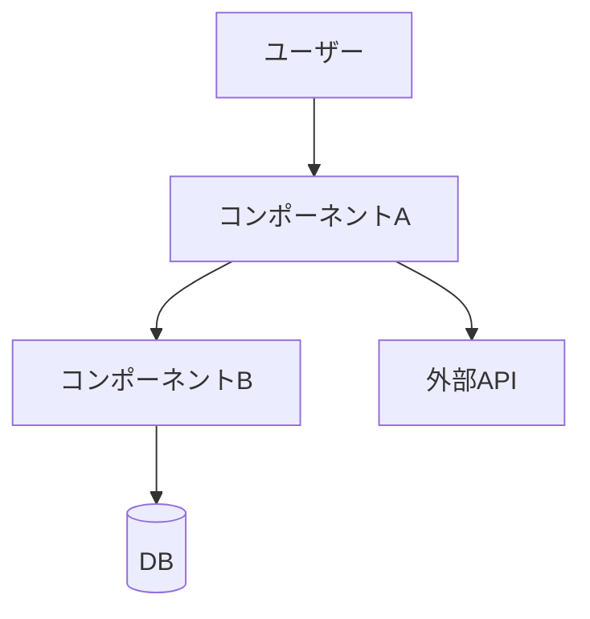

# スペックテンプレート集

各フェーズのコピペ用スターターテンプレートです。

---

## requirements.md

```markdown
# 要件定義: <機能名>

## はじめに

<この機能が何か、なぜ必要か、誰が使うかを2〜3文で記述。>

## 要件

### 要件1: <短いタイトル>

**ユーザーストーリー：** <ロール>として、<目標>したい。なぜなら<理由>だから。

#### 受け入れ基準

1. WHEN <トリガー> THEN the system SHALL <ふるまい>
2. WHEN <トリガー> AND <条件> THEN the system SHALL <ふるまい>
3. IF <前提条件> WHEN <トリガー> THEN the system SHALL <ふるまい>
4. IF <条件> THEN the system SHALL NOT <ふるまい>

---

### 要件2: <短いタイトル>

**ユーザーストーリー：** <ロール>として、<目標>したい。なぜなら<理由>だから。

#### 受け入れ基準

1. WHEN <トリガー> THEN the system SHALL <ふるまい>
2. WHILE <状態> the system SHALL <ふるまい>
```

---

## design.md

```markdown
# 設計書: <機能名>

## 概要

<技術的アプローチと主要な設計判断を1〜2段落で要約。>

## アーキテクチャ

### コンポーネント

| コンポーネント | 責務 |
|--------------|------|
| `<コンポーネントA>` | <何をするか> |
| `<コンポーネントB>` | <何をするか> |

### データモデル

```typescript
// スタックに合わせて調整してください
interface <モデル名> {
  id: string
  <フィールド>: <型>
  createdAt: Date
  updatedAt: Date
}
```

### API / インターフェース

```typescript
// 主要な関数シグネチャやAPIエンドポイント
```

## データフロー



## 実装方針

### <領域1（例：状態管理）>

<技術的判断とその理由。>

### <領域2（例：エラーハンドリング）>

<技術的判断とその理由。>

## 依存関係

| パッケージ | 用途 | 導入済み？ |
|----------|------|----------|
| `<package>` | <なぜ必要か> | はい / いいえ |

## トレードオフと検討した代替案

- **決定内容**：<何を決めたか>
  **理由**：<なぜそうしたか>
  **検討した代替案**：<何を検討して、なぜ採用しなかったか>
```

---

## tasks.md

```markdown
# タスク一覧: <機能名>

## 概要

<実装順序とクリティカルパスの要約（1段落）。>

合計タスク数：N件 ｜ 想定工数：X時間

## タスク

- [ ] **1. <タスクタイトル>**
  - 内容：<具体的な説明>
  - ファイル：`<path/to/file.ts>`、`<path/to/other.ts>`
  - 依存：なし
  - 完了条件：<どうなったら完了か — 例：「単体テストがパスする」>

- [ ] **2. <タスクタイトル>**
  - 内容：<具体的な説明>
  - ファイル：`<path/to/file.ts>`
  - 依存：タスク1
  - 完了条件：<どうなったら完了か>

- [ ] **3. <タスクタイトル>**
  - 内容：<具体的な説明>
  - ファイル：`<path/to/file.ts>`
  - 依存：タスク1、2
  - 完了条件：<どうなったら完了か>
```
