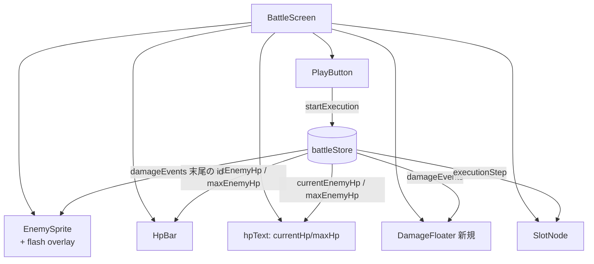
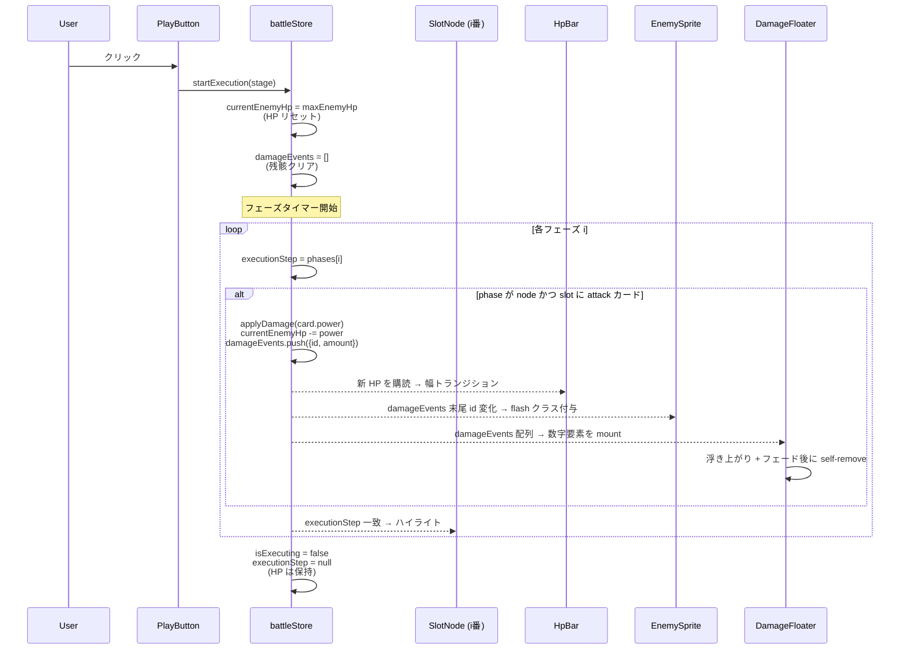

# 設計書: 攻撃カード処理（ダメージ計算と演出）

## 概要

`requirements.md` で定義した攻撃カード処理を、既存の `battleStore` と React Flow ベースのフローチャート実行サイクルに統合する。中心となる設計判断は次の 3 点。

1. **敵 HP は `battleStore` に集約する**: 既存の `handCards` / `slotAssignments` / `executionStep` と同列のグローバル状態として `currentEnemyHp` / `maxEnemyHp` を保持し、HP バーとダメージ適用ロジックが同じソースを参照する。
2. **ダメージ適用は `startExecution` のフェーズタイマー内で実行する**: スロット通過の演出（`SlotNode` の `.active` ハイライト）と完全に同じタイマーで `applyDamage(power)` を発火することで、フラッシュ・ダメージ数字・HP バー減少の起点を 1 点に揃える。
3. **演出は宣言的にデータドリブン化する**: 「最後にヒットした合図」を `damageEvents: Array<{id, amount}>` としてストアに置き、`EnemySprite`（フラッシュ）と新規の `DamageFloater`（数字フロート）がこの配列を購読して自走アニメーションする。命令的に DOM をいじる API は導入しない。

本設計は要件 1〜8 をすべて満たし、既存の `play-button` / `flowchart-zoom` / `card-placement` の挙動には変更を入れない（追加のみ）。

## アーキテクチャ

### コンポーネント構成図



### データフロー（実行 → 攻撃適用 → 演出）



### 演出タイミング（1 ヒット分）

```
  T=0ms                        T=phaseMs (= totalMs / phases.length)
  │                            │
  ├─ executionStep = {node, slot-i}
  ├─ applyDamage(power)
  │    ├─ HP バー幅: 0.25s ease-out で新比率へ
  │    ├─ EnemySprite flash: 0.25s で 1 回明滅
  │    └─ DamageFloater: 「-N」を 0.8s で上昇＋フェードアウト
  │                                                     │
  │                                                     └ 自己 unmount
  ├─ SlotNode .active: 0.3s × 2 alternate（既存）
  └────────────────────────────── 次フェーズへ
```

3 演出すべて 1 フェーズ（既定 `EXECUTION_PER_CARD_MS / phases.length` = `2000 × slots / phases.length` ≒ 数百ms 単位）の中に収まる。フロート数字だけ 0.8s と少し長いが、次のフェーズの演出と独立したレイヤで描画するため重なっても干渉しない（要件 6-3）。

## 状態管理（battleStore の拡張）

既存の状態に以下を追加する。`isExpanded` の慣例にならい、`initializeBattle` で初期化／リセットする値と、`startExecution` のたびにリセットする値を区別する。

### 追加する state

| キー                | 型                              | 初期値 | 更新タイミング                                                                       |
| ------------------- | ------------------------------- | ------ | ------------------------------------------------------------------------------------ |
| `currentEnemyHp`    | `number`                        | `0`    | `initializeBattle` で `maxHp` に。`startExecution` で `maxHp` に戻し、ヒット毎に減算 |
| `maxEnemyHp`        | `number`                        | `0`    | `initializeBattle` で `enemiesData` から取得して保持                                 |
| `damageEvents`      | `Array<{id:string,amount:number}>` | `[]`   | ヒット毎に `push`、`startExecution` 開始時にクリア                                   |

`damageEvents` の `id` はバトル内で一意な単調増加の値（`d-${counter}`）で、React の `key` として使う。フローター側で自己 unmount する際に親（store）から該当要素を削除するアクション `dismissDamageEvent(id)` も用意する。

### 追加・変更するアクション

#### `initializeBattle(stage)` の拡張

```jsx
initializeBattle: (stage) => {
  const enemy = enemiesData.enemies.find((e) => e.id === stage.enemyId);
  const maxHp = enemy?.maxHp ?? 0;
  set(() => ({
    handCards: expandHandCards(stage.cards ?? []),
    slotAssignments: emptySlotAssignments(stage.slots ?? []),
    activeInstanceId: null,
    maxEnemyHp: maxHp,
    currentEnemyHp: maxHp,
    damageEvents: [],
  }));
}
```

`enemiesData` をストアモジュールから直接 import する（`BattleScreen.jsx` で参照しているのと同じ JSON）。これで「敵 HP の真実は store に閉じる」設計になり、ビュー側は `currentEnemyHp` / `maxEnemyHp` を読むだけでよい。

#### `startExecution(stage)` の拡張（要件 3-1）

`beginSequence` の冒頭で HP リセットと `damageEvents` クリアを行う。

```jsx
const beginSequence = () => {
  const phases = buildExecutionPath(stage);
  const totalMs = stage.slots.length * EXECUTION_PER_CARD_MS;
  const phaseMs = totalMs / phases.length;

  // 要件 3-1: 実行のたびに HP を maxHp に戻す
  set((s) => ({
    isExecuting: true,
    currentPhaseMs: phaseMs,
    currentEnemyHp: s.maxEnemyHp,
    damageEvents: [],
  }));

  phases.forEach((phase, i) => {
    setTimeout(() => {
      set({ executionStep: phase });
      // 要件 2-1, 2-2, 2-3: ノードフェーズでスロットに attack カードがあればダメージ適用
      if (phase.type === 'node') {
        const card = get().slotAssignments[phase.id];
        if (card && card.id === 'attack') {
          get().applyDamage(card.power);
        }
      }
    }, i * phaseMs);
  });
  setTimeout(() => {
    set({ isExecuting: false, executionStep: null, currentPhaseMs: null });
    // 注: currentEnemyHp は保持（要件 3-2）
  }, phases.length * phaseMs);
};
```

`phase.id === 'start'` / `'goal'` には `slotAssignments[phase.id]` が `undefined` なので、ガードで自然にスキップされる（カード判定で `card && card.id === 'attack'`）。

#### 新規アクション `applyDamage(amount)`（要件 1-3, 2-1）

```jsx
applyDamage: (amount) => set((state) => {
  const next = Math.max(0, state.currentEnemyHp - amount);
  const id = `d-${state._damageCounter ?? 0}`;
  return {
    currentEnemyHp: next,
    damageEvents: [...state.damageEvents, { id, amount }],
    _damageCounter: (state._damageCounter ?? 0) + 1,
  };
});
```

- 0 クランプ（要件 1-3）はここで担保する。
- `_damageCounter` はキー生成専用の内部カウンタ。アンダースコア付きで「ビューが直接購読しない」意図を示す。

#### 新規アクション `dismissDamageEvent(id)`

```jsx
dismissDamageEvent: (id) => set((state) => ({
  damageEvents: state.damageEvents.filter((e) => e.id !== id),
}));
```

`DamageFloater` の各浮き数字が `onAnimationEnd` で呼び出し、配列から自身を取り除く。これにより `damageEvents` が無限に膨らむのを防ぐ。

### state リセット境界の整理

| イベント                    | `maxEnemyHp` | `currentEnemyHp` | `damageEvents` |
| --------------------------- | ------------ | ---------------- | -------------- |
| 戦闘画面マウント時 (`initializeBattle`) | 設定         | `maxHp` で初期化 | `[]`           |
| 実行開始 (`startExecution`) | 触らない     | `maxHp` に復帰   | `[]`           |
| 実行完了                    | 触らない     | 保持（結果値）   | 演出が終わるまで残り、各要素が自分で `dismiss` |
| リセットボタン (要件 3-4 / 8-1) | 触らない     | **触らない**     | 触らない       |
| 拡大トグル (要件 8-2 / 8-4) | 触らない     | 触らない         | 触らない       |

リセットボタンは `initializeBattle` を呼んでいない（`flowchart/ResetButton.jsx` は手札・スロットのみ初期化）。今回も `initializeBattle` の責務に手を入れる必要はなく、リセットボタン側のコードも無変更でよい。`initializeBattle` は「画面マウント時に 1 回だけ呼ばれる初期化」という現在の役割が維持される。

## コンポーネント設計

### 1. `BattleScreen.jsx` の改修

変更は最小限。ローカル変数 `enemyMaxHp` を介する代わりに store から `currentEnemyHp` / `maxEnemyHp` を購読し、敵 HP バーを `hpBox` レイアウトでくるんで数値ラベルを併記する（要件 4-1, 4-3）。

```jsx
const currentEnemyHp = useBattleStore((s) => s.currentEnemyHp);
const maxEnemyHp = useBattleStore((s) => s.maxEnemyHp);
```

```jsx
<div className={styles.enemyArea}>
  <EnemySprite enemyId={stage.enemyId} state="idle" />
  <div className={styles.hpBox}>
    <HpBar currentHp={currentEnemyHp} maxHp={maxEnemyHp} />
    <span className={styles.hpText}>
      {currentEnemyHp}/{maxEnemyHp}
    </span>
  </div>
  <DamageFloater />
</div>
```

`enemyArea` は既に `flex-direction: column; align-items: center;` なので、`DamageFloater` を絶対配置で重ねるために `enemyArea` に `position: relative;` を追加する（既存レイアウトには影響しない）。

`enemiesData` / `playerData` の import 行のうち、`enemiesData` は store 側に移すため `BattleScreen.jsx` からは削除可能（playerData は残す）。

### 2. `EnemySprite.jsx` のフラッシュ演出（要件 5）

`damageEvents` の末尾要素の `id` を購読し、変化したタイミングで CSS アニメーション用クラスを 1 ショットだけ付け替える。アニメーション終了は `onAnimationEnd` で検知してクラスを外す。

#### 設計のポイント

- **位置・サイズ・既存 idle に影響しない**: フラッシュは `` の上に「同じ画像を白く塗ったレイヤ」を `mix-blend-mode` ではなく `filter: brightness(N) saturate(0)` で重ねるか、もしくは `` 自体に `animation` を当てる。後者の方が DOM が増えず、`useSpriteAnimation` のフレーム切り替えとも干渉しない（クラスが付いている間は `` の `src` が変わってもアニメーションは継続）。後者を採用する。
- **idle の `` が `animation` を持たない**ので、`.flashing` クラス付与で `animation: enemyFlash 0.25s ease-out 1` を発動できる。
- **キーフレーム**:
  ```css
  @keyframes enemyFlash {
    0%   { filter: brightness(1)   saturate(1); }
    35%  { filter: brightness(2.2) saturate(0.2); }
    100% { filter: brightness(1)   saturate(1); }
  }
  ```

#### コードスケッチ

```jsx
const lastDamageId = useBattleStore(
  (s) => s.damageEvents.at(-1)?.id ?? null
);
const [flashKey, setFlashKey] = useState(null);

useEffect(() => {
  if (lastDamageId) setFlashKey(lastDamageId);
}, [lastDamageId]);

// ...
 setFlashKey(null)}
  src={src}
  ...
/>
```

`key` を切り替えることで `` を再マウントせず、CSS animation を確実に再起動する手法も検討するが、`` の再マウントはフレームの読み込み感を生むので避ける。代わりに `onAnimationEnd` でクラスを外し、次回のヒットでクラス再付与すればブラウザは新しいアニメーションとして再生する。

### 3. `HpBar.jsx` / `HpBar.module.css`（要件 7）

#### 共通 HpBar のトランジション変更

現状の `transition: width 120ms steps(8, end);` を `transition: width 0.25s ease-out;` に置き換える（要件 7-1）。プレイヤー HP バーも同じスタイルを共有するが、本スペック範囲ではプレイヤー HP は変動しないため挙動上の違いは生じない。将来プレイヤー HP に変動が入る際にも同じ挙動になる。

ピクセルアート風の階段アニメーション感は `image-rendering: pixelated` と `background: #3ad430` の塗りで残るため、トランジションを連続値にしても「ドット絵 RPG ぽさ」は損なわれない。

#### 数値併記レイアウト

数値は **HpBar の外側に並べる**（要件 4-3 で player HP の `.hpText` 相当を流用）。`BattleScreen.module.css` の既存 `.hpBox` クラスをそのまま敵側にも使う。これによりスタイル定義は重複しない。

### 4. `DamageFloater.jsx`（新規、要件 6）

`damageEvents` 配列を購読し、各要素を 1 つの浮き数字 DOM ノードとして描画する。各ノードは CSS animation で「上方向に浮きながらフェードアウト」し、`onAnimationEnd` で `dismissDamageEvent(id)` を呼んで自己 unmount する。

#### 配置場所

`BattleScreen.jsx` の `enemyArea` 内、`EnemySprite` の上に絶対配置で重ねる。`enemyArea { position: relative; }` を加えた上で、`DamageFloater` のルートを `position: absolute; inset: 0; pointer-events: none;` にする。

#### スケッチ

```jsx
function DamageFloater() {
  const damageEvents = useBattleStore((s) => s.damageEvents);
  const dismiss = useBattleStore((s) => s.dismissDamageEvent);

  return (
    <div className={styles.layer}>
      {damageEvents.map((e) => (
        <span
          key={e.id}
          className={styles.number}
          onAnimationEnd={() => dismiss(e.id)}
        >
          -{e.amount}
        </span>
      ))}
    </div>
  );
}
```

#### CSS

```css
.layer {
  position: absolute;
  inset: 0;
  pointer-events: none;
  display: flex;
  align-items: center;
  justify-content: center;
}

.number {
  position: absolute;
  font-family: 'Press Start 2P', 'Courier New', Courier, monospace;
  font-size: 1.5rem;
  color: #ff5d5d;
  text-shadow: 0 0 4px #000, 0 2px 0 #000;
  animation: damageFloat 0.8s ease-out forwards;
}

@keyframes damageFloat {
  0%   { transform: translateY(0)     scale(1.0); opacity: 1; }
  20%  { transform: translateY(-12px) scale(1.15); opacity: 1; }
  100% { transform: translateY(-48px) scale(1.0); opacity: 0; }
}
```

複数同時表示時に **重ならない**設計までは要件外（要件 6-3 は「重なって見えてもアニメーションが互いに干渉しない」ことのみ求める）。各 `<span>` は独立アニメーションなので干渉しない。将来位置をずらしたければ `transform: translateX(${ランダム}px)` を初期スタイルに足すだけで済む。

## データモデル

新しい JSON フォーマットは導入しない。既存の以下を参照する。

- `enemies.json` の `maxHp` を `initializeBattle` で読み取り `maxEnemyHp` にコピー。
- `cards.json` の `id === 'attack'` および `power` を `applyDamage` 用の値ソースとして使用。
- `stages.json` の `cards[].power` がインスタンス毎の値を上書きする（既存挙動）。

`CardInstance` 型・スロット ID 規約は無変更。

## エラーハンドリング・エッジケース

| ケース                                               | 挙動                                                                                                  |
| ---------------------------------------------------- | ----------------------------------------------------------------------------------------------------- |
| `enemiesData` に該当する敵が無い                     | `maxEnemyHp = 0`、`currentEnemyHp = 0`。`HpBar` は `null` を返してレイアウトを崩さない（既存仕様）。  |
| `power` が `0` または欠損                            | `Math.max(0, current - 0) === current` で何も起きない。`damageEvents` には push されるので `-0` がフロート表示される。**要件 2-2 (attack 以外は適用しない)** との一貫性のため、`power > 0` も合わせてガードする：`if (card.id === 'attack' && card.power > 0)`。 |
| ヒットフェーズの最中にユーザーが画面遷移（リロード等） | 戦闘画面アンマウント＝store も初期値へ。次回マウントで `initializeBattle` が走り `maxHp` から再開。   |
| `damageEvents` の `onAnimationEnd` が発火しない（タブ非表示等）| 演出が残り続けても次の `startExecution` で `damageEvents = []` クリアにより自然に消える。           |
| 同フェーズ内の二重 `applyDamage`                     | `executionStep` は単一フェーズに 1 度しかセットされないため発生しない。`setTimeout` の重複登録もない。 |
| ステージ未選択 / `stage.enemyId` が undefined        | `enemy?.maxHp ?? 0` で 0 になり、HP バー非表示で破綻しない。                                          |

## テスト戦略

人手で確認する。`vitest` 等は既存に未導入のため、本スペックで導入はしない。確認項目は `tasks.md` のサニティチェックに記載する。

主要シナリオ:

1. **初期表示**: 戦闘画面に入った直後、敵 HP バーが満タン、`30/30` 表示。
2. **単発ヒット**: `attack:12` 1 枚だけ置いて実行 → スロットハイライト時にフラッシュ・`-12`・バー幅減少が同時に走る → 終了後 `18/30` で停止。
3. **連続ヒット**: `attack:12 / attack:5 / attack:7` 3 枚 → 順番に演出、終了後 `6/30`。
4. **オーバーキル**: `attack:12 / attack:12 / attack:12` で `30 - 36 = -6` をクランプ → 0 で停止。
5. **再実行で HP 復帰**: 4 のあと再度実行 → 開始時に `30/30` に戻り、再び 0 へ。
6. **リセットボタン**: HP が削れた状態でリセット → HP は変化しない。手札・スロットのみ初期化。
7. **非 attack カード**: `guard:N` をスロットに置いて実行 → ハイライトは出るが HP は変化しない、フラッシュ・数字も出ない。
8. **拡大時実行**: 拡大状態で実行ボタン → 縮小トランジション後にシーケンス開始、HP バー表示・演出ともに崩れない。

## 要件への対応マトリクス

| 要件 | 対応箇所                                                                              |
| ---- | ------------------------------------------------------------------------------------- |
| 1-1  | `initializeBattle` で `maxEnemyHp` / `currentEnemyHp` を `enemies.json` の `maxHp` で初期化 |
| 1-2  | `BattleScreen` が `currentEnemyHp` / `maxEnemyHp` を購読、HpBar と `.hpText` の両方が同じ store を参照 |
| 1-3  | `applyDamage` で `Math.max(0, …)` クランプ                                           |
| 2-1  | `startExecution` のフェーズタイマー内で `card.id === 'attack'` をチェックし `applyDamage(card.power)` |
| 2-2  | 同上、`'attack'` 以外は分岐に入らないので適用されない                                |
| 2-3  | ハイライト発火と同じ `setTimeout` コールバック内で `applyDamage` → 演出起点が同期    |
| 3-1  | `beginSequence` 冒頭で `currentEnemyHp = maxEnemyHp`、`damageEvents = []`             |
| 3-2  | 完了タイマーで `currentEnemyHp` には触れない                                          |
| 3-3  | 完了後も `currentEnemyHp` は保持されるため可視化が維持される                          |
| 3-4  | リセットボタン経路は `initializeBattle` を呼ばない（手札・スロットのみ） → HP 不変    |
| 4-1  | `BattleScreen` で `<HpBar />` と `<span className={styles.hpText}>` を並べる         |
| 4-2  | `HpBar` と `.hpText` は同じ store 値を購読                                            |
| 4-3  | 既存の `.hpText` スタイルをプレイヤーと共有                                            |
| 5-1  | `damageEvents` 末尾の `id` 変化を `EnemySprite` が検知して `.flashing` を 1 ショット付与 |
| 5-2  | `enemyFlash` キーフレームを 0.25s で 1 回                                              |
| 5-3  | `` の位置・サイズは変えず `filter` のみで明滅、`useSpriteAnimation` も無干渉      |
| 6-1  | `DamageFloater` が `damageEvents` 配列をマップして `<span>` を並べる                  |
| 6-2  | `damageFloat` キーフレームで 0.8s の上昇＋フェード                                    |
| 6-3  | 各 `<span>` が独立 `key` で独立 animation                                            |
| 7-1  | `HpBar.module.css` の `transition` を `width 0.25s ease-out` に変更                  |
| 7-2  | バーと `.hpText` は同一 state を購読しているので同期する                               |
| 8-1  | `initializeBattle` の HP 初期化は本スペックでも「画面マウント時 1 回」のまま          |
| 8-2  | 拡大トグル / ドラッグは store の HP 系を変更しない                                    |
| 8-3  | `slotAssignments` / `handCards` の挙動は無変更                                        |
| 8-4  | 敵 HP バー数値・フラッシュ・ダメージ数字は `enemyArea` 内の絶対配置で完結し、`flowchartArea` の拡大には影響を受けない |
