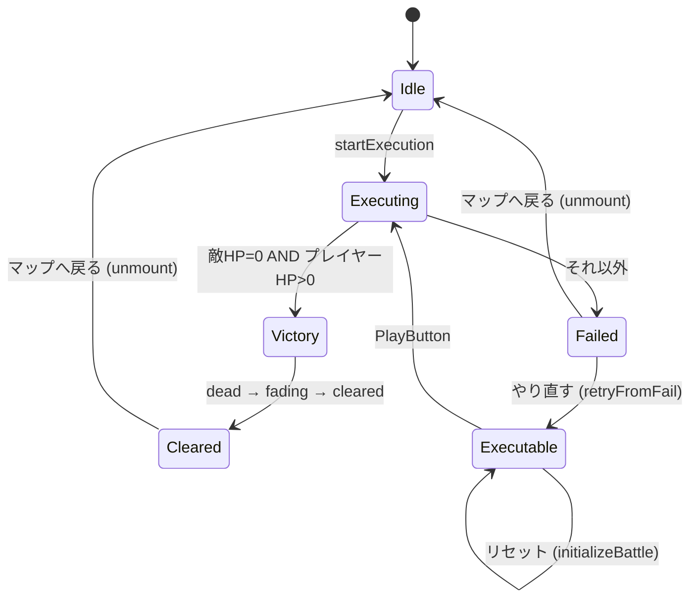
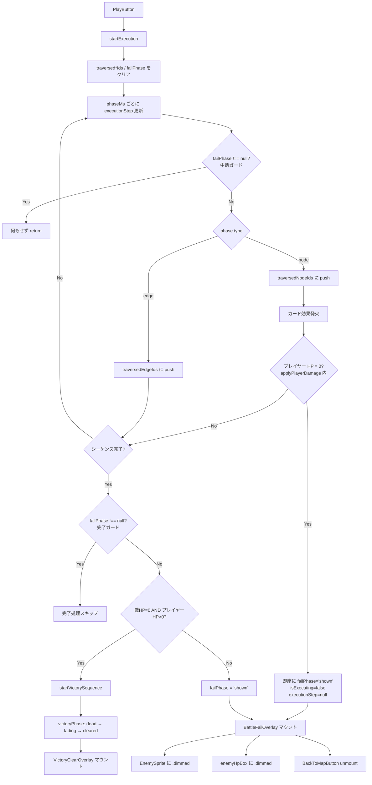
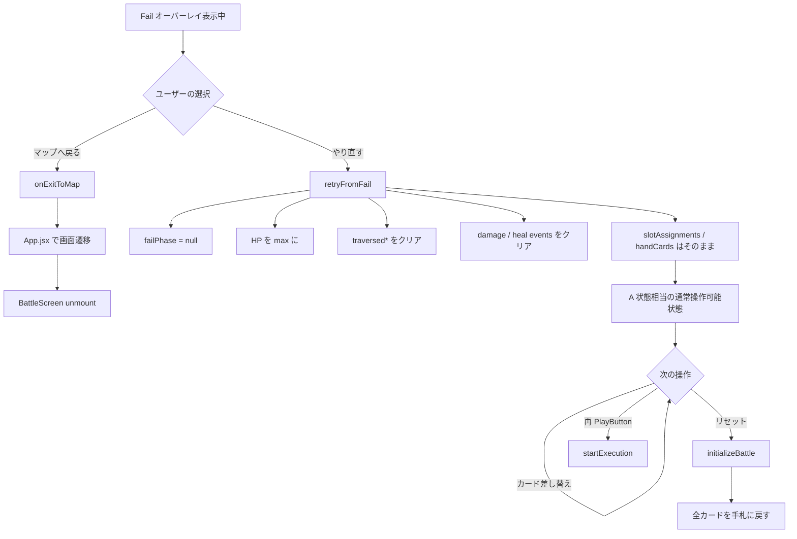
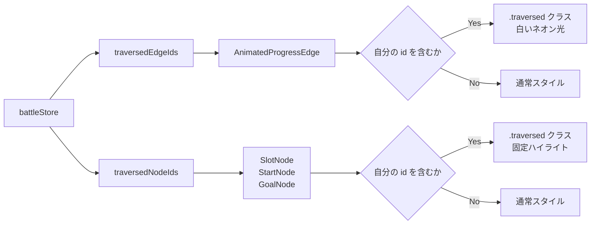
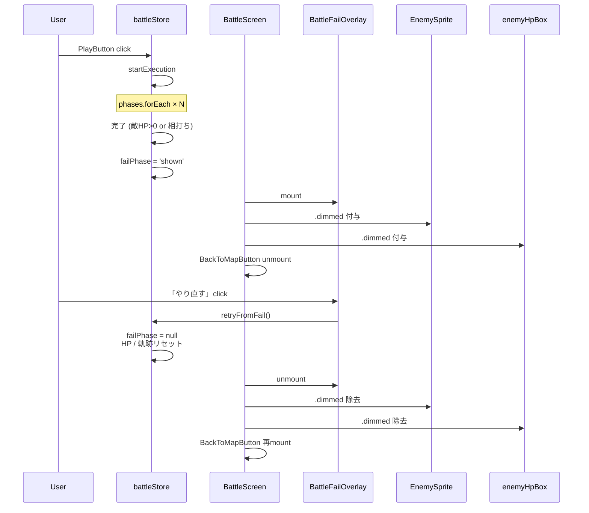

# 設計書: バトル失敗演出とやり直し機能（battle-fail-retry）

## 概要

実行シーケンスに「通過軌跡の永続化」と「Fail フェーズ」を追加し、既存の勝利演出（victory-clear）と対称になる失敗演出を導入する。勝敗判定は「敵 HP = 0 **かつ** プレイヤー HP > 0」を勝利、それ以外を失敗とし、既存実装が片側しか見ていなかった点を訂正する。

軌跡の可視化は `traversedEdgeIds` / `traversedNodeIds` の 2 配列を `battleStore` に追加し、各エッジ・ノード描画コンポーネントが自身の id の含有を購読する形で実装する。これにより既存の「実行中だけ点滅する `.active` ハイライト」と「実行完了後も固定で光る `.traversed` ハイライト」を独立した CSS クラスとして共存させられる。

「やり直す」操作は **スロット配置と手札を保持したまま** HP・軌跡・演出キューだけを初期化する新アクション `retryFromFail()` で実装する。これは既存の `initializeBattle(stage)`（スロット配置をステージ定義から再構築する）とは責務が逆なので、新規アクションとして分離する。

## アーキテクチャ

### コンポーネント

| コンポーネント | 責務 | 新規 / 変更 |
|---|---|---|
| `BattleFailOverlay` | Fail テキスト＋「マップへ戻る」「やり直す」の 2 ボタン行を敵エリアに絶対配置で描画 | 新規 |
| `BattleScreen` | `failPhase` を購読して overlay マウント、`BackToMapButton` の出し分け、ルートクラス付与 | 変更 |
| `EnemySprite` | `failPhase === 'shown'` で `.dimmed` クラス付与（半透過） | 変更 |
| `AnimatedProgressEdge` | `traversedEdgeIds` を購読して通過済みエッジの `<path>` に `.traversed` クラス付与 | 変更 |
| `SlotNode` | `traversedNodeIds` を購読して通過済みスロットに `.traversed` クラス付与（既存 `.active` と分離） | 変更 |
| `StartNode` / `GoalNode` | 同上 | 変更 |
| `PlayButton` / `ResetButton` | `failPhase !== null` を `disabled` 条件に追加 | 変更 |
| `battleStore` | `failPhase` / `traversedEdgeIds` / `traversedNodeIds` の追加。`startExecution` の判定変更。`retryFromFail` アクションの追加 | 変更 |

### データモデル

`battleStore` に追加するフィールドと初期値：

```javascript
{
  failPhase: null,            // null | 'shown'
  traversedEdgeIds: [],       // string[]
  traversedNodeIds: [],       // string[]
}
```

- `failPhase` は将来の段階追加（フェードイン等）に備えて文字列 enum とする。`victoryPhase` の `null | 'dead' | 'fading' | 'cleared'` と対称。
- `traversedEdgeIds` / `traversedNodeIds` は配列で持つ。フェーズ数は最大でも 10〜20 程度なので `Array#includes` の `O(n)` で十分。`Set` だと不変更新が冗長になり、selector の `===` 比較で false になる挙動を考慮しても配列の方が扱いやすい。

`failPhase` と `victoryPhase` は **相互排他**：



### API / インターフェース

#### `battleStore` の変更

**`startExecution(stage)` の差分**：

```javascript
// 開始時クリアに traversedEdgeIds / traversedNodeIds / failPhase を追加
set((s) => ({
  // ... 既存 ...
  traversedEdgeIds: [],
  traversedNodeIds: [],
  failPhase: null,
}));

// 各フェーズで軌跡を蓄積
phases.forEach((phase, i) => {
  setTimeout(() => {
    set((s) => ({
      executionStep: phase,
      ...(phase.type === 'edge'
        ? { traversedEdgeIds: [...s.traversedEdgeIds, phase.id] }
        : { traversedNodeIds: [...s.traversedNodeIds, phase.id] }),
    }));
    // 既存のカード効果分岐（attack / monster / heal）はそのまま
  }, i * phaseMs);
});

// 完了時の判定を変更
setTimeout(() => {
  set({ isExecuting: false, executionStep: null, currentPhaseMs: null });
  const { currentEnemyHp, currentPlayerHp } = get();
  if (currentEnemyHp === 0 && currentPlayerHp > 0) {
    get().startVictorySequence(stage.enemyId);
  } else {
    set({ failPhase: 'shown' });
  }
}, phases.length * phaseMs);
```

**`applyPlayerDamage(amount)` の差分**：

実行中にプレイヤー HP が 0 に達した場合、即座に Fail フェーズへ遷移して残りのフェーズを打ち切る（要件 2-4 の抜け道防止）。

```javascript
applyPlayerDamage: (amount) => set((state) => {
  const nextHp = Math.max(0, state.currentPlayerHp - amount);
  const id = `pd-${state._playerDamageCounter}`;
  const result = {
    currentPlayerHp: nextHp,
    playerDamageEvents: [...state.playerDamageEvents, { id, amount }],
    _playerDamageCounter: state._playerDamageCounter + 1,
  };
  if (nextHp === 0 && state.isExecuting) {
    result.failPhase = 'shown';
    result.isExecuting = false;
    result.executionStep = null;
    result.currentPhaseMs = null;
  }
  return result;
}),
```

**`startExecution` の中断ガード追加**：

各フェーズの `setTimeout` コールバック先頭と完了タイマー先頭に `if (get().failPhase !== null) return;` を追加し、中断後にスケジュール済みの `setTimeout` が発火しても何もしないようにする（要件 2-5）。これにより、`clearTimeout` で明示的にタイマーを破棄しなくても、副作用（軌跡 push・カード効果発火・勝敗判定）を完全に打ち切れる。

**新規アクション `retryFromFail()`**：

```javascript
retryFromFail: () => set((state) => ({
  failPhase: null,
  currentEnemyHp: state.maxEnemyHp,
  currentPlayerHp: state.maxPlayerHp,
  enemyDamageEvents: [],
  playerDamageEvents: [],
  playerHealEvents: [],
  traversedEdgeIds: [],
  traversedNodeIds: [],
  // slotAssignments と handCards は意図的に触らない
}))
```

**`initializeBattle(stage)` の差分**：

新規フィールド 3 つを初期状態に戻す処理を追加（既存の他フィールドのリセットと並列）。

#### `BattleFailOverlay` のインターフェース

```javascript
function BattleFailOverlay({ onExitToMap, onRetry }) { ... }
```

`onExitToMap` は既存の `VictoryClearOverlay` と同じハンドラ（`BattleScreen` 経由で `App.jsx` の画面遷移ロジックへ橋渡し）。`onRetry` は `BattleScreen` 内で `retryFromFail` を呼ぶ薄いラッパー。

## データフロー

### 実行シーケンスから演出フェーズまで



### 「やり直す」と「マップへ戻る」



### 通過軌跡の購読



### Fail フェーズのコンポーネント連動



## 実装方針

### 通過軌跡（白いネオン光）の CSS 設計

#### エッジ

`AnimatedProgressEdge.jsx` 内の `<path>` に対し、`useBattleStore((s) => s.traversedEdgeIds.includes(id))` で求めた `isTraversed` で CSS Modules のクラスを条件付与する。React Flow デフォルトの `react-flow__edge-path` クラスは保ったまま、追加クラスで上書きする。

```css
/* AnimatedProgressEdge.module.css */
.traversed {
  stroke: #f5f5ff;
  filter: drop-shadow(0 0 4px rgba(229, 229, 255, 0.9));
}
```

CSS Modules によるハッシュ化を避けるため、`stroke` と `filter` のみで完結させる。React Flow 既定の `stroke-width` はそのまま継承する。

#### ノード（スロット・スタート・ゴール）

既存の `.active` キーフレーム（`slotHighlight: 0.3s × 2 alternate`）を残したまま、新規 `.traversed` クラスを追加して **キーフレーム終端の状態を固定**する：

```css
/* SlotNode.module.css に追加 */
.slot.traversed {
  filter: brightness(1.6) drop-shadow(0 0 10px rgba(229, 229, 255, 0.9));
}
```

`.active` と `.traversed` が同時に当たる瞬間（フェーズ突入時）は `.active` のキーフレームアニメーションが上に被るため自然に統合される。`.active` のアニメ終了後はクラスが外れ、`.traversed` の固定光のみが残る。`StartNode.module.css` / `GoalNode.module.css` も同パターンで追加する。

### Fail フェーズの操作ロックと BackToMapButton

`BattleScreen.module.css` に既存の `.root.victory` と並列で `.root.failed` を追加し、`pointer-events: none` を付与する。`BattleScreen.jsx` のルートクラス組み立てで `failPhase && styles.failed` を `.filter(Boolean).join(' ')` に追加する。

`BackToMapButton` の出し分けは現状 `victoryPhase !== 'cleared'` で判定しているが、これを `victoryPhase !== 'cleared' && failPhase !== 'shown'` に変更する。Fail オーバーレイ内に「マップへ戻る」を持つため、右上ボタンとの重複を避ける。

### 敵スプライトと敵 HP バーの半透過

`EnemySprite.module.css` に `.dimmed` クラスを新設：

```css
.dimmed {
  opacity: 0.4;
  transition: opacity 0.3s ease-out;
}
```

`.fading`（勝利時の `opacity: 0`）と独立させる。`failPhase` と `victoryPhase` は相互排他なので両クラスが同時に当たることはない。`EnemySprite.jsx` で `failPhase === 'shown'` を購読して条件付与する。

`BattleScreen.module.css` の `.enemyHpBox` には既存の `.fading`（勝利時の `opacity: 0`）と並列で `.dimmed`（失敗時の `opacity: 0.4`）を追加する。`BattleScreen.jsx` で `failPhase` を購読し、`isEnemyDimmed` を計算してクラスに反映する。

### Fail テキストの視覚中央配置補正

`Press Start 2P` フォントの「Fail」グリフは末尾の `l` が advance box 内で左寄り描画される性質を持つ（`!` `i` `l` `.` 系の細い文字に共通）。CLAUDE.md の memory にも記録されているプロジェクト共通テクニックに従い、`<span class="failTextInner">` に `padding-left` を `em` 単位で当てて視覚中央化する：

```jsx
<div className={styles.failText}>
  <span className={styles.failTextInner}>Fail</span>
</div>
```

```css
.failText {
  width: 100%;
  display: flex;
  justify-content: center;
  font-family: 'Press Start 2P', 'Courier New', Courier, monospace;
  font-size: clamp(2rem, 6vw, 3rem);
  color: #ff5a5a;             /* 「失敗」を示す赤 */
  text-shadow: 2px 2px 0 #0b0b10;
  letter-spacing: 2px;
}

.failTextInner {
  padding-left: 0.4em;        /* glyph 位置補正（em 単位で font-size 変動に追従） */
}
```

`padding-left` の実数（0.3〜0.5em）は実装時に視認確認で調整する（CLEAR! は 0.4em で確定済み）。

### Fail オーバーレイのボタン配置

`VictoryClearOverlay` のボタン行（中央 1 個）に対し、`BattleFailOverlay` は左右 2 個。

```css
.buttonRow {
  flex: 1;
  display: flex;
  align-items: flex-start;
  justify-content: center;
  gap: 1.5rem;                /* ボタン間の余白 */
  padding-top: 2rem;
}

.button {
  /* VictoryClearOverlay.module.css の .button をベースに同じ意匠で */
  font-family: 'Press Start 2P', ...;
  /* 以下略 */
}
```

左右 2 個でも `justify-content: center; gap: ...` で中央揃え。レイアウトは敵エリアの幅に依存するため `space-between` ではなく `center + gap` で「左右のボタン」を表現する。

### `PlayButton` / `ResetButton` の disable 条件

両ボタンとも既存の `isDisabled` 計算に `failPhase !== null` を追加する：

```javascript
// PlayButton
const isDisabled = isExecuting || isTransitioning || !allFilled
  || victoryPhase !== null || failPhase !== null;

// ResetButton
const isDisabled = isExecuting || isTransitioning
  || victoryPhase !== null || failPhase !== null;
```

これにより Fail オーバーレイ表示中は両ボタンが押せず、誤動作を防ぐ。`.root.failed` の `pointer-events: none` でも吸収できるが、`disabled` 属性も併用することでアクセシビリティと視覚（ボタンの半透明表示）を両立する。

### 中断機構（プレイヤー HP=0 での即座 Fail）

要件 2-4 で「実行中にプレイヤー HP が 0 になったら即座に Fail へ遷移」を満たすため、以下 3 点で中断機構を実装する：

1. **`applyPlayerDamage` で死亡を検知して状態を一括変更**：HP 減算後 `nextHp === 0 && state.isExecuting` を満たすときに、`failPhase: 'shown'` ／ `isExecuting: false` ／ `executionStep: null` ／ `currentPhaseMs: null` を同じ `set` 内で一括変更する。1 トランザクションでまとめることで、途中状態（例：`failPhase: 'shown'` だけど `isExecuting: true` のまま）を観測されない。
2. **各フェーズの `setTimeout` コールバック先頭にガード**：`if (get().failPhase !== null) return;` で中断後の発火を全面ブロック。軌跡 push・`executionStep` 更新・カード効果発火（`applyEnemyDamage` / `applyPlayerHeal`）すべて打ち切られる。
3. **完了タイマーの先頭にもガード**：同じ early-return パターンで、中断後の勝敗判定を抑止する。これにより、中断時点で確定した `failPhase: 'shown'` を完了タイマーが上書きすることはなく、かつ `isExecuting: false` への重複セットも避けられる。

`clearTimeout` で明示的にタイマー破棄する選択肢もあるが、(a) `setTimeout` の戻り値（タイマー ID）を別配列で保持する必要が出てくる、(b) フェーズ数 N 個に対して `clearTimeout` の N 回呼び出しが必要、(c) 既に走り始めたコールバックは止められない、という理由で early-return ガード方式の方がシンプルかつ十分。

### 軌跡蓄積のタイミング

軌跡は **`executionStep` を更新する `setTimeout` 内で同時に push** する。これにより：

1. 「現在 active なフェーズ」と「通過済み」の境界が常に整合する（`executionStep === phase.id` のとき必ず `traversed*Ids` にも含まれている）
2. 既存の `executionStep` 駆動の `.active` クラス付与ロジックには手を入れずに済む

`set` の関数形式を使い `[...s.traversedEdgeIds, phase.id]` のように不変更新する。

### `retryFromFail` と `initializeBattle` の責務分離

| 操作 | 呼ばれる場面 | カード配置 | HP | 軌跡 / 演出キュー | `victoryPhase` / `failPhase` |
|---|---|---|---|---|---|
| `initializeBattle(stage)` | バトル開始時、リセットボタン | ステージ定義から再構築 | max | クリア | クリア |
| `retryFromFail()` | Fail オーバーレイの「やり直す」 | **保持** | max | クリア | クリア |

`initializeBattle` を `keepCards` オプションで分岐させると条件分岐が増えて既存処理の見通しが悪くなるため、新規関数として独立させる。

### `executionStep` クリアタイミング

軌跡蓄積を導入したことで、シーケンス完了時に `executionStep: null` にする処理は既存どおり残せる。`.active` クラスの付与は `executionStep === { type, id }` の一致で動くため、null になれば `.active` は外れる。`.traversed` は `traversedNodeIds` 配列由来で独立に判定されるので両者の並存は問題ない。

## 依存関係

| パッケージ | 用途 | 導入済み？ |
|---|---|---|
| `zustand` | `battleStore` への状態追加・アクション追加 | はい |
| `@xyflow/react` | エッジの `<path>` クラス操作（既存と同じ使い方） | はい |
| `react` | `useState` / `useEffect` / 既存パターン踏襲 | はい |

新規ライブラリ追加は無い。

## トレードオフと検討した代替案

### 軌跡の表現方式

- **決定内容**：`traversedEdgeIds` / `traversedNodeIds` の 2 配列をストアに持ち、各描画コンポーネントが自身の id の含有を購読する。
  **理由**：既存の `executionStep`（= 1 フェーズ分）との対比で「現在ハイライト中」と「過去に通過」を独立に表現でき、CSS クラスも `.active`（点滅）／`.traversed`（固定光）として分離できる。
  **検討した代替案**：
  - `executionStep` のみで全部表現する → 過去通過情報が失われ、要件 1-2 / 1-4 を満たせない。
  - `traversedSteps: Array<{type, id}>` の 1 配列にまとめる → 各コンポーネントが線形検索＋型判定で 2 ステップになり可読性で劣る。機能的には等価。

### Fail フェーズの状態表現

- **決定内容**：`failPhase: null | 'shown'` の文字列 enum。
  **理由**：`victoryPhase` と対称的に書け、将来「fading-in」のような中間段階を増やしたくなった場合も値追加だけで済む。
  **検討した代替案**：
  - `isFailed: boolean` → 同等だが拡張性に欠ける。
  - `phase: 'idle' | 'executing' | 'cleared' | 'failed'` のような統合 enum → 既存 `victoryPhase` を全面書き換える必要があり影響範囲が大きい。

### 「やり直す」アクションを `initializeBattle` の派生にするか、新規関数にするか

- **決定内容**：新規アクション `retryFromFail()`。
  **理由**：`initializeBattle` は **スロット配置をステージ定義から再構築する**（ロックカード復元含む）責務。一方「やり直す」は **現在のスロット配置を保持** する必要があり、責務が逆。共通点（HP リセット、演出キュークリア）はあるが、引数で分岐させるとガード条件が増えて見通しが悪くなる。
  **検討した代替案**：
  - `initializeBattle(stage, { keepCards: true })` のオプション化 → 引数による振る舞い変化は将来の保守で誤解を招きやすい。
  - `BattleScreen` 側で個別に `set({ ... })` を呼ぶ → ストア外部から内部状態を直接書き換えることになり責務分離が崩れる。

### 敵スプライトの透過度

- **決定内容**：`opacity: 0.4` を起点に、実装時に視認確認で調整。
  **理由**：要件 3-5「完全透過ではなく薄く見える」に合致し、CLEAR! 時の `opacity: 0`（完全透明）と区別できる差を出せる。0.5〜0.6 だと「ピンチだが普通に見えている」のような曖昧さが残る。
  **検討した代替案**：
  - グレースケール化（`filter: grayscale(1)`）→ 「殺気を失った敵」感が出るが、CLEAR! 時の opacity 単純減衰との対称性が崩れる。
  - 動かなくする（idle アニメ停止）→ 既存 `useSpriteAnimation` を破壊する変更が必要で複雑度が増す。

### 操作ロックを `pointer-events: none` だけにするか、ボタンの `disabled` も併用するか

- **決定内容**：両方併用（`PlayButton` / `ResetButton` の `disabled` 属性も `failPhase` を見る）。
  **理由**：`pointer-events: none` だけだと、キーボード操作・スクリーンリーダーからボタンが押せてしまう。`disabled` を付ければアクセシビリティ的にも「押せない」ことが伝わり、視覚的にも半透明で押せないことを示せる。
  **検討した代替案**：
  - `pointer-events: none` のみ → 視覚的に押せそうに見えるが押せない、という UX 上の不整合が起きる。

### カードのドラッグを Fail 中にどうロックするか

- **決定内容**：`DraggableCard` の `useDraggable({ disabled })` に `failPhase !== null` を OR で加える（既存の `victoryPhase !== null` と並列）。
  **理由**：`SlotNode` がローカルに `pointer-events: auto` を当てて React Flow ラッパーの `none` を上書きしているため、戦闘画面ルートの `.root.failed { pointer-events: none }` を当てても、スロット配下のカードでは pointer-events が `auto` のまま「突き抜けて」しまう。さらに dnd-kit はカード要素に直接 `pointermove` リスナーを設置するため、CSS だけでは捕捉漏れが起きうる。dnd-kit 公式の `disabled` API でカード側から明示的にドラッグ開始を抑止することで、CSS による全体ロックと合わせて二重防御になる。既存の勝利演出（`victoryPhase !== null`）でも同じ理由で `disabled` を併用しており、本件は既存パターンの対称的な拡張。
  **検討した代替案**：
  - `SlotNode` の `.locked` を `failPhase` 中も付与する → スロット側の `pointer-events: none` で阻止できるが、手札カード（`Hand` 配下）には適用されないので、手札のドラッグは依然として通ってしまう。`DraggableCard` 側で disable する方が手札・スロット両方をカバーできる。
  - `BattleScreen` 側で `DndContext` 自体を unmount する → 状態遷移が複雑になり、`DragOverlay` のフローティングカードなどの再マウントが噛み合わない。最小変更の原則に反する。

## トレーサビリティ

| 要件 | 対応する設計セクション |
|---|---|
| 1-1, 1-2（エッジ通過軌跡の維持） | データモデル `traversedEdgeIds` / 実装方針「通過軌跡（白いネオン光）の CSS 設計」/ データフロー「通過軌跡の購読」 |
| 1-3, 1-4（ノード固定ハイライト） | データモデル `traversedNodeIds` / 実装方針「ノード」段落 |
| 1-5（緑進行アイコンは現状維持） | 実装方針「軌跡蓄積のタイミング」（既存 `executionStep` 駆動部分は不変） |
| 1-6（シーケンス完了後の固定） | 実装方針「`executionStep` クリアタイミング」 |
| 2-1〜2-3（勝敗判定） | API 変更「`startExecution(stage)` の差分」 |
| 2-4（HP=0 でも中断しない） | API 変更（中断ロジックを追加しないことを設計上明示） |
| 2-5, 2-6（`failPhase` の相互排他と操作ロック） | データモデル「`failPhase` と `victoryPhase` は相互排他」/ 実装方針「Fail フェーズの操作ロックと BackToMapButton」 |
| 3-1〜3-7（Fail オーバーレイ表示） | コンポーネント `BattleFailOverlay` / 実装方針「Fail テキストの視覚中央配置補正」「Fail オーバーレイのボタン配置」/ 「敵スプライトと敵 HP バーの半透過」 |
| 4-1, 4-2（マップへ戻る） | データフロー「『やり直す』と『マップへ戻る』」 |
| 5-1〜5-6（やり直すと配置保持） | API 変更「新規アクション `retryFromFail()`」/ 「`retryFromFail` と `initializeBattle` の責務分離」 |
| 6-1〜6-3（リセットボタンの挙動） | 実装方針「`retryFromFail` と `initializeBattle` の責務分離」（リセットは既存の `initializeBattle` で担保） |
| 7-1〜7-4（実行中・Fail 中の disable） | 実装方針「`PlayButton` / `ResetButton` の disable 条件」/ 「操作ロックを `pointer-events: none` だけにするか…」 |
| 8-1, 8-2（CLEAR! 演出維持） | 既存 `victoryPhase` 系処理を変更しないことを設計全体で明示 |
| 8-3, 8-4（モンスター・回復カード演出維持） | 既存の `applyPlayerDamage` / `applyPlayerHeal` 呼び出しを変更しない |
| 8-5（A 状態の `endDrag` 不変） | `retryFromFail` は `slotAssignments` / `handCards` を触らないため `endDrag` ロジックに影響なし |
