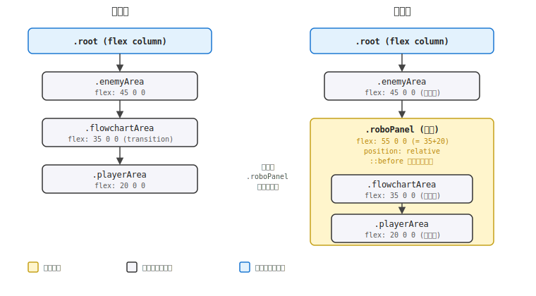
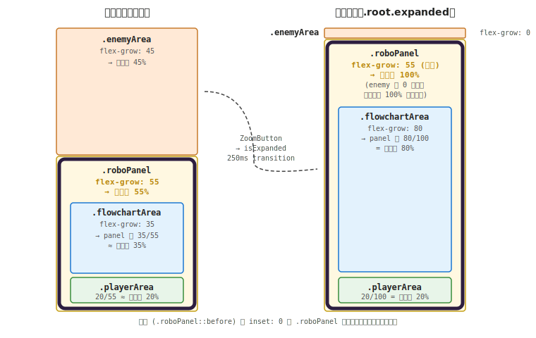
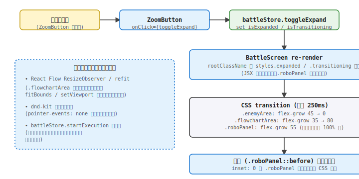

# 設計書: 戦闘画面のフロチャロボパネル化

## 概要

`BattleScreen.jsx` の DOM に **`.roboPanel` という 1 つのラッパー div** を追加し、`.flowchartArea` と `.playerArea` を内包する。`.roboPanel` には `position: relative` を当て、`::before` 擬似要素で `inset: 0` の絶対配置でフロチャロボの紫色の枠（`border + border-radius`）を **コンテンツの上に重ねて描く**。`pointer-events: none` で枠がドラッグ操作を奪わない。

設計上の最重要事実：**`::before` で枠を重ねるアプローチを採用することで、内側コンテンツ（フローチャート + 手札）の占有サイズが本機能導入前と完全に一致する**。`border` を直接当てると内側コンテンツが border 厚みぶん狭くなり、React Flow の `ResizeObserver` ＋ `fitBounds` 計算が変化するが、`::before` 方式ならば「視覚的に枠が乗っているだけ」になり、ResizeObserver も既存と同じサイズを観測し続ける（要件 4-1 / 4-4 を自然に達成）。

flex レイアウトは「`.roboPanel` の flex-grow = 55（= flowchart 35 + player 20）」とし、内側の `.flowchartArea` と `.playerArea` の flex-grow は **既存値を完全保持**（35 / 20）。これにより:
- **縮小時**: `.enemyArea`(45) + `.roboPanel`(55) = 100 → enemyArea 45% / roboPanel 55%。roboPanel 内部で flowchart は 35/55 ≈ 64%、player は 20/55 ≈ 36%。これは従来の flowchart 35% / player 20% に完全一致。
- **拡大時**: `.enemyArea`(0) + `.roboPanel`(55) → roboPanel 100%。roboPanel 内部で flowchart は 35→80 にトランジション、player は 20 のまま。

`.roboPanel` 自身の flex-grow は **トランジションしない**（55 固定）。`.enemyArea` の flex-grow 45→0 トランジション（既存）と、`.flowchartArea` の flex-grow 35→80 トランジション（既存）の 2 つだけで全体の見た目が決まる。新たな transition 設定なし、CSS の追加範囲は最小。

色味は **CSS カスタムプロパティ** で 1 箇所に定義（要件 5）：
- `--robo-frame-color`（暗い紫の外枠、`robo.png` の本体外周色）
- `--robo-frame-body`（任意・実装で要否判断、内側のうっすらした紫の塗り）

定義場所は `frontend/src/index.css`（グローバル）または `BattleScreen.module.css`（モジュールローカル）。本機能のスコープは戦闘画面のみなので `BattleScreen.module.css` の `:root` または `.root` セレクタに置くのが妥当。

---

## アーキテクチャ

### 変更コンポーネント

| ファイル | 変更内容 | 関連要件 |
|---|---|---|
| `frontend/src/features/battle/BattleScreen.jsx` | `.enemyArea` の直後に `.roboPanel` div を追加し、`.flowchartArea` と `.playerArea` をその内側に移動 | 1, 4 |
| `frontend/src/features/battle/BattleScreen.module.css` | CSS カスタムプロパティ（`--robo-frame-color` 等）を `.root` に追加。`.roboPanel` クラスと `.roboPanel::before` の追加。既存の `.flowchartArea` / `.playerArea` / `.root.expanded .flowchartArea` 等は無変更 | 1, 2, 3, 4, 5 |

変更ファイルは 2 つのみ、すべて既存ファイルの編集。新規ファイルなし、新規パッケージ追加なし、`README.md` のディレクトリ構造変更なし。

### DOM 構造の変化



### flex レイアウトの数値



> `.roboPanel` の flex-grow は **常に 55**。`.enemyArea` の flex-grow が 45→0 へ縮むと相対的に `.roboPanel` が 100% を占める仕組み（flex の比例配分）。`.roboPanel` 自体に transition を当てない。

### 色とスタイルの仕様

| 変数 | 採取元 | 仮値（実装で確定） | 用途 |
|---|---|---|---|
| `--robo-frame-color` | `robo.png` の本体外周の濃い紫 | `#2c1d3f` 前後（暗い紫、ほぼ黒紫） | `.roboPanel::before` の `border-color` |
| `--robo-frame-body` | `robo.png` の本体中央の紫 | `#5e4683` 前後（中程度の彩度の紫） | 必要なら `.roboPanel` の `background-color`（任意） |

数値はあくまで設計時の仮定で、実装フェーズで `robo.png` から実際にピクセルを採取して確定する（要件 5-2）。

### z-index の整理

| 要素 | z-index | 説明 |
|---|---|---|
| 既存 React Flow のキャンバス | （既定） | フローチャート描画の本体 |
| 既存 `.flowchartControls`（ZoomButton 等） | 10（既存） | フローチャート右上のボタン群 |
| **`.roboPanel::before`（紫枠）** | **9 前後** | コントロール群より下、フローチャート本体より上 |
| `VictoryClearOverlay` / `BattleFailOverlay` | 既存の絶対配置（`position: absolute`） | 既存挙動を保持。紫枠より前面に描画されるよう必要なら z-index を引き上げる |

---

## データフロー

本機能はビューレイヤーのみへの変更で、ランタイム・状態・データロードは無関係。ユーザー操作のシーケンスを簡単に示す:



`battleStore.isExpanded` / `isTransitioning` の値変化は **既存どおり**。`.root.expanded` クラスが付くと CSS が `.enemyArea` の flex-grow 0、`.flowchartArea` の flex-grow 80 を当てる。`.roboPanel` の `::before` は `.roboPanel` の実寸に追従する `inset: 0` で描かれるため、自動的に拡縮する。

---

## 実装方針

### 1. CSS カスタムプロパティの定義

`BattleScreen.module.css` の `.root` セレクタに以下を追加:

```css
.root {
  /* ... 既存プロパティ ... */
  --robo-frame-color: #2c1d3f;  /* 実装フェーズで robo.png から実値採取 */
  --robo-frame-radius: 12px;
  --robo-frame-width: 6px;
}
```

3 つの変数で枠の見た目を完全に制御できるようにする。将来の調整やテーマ化が `.root` セレクタの 1 箇所で完結する。

### 2. `.roboPanel` クラスの追加

```css
.roboPanel {
  /* 既存 .flowchartArea(35) + .playerArea(20) を合算 */
  flex: 55 0 0;
  display: flex;
  flex-direction: column;
  min-height: 0;     /* 子要素が中身で押し広げない */
  position: relative;
}

.roboPanel::before {
  content: '';
  position: absolute;
  inset: 0;
  border: var(--robo-frame-width) solid var(--robo-frame-color);
  border-radius: var(--robo-frame-radius);
  pointer-events: none;
  z-index: 9;
}
```

`::before` が枠を担当し、`pointer-events: none` でユーザー操作（カードドラッグ、フローチャート操作）を一切奪わない（要件 6）。

### 3. JSX の DOM 構造変更

`BattleScreen.jsx` の return 内、`.enemyArea` の閉じタグの直後から `.playerArea` の閉じタグまでを `.roboPanel` div で囲む:

```jsx
<section className={rootClassName}>
  {/* BackToMapButton は既存どおり .root 直下 */}
  <div className={styles.enemyArea}>
    {/* 既存内容は完全保持 */}
  </div>
  <div className={styles.roboPanel}>
    <div className={styles.flowchartArea}>
      {/* 既存内容は完全保持 */}
    </div>
    <div className={styles.playerArea}>
      {/* 既存内容は完全保持 */}
    </div>
  </div>
</section>
```

`.enemyArea` / `.flowchartArea` / `.playerArea` の中身・className は **一切無変更**。新しく追加するのは `.roboPanel` のラッパー div 1 つだけ。

### 4. 拡大／縮小モードへの追従

CSS の追加は不要。既存の transition で自動的に動く:

- 既存: `.enemyArea { transition: flex-grow 0.25s ease; }` → 45 → 0 へ遷移
- 既存: `.flowchartArea { transition: flex-grow 0.25s ease; }` → 35 → 80 へ遷移
- 新規: `.roboPanel` は flex-grow 55 固定（トランジション不要）

`.roboPanel` の高さは「親 `.root` から `.enemyArea` の分を引いた残り」として flex-box の比例配分で自動的に決まる。`.enemyArea` が 0 へ縮むと `.roboPanel` が 100% に拡大、内側の `.flowchartArea` が 35→80 にトランジションして player が相対的に圧縮される、という連動が自然に成立する。

### 5. React Flow / dnd-kit / 既存演出への影響ゼロ

- **React Flow**: `.flowchartArea` の `clientWidth` / `clientHeight` は本機能導入前と同じ。`FlowchartArea` 内の `ResizeObserver` ＋ `refit` ロジックは完全保持（要件 4-4）。
- **dnd-kit**: `.roboPanel::before` は `pointer-events: none` なので、ドラッグ操作のヒットテストに干渉しない。`SlotNode` の `useDroppable` も既存どおり動く（要件 4-2）。
- **battleStore.startExecution**: ランタイム・状態管理に変更なし。動的エッジ追跡・カード効果・演出すべて従来どおり（要件 4-3）。
- **オーバーレイ**: `VictoryClearOverlay` / `BattleFailOverlay` の `position: absolute` 配置は無変更。z-index が低くて紫枠に隠される場合のみ、実装時に必要に応じて z-index を 10 以上に上げる（要件 6-2）。

### 6. アクセシビリティと小画面対応

- 紫枠の太さは固定値（`6px`）。`em` / `rem` 単位ではないが、戦闘画面の他の UI（スロット・カードサイズ）も固定 px ベースのため、ブラウザ全体の zoom には自然に追従する（要件 7-2）。
- `border-radius: 12px` も控えめな角丸で、画面サイズに関係なく破綻しない（要件 7-1）。
- 必要なら将来 `clamp(4px, 0.5vw, 8px)` 等で完全レスポンシブにする余地はあるが、今回は固定 px で実装し、実機で問題があれば調整する。

---

## 依存関係

| パッケージ | 用途 | 導入済み？ |
|---|---|---|
| （新規パッケージなし） | - | - |

純粋に CSS と JSX の追加のみ。新規ライブラリ・新規ファイル不要。

---

## トレーサビリティ（要件 → 設計）

| 要件 | 対応する設計セクション |
|---|---|
| 1: フロチャロボパネルの基本構造 | 実装方針 2（`.roboPanel` クラス）・3（DOM 構造変更）、DOM 構造図、flex レイアウト図 |
| 2: 装飾レベルの制約（紫枠だけ） | 実装方針 2（`::before` の `border` 1 行で枠だけ描く） |
| 3: 拡大／縮小モードへの追従 | 実装方針 4（既存 transition で自動追従）、ユーザー操作シーケンス図 |
| 4: 既存ステージへの非破壊性 | 実装方針 5（React Flow / dnd-kit / startExecution への影響ゼロ）、概要（`::before` 方式で内側サイズを変えない） |
| 5: 色とスタイルの統一基盤 | 実装方針 1（CSS カスタムプロパティ）、色とスタイルの仕様表 |
| 6: アクセシビリティと既存演出への配慮 | 実装方針 2（`pointer-events: none`）・5（オーバーレイの z-index）、z-index 整理表 |
| 7: 小画面への配慮 | 実装方針 6 |

---

## トレードオフと検討した代替案

- **決定**: `.roboPanel::before` で枠を「上に重ねる」方式。
  **理由**: 内側コンテンツ（フローチャート・手札）の占有サイズが本機能導入前と完全一致するため、React Flow の `ResizeObserver` / `fitBounds` を変えずに済み、既存ステージへのデグレリスクが最小化される。
  **代替案 A**: `.roboPanel` に直接 `border: 6px solid var(--robo-frame-color)` を当てる → 内側のコンテンツ領域が border の厚みぶん狭くなり、React Flow が再計算するため、ステージレイアウトが微妙にずれる懸念。デグレリスクが高い。
  **代替案 B**: `box-shadow: inset 0 0 0 6px var(--robo-frame-color)` を `.roboPanel` に当てる → 内側サイズは保つが、`border-radius` との組み合わせで角丸が崩れる場合がある。`::before` 方式の方が確実。

- **決定**: `.roboPanel` の flex-grow は 55 で固定。内側 `.flowchartArea` の flex-grow 35→80 トランジションだけで拡大／縮小を表現。
  **理由**: 新たな transition 設定が不要で、CSS の追加範囲が最小。flex の比例配分により `.enemyArea` 縮小だけで `.roboPanel` が 100% を占める挙動が自然に成立する。
  **代替案**: `.roboPanel` も transition の対象にする（55→100 にトランジション）→ 二重 transition で同じ結果になるが、設定が冗長で、内側の `.flowchartArea` のトランジションと位相がずれるリスクがある。

- **決定**: CSS カスタムプロパティを `BattleScreen.module.css` の `.root` セレクタに置く（`index.css` には置かない）。
  **理由**: 本機能は戦闘画面専用で、グローバル CSS を汚す必要がない。将来「フロチャロボ色を他画面でも使う」ことになったとき初めて `index.css` に昇格させる。YAGNI 原則。
  **代替案**: 最初から `index.css` の `:root` に置く → グローバル汚染、特に本機能で戦闘画面以外は触らないため不要。

- **決定**: 枠の太さ・角丸サイズも `var(--robo-frame-width)` / `var(--robo-frame-radius)` で変数化する。
  **理由**: 1 セットの変数で枠の見た目を完全制御できるようにすると、調整が高速になる。実装フェーズの試行錯誤コストを下げる。
  **代替案**: 色だけ変数化して、太さ・角丸は直接書く → 調整時に複数箇所を書き換える必要が出てきて、`.roboPanel` の CSS と `::before` の CSS で値がずれる事故が起きやすい。

- **決定**: `--robo-frame-body`（内側の塗り）は **任意採用**（実装フェーズで要否判断）。
  **理由**: シンプルな枠だけで十分（要件 2）かもしれず、内側塗りを入れるとフローチャート背景の暗いグレー（既存）と重なって UI が変わるリスクがある。実機で「枠だけだと貧弱に見える」場合のみ追加する。
  **代替案**: 最初から内側塗りも入れる → 既存フローチャート背景との視覚干渉のリスクを取り、調整が増える。

- **決定**: 紫枠の z-index は 9（`.flowchartControls` の 10 より下）。
  **理由**: フローチャート右上の ZoomButton / ResetButton / PlayButton が枠に隠れず、視認できる状態を維持する。
  **代替案**: z-index: 100 など高くする → ボタン群が枠に隠れて押せなくなる可能性。

---

## 未確定（実装/レビューで確定）

- `--robo-frame-color` の具体値（`#2c1d3f` 仮、`robo.png` のピクセルから採取して確定）
- `--robo-frame-radius` / `--robo-frame-width` の値（仮 `12px` / `6px`、実機で見て調整）
- `--robo-frame-body`（内側の紫の塗り）を採用するか否か（実機で「枠だけ」を見てから判断）
- オーバーレイ（`VictoryClearOverlay` / `BattleFailOverlay`）の z-index 調整が必要かどうか（実装時に紫枠と被さるか確認）
- `box-shadow` で 3D 感（凹み風）を追加するかどうか（実機で「のっぺりして見える」場合のみ検討）
