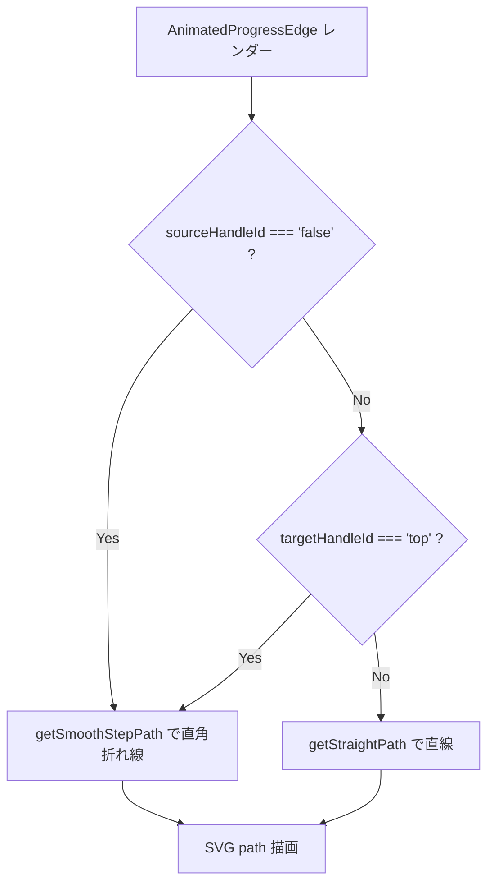
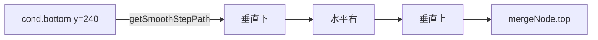

# 設計書: 条件分岐ノード周りの UI 修正（branching-ui-fixes）

## 概要

本機能は 4 つの修正を独立した変更として扱う。

1. **菱形の枠線**: `clip-path` で削れる border を `::before` 疑似要素で再現する技法。`.diamond` 全体を枠線色で塗り、`::before` に同じ `clip-path` で内側を背景色で塗ることで「枠線付き菱形」を見せる。
2. **横頂点と隣接スロットの y 整合**: 菱形のサイズを `140 × 140` → `140 × 120` に変更し、`SlotNode`（高さ 120）と中心 y を揃える。これにより `Position.Left` / `Position.Right` のハンドル位置が SlotNode と同じ y 座標になり、エッジが水平に描かれる。
3. **直角折れ線エッジ**: `AnimatedProgressEdge` を拡張し、エッジの `sourceHandleId === 'false'` または `targetHandleId === 'top'` のときは `getSmoothStepPath` を使う。それ以外は既存の `getStraightPath` を維持。`SlotNode` に Top target ハンドルを追加し、`stagesLoader.js` で False 経路の合流エッジに `targetHandle: 'top'` を自動付与する。
4. **数字途中改行の抑止**: `.expression` の `word-break: break-all` を撤回し、`word-break: keep-all` + `overflow-wrap: break-word` の組み合わせに切り替える。

各修正は他の修正に依存せず実装可能だが、要件 2 と 3 は「ハンドル位置の整合」と「エッジ経路」の両方を整える必要があるため、セットで動作確認する。

## アーキテクチャ

### コンポーネント

| コンポーネント | 責務 |
|---|---|
| `ConditionNode.module.css` | 菱形の枠線実装、サイズを `140 × 120` に、テキストの改行ルール変更 |
| `SlotNode.jsx` | Top target ハンドル（`id="top"`）を追加 |
| `AnimatedProgressEdge.jsx` | `sourceHandleId` / `targetHandleId` を props で受け取り、条件分岐エッジは `getSmoothStepPath`、それ以外は `getStraightPath` を使う |
| `stagesLoader.js` | False 経路の合流エッジに `targetHandle: 'top'` を自動付与する分岐ロジックを `processSubFlow` に追加 |

### データモデル

`stagesLoader.js` の `processSubFlow` の戻り値の `endings` 配列に `targetHandle` フィールドを追加：

```js
endings = [
  { nodeId: 'slot-3', sourceHandle: undefined, targetHandle: undefined },  // True 経路の終端
  { nodeId: 'cond-1', sourceHandle: 'false', targetHandle: 'top' },        // False 経路の終端
]
```

`buildEdge` 関数も `ending.targetHandle` を見てエッジに `targetHandle` を付与するように拡張する。

### API / インターフェース

#### `AnimatedProgressEdge` の props 拡張

```js
function AnimatedProgressEdge({
  id,
  sourceX, sourceY, targetX, targetY,
  sourcePosition, targetPosition,
  sourceHandleId,   // 追加：'true' / 'false' / undefined
  targetHandleId,   // 追加：'top' / undefined
  markerEnd,
}) {
  const shouldUseStep =
    sourceHandleId === 'false' || targetHandleId === 'top';
  const [edgePath] = shouldUseStep
    ? getSmoothStepPath({
        sourceX, sourceY, sourcePosition,
        targetX, targetY, targetPosition,
        borderRadius: 5,
      })
    : getStraightPath({ sourceX, sourceY, targetX, targetY });
  // ...以下既存ロジック
}
```

`sourcePosition` / `targetPosition` は React Flow がカスタムエッジに自動で渡す props（`Position.Left` / `Position.Right` / `Position.Top` / `Position.Bottom` のいずれか）。

#### `SlotNode` の Handle 追加

```jsx
<Handle type="target" position={Position.Left} className={styles.handle} isConnectable={false} />
<Handle type="target" position={Position.Top} id="top" className={styles.handle} isConnectable={false} />
<Handle type="source" position={Position.Right} className={styles.handle} isConnectable={false} />
```

既存の Left target を残しつつ、Top target を追加。

## データフロー

### エッジパス選択の判定フロー



### False 経路エッジの形状



## 実装方針

### 1. 菱形ノードの白い枠線（要件 1）

`ConditionNode.module.css` の `.diamond` を以下に変更：

```css
.diamond {
  width: 140px;
  height: 120px;  /* 要件 2 と統合: SlotNode と同じ高さ */
  background: #f5f5f5;  /* 枠線色（白） */
  clip-path: polygon(50% 0, 100% 50%, 50% 100%, 0 50%);
  display: flex;
  align-items: center;
  justify-content: center;
  position: relative;
}

.diamond::before {
  content: '';
  position: absolute;
  inset: 4px;  /* 枠線の太さ（片側 4px）*/
  background: #15151c;  /* 内部色（既存の暗色）*/
  clip-path: polygon(50% 0, 100% 50%, 50% 100%, 0 50%);
  z-index: 0;
}

.expression {
  position: relative;
  z-index: 1;  /* ::before の上に重ねる */
  /* 既存の color / font-size / padding はそのまま */
}
```

**枠線描画の仕組み**:
- `.diamond` 全体を **白(`#f5f5f5`)** で塗り、`clip-path` で菱形に切り抜く
- `::before` 疑似要素を `inset: 4px` で 4px 内側に配置、内部色(`#15151c`)で同じ菱形に切り抜く
- 結果として、外側 4px の縁が白、内側が暗色になり「白枠付き菱形」になる
- `expression` テキストは `z-index: 1` で疑似要素の上に表示

**`.active` / `.traversed` ハイライトとの共存**:
- 既存の `filter: brightness/drop-shadow` は `.diamond` 全体に適用される
- `::before` も `.diamond` の子なので、`filter` の効果が伝播する
- 既存挙動を維持

### 2. 横頂点と隣接スロットの y 整合（要件 2）

実装方針 1 の CSS で `.diamond { height: 120px }` に変更すれば、SlotNode（高さ 120）と中心 y が揃う。

`Position.Left` / `Position.Right` のハンドルは React Flow のデフォルトで「ノード要素の中央左 / 中央右」に配置されるため、ノードのサイズを揃えれば自動的にハンドル位置も揃う。

`stages.json` の `position.y` は両者とも 120（左上座標）で OK。

### 3. 直角折れ線エッジ（要件 3）

#### 3a. `SlotNode` に Top ハンドル追加

`SlotNode.jsx` の Handle 配置に以下を追加：

```jsx
<Handle
  type="target"
  position={Position.Top}
  id="top"
  className={styles.handle}
  isConnectable={false}
/>
```

既存の Left target、Right source（条件分岐の `sourceHandle: 'true'/'false'` で参照される）はそのまま。

#### 3b. `AnimatedProgressEdge` のパス分岐

`AnimatedProgressEdge.jsx` の関数シグネチャに `sourcePosition` / `targetPosition` / `sourceHandleId` / `targetHandleId` を追加し、パスを動的に選択：

```js
import { getStraightPath, getSmoothStepPath } from '@xyflow/react';

function AnimatedProgressEdge({
  id,
  sourceX, sourceY, targetX, targetY,
  sourcePosition, targetPosition,
  sourceHandleId, targetHandleId,
  markerEnd,
}) {
  const shouldUseStep =
    sourceHandleId === 'false' || targetHandleId === 'top';

  const [edgePath] = shouldUseStep
    ? getSmoothStepPath({
        sourceX, sourceY, sourcePosition,
        targetX, targetY, targetPosition,
        borderRadius: 5,
      })
    : getStraightPath({ sourceX, sourceY, targetX, targetY });

  // ...以下、既存のロジック（isActive / isTraversed / マーカー処理）はそのまま
}
```

**`getSmoothStepPath` のパラメータ**:
- `sourcePosition` / `targetPosition` は React Flow が Handle の `position` から自動算出
- `borderRadius: 5` で角を少し丸める（`step` だと尖った直角、`smoothstep` だと丸い角）

**パスの形**:
- `source: cond.bottom(Position.Bottom)`、`target: merge.top(Position.Top)` のとき：
  - `getSmoothStepPath` は「下に伸びる → 右に曲がる → 上に伸びる → top に入る」の L 字経路を自動算出
- `source: cond.right(Position.Right)`、`target: slot.left(Position.Left)` のとき：
  - `sourceHandleId === 'true'` で `shouldUseStep === false` → `getStraightPath` で水平直線

#### 3c. `stagesLoader.js` で False 経路の合流エッジに `targetHandle: 'top'` を自動付与

`processSubFlow` 内で、`endings` 配列に `targetHandle` フィールドを含めるよう拡張：

```js
// 再帰呼び出し時：
const falseResult = processSubFlow(falseItems, {
  startColumn: column,
  yLevel: yLevel + 160,
  prevNodeId: condId,
  prevSourceHandle: 'false',
  prevTargetHandle: 'top',  // 追加：False 経路の最初のエッジは合流先 top に入る...
  ctx,
});
```

ただし、これは「False 経路の最初のエッジ」だけでなく「False 経路の最後の ending → 合流先」のエッジに `targetHandle: 'top'` を付与する必要がある。

実装をシンプルにするため、`processSubFlow` の戻り値 `endings` の各要素に「自分が False 経路かどうか」のフラグを持たせる：

```js
// processSubFlow の戻り値
return {
  endings: [
    // True 経路の終端: targetHandle 不要
    { nodeId: 'slot-3', sourceHandle: undefined, targetHandle: undefined },
    // False 経路の終端: 合流先 top に入る
    { nodeId: 'cond-1', sourceHandle: 'false', targetHandle: 'top' },
  ],
  endColumn: 4,
};
```

`buildEdge` 関数も `ending.targetHandle` を見てエッジに付与する：

```js
function buildEdge(ending, targetId) {
  const edge = {
    id: `e-${ending.nodeId}-${targetId}`,
    source: ending.nodeId,
    target: targetId,
  };
  if (ending.sourceHandle) edge.sourceHandle = ending.sourceHandle;
  if (ending.targetHandle) edge.targetHandle = ending.targetHandle;
  return edge;
}
```

**詳細な処理**: `processSubFlow` の False 経路再帰呼び出しで、戻り値の `endings` 各要素に `targetHandle: 'top'` を付与してから親に返す：

```js
const falseResult = processSubFlow(falseItems, { ...args, yLevel: yLevel + 160, prevSourceHandle: 'false' });
// false 経路の全 endings に targetHandle: 'top' を付与
const falseEndingsWithTop = falseResult.endings.map((e) => ({
  ...e,
  targetHandle: 'top',
}));
endings = [...trueResult.endings, ...falseEndingsWithTop];
```

これで、合流先（次のノード）に向かう False 経路のエッジは自動的に `targetHandle: 'top'` になる。

### 4. 数字途中改行の抑止（要件 4）

`ConditionNode.module.css` の `.expression` を以下に変更：

```css
.expression {
  /* 既存 color / font-size / text-align / padding はそのまま */
  word-break: keep-all;
  overflow-wrap: break-word;
}
```

**`word-break: keep-all`**:
- CJK 文字以外（英数字、空白で区切られた単語）を「1 単語」として扱い、単語の途中で改行しない
- 数字シーケンス `50` は 1 単語扱いになり、`5` と `0` の間で改行されない

**`overflow-wrap: break-word`**:
- それでも長い単語が表示領域からはみ出す場合は、必要に応じて折り返す（フォールバック）

**結果**:
- `playerHp > 50` のような式: 空白の位置（`playerHp` の後、`>` の後）で改行される可能性はあるが、`50` の途中では改行されない
- 極端に長い変数名（`reflectActiveStateFlag` 等）の場合は、`overflow-wrap` で途中折り返し

## 依存関係

| パッケージ | 用途 | 導入済み？ |
|---|---|---|
| なし | 新規パッケージ不要 | - |

`@xyflow/react` の `getSmoothStepPath` は既存の `@xyflow/react` パッケージに含まれている関数で、新規導入は不要。

## トレードオフと検討した代替案

- **決定内容**: 菱形の枠線を `::before` + `inset: 4px` で実装する
  **理由**: `clip-path` で border が削れる問題への王道アプローチ。`.diamond` 全体を枠線色で塗り、内側に同形の小さい菱形を被せることで枠線を見せる。CSS だけで完結し、JS や SVG 描画は不要。
  **検討した代替案**:
  - **代替 1: SVG で `<polygon>` を描画**: SVG なら `stroke` で枠線が描けるが、React Flow のカスタムノード内で SVG を扱うとサイズや座標計算が面倒。
  - **代替 2: `filter: drop-shadow` で枠線シミュレート**: 滑らかな線にならず、太い枠線には不適。

- **決定内容**: 菱形のサイズを `140 × 120`（横長）にして SlotNode と高さを揃える
  **理由**: SlotNode（80 × 120）と中心 y を揃える最もシンプルな方法。横長になるが、視覚的に「条件分岐は他より大きく目立つ」という印象は維持される。
  **検討した代替案**:
  - **代替 1: 菱形のサイズ `140 × 140` を維持して `stages.json` の `position.y` を `-10` 補正**: データ側に補正値が入ると「他のノードと同じ y で書いたつもりが実際は違う」状態になり、混乱を招く。
  - **代替 2: CSS で Handle の位置を `top: calc(50% - 10px)` でずらす**: React Flow の内部実装に依存し、将来のバージョンアップで挙動が変わるリスクがある。

- **決定内容**: `AnimatedProgressEdge` を拡張して `sourceHandleId` / `targetHandleId` でパスを切り替える
  **理由**: 1 つのエッジコンポーネントで両方の見た目（直線 / 直角折れ線）を扱えるので、`FlowchartArea` 側のエッジタイプ登録（`edgeTypes`）が増えない。マーカーや通過軌跡演出のロジックを 1 箇所に集約できる。
  **検討した代替案**:
  - **代替 1: 新規 `SmoothStepAnimatedEdge` を作成、`FlowchartArea` で動的にエッジタイプを切り替え**: コンポーネントが 2 つになり、共通ロジック（通過軌跡、マーカー、進行アイコン）の重複が発生する。
  - **代替 2: 組み込み `'smoothstep'` タイプをそのまま使う**: 既存の通過軌跡演出（白いネオン光）が消えてしまう。

- **決定内容**: False 経路の合流エッジに `targetHandle: 'top'` を `stagesLoader.js` で自動付与する
  **理由**: ユーザーが `stages.json` を書くときに `targetHandle: 'top'` を毎回書く必要をなくす。短縮形式（`flow` キー）の利点を維持。
  **検討した代替案**:
  - **代替 1: `targetHandle: 'top'` を明示的に書かせる**: 短縮形式の意義が薄れる。
  - **代替 2: `AnimatedProgressEdge` が source / target の position 関係から自動判定**: エッジ側で「source が target より下にあるなら top に向かう」のような判定はできるが、ロジックが分散し可読性が下がる。

- **決定内容**: 数字途中改行は `word-break: keep-all` + `overflow-wrap: break-word`
  **理由**: 「英数字を 1 単語として扱う」という CSS の標準的なアプローチ。`white-space: nowrap` だと一切折り返さなくなり、表示領域から完全にはみ出す。
  **検討した代替案**:
  - **代替 1: `white-space: nowrap`**: 改行しなくなるので、文字数が多いと菱形からはみ出す。
  - **代替 2: 数字部分を `<span style="white-space: nowrap">` で囲む**: JSX 側で数字を抽出する処理が必要、複雑。

## トレーサビリティ確認

| 要件 | 対応する設計セクション |
|---|---|
| 1-1, 1-2, 1-3（菱形に白枠線） | 実装方針 1（`.diamond` + `::before` 構造） |
| 2-1, 2-2, 2-3（横頂点と隣接スロットの y 整合） | 実装方針 1 & 2（菱形サイズ `140 × 120`） |
| 3-1（False 経路エッジが下→右→上の L 字） | 実装方針 3b（`getSmoothStepPath`、`sourceHandleId === 'false'`） |
| 3-2（False 経路にスロットなしでも L 字維持） | 実装方針 3b、3c（`targetHandle: 'top'` の自動付与） |
| 3-3（False 経路スロット間も直角折れ線） | 実装方針 3b（`sourceHandleId` または `targetHandleId` の判定） |
| 3-4（True 経路は水平直線） | 実装方針 3b（`shouldUseStep === false` で `getStraightPath`） |
| 3-5（マップ 1 線形ステージは既存スタイル） | 実装方針 3b（`sourceHandleId` / `targetHandleId` がどちらも未指定 → `getStraightPath`） |
| 4-1, 4-2, 4-3（数字途中改行抑止） | 実装方針 4（`word-break: keep-all` + `overflow-wrap: break-word`） |
| 5-1, 5-2, 5-3（既存システムとの整合） | 実装方針 1〜4（マップ 1 への影響なしを各実装で確認） |
