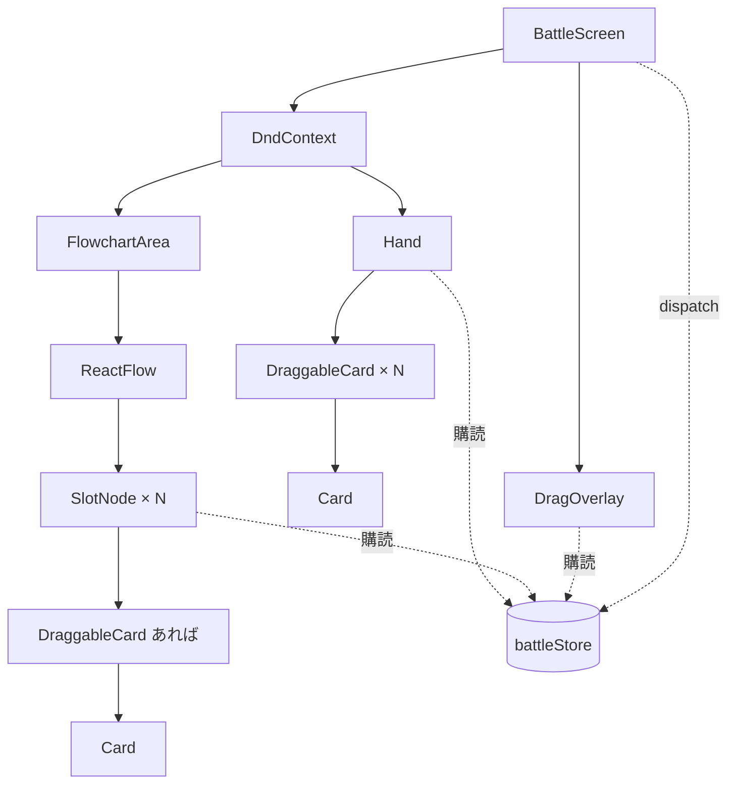
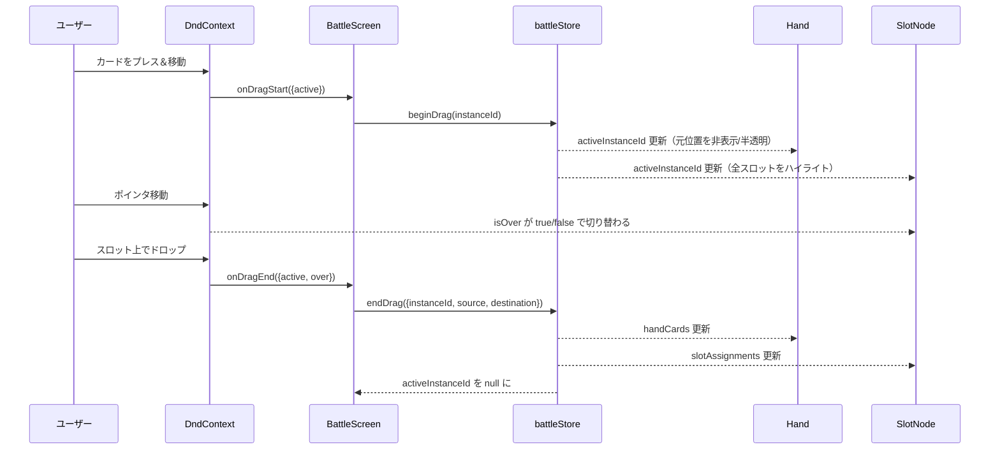

# 設計書: カード配置（ドラッグ＆ドロップ）

## 概要

`@dnd-kit/core` を用いて手札カードとフローチャート上のスロットを結び、カードをドラッグ＆ドロップで配置できるようにする。状態は Zustand ストア（`src/stores/battleStore.js`）に集約し、`Hand` / `FlowchartArea` はストアの購読者として描画する。ドラッグ中の追従表示は `DragOverlay` で実装し、手札のはみ出しや React Flow キャンバスのクリップ領域に制約されず滑らかに動くようにする。

大きな設計判断は 3 つ：
1. **状態はグローバルストアに寄せる**（props のバケツリレーを避ける。ドラッグ操作は手札⇄スロットを跨ぐため、両者の共通祖先である `BattleScreen` に閉じ込めると結局そこに分岐が集まる）
2. **個別カードは "インスタンス ID" で一意化する**（同一 `id` の複数所持に対応。手札 dnd-kit のドラッグ識別子には `id` ではなく `instanceId` を使う）
3. **スロットごとに `useDroppable` を付ける**（コンテナ 1 箇所で受けてヒットテストを手書きするより、dnd-kit のヒット判定とハイライトに任せたほうが安定）

## アーキテクチャ

### コンポーネント

| コンポーネント | 責務 |
|--------------|------|
| `BattleScreen` | `DndContext` / `DragOverlay` で画面全体をラップし、`onDragStart` / `onDragEnd` をストアのアクションに橋渡しする。ステージデータでストアを初期化する |
| `Hand` | ストアから `handCards` を購読して並べる。カード 1 枚ごとに `DraggableCard` を描画 |
| `DraggableCard`（新規） | `useDraggable` を適用して `Card` をドラッグ可能にする薄いラッパー。`source`（手札 or スロット ID）を `data` で付与する |
| `Card` | 既存の描画専用コンポーネント（変更なし） |
| `FlowchartArea` | ステージのスロット・エッジを React Flow に渡す。各スロットの現在値（空 / 配置済みカード）を `node.data` 経由で `SlotNode` に流す |
| `SlotNode` | `useDroppable` を適用し、配置済みカードがあれば `DraggableCard` を内側に描画する |
| `battleStore`（新規） | 手札・スロット割当・ドラッグ中カードを持つ Zustand ストア。配置／差し替え／撤回のロジックを純粋関数的に実装 |

### データモデル

カードのインスタンス：

```js
/**
 * @typedef {Object} CardInstance
 * @property {string} instanceId  バトル内で一意な識別子（例: "c-0"）
 * @property {string} id          カード種別（"attack" など、stages.json 由来）
 * @property {number} power       効力値（stages.json 由来）
 */
```

ストアの状態：

```js
{
  handCards: CardInstance[],                   // 順序のある手札
  slotAssignments: { [slotId]: CardInstance | null },
  activeInstanceId: string | null,             // ドラッグ中のカード（DragOverlay 用）
}
```

`stages.json` はそのまま変更せず、ストア初期化時に `cards` 配列へ `instanceId` を付与して展開する。

```js
// 例: stage.cards = [{id:"attack",power:12}, {id:"guard",power:12}, {id:"heal",power:12}]
// → handCards = [
//     {instanceId:"c-0", id:"attack", power:12},
//     {instanceId:"c-1", id:"guard",  power:12},
//     {instanceId:"c-2", id:"heal",   power:12},
//   ]
```

### API / インターフェース

**battleStore のアクション**

| 関数 | 引数 | 役割 |
|---|---|---|
| `initializeBattle(stage)` | `stage: StageDef` | 手札を展開し、スロット割当を全て `null` で初期化する |
| `beginDrag(instanceId)` | `instanceId: string` | `activeInstanceId` をセット（`onDragStart`） |
| `endDrag(result)` | `result: { instanceId, source, destination }` | ドラッグ終了時の状態遷移を 1 箇所で処理（下の表） |

`endDrag` のロジック（`source` と `destination` の組み合わせで分岐）：

| source | destination | ふるまい |
|---|---|---|
| `'hand'` | `null`（スロット外） | 何もしない（要件 4-1） |
| `'hand'` | `slotId`（空） | 手札から取り除き、スロットに配置（要件 2-1, 2-2） |
| `'hand'` | `slotId`（埋まっている） | 既存カードを手札末尾に戻し、新カードを配置（要件 3-1, 3-2） |
| `slotId-A` | `null` | カードを手札末尾に戻し、元スロットを `null` に（要件 4-2, 4-3） |
| `slotId-A` | `slotId-A`（同一） | 何もしない（要件 3-4） |
| `slotId-A` | `slotId-B`（空） | 元スロットを `null`、新スロットに配置（要件 2-1, 2-3） |
| `slotId-A` | `slotId-B`（埋まっている） | 既存カードを手札末尾に戻し、元スロットを `null`、新スロットに配置（要件 3-1〜3-3） |

**コンポーネントインターフェース**

```jsx
// 既存 Card は変更なし
<Card card={{ id, power }} />

// 新設
<DraggableCard
  card={CardInstance}      // instanceId を含む
  source={'hand' | slotId} // ドラッグ終了時に endDrag へ渡す
/>

// 既存 SlotNode は data でスロット状態を受ける React Flow のインターフェース
// FlowchartArea 側で node.data.assignedCard / node.data.slotId を渡す
```

## データフロー

### コンポーネント関係



### ドラッグ〜ドロップのシーケンス



## 実装方針

### 状態管理（Zustand）

- 新規ファイル：`frontend/src/stores/battleStore.js`
- `create` でシングルトンストアを作成。`initializeBattle` / `beginDrag` / `endDrag` の 3 アクションのみを公開する
- コンポーネントからは `useBattleStore(selector)` でスライス購読し、不要な再描画を避ける
- `endDrag` は `set((state) => ...)` で前述の表の通り分岐する純粋関数的実装。テストしやすいように分岐ロジックは `applyDrop(state, result)` のようなヘルパーに切り出してもよいが、最初は store 内に直書きでよい

### ドラッグ識別子と `source` の受け渡し

- `useDraggable({ id: instanceId, data: { source } })` で登録
  - `source` は `'hand'` または `slotId`
- `onDragEnd` で `active.data.current.source` と `over?.id` を取り出して `endDrag` に渡す
- 同じ `id` のカードが複数あっても `instanceId` で区別されるため dnd-kit 側の衝突は発生しない

### ドラッグ中の見た目

- `DragOverlay`（dnd-kit 標準）で「つかんでいるカード」をポインタ位置に追従描画する
  - Overlay 内では同じ `Card` コンポーネントを再利用（見た目は手札／スロットと揃える）
- 元位置の描画：
  - 手札側：ドラッグ中の `instanceId` に一致するカードは `opacity: 0.3` 程度で残す（「ここから取った」感を維持）
  - スロット側：ドラッグ中のカードが置かれていたスロットは空き表示（既存の `SlotNode` デフォルト状態）に切り替える。要件 1-6 を満たす

### ドロップ可能スロットのハイライト

- 各 `SlotNode` は `useDroppable({ id: slotId })` で登録
- ハイライト条件（CSS で分岐）：
  - `activeInstanceId !== null` のとき：全スロットに「ドロップ可能」を示す控えめなスタイル（例：枠色を少し明るく）
  - `isOver === true` のとき：「ここに落とせる」を示す強いスタイル（例：枠色をアクセント色、背景をほのかに塗る）
- 既存の破線スタイル（`SlotNode.module.css`）を壊さないよう、クラス付与で上書き可能にする

### React Flow 内でのドラッグ実装

- `SlotNode` は React Flow のカスタムノードだが、通常の DOM と同じく `useDroppable` / `useDraggable` が利用できる（DndContext は `BattleScreen` 直下なので React Flow 内部の DOM も配下に入る）
- React Flow 側の `nodesDraggable={false}` / `panOnDrag={false}` は維持する（要件 6-1）
- `node.data` を介して必要な情報（現在割当てられたカード、ドラッグ中フラグ）を SlotNode に渡す。`useMemo` で `nodes` を作る際に `slotAssignments` をマージする

### DndContext の設定

- センサーは `PointerSensor`（マウス）＋ `TouchSensor`（スマホ）を組み合わせる。どちらも `activationConstraint: { distance: 4px }` 程度を付けて、単純なクリック／タップをドラッグと誤検出しないようにする
- 衝突検出は `closestCenter`（スロット同士が離散的で小さく、pointerWithin ではヒット面積が小さすぎるため）

### コンポーネント配置とファイル命名

CLAUDE.md の「1 ファイル 1 クラス」「Docstring 必須」に従う。

```
frontend/src/
├── stores/
│   └── battleStore.js                  （新規）
└── features/
    ├── battle/
    │   ├── BattleScreen.jsx            （変更：DndContext/DragOverlay、ストア初期化）
    │   └── flowchart/
    │       ├── FlowchartArea.jsx       （変更：node.data に割当・ドラッグ状態を流す）
    │       ├── SlotNode.jsx            （変更：useDroppable、DraggableCard 描画）
    │       └── SlotNode.module.css     （変更：ハイライト用クラス）
    └── cards/
        ├── Card.jsx                    （変更なし）
        ├── Card.module.css             （変更なし）
        ├── DraggableCard.jsx           （新規）
        ├── DraggableCard.module.css    （新規／ドラッグ中の半透明表現）
        ├── Hand.jsx                    （変更：props 駆動からストア購読へ）
        └── Hand.module.css             （変更なし）
```

## 依存関係

| パッケージ | 用途 | 導入済み？ |
|---|---|---|
| `@dnd-kit/core` | ドラッグ＆ドロップ（`DndContext`, `useDraggable`, `useDroppable`, `DragOverlay`, `PointerSensor`, `TouchSensor`） | はい（6.3.1） |
| `zustand` | `battleStore` の状態管理 | はい（5.0.2） |
| `@xyflow/react` | スロット配置は既存のまま | はい |
| `react` | - | はい |

新規パッケージの導入はなし。

## トレードオフと検討した代替案

- **決定内容**：状態を Zustand の単一ストア（`battleStore`）に寄せる
  **理由**：ドラッグ操作は手札エリアとフローチャート領域を跨ぎ、両者の状態更新は 1 つのアクション（`endDrag`）で原子的に行う必要がある。ストアに寄せるとコンポーネントは `handCards` と `slotAssignments` をそれぞれ購読するだけになり、`BattleScreen` に巨大な state と prop drilling が集中するのを防げる。また README が状態管理ツールとして宣言している Zustand を実際に導入する最初のユースケースとしても自然
  **検討した代替案**：`BattleScreen` で `useReducer` を持ち props で流す案／`useState` 複数本。いずれも `endDrag` のロジック自体は同等だが、将来の「実行」「HP 変動」「フェーズ管理」といった拡張を Zustand に追加するほうが層が一貫する。今回の規模でも両手法の実装コスト差は小さく、長期を見て Zustand を採用

- **決定内容**：`DragOverlay` でドラッグ中のカードを描画する（元位置は半透明で残す）
  **理由**：手札エリアは `overflow: hidden` のレイアウトに入っており、元 DOM を CSS `transform` で動かすと親のクリップで切れる。Overlay は body 直下にポータル描画されるため自由に動く。さらに React Flow キャンバスを跨いで移動する際にもクリップされず、操作感が安定する
  **検討した代替案**：`transform` で元要素を動かす案。実装は薄いが、上記のクリップ問題でレイアウト調整が複雑化する

- **決定内容**：個別カードに `instanceId` を付与し、dnd-kit のドラッグ ID として使う
  **理由**：将来的に同一 `id`（例：`attack` を 2 枚）を手札に持つ拡張が見込まれ、dnd-kit はドラッグアイテムの `id` が一意である必要がある。早期に `instanceId` を導入しておけば、後から差し込むより安全。命名は単純に `c-<index>` で衝突回避に十分（同一バトル内で一意、再シャッフル等は未実装）
  **検討した代替案**：`cardId + index` の複合キー。動的にカードが動く際にキーが変わり React の再マウントや dnd-kit の追跡で不整合が出やすい

- **決定内容**：`SlotNode` ごとに `useDroppable` を設置する
  **理由**：スロット単位でヒットテスト・ハイライト（`isOver`）を dnd-kit に任せられるため、ロジックが簡潔になる。ノードが 3 つ程度なら Droppable の数もごく少なく、パフォーマンスへの影響は無視できる
  **検討した代替案**：`FlowchartArea` 1 箇所に Droppable を置いて内部で座標判定する案。スロットを移動したい場合に座標・当たり判定を自前で書く必要があり、スロットの位置は React Flow のビューポート変換を挟むため計算が増える

- **決定内容**：スロット外にドロップしたときは `over === null` で判定する
  **理由**：dnd-kit は有効な Droppable 上でのドロップのみ `over` を返す。「フローチャート領域内の非スロット部分」と「完全に領域外」を区別する必要は要件にないため、単純な `null` 判定で要件 4 を満たせる
  **検討した代替案**：フローチャート領域全体を「手札戻し専用」の Droppable にする案。区別が不要な今は複雑さだけが増える
