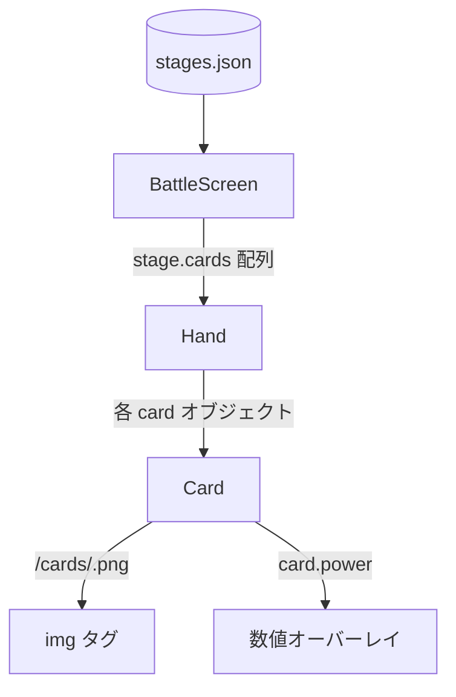
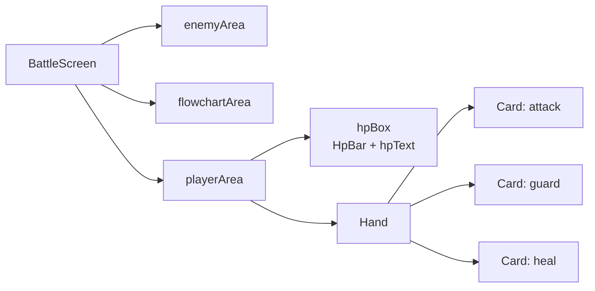

# 設計書: カード UI 画像化と Hand / Card 分離

## 概要

戦闘画面の手札 UI を 2 層に分割する:

1. **`Card`** — 個別カードの描画。画像 + `power` オーバーレイのみに責務を絞る。
2. **`Hand`** — カード配列の横並びレイアウト。個別カードの見た目には関与しない。

データ層では `cards.json` を廃止し、`stages.json` 各ステージに `cards: Array<{id, power}>` を追加する。`BattleScreen` はステージ定義から `cards` を取り出してそのまま `Hand` に渡す。

## アーキテクチャ

### コンポーネント

| コンポーネント | 配置先 | 責務 |
|--------------|------|------|
| `Hand` | `frontend/src/features/cards/Hand.jsx` | `cards` 配列を横並びに描画するレイアウトコンポーネント |
| `Card` | `frontend/src/features/cards/Card.jsx` | 単一カード画像 + `power` 数値オーバーレイの描画 |
| `BattleScreen`（既存・改修） | `frontend/src/features/battle/BattleScreen.jsx` | 現在ステージの `cards` を `Hand` に渡す。placeholder `.card` 要素は削除 |

### データモデル

#### `stages.json`（拡張後）

```jsonc
{
  "stages": [
    {
      "id": "stage-00",
      "enemyId": "slime",
      "cards": [
        { "id": "attack", "power": 12 },
        { "id": "guard",  "power": 12 },
        { "id": "heal",   "power": 12 }
      ],
      "slots": [ /* 既存のまま */ ],
      "edges": [ /* 既存のまま */ ]
    }
  ]
}
```

#### カードの型（JSDoc コメントでの扱い、実体は TypeScript ではない）

```text
Card: { id: string, power: number }
```

- `id`: `cards.json` を廃止するため、`stages.json` の `cards[*].id` が valid な ID 集合を暗黙に定義する。`id` は `frontend/public/cards/<id>.png` の存在するファイル名に一致する前提。
- `power`: 当該ステージでのカード威力。UI 上はカード画像下段に数値表示するのみ。効果計算は本スペック外。

#### `cards.json`

**削除。** 現行の 3 カード（attack / guard / heal）はステージ側に移管済み。

### API / インターフェース

#### `Card`

```jsx
<Card card={{ id, power }} />
```

- props:
  - `card.id` (string, 必須): カード ID。`/cards/${id}.png` の解決と `alt` 属性に使用。
  - `card.power` (number, 必須): 数値オーバーレイに表示する値。
- 戻り値: カード 1 枚を表す `<div>` 要素。

#### `Hand`

```jsx
<Hand cards={[{ id, power }, ...]} />
```

- props:
  - `cards` (Array<{id, power}>, 必須): 描画するカード配列。空配列は「手札 0 枚」として空のコンテナを返す。
- 戻り値: 横並びレイアウトの `<div>` 要素。内部では `cards.map` で `Card` を並べる。
- key: 同一 `id` の重複が許容されるため、`key` にはインデックスを使用する（配列の長さ・順序は入れ替わらない想定）。

## データフロー



## コンポーネント階層



## 実装方針

### Card.jsx

- `card.id` から `src = \`/cards/${card.id}.png\`` を組み立てる（パス解決ヘルパは作らない。1 行で済むため `enemySpritePath.js` 相当の分離は不要と判断）。
- レイアウトは `position: relative` のコンテナに `` を敷き、`<span>` を `position: absolute` で下段パネルに重ねる。
- `power` のテキストは `Press Start 2P` フォント、`text-shadow` で可読性を確保（HpText の既存スタイルに倣う）。
- `draggable={false}`、`user-select: none`、`-webkit-user-drag: none` でドラッグ抑止（D&D は別スペックで改めて制御するためここでは無効化）。

### Hand.jsx

- `display: flex` の横並びコンテナ。`align-items: center`、`gap: 0.5rem`、`height: 100%`。
- `cards.map((card, index) => <Card key={index} card={card} />)`。
- 空配列は許容（`cards.length === 0` のとき空の `<div>` を返す）。

### Card.module.css

```css
.root {
  position: relative;
  height: 100%;
  aspect-ratio: 2 / 3;
  flex-shrink: 0;
  user-select: none;
}
.image {
  display: block;
  width: 100%;
  height: 100%;
  image-rendering: pixelated;
  -webkit-user-drag: none;
}
.power {
  position: absolute;
  left: 0;
  right: 0;
  bottom: 10%;
  text-align: center;
  font-family: 'Press Start 2P', 'Courier New', Courier, monospace;
  font-size: 0.9rem;
  color: #f5f5f5;
  text-shadow: 1px 1px 0 #000;
  letter-spacing: 1px;
  pointer-events: none;
}
```

### Hand.module.css

```css
.root {
  display: flex;
  align-items: center;
  gap: 0.5rem;
  height: 100%;
}
```

### BattleScreen.jsx の改修

- `import Hand from '../cards/Hand'` を追加。
- `cardsData` 系の import は元々無いため追加不要。
- 下段の手札を `<Hand cards={stage.cards} />` に置換。
- `stage.cards` は `stages.json` から `stages[0]` を取っているので、既存の `const stage = stagesData.stages[0]` の流れをそのまま利用。
- 既存の docstring にある「手札プレースホルダ」記述を実態に合わせて更新。

### BattleScreen.module.css の改修

- `.hand` と `.card` のルールを削除（それぞれ `Hand.module.css` / `Card.module.css` に移管済み）。
- `.playerArea` / `.hpBox` / `.hpText` は維持。

### stages.json の変更

- `stage-00` に `cards` フィールドを追加（`slots` の直前に配置し、意味のまとまりを「敵 → カード → フローチャート（slots/edges）」の順にする）。

### cards.json の削除

- `frontend/src/data/cards.json` を削除。
- リポジトリ全体を `grep -r "cards.json"` / `grep -r "cardsData"` で確認し、残存 import がないことを保証する。

### README.md の更新

- ディレクトリ構造図に `features/cards/` を追記。
- `data/cards.json` の行を削除。
- 「今後追加予定のディレクトリ」表から `frontend/src/features/cards/` を削除（実装されたため）。

## 依存関係

| パッケージ | 用途 | 導入済み？ |
|----------|------|----------|
| `react` | コンポーネント定義 | 済 |
| （CSS Modules） | Vite 標準、追加依存なし | 済 |

新規パッケージは不要。

## 要件トレーサビリティ

| 要件 | 設計セクション |
|------|---------------|
| 要件1-1（`` で表示） | Card.jsx > `src` 組み立て |
| 要件1-2（`power` オーバーレイ） | Card.jsx / Card.module.css の `.power` |
| 要件1-3（ピクセルアート調） | Card.module.css `.image { image-rendering: pixelated }` |
| 要件1-4（ドラッグ・選択抑止） | Card.jsx の `draggable={false}` / Card.module.css `user-select: none` |
| 要件1-5（`id` を alt に） | Card.jsx の `` |
| 要件2-1（ファイル分離） | コンポーネント表（`Card.jsx`, `Hand.jsx`） |
| 要件2-2（`cards` プロップ） | Hand のインターフェース定義 |
| 要件2-3（`Card` が JSON import を持たない） | Card のインターフェース定義（props のみ） |
| 要件2-4（BattleScreen に `.card` DOM を残さない） | BattleScreen.jsx / .module.css の改修 |
| 要件3-1（`cards.json` 削除） | cards.json の削除セクション |
| 要件3-2（`cards` フィールド追加） | stages.json の変更 |
| 要件3-3（同一 id 複数可） | データモデル注記 + Hand の `key` にインデックス使用 |
| 要件3-4（ステージから Hand へ渡す） | データフロー図 / BattleScreen.jsx 改修 |
| 要件3-5（`stage-00` の移行） | stages.json サンプル |
| 要件3-6（import の残存なし） | cards.json の削除セクション（grep 確認） |
| 要件4-1・2（可変サイズ） | Card.module.css `.root { aspect-ratio: 2/3; height: 100% }` |
| 要件4-3（gap 横並び） | Hand.module.css |
| 要件4-4（レイアウトシフト防止） | Card.module.css の `aspect-ratio` 事前確保 |
| 要件5（スコープ外） | 本設計で実装しないものを明記（D&D・選択状態・displayName） |

## トレードオフと検討した代替案

- **`cards.json` の完全廃止 vs メタデータ残存**: 決定：完全廃止。理由：現状 `displayName` は UI で表示しておらず、`id` を alt に使えば代替できる。必要になった時点で再追加する方が CLAUDE.md の「必要になった時点で作る」方針に沿う。
- **`cards` を辞書 vs 配列**: 決定：配列 `[{ id, power }, ...]`。理由：同一カード複数枚（例：`attack` を 2 枚）を自然に表現できる。順序が明示的。辞書だと `id` をキーとする制約で重複不可になる。
- **カードサイズの可変 vs 固定**: 決定：可変（`height: 100%` + `aspect-ratio: 2/3`）。理由：`playerArea` の高さに追従する方が画面サイズ差異に強い。固定値は将来の調整にハードコード依存が残る。
- **`card.power` のオーバーレイ手段（CSS overlay vs Canvas 合成）**: 決定：CSS absolute positioning。理由：DOM のまま扱える方が React のレンダリングサイクルに自然に乗り、フォント・色・サイズ変更の実験が容易。Canvas は単一画像の書き出しには有効だが、動的変更やテーマ対応で不利。
- **パス解決ヘルパ（`enemySpritePath.js` 相当）の有無**: 決定：作らない。理由：`/cards/${id}.png` は 1 行で済み、フレーム連番等の複雑なロジックがないため先例との対称性より簡潔性を優先。
- **`Hand` の `key`**: 決定：配列インデックス。理由：同一 id 重複が許容される仕様上、id は一意キーにできない。`cards` 配列の並び替え機能は本スペックで扱わないため、index で問題ない。将来並び替えを導入する段階で UUID 等に切り替える。
