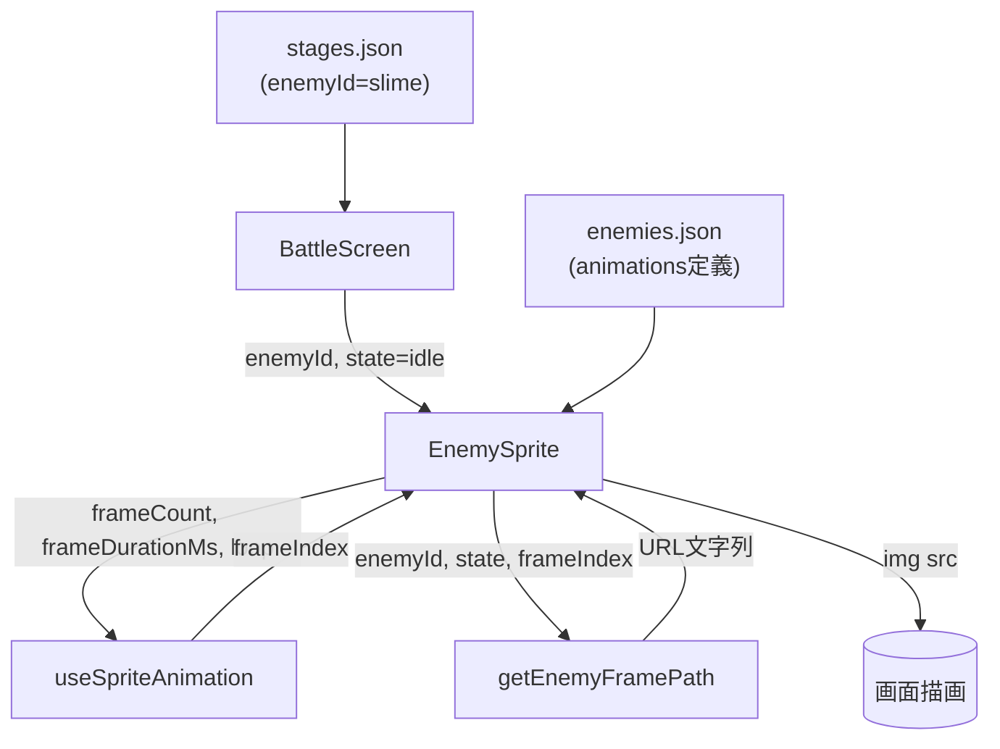
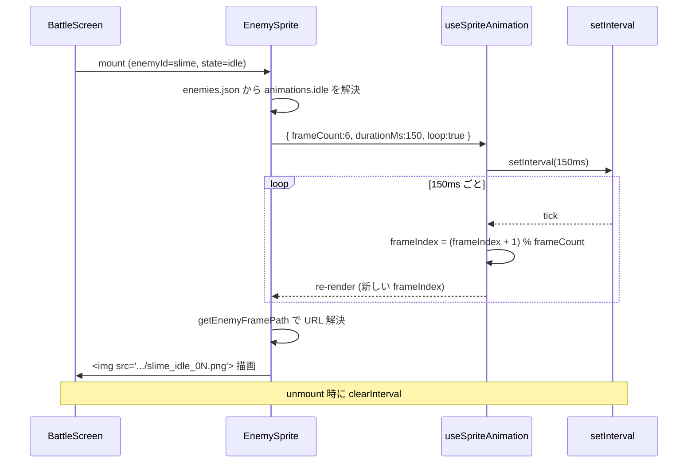

# 設計書: 敵のスプライトアニメーション描画

## 概要

戦闘画面上部に、敵の種類と状態を指定するだけでスプライトアニメーションを描画できる汎用コンポーネント `EnemySprite` を React で実装する。フレーム切り替えはカスタムフック `useSpriteAnimation` に分離し、UI と動作ロジックを疎結合にする。敵の定義（フレーム数・フレーム間隔など）は `enemies.json` に外出しし、コード変更なしで敵の追加・調整ができるようにする。状態（`idle` / 将来の `hurt` / `attack` / `dead` など）は敵定義の `animations` マップのキーとして表現し、今回は `idle` のみ実装する。

## アーキテクチャ

### コンポーネント / モジュール

| コンポーネント・モジュール | 種別 | 責務 |
|---|---|---|
| `EnemySprite` | React コンポーネント | `enemyId` と `state` を受け取り、現在フレームの `` を描画する。敵定義の解決・アニメの開始/停止を管理。 |
| `useSpriteAnimation` | カスタムフック | 指定された総フレーム数・1フレームの表示時間・ループ設定に従い、現在フレーム index を時間経過で更新して返す。 |
| `enemySpritePath.js` | ユーティリティ | `(enemyId, state, frameIndex)` からスプライト画像の公開 URL を組み立てる純粋関数。命名規則の唯一の真実の源。 |
| `enemies.json` | 静的データ | 敵 ID・表示名・状態別アニメーション定義を保持。 |
| `BattleScreen` | 既存コンポーネント（改修） | プレースホルダ `[敵エリア] テストエネミー` を `<EnemySprite enemyId="slime" state="idle" />` に置き換える。ステージ定義から敵 ID を受け取る前提で繋ぎ込む。 |

### データモデル

#### `enemies.json`

```json
{
  "enemies": [
    {
      "id": "slime",
      "displayName": "スライム",
      "animations": {
        "idle": {
          "frameCount": 6,
          "frameDurationMs": 150,
          "loop": true
        }
      }
    }
  ]
}
```

| フィールド | 型 | 説明 |
|---|---|---|
| `id` | string | 敵識別子。ディレクトリ名・ファイル名と一致させる（例：`slime`）。 |
| `displayName` | string | UI 表示用の日本語名。将来の HP バー等で利用する想定。今回は未使用だが定義は置く。 |
| `animations` | object | 状態名 → アニメーション定義のマップ。今回のスコープでは `idle` のみ必須。 |
| `animations.<state>.frameCount` | number | その状態の総フレーム数。 |
| `animations.<state>.frameDurationMs` | number | 1 フレームを表示するミリ秒。 |
| `animations.<state>.loop` | boolean | ループ再生するか。`idle` は `true`、将来の `attack`/`hurt` は `false` を想定。 |

> **状態拡張の前提**: `animations` マップに新しい状態を追加するだけで新しいアニメーションを宣言できる（要件4-2）。コンポーネント側は状態キーを持たず動的に参照するため、`hurt`・`attack`・`dead` 追加時に `EnemySprite` の改修は不要。

#### `stages.json` への追加（最小変更）

ステージに `enemyId` を追加し、戦闘画面がどの敵を出すか決められるようにする。

```json
{
  "id": "stage-00",
  "enemyId": "slime",
  "slots": [...],
  "edges": [...]
}
```

### API / インターフェース

#### `<EnemySprite />`

| prop | 型 | 必須 | 説明 |
|---|---|---|---|
| `enemyId` | string | 必須 | 例：`"slime"`。`enemies.json` に存在する ID。 |
| `state` | string | 任意（既定値 `"idle"`） | 表示する状態。敵の `animations` に存在するキー。 |

Return: その敵・状態の現在フレームを描画する `` を内包した `<div>`。

#### `useSpriteAnimation({ frameCount, frameDurationMs, loop })`

Return: `{ frameIndex: number }`。呼び出し元が props を変えるとタイマーが再始動し、新しい設定でフレームが進む。`loop: false` のときは最終フレームで停止する（今回は未使用だが実装しておく）。

#### `getEnemyFramePath(enemyId, state, frameIndex)`

純粋関数。戻り値：`/sprites/enemies/${enemyId}/${state}/${enemyId}_${state}_${NN}.png` 形式の文字列（`NN` は 2 桁ゼロ埋め）。命名規則（要件5）を本関数に閉じ込め、他箇所にパス組み立てロジックを書かせない。

## データフロー



## アニメーション内部動作



## 実装方針

### 配置（ディレクトリ構造）

```
frontend/
├── public/sprites/enemies/<敵ID>/<状態>/<敵ID>_<状態>_<NN>.png  ← 既存、要件5
└── src/
    ├── data/
    │   └── enemies.json                        ← 新規
    └── features/battle/
        └── enemy/                              ← 新規ディレクトリ
            ├── EnemySprite.jsx
            ├── EnemySprite.module.css
            ├── useSpriteAnimation.js
            └── enemySpritePath.js
```

- `features/battle/enemy/` 配下に関連 4 ファイルを集約。将来、戦闘外でも敵を使うようになれば `features/enemies/` へ移す（現時点では早期抽象化を避ける）。
- CLAUDE.md の「1 ファイル 1 クラス」に従い、コンポーネント・フック・ユーティリティを別ファイルに分ける。

### フレーム切り替え方式

- `setInterval` ベースで実装する。60fps の滑らかさは不要で、固定ミリ秒ごとの離散的な切り替えで十分なため。
- `requestAnimationFrame` は不採用。タブが非アクティブなときに止まってしまうなどの扱いが煩雑で、この用途では恩恵が薄い。
- React の strict mode による 2 重マウントでタイマーが重複しないよう、`useEffect` のクリーンアップで必ず `clearInterval` する。

### 画像のプリロード

- `EnemySprite` マウント時、対象状態の全フレームを `new Image()` で事前読み込みする。ネットワーク遅延でフレーム切り替え時にチラつくのを防ぐため。
- プリロード完了を待つかは今回は問わない（ローカル配信で速いため）。将来、プリロード状態をローディング表示に使う余地を残して `useSpriteAnimation` からは切り離しておく。

### 配置・サイズ（要件1）

- 親の `.enemyArea`（`flex: center center` で中央揃え済）にそのまま配置する。
- `EnemySprite` のルート要素は inline-block 的に振る舞えば自動で中央に寄る。
- `` は **原寸** 表示（`width`/`height` を指定しない。CSS でも `max-width: none`）。要件1-2。

### エラーハンドリング（要件1-3）

- `enemies.json` に該当 ID が無い、または対象状態の定義が無い場合：`null` を返して何も描画しない。`.enemyArea` のレイアウトは維持される。
- `` の読み込み失敗は `onError` を指定せず自然に壊れたままにする（将来、代替画像やエラーロギングを追加する余地を残す）。

## 依存関係

| パッケージ | 用途 | 導入済み？ |
|---|---|---|
| `react` | コンポーネント・フック | ✅ |
| `react-dom` | 描画 | ✅ |
| （新規導入なし） | — | — |

`framer-motion` は今回の固定間隔フレーム切り替えにはオーバースペックなため採用しない。

## 要件トレーサビリティ

| 要件 | 実現箇所 |
|---|---|
| 1-1 上部中央に1体描画 | `BattleScreen` で `.enemyArea` 内に `<EnemySprite>` を配置。`.enemyArea` は既に flex center。 |
| 1-2 原寸描画 | `EnemySprite` の `` に `width`/`height` を指定しない。CSS で `max-width: none`。 |
| 1-3 読み込み失敗時のレイアウト保持 | 敵定義が無い場合は `null` を返し、`.enemyArea` の余白をそのままにする。 |
| 2-1 自動再生 | `EnemySprite` マウント時に `useSpriteAnimation` が `setInterval` を開始。 |
| 2-2 一定間隔で切り替え | `useSpriteAnimation` が `frameDurationMs` 毎に `frameIndex` をインクリメント。 |
| 2-3 最終→先頭のループ | `frameIndex = (prev + 1) % frameCount`。 |
| 2-4 表示中は止めない | アンマウントまで `clearInterval` しない。 |
| 3-1 ID・状態で解決 | `EnemySprite` が `enemies.json` から動的に定義を引く。 |
| 3-2 敵ごとにフレーム数可変 | `frameCount` を敵定義から読み出し、そのまま使用。 |
| 3-3 データ管理 | `enemies.json` に敵を追加するだけで描画可能。 |
| 4-1 状態キーでの切替 | `animations` マップを state 名で引く設計。 |
| 4-2 呼び出し側変更不要で状態追加 | `EnemySprite` は状態キーに非依存。`enemies.json` への追加のみで拡張可能。 |
| 4-3 今回は idle のみ | `enemies.json` に `idle` のみ定義。 |
| 5-1/5-2/5-3 パス・命名・ゼロ埋め | `getEnemyFramePath` に閉じ込め、他コードから直接パスを書かせない。 |
| 5-4 README 更新 | 新規ディレクトリ（`src/features/battle/enemy/` 等）を同一コミットで README 反映。 |

## トレードオフと検討した代替案

- **決定：1 枚 1 PNG 方式（現行）** / **理由**：Aseprite からの書き出しそのままで扱え、デバッグ時に各フレームを単独で閲覧できる。スプライトシート（1 枚に全フレームを敷き詰め `background-position` で切り替え）は CSS が複雑になり、フレーム数が敵ごとに可変な要件と相性が悪い。
- **決定：`setInterval` / **不採用：`requestAnimationFrame`** / **理由**：固定間隔の離散アニメーションには `setInterval` の方が素直。`requestAnimationFrame` は可変フレームレートのアニメ向き。
- **決定：`enemies.json` で宣言** / **不採用：コード内の定数** / **理由**：敵追加時にコード変更不要（要件3-3）、将来ステージデータと同じく外部 JSON へ統一しやすい。
- **決定：`features/battle/enemy/` 配下** / **不採用：`features/enemies/` へ先行配置** / **理由**：現時点で戦闘以外に用途が無い。早期の抽象化は避ける（CLAUDE.md・プロジェクト方針）。将来用途が増えた時点で移動する。
- **決定：`framer-motion` 不使用** / **理由**：固定時間のフレーム切り替えに外部依存は不要。将来被弾シェイク等の演出を入れる段階で検討する。
