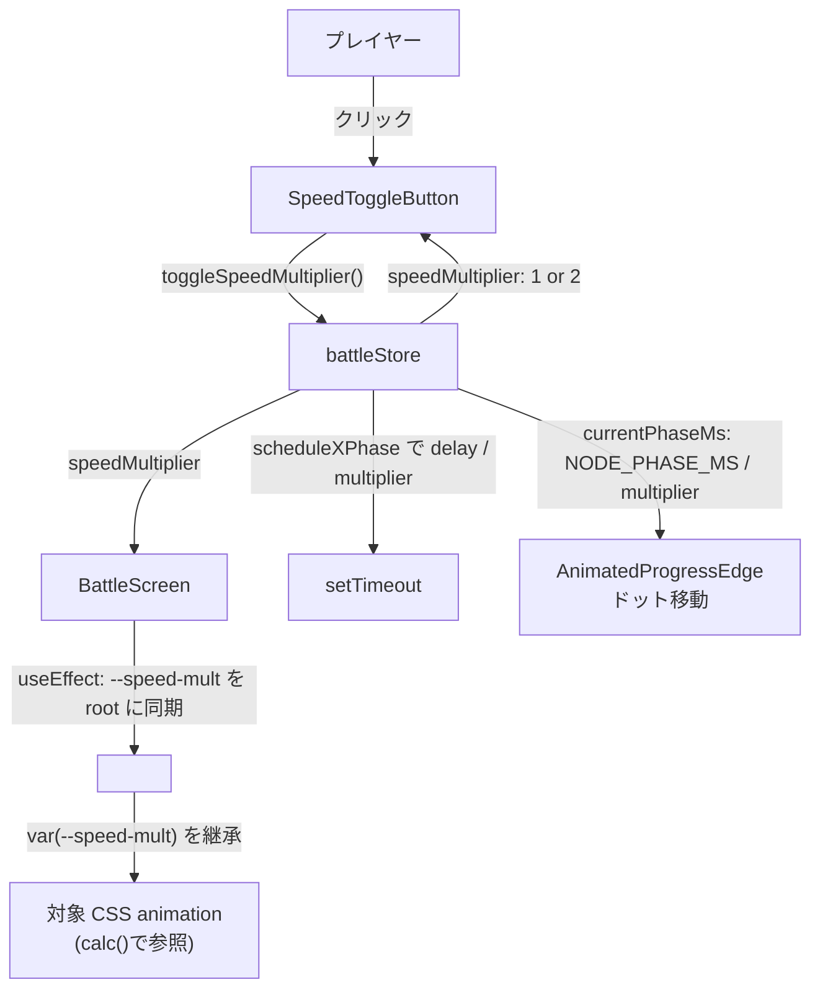
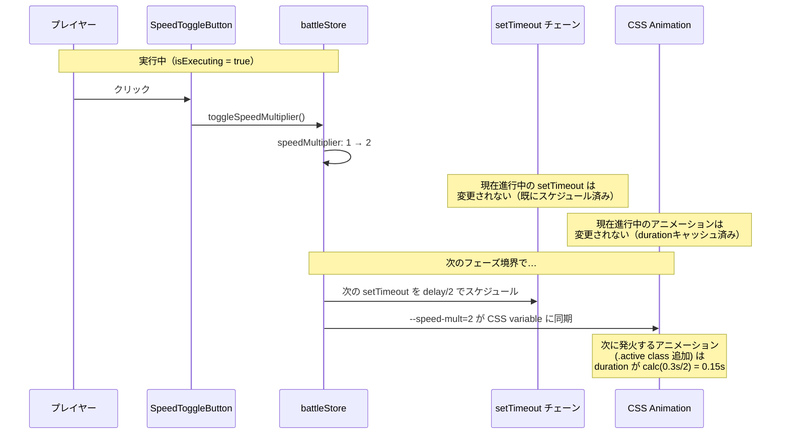
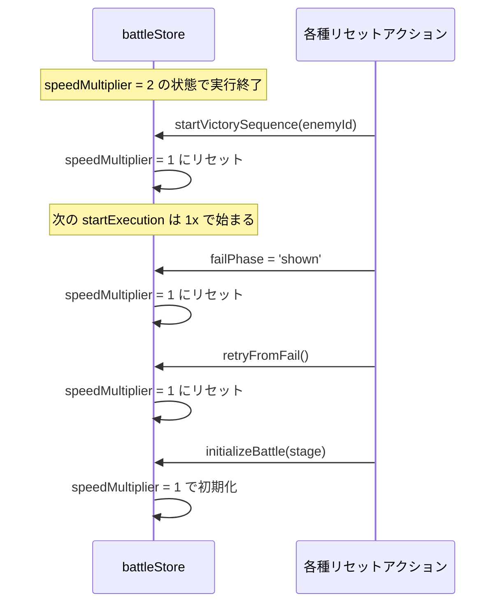

# 設計書: 実行速度トグルボタン（2倍速）

## 概要

`battleStore` に新しい状態 `speedMultiplier: number`（初期値 1、ボタンで 2 にトグル）を追加し、フローチャート実行中の **JS タイマー（`setTimeout`）の遅延** と **CSS アニメーションの所要時間** を `<base> / speedMultiplier` で割る形で 2 倍速を実現する。タイマー側は既存の `scheduleNodePhase` / `scheduleEdgePhase` / `scheduleComplete` の `delay` 引数を `delay / get().speedMultiplier` で囲うだけで「**次のフェーズから新しい倍率が効く**」セマンティクスが自然に達成される（既にスケジュール済みの `setTimeout` は変えられないため）。CSS 側は **CSS カスタムプロパティ `--speed-mult`** を `BattleScreen` の root 要素に `useEffect` で同期し、対象アニメーションだけが `animation-duration: calc(<base> / var(--speed-mult, 1))` で参照する。`var()` を使わない animation rule（勝利/敗北演出）は影響を受けない opt-in 方式。UI 側は新規 `SpeedToggleButton.jsx` を `.flowchartControls` 下段（旧 `PlayButton` 位置）に置き、`isExecuting` の間だけ押下可能。

## アーキテクチャ

### コンポーネント

| コンポーネント | 責務 |
|--------------|------|
| `SpeedToggleButton`（新規） | `>>` アイコンの button。`isExecuting` の間だけ enabled。クリックで `toggleSpeedMultiplier()` を発火。`speedMultiplier === 2` のとき opacity を下げて「オン中」を視覚化 |
| `battleStore`（改修） | `speedMultiplier` state を追加。`toggleSpeedMultiplier()` action を追加。`startExecution` 内の `setTimeout` 遅延と `currentPhaseMs` を `/ speedMultiplier` で割る。`initializeBattle` / `startVictorySequence` / 失敗パス / `retryFromFail` でリセット |
| `BattleScreen`（改修） | `useEffect` で `speedMultiplier` を購読し、`.root` 要素の CSS variable `--speed-mult` に同期。新規 `SpeedToggleButton` を `.flowchartControls` 下段に配置 |
| 各種 `.module.css`（改修） | フェーズ進行に同期させたい animation の `animation-duration` を `calc(<base> / var(--speed-mult, 1))` に書き換え（フローチャート発光・HP エフェクト・DamageFloater 系） |

### データモデル

新規 store フィールドとアクション:

| 名前 | 型 | 用途 |
|---|---|---|
| `speedMultiplier` | `number` | 現在の速度倍率。1（通常）または 2（倍速）。将来 3, 4 等に拡張可能 |
| `toggleSpeedMultiplier()` | `() => void` | 倍率を `[1, 2]` 配列の次の値にサイクルする。将来 `[1, 2, 3]` に拡張可能 |

定数（モジュールスコープ）:

| 名前 | 値 | 用途 |
|---|---|---|
| `SPEED_MULTIPLIERS` | `[1, 2]` | トグル順序。将来 `[1, 2, 3, 4]` 等に拡張するときはこの配列を伸ばすだけ |

### API / インターフェース

#### `battleStore` の新 action

```javascript
toggleSpeedMultiplier: () => {
  set((s) => {
    const current = s.speedMultiplier;
    const idx = SPEED_MULTIPLIERS.indexOf(current);
    const next = SPEED_MULTIPLIERS[(idx + 1) % SPEED_MULTIPLIERS.length];
    return { speedMultiplier: next };
  });
}
```

#### `startExecution` 内の `setTimeout` 遅延変換

既存 `scheduleNodePhase`/`scheduleEdgePhase`/`scheduleComplete` の各 `setTimeout(callback, delay)` を:

```javascript
setTimeout(callback, delay / get().speedMultiplier)
```

に置き換える。`currentPhaseMs` を `set()` で更新する箇所も同様:

```javascript
currentPhaseMs: NODE_PHASE_MS / get().speedMultiplier
currentPhaseMs: EDGE_PHASE_MS / get().speedMultiplier
```

#### CSS variable bridge（`BattleScreen.jsx` に追加）

```javascript
const speedMultiplier = useBattleStore((s) => s.speedMultiplier);
const rootRef = useRef(null);
useEffect(() => {
  if (rootRef.current) {
    rootRef.current.style.setProperty('--speed-mult', String(speedMultiplier));
  }
}, [speedMultiplier]);
```

`<section className={rootClassName} ref={rootRef}>` のように `ref` を付与。

#### CSS animation duration 変換例

```css
/* 旧 */
.slot.active {
  animation: slotHighlight 0.3s ease-in-out 2 alternate;
}

/* 新 */
.slot.active {
  animation: slotHighlight calc(0.3s / var(--speed-mult, 1)) ease-in-out 2 alternate;
}
```

## データフロー







## 実装方針

### 速度倍率の保持と適用ポイント

**JS タイマー側**: `startExecution` 内の 3 つの schedule 関数（`scheduleNodePhase`, `scheduleEdgePhase`, `scheduleComplete`）で `setTimeout` の delay を `delay / get().speedMultiplier` に置換。`get().speedMultiplier` は setTimeout コールバック内ではなく **schedule 関数呼び出し時点** で読むことで、「次のフェーズから新倍率」セマンティクスが達成される（現在進行中のフェーズは既に setTimeout がキューに入っているので変更不可、次のフェーズが setTimeout を新規キューイングする時点で新値を読む）。

**CSS animation 側**: `BattleScreen` の `useEffect` で `speedMultiplier` を `--speed-mult` カスタムプロパティに同期。対象 CSS rule は `animation-duration` を `calc(<base> / var(--speed-mult, 1))` に書き換える。`var()` を使わない rule（勝利/敗北演出）は自動的に opt-out。CSS の animation duration は **アニメーション開始時に確定** するので、走行中のアニメは変わらず、次の `.active` クラス付与から新値が適用される（JS タイマーと同じ「次のフェーズから」セマンティクス）。

### 倍率の保持を boolean ではなく number にする理由

要件6 で「将来 3x/4x 拡張」が明記されているため、`isSpeedUp: boolean` ではなく `speedMultiplier: number` で保持。

- 計算式: `delay / speedMultiplier` / `baseDuration / var(--speed-mult, 1)` で **倍率値が直接式に入る**ため、`2x → 3x` 拡張時に store ロジックは触らず、`SPEED_MULTIPLIERS` 配列を `[1, 2]` → `[1, 2, 3]` に伸ばすだけで対応可
- UI 側: 「現在の倍率を画面に出したい」「ボタンが連打されるたびに 1→2→3→1→… でサイクル」も自然に表現できる

### CSS カスタムプロパティ `--speed-mult` の同期方式

`BattleScreen` の `useEffect` で `speedMultiplier` を購読し、`rootRef.current.style.setProperty('--speed-mult', ...)` で `.root` 要素にインラインスタイルとして設定する。

- **`document.documentElement` ではなく `.root` 要素に設定** する理由: スコープを戦闘画面に限定するため。他画面（タイトル・マップ等）に副作用が出ないよう。
- **インラインスタイル経由**: グローバル CSS で `--speed-mult: 1` をデフォルト指定し、JS が動的に上書きする形。コンポーネントのライフサイクルに同期するので、`BattleScreen` がアンマウントされれば自動的に消える。

### 倍率の適用範囲リスト（要件4 対応）

以下の CSS animation を `calc(<base> / var(--speed-mult, 1))` に書き換える:

| ファイル | アニメーション | 旧 duration |
|---|---|---|
| `SlotNode.module.css` | `slotHighlight` | 0.3s |
| `SlotNode.module.css` | `counterFlash` | 0.36s |
| `StartNode.module.css` | `startGoalHighlight` | 0.3s |
| `GoalNode.module.css` | `startGoalHighlight` | 0.3s |
| `ConditionNode.module.css` | `conditionHighlight` | 0.3s |
| `MergeNode.module.css` | `mergeHighlight` | 0.3s |
| `BattleScreen.module.css` | `hpBoxHit` | 0.3s |
| `BattleScreen.module.css` | `hpBoxShakeX` | 0.3s |
| `BattleScreen.module.css` | `hpBoxHealGlow` | 0.5s |
| `BattleScreen.module.css` | `hpBoxDamageGlow` | 0.5s |
| `BattleScreen.module.css` | `hpBoxReflectGlow` | 0.5s |
| `BattleScreen.module.css` | `hpBoxShielded` | 500ms |
| `BattleScreen.module.css` | `hpBoxShakeVert` | 0.3s |
| `DamageFloater.module.css` | `damageFloat` | 0.8s |
| `PlayerDamageFloater.module.css` | `damageFloat` | 0.8s |
| `ReflectDamageFloater.module.css` | `reflectFloat` | 0.8s |

**触らない** animation（要件4-6, 4-7）:

- `VictoryClearOverlay`（勝利演出フェーズの各種アニメ）
- `BattleFailOverlay`（敗北演出フェーズの各種アニメ）
- `AnimatedProgressEdge.module.css` の `drawingPath` / `traverseEdge`: ただしこれらは元から JS の `currentPhaseMs` を inline style で受け取る形なので、`currentPhaseMs` を倍率適用済みにしておけば自動的にスケールされる（CSS variable 経由ではない）

### `SpeedToggleButton` の UI 設計

`ZoomButton.module.css` のスタイルをそのまま流用する形で `SpeedToggleButton.module.css` を作成:

- `.button`: `padding: 0.35rem 0.6rem`, `font-size: 0.9rem`, 色・角丸は同じ
- `.button:hover:not(:disabled)`, `.button:active:not(:disabled)`, `.button:disabled`: 同じパターン
- **新規** `.active`（倍速オン中）: `opacity: 0.5` で薄く表示（要件1-4）

アイコン: テキスト `>>` を採用（unicode 半角 `>>` または `»`、`ZoomButton` の `↑`/`↓` と統一感）。SVG 化は不要。

JSX:
```jsx
<button
  type="button"
  className={isFast ? `${styles.button} ${styles.active}` : styles.button}
  onClick={toggleSpeedMultiplier}
  disabled={!isExecuting}
  aria-label="2倍速切替"
  aria-pressed={isFast}
>
  &gt;&gt;
</button>
```

`aria-pressed` でトグルボタンであることを支援技術に伝える。

### リセットタイミングの実装ポイント

`battleStore` 内の以下の場所で `speedMultiplier: 1` を一括 set:

| トリガー | 場所 |
|---|---|
| `initializeBattle(stage)` | 既存の `set(...)` 内に `speedMultiplier: 1` を追加 |
| 勝利確定（`startVictorySequence(enemyId)`） | 既存の `set(...)` 内に追加 |
| 敗北確定（`failPhase: 'shown'` を set している全箇所） | 該当 set 内に追加（複数箇所あり、要 grep） |
| `retryFromFail()` | 既存の `set(...)` 内に追加 |

`startExecution` は `initializeBattle` 経由で既に 1 で始まるため、明示的なリセットは不要（ただし防御的に冒頭で set してもよい）。

### `disabled` 条件（要件2）

`!isExecuting` を `disabled` にするのが基本だが、念のため以下も確認:

- **拡大/縮小トランジション中** (`isTransitioning`): 通常は `isExecuting === false` のはずなので不要
- **勝利/敗北演出中** (`victoryPhase` / `failPhase`): 通常は `isExecuting === false` だが、リセットが `isExecuting = false` を set した直後に演出フェーズに移る境界があるため、`!isExecuting` だけで disabled にすれば自然にカバーされる

シンプルに `disabled={!isExecuting}` で要件 2 を達成。

## 依存関係

| パッケージ | 用途 | 導入済み？ |
|----------|------|----------|
| `zustand` | 既存の `useBattleStore` に新 state/action を追加するだけ | はい（既存） |
| `react` | `useEffect`, `useRef` 使用 | はい（既存） |

新規依存なし。

## トレードオフと検討した代替案

- **決定内容**: `speedMultiplier` を **number** で保持（boolean ではなく）
  **理由**: 要件6（将来拡張）と整合。3x/4x 追加時に store ロジック変更不要、`SPEED_MULTIPLIERS` 配列を伸ばすだけ
  **検討した代替案**: `isSpeedUp: boolean` → 2x ハードコード前提になり、3x 追加時に状態の意味自体を変える必要が出る。負債化リスク

- **決定内容**: CSS animation の倍速は **CSS カスタムプロパティ `--speed-mult` + `calc()`**
  **理由**: 1 箇所（`BattleScreen` の useEffect）で全 animation のスケールを一元制御。各 CSS rule の `animation-duration` だけ書き換えれば opt-in 可能。`var()` を使わない rule は自動的に opt-out（勝利/敗北演出が影響を受けない）
  **検討した代替案**: 
    - (a) `.root.fastSpeed` クラスを追加して `:root.fastSpeed .slot.active { animation-duration: 0.15s }` を全 animation 用に書く → 倍率追加（3x）のたびに全 CSS rule を再記述、負債化リスク
    - (b) JSX 側で `style={{ animationDuration: ... }}` をインライン指定 → JSX が膨れる、CSS から JS に animation duration が漏れて保守困難

- **決定内容**: **「次のフェーズから新倍率」セマンティクス** を採用（途中で時間が縮まない）
  **理由**: 走行中の animation/setTimeout の時間が突然変わると視覚的に不自然。要件3-3 にも明記
  **検討した代替案**: 走行中も即時反映 → setTimeout は再スケジュールできないため実装複雑、CSS は元々 animation duration が start 時点で確定するので無意味

- **決定内容**: CSS カスタムプロパティを `.root` 要素（`<section>`）に設定（`document.documentElement` ではなく）
  **理由**: スコープを戦闘画面に限定。他画面に副作用が出ない
  **検討した代替案**: `document.documentElement` に直接 set → グローバル汚染、`useEffect` のクリーンアップで削除を忘れると他画面に残る

- **決定内容**: `disabled={!isExecuting}` のみで判定（拡大遷移中・演出中の追加チェックなし）
  **理由**: 実行中以外では `isExecuting === false`、これらの遷移中も `isExecuting === false`。シンプルさを優先
  **検討した代替案**: `isExecuting && !isTransitioning && !victoryPhase && !failPhase` → 冗長

- **決定内容**: アイコンに **テキスト `>>`**（SVG ではない）
  **理由**: `ZoomButton` の `↑`/`↓` と統一感、ファイル追加不要、軽量
  **検討した代替案**: `/icons/flowchart/fast.svg` を作成 → SVG ファイル管理が増える、見た目の利点はほぼゼロ

## トレーサビリティ

| 要件 | 対応する設計セクション |
|---|---|
| 1: ボタンの配置と外観 | コンポーネント表（`SpeedToggleButton`）、実装方針「`SpeedToggleButton` の UI 設計」 |
| 2: 押下可能タイミング | 実装方針「`disabled` 条件」 |
| 3: トグル機構と倍率の適用 | API/インターフェース「`toggleSpeedMultiplier`」、データフロー Mermaid、実装方針「速度倍率の保持と適用ポイント」 |
| 4: 倍率適用範囲 | 実装方針「倍率の適用範囲リスト」（全 16 animation 列挙）、`AnimatedProgressEdge` の `currentPhaseMs` 経由スケール |
| 5: 実行終了時のリセット | 実装方針「リセットタイミングの実装ポイント」 |
| 6: 将来拡張可能な構造 | データモデル「`SPEED_MULTIPLIERS` 配列」、トレードオフ「number で保持」 |
| 7: アクセシビリティと非干渉 | 実装方針「`SpeedToggleButton` の UI 設計」（`aria-label`/`aria-pressed`）、トレードオフ「次のフェーズから新倍率」（実行ロジック自体は不変、時間だけ短縮） |

全7要件が設計に対応しています。孤立した要件はありません。
