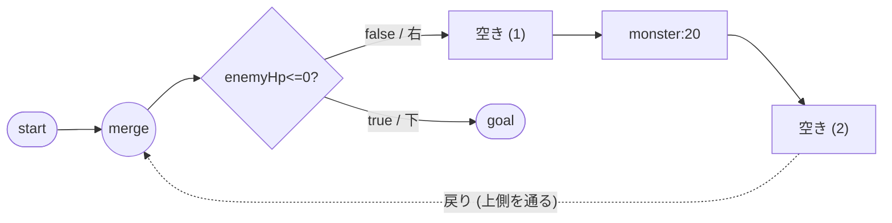
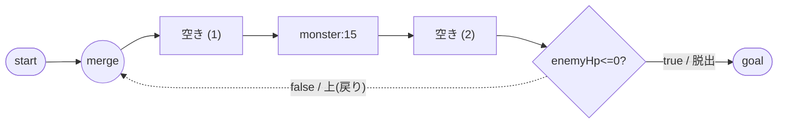
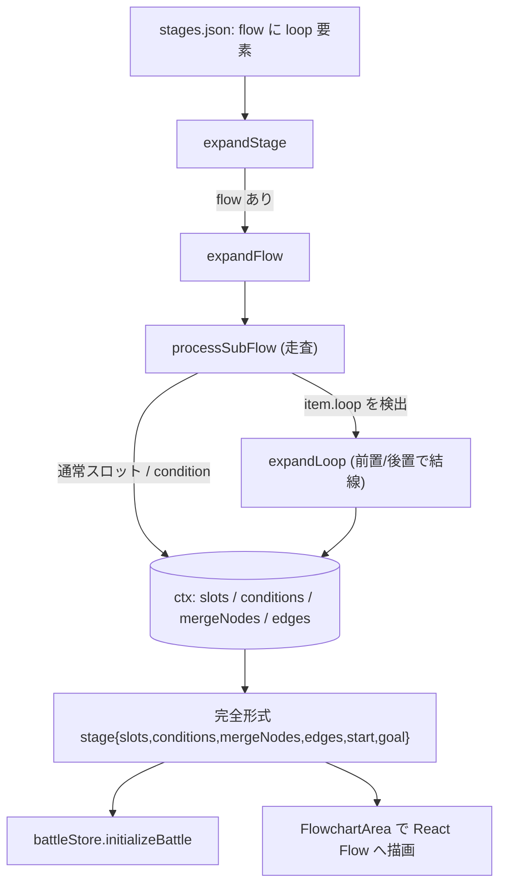
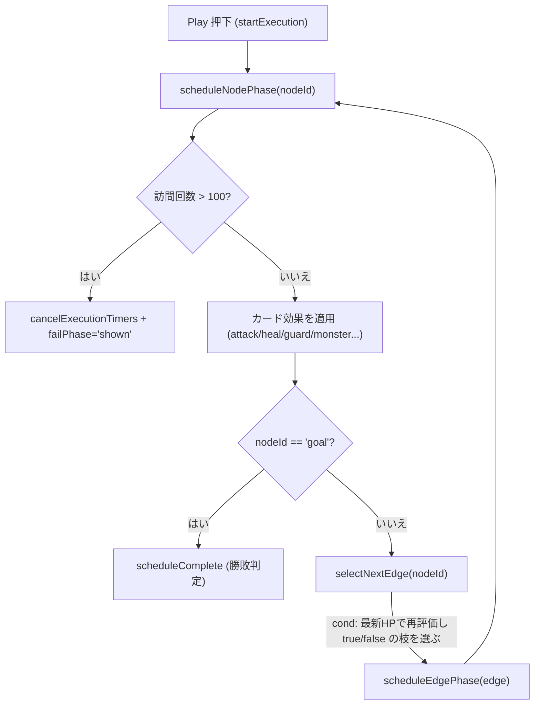

# 設計書: フローチャートのループ（while / do-while）構文

## 概要

`flow` ショートカットに **loop 構文** を新設し、ローダー（`stagesLoader.js`）が
「合流ノード（merge）＋条件ノード（cond）＋ループボディ＋戻りエッジ＋脱出経路」を
含む完全形式へ自動展開する。`mode`（前置 `pre` / 後置 `post`）パラメータひとつで
前置 while と後置 do-while を切り替える。両者は **同じ部品** で構成され、生成する
**エッジの結線だけが異なる**。

設計上の最重要事実：**ランタイム実行エンジン（`battleStore.startExecution`）は
すでに閉路（ループ）を実行できる**。実行は静的経路を事前展開するのではなく、
`edgesBySource` を引いてノードごとに次エッジを動的選択し、条件ノードでは到達の
つど最新状態で `evaluateCondition` を再評価する方式だから（`battleStore.js:848-857`）。
したがって本機能でエンジンに加える変更は **無限ループ防止ガードのみ**。死にコードの
`buildExecutionPath`（静的展開・閉路非対応）は削除する。

描画側（React Flow）も任意座標＋任意エッジを描けるため、ループは「ノード集合＋
戻りエッジ＋ハンドルの向き」の追加で表現できる。残る作業は (1) ローダーの展開
アルゴリズム、(2) cond の true/false 出口方向のデータ化、(3) ハンドル追加と戻り
エッジの上側ルーティング、(4) 周回上限ガード、(5) ステージ定義（4-1 前置 / 4-2 後置）。

---

## アーキテクチャ

### 変更コンポーネント

| ファイル | 変更内容 | 関連要件 |
|---|---|---|
| `frontend/src/data/stagesLoader.js` | loop 構文の展開（`expandLoop` 追加＋`processSubFlow` で `item.loop` を検出）、cond の `trueDir`/`falseDir` を `processSubFlow`・`expandConditions` で透過 | 1, 2, 8 |
| `frontend/src/features/battle/flowchart/ConditionNode.jsx` | true/false ソースハンドルの位置を `data.trueDir`/`data.falseDir` から決定（既定 right/down） | 2 |
| `frontend/src/features/battle/flowchart/MergeNode.jsx` | 戻りエッジ受け口の **Top target ハンドル**（`id="top"`）を追加 | 3, 8 |
| `frontend/src/features/battle/flowchart/SlotNode.jsx` | 前置ループの戻りエッジ出口となる **Top source ハンドル**（`id="loop-out"`）を追加 | 3 |
| `frontend/src/features/battle/flowchart/AnimatedProgressEdge.jsx` | `shouldUseStep` に「`targetHandleId === 'top'`（戻りエッジ）」を追加。Yes/No ラベル位置を出口方向に追従（リファイン） | 2, 3 |
| `frontend/src/features/battle/flowchart/FlowchartArea.jsx` | `conditionsToNodes` が `trueDir`/`falseDir` を `data` に転記 | 2 |
| `frontend/src/engine/simulateBattle.js`（新規） | 実行前の数値シミュレーション（`applyNodeEffect` / `clearTransientBuffs` / `simulateBattle`）。runaway 検出に使う純関数 | 4, 5 |
| `frontend/src/stores/battleStore.js` | 実行前 `simulateBattle` 呼び出し＋runaway 即負け、live 周回ガード（保険）、開発時整合チェック、`buildExecutionPath` 削除＋古い docstring 修正、`initializeBattle` に stage レベル敵HP上書き | 4, 5, 6, 7 |
| `frontend/src/data/stages.json` | stage 4-1（前置 while）と stage 4-2（後置 do-while 検証用）を追加 | 6, 9 |
| `README.md` | `frontend/src/engine/` を構造図に反映（`evaluateCondition.js` / `simulateBattle.js`） | 4 |

> 新規ファイルは `frontend/src/engine/simulateBattle.js` の 1 つ。`frontend/src/engine/`
> は既存（`evaluateCondition.js` が在る）だが `README.md` の「ディレクトリ構造」では
> まだ「今後追加予定」に置かれているため、本機能のコミットで構造図へ `engine/` を
> 反映する（`evaluateCondition.js` / `simulateBattle.js` を明記）。それ以外のタスクは
> 既存ファイルの編集のみでディレクトリ変更を伴わない。

### データモデル

#### loop 構文（`stages.json` の `flow` 要素）

```jsonc
{
  "loop": {
    "mode": "pre",              // "pre"(前置, 既定) | "post"(後置)
    "condition": "enemyHp <= 0", // 脱出条件。true で脱出、false でループ継続
    "label": "てきのHPが0？",     // 表示テキスト(任意)。未指定なら condition を表示
    "trueDir": "down",          // 脱出側(true)の出口方向(任意, 既定 right)
    "falseDir": "right",        // ループ側(false)の出口方向(任意, 既定 down)
    "body": [                   // ループボディ(通常スロット要素の一本道)
      {},
      { "lockedCard": { "id": "monster", "power": 20 } },
      {}
    ]
  }
}
```

**条件の意味は「脱出条件」に統一する**：`condition` が `true` でループを抜け、
`false` でループを継続する。これにより `trueDir` = 脱出方向、`falseDir` =
ループ方向、と一意に対応づく。4-1 は `enemyHp <= 0` が `true`（敵を倒した）で
Goal へ抜け、`false`（まだ生きている）でボディを繰り返す。

#### 通常分岐への出口方向指定（要件2、ループ以外でも有効）

既存の分岐要素（3-1 / 3-2 が使う `{ condition, true:[...], false:[...] }`）にも
`trueDir` / `falseDir` を **任意キー** として足せる。`true` / `false` は既に
**分岐ボディの配列** に使われているため、方向は別キー `trueDir` / `falseDir`
（スカラー文字列）で表し、衝突を避ける。

```jsonc
{
  "condition": "playerHp > 50",
  "label": "...",
  "trueDir": "right",   // 任意。既定 right
  "falseDir": "down",   // 任意。既定 down
  "true":  [ /* 分岐ボディ */ ],
  "false": [ /* 分岐ボディ */ ]
}
```

#### 展開後の完全形式（ローダー出力）

ローダーは従来どおり `{ slots, conditions, mergeNodes, edges, start, goal }` を返す。
loop 由来でも形状は同じ。条件オブジェクトに方向を追加する：

```jsonc
// conditions[] の 1 要素
{ "id": "cond-1", "position": {"x":..,"y":..},
  "expression": "enemyHp <= 0", "label": "てきのHPが0？",
  "trueDir": "down", "falseDir": "right" }

// edges[] の例（前置ループ）
{ "id": "e-start-merge-1", "source": "start",  "target": "merge-1" }
{ "id": "e-merge-1-cond-1","source": "merge-1","target": "cond-1" }
{ "id": "e-cond-1-slot-1", "source": "cond-1", "target": "slot-1", "sourceHandle": "false" }
{ "id": "e-slot-1-slot-2", "source": "slot-1", "target": "slot-2" }
{ "id": "e-slot-2-slot-3", "source": "slot-2", "target": "slot-3" }
{ "id": "e-slot-3-merge-1","source": "slot-3", "target": "merge-1",
  "sourceHandle": "loop-out", "targetHandle": "top" }                 // 戻りエッジ
{ "id": "e-cond-1-goal",   "source": "cond-1", "target": "goal", "sourceHandle": "true" }
```

### ハンドル構成（追加・変更点）

| ノード | ハンドル | 種別 | id | 用途 |
|---|---|---|---|---|
| ConditionNode | 既定 right→可変 | source | `true` | 脱出側。位置は `trueDir`（既定 Right） |
| ConditionNode | 既定 down→可変 | source | `false` | ループ/分岐側。位置は `falseDir`（既定 Bottom） |
| ConditionNode | Left | target | (既定) | 入力（merge または body 末尾から） |
| MergeNode | Left | target | (既定) | start からの入力 |
| MergeNode | **Top（新規）** | target | `top` | **戻りエッジの入力**（上側から進入） |
| MergeNode | Right | source | (既定) | cond（前置）/ body 先頭（後置）への出力 |
| SlotNode | **Top（新規 source）** | source | `loop-out` | **前置ループの戻りエッジ出口**（上向き） |
| SlotNode | Left / Top(target) / Right | 既存 | - | 既存のまま |

> `directionToPosition(dir)`：`right→Position.Right` / `left→Position.Left` /
> `up→Position.Top` / `down→Position.Bottom`。不正値は `console.warn` のうえ既定へ。

---

## データフロー

### 前置 while のトポロジ（stage 4-1）



### 後置 do-while のトポロジ（stage 4-2 検証用）



前置と後置の違いは「`start` からの入口がリングのどこに落ちるか＝merge が cond を
先に呼ぶか body を先に呼ぶか」だけ。merge・cond・body・戻りエッジ・脱出は共通。

### ローダー展開の流れ



### ランタイムのループ実行＋周回ガード



---

## 実装方針

### 1. ローダー：loop 構文の展開（`stagesLoader.js`）

`processSubFlow` のループ内に「`item.loop` を持つ要素」の分岐を追加し、`expandLoop`
へ委譲する。`expandLoop` は `mode` で結線を変える。

- **共通生成物**：merge ノード 1 個（`ctx.mergeNodes`）、cond ノード 1 個
  （`ctx.conditions`、`trueDir`/`falseDir` 付き）、body の各スロット（`ctx.slots`）。
- **前置（pre）の結線**：
  - `prev → merge`（直前の終端から merge の Left へ）
  - `merge → cond`（merge Right → cond Left）
  - `cond --false--> body[0]`（`sourceHandle:'false'`）
  - `body[i] → body[i+1]`
  - `body[last] → merge`（`sourceHandle:'loop-out'`, `targetHandle:'top'`：戻りエッジ）
  - `endings = [{ nodeId: cond, sourceHandle: 'true' }]`（脱出側を次要素／goal へ繋ぐ）
- **後置（post）の結線**：
  - `prev → merge`
  - `merge → body[0]`
  - `body[i] → body[i+1]`
  - `body[last] → cond`（cond Left）
  - `cond --false--> merge`（`targetHandle:'top'`：戻りエッジ。`sourceHandle:'false'`）
  - `endings = [{ nodeId: cond, sourceHandle: 'true' }]`
- **座標（自動レイアウト）**：既存の `x = SLOT_X_START + column*SLOT_X_STEP`, `y = yLevel`
  を踏襲。merge は既存の中心アンカー方式（slot と merge のサイズ差を吸収）で配置。
  goal は `trueDir` に応じて cond の下（down）または右（right）に置く。戻りエッジは
  ハンドル（source 上 / target 上）と `getSmoothStepPath` により行の上側を回る。
  **単一 while のみ対応**（入れ子・ループ内分岐は対象外）なので、body は一本道として
  単純に列を進めるだけでよく、複雑な自動レイアウトは不要。
- **不正入力**：`loop.condition` が文字列でない / `loop.body` が配列でない場合は
  `console.warn` してそのループを安全側でスキップ（要件1-6）。`mode` が `pre`/`post`
  以外なら warn して `pre` にフォールバック（要件8-5）。

#### cond の方向の透過

`processSubFlow` の condition 生成箇所と `expandConditions` で、`item.trueDir` /
`item.falseDir`（無ければ `undefined`）を条件オブジェクトへコピーする。`undefined`
のときは ConditionNode 側で既定（right/down）にフォールバックするため、既存の
3-1 / 3-2 は完全に後方互換（要件2-2）。

### 2. 描画：ConditionNode のハンドル位置可変化

`ConditionNode` の `true` / `false` ソースハンドルの `position` を
`directionToPosition(data.trueDir ?? 'right')` / `directionToPosition(data.falseDir ?? 'down')`
で決める。**ハンドル id は `'true'`/`'false'` のまま**（`selectNextEdge` は id で
枝を選ぶので、方向を変えても分岐ロジックは不変＝要件2-3）。`FlowchartArea.conditionsToNodes`
は `data: { expression, label, trueDir, falseDir }` を渡す。

### 3. 描画：戻りエッジのハンドルと経路

- `MergeNode` に Top target（`id="top"`）を追加。`SlotNode` に Top source
  （`id="loop-out"`）を追加（前置の戻り出口）。後置の戻り出口は cond の `false`
  ハンドルを `falseDir: 'up'` 等で上辺に置いて流用する（新ハンドル不要）。
- `AnimatedProgressEdge.shouldUseStep` に `targetHandleId === 'top'` を OR で追加し、
  戻りエッジを `getSmoothStepPath`（角丸 L 字／U 字）で描く。これで戻りエッジが
  行の上側を回って merge へ進入する自然な経路になる。
- **Yes/No ラベル**（`はい`/`いいえ`）の位置は現在 true=右・false=下 を前提に
  固定オフセットしている。出口方向が可変になるため、`sourceHandleId` と
  対応する方向（`sourcePosition`）からオフセットを算出する形にリファインする
  （方向ごとにラベルがエッジの根本に出るように）。

### 4. ランタイム：無限ループ防止（実行前シミュレーション ＋ 周回ガード）

**方針（改訂）**: 当初は「live 実行中にノード訪問回数を数え 100 周で打ち切る」
だけだったが、それだと runaway なループが **100 周ぶんアニメしてから負け**になり
プレイヤーを長時間待たせる。そこで **Play 押下時にアニメ無しの数値シミュレーション
を先に走らせ、runaway なら即負け**にする。live 側の演出コード（ダメージ遅延・
フロート・死亡処理）は変更せず、デグレリスクを避ける。

#### 4-1. 純粋シミュレーション（新規 `frontend/src/engine/simulateBattle.js`）

UI 非依存の純関数として、live のエッジ追跡と数値遷移を**エフェクト抜きで**写す。

- `applyNodeEffect(state, card, multiplier)` → 新 state。1 ノードのカード効果を
  数値だけ適用（attack=敵HP減 / monster=反射・シールド・自HP の分岐 / heal=自HP
  回復＋`maxPlayerHp` クランプ / guard=シールド設定＋反射解除 / reflect=反射＋
  シールド解除）。クランプは live と同じ（敵HP・自HP は 0 下限、heal は上限）。
- `clearTransientBuffs(state, prevCard)` → 新 state。エッジ通過時に「直前ノードが
  guard/reflect でなければ」シールド/反射を解除（live のエッジフェーズと同じ）。
- `simulateBattle({ edgesBySource, nodeMap, slotAssignments, slotMetadata, initialState, maxVisits })`
  → `'win' | 'lose' | 'runaway'`。`'start'` から動的にエッジを辿り（条件ノードは
  共有の `evaluateCondition` で評価）、ノード訪問回数が `maxVisits`（=`LOOP_MAX_VISITS`
  =100）を超えたら `'runaway'`、`playerHp <= 0` で `'lose'`、`'goal'` 到達/行き止まりで
  `enemyHp <= 0 && playerHp > 0` なら `'win'` それ以外 `'lose'`。state には
  `enemyHp / playerHp / guardShield / reflectActive / maxPlayerHp / maxEnemyHp` を持つ。
  遅延（`GUARD_TO_HP_DELAY_MS`）やフロートは最終数値に影響しないので無視する。

#### 4-2. `battleStore.startExecution` 側の統合

- `beginSequence` で `nodeMap` / `edgesBySource` を組んだ直後、`initialState`
  （満タンHP・シールド0・反射false、`maxEnemyHp`/`maxPlayerHp` はストア値）で
  `simulateBattle(...)` を実行する。
- 結果が `'runaway'` → `set({ failPhase:'shown', isExecuting:false, executionStep:null,
  currentPhaseMs:null })` で**アニメせず即負け**（要件5-2, 5-3）。
- それ以外 → 従来どおりアニメ再生。`simulateBattle` の結果（`'win'`/`'lose'`）は
  クロージャに退避し、後述の整合チェックに使う。
- **保険として live の周回ガード（`LOOP_MAX_VISITS` のノード訪問カウント、既存）を残す**。
  万一 sim が runaway を見逃しても live が最終的に停止させる（false negative の最終防衛）。

#### 4-3. 整合チェック（開発時のみ、`import.meta.env.DEV`）

sim と live は別実装なので、効果ルールがドリフトすると **false positive（正しい解を
runaway 誤判定して即負け）** の恐れがある。これを早期検知するため、`scheduleComplete`
で live の最終結果（`enemyHp<=0 && playerHp>0 ? 'win' : 'lose'`）と退避した sim 結果を
比較し、不一致なら `console.warn` する（本番挙動は不変、live が常に正）。これにより
カード追加・ルール変更で sim の更新を忘れた場合にすぐ気づける。

- 既存の勝敗（敵HP0 / プレイヤーHP0）は live が常に正で、先に成立すればそちらが優先
  （要件5-4）。プレイヤー死亡は `applyPlayerDamage` が `failPhase` を立てて停止する
  （要件4-4）。

### 5. 条件式の演算子（`evaluateCondition`）

`evaluateCondition` の対応演算子は `> < >= <= === !==` の 6 種で、**`==` は非対応**。
よってループの条件は **`enemyHp <= 0`** を用いる（`applyEnemyDamage` は
`Math.max(0, ...)` でクランプし負にならないため `=== 0` でも可だが、オーバーキル時
の取りこぼしを避け `<= 0` を採用）。**`evaluateCondition` は拡張しない**（スコープ
を絞る）。子ども向け表示は `label`（例「てきのHPが0？」）で隠れるため、式の
表記が `<= 0` でも UI 上の問題はない。

### 6. ステージ定義と敵HP上書き

敵HPは `enemies.json` の `enemyId` から引かれる（slime10 / wolf20 / knight20 /
golem80）。**60 のHPを持つ敵が存在しない**ため、`initializeBattle` に
**stage レベルの敵HP上書き** を導入する：

```js
// initializeBattle 内
const maxEnemyHp = stage.maxEnemyHp ?? enemy?.maxHp ?? 0;
```

これにより、パズルのバランス上必要なHPをステージ側で指定でき（`stages.json` に
`"maxEnemyHp": 60`）、共有の `enemies.json` を汚さずに済む。既存ステージは
`maxEnemyHp` 未指定なので従来どおり `enemy.maxHp` を使う（後方互換）。

#### stage 4-1（前置 while）

```jsonc
"4-1": {
  "enemyId": "wolf",
  "maxEnemyHp": 60,
  "cards": [ { "id": "attack", "power": 15 }, { "id": "guard", "power": 10 } ],
  "flow": [
    { "loop": {
        "mode": "pre",
        "condition": "enemyHp <= 0",
        "label": "てきのHPが0？",
        "trueDir": "down",
        "falseDir": "right",
        "body": [ {}, { "lockedCard": { "id": "monster", "power": 20 } }, {} ]
    } }
  ]
}
```

#### stage 4-2（後置 do-while・検証用ストローマン）

```jsonc
"4-2": {
  "enemyId": "slime",
  "maxEnemyHp": 40,
  "cards": [ { "id": "attack", "power": 20 }, { "id": "guard", "power": 10 } ],
  "flow": [
    { "loop": {
        "mode": "post",
        "condition": "enemyHp <= 0",
        "label": "てきのHPが0？",
        "trueDir": "down",
        "falseDir": "up",
        "body": [ {}, { "lockedCard": { "id": "monster", "power": 15 } }, {} ]
    } }
  ]
}
```

露出方法：当面は `demoStageIds` に `"4-1"` / `"4-2"` を追加して
デバッグ用バトルデモから到達可能にする（マップ進行解放は別途）。バランス数値は
プレイテストで微調整しうる（要件6・9の注記どおり）。

### 7. クリーンアップ（要件7）

- `buildExecutionPath`（`battleStore.js:347-363`、呼び出し元なしの死にコード）を削除。
- それを参照する古い docstring（`battleStore.js:679` 付近の「実行シーケンスは
  `buildExecutionPath(stage)` で組み立てたフェーズ列を…」）を、実体（`startExecution`
  の動的エッジ追跡＋周回ガード）に合わせて書き換える。
- 削除前に `grep` で他参照が無いことを再確認（現状 def と docstring のみ）。

---

## 依存関係

| パッケージ | 用途 | 導入済み？ |
|---|---|---|
| `@xyflow/react` | ハンドル・`getSmoothStepPath`・カスタムノード/エッジ | はい |
| `zustand` | 実行状態・周回カウント | はい |

新規パッケージは不要。

---

## トレーサビリティ（要件 → 設計）

| 要件 | 対応する設計セクション |
|---|---|
| 1: loop 構文＋展開 | 実装方針1（`expandLoop`／不正入力ガード）、データモデル |
| 2: true/false 出口方向 | 実装方針1（方向の透過）・2（ConditionNode 可変化）、ハンドル構成 |
| 3: 戻りエッジ描画 | 実装方針3（ハンドル追加・smoothstep）、ハンドル構成 |
| 4: ランタイムのループ実行 | 概要（動的走査で閉路対応）、実装方針4（実行前 sim ＋ live）、ランタイム図 |
| 5: 無限ループ防止ガード | 実装方針4-1（純粋 sim）・4-2（実行前 runaway 即負け）・4-3（整合チェック）。`LOOP_MAX_VISITS` は live 保険 |
| 6: stage 4-1 | 実装方針6（4-1 定義・敵HP上書き） |
| 7: 未使用コード整理 | 実装方針7 |
| 8: 条件位置パラメータ | 実装方針1（pre/post 結線）、両トポロジ図 |
| 9: 後置検証ステージ | 実装方針6（4-2 定義） |

---

## トレードオフと検討した代替案

- **決定**：ループ実行は既存エンジンの動的エッジ追跡をそのまま使い、ガードのみ追加。
  **理由**：エンジンは到達のつど条件を再評価する設計で、閉路をそのまま回せる。
  **代替案**：静的に経路を事前展開（`buildExecutionPath` 的）→ ループ回数が状態
  依存で事前に決まらず破綻するため不採用（むしろ削除対象）。

- **決定**：前置/後置を `mode` パラメータで切り替える単一構文。
  **理由**：両者は同じ部品でエッジ結線だけが違う。固定形に「揃える」と、前置=ボディ
  0回／後置=必ず1回 という実行意味論の差を失う。
  **代替案**：別構文（`while` と `doWhile`）→ 部品が重複し保守が増えるため不採用。

- **決定**：方向は `trueDir`/`falseDir` のスカラーキー。
  **理由**：既存分岐の `true`/`false`（配列ボディ）と衝突せず、完全後方互換。
  **代替案**：`true` を `{dir, body}` オブジェクトに拡張 → 既存記述の書き換えが必要で
  破壊的なため不採用。

- **決定**：敵HPは stage レベル `maxEnemyHp` で上書き。
  **理由**：HPがパズルの一部であり、ステージごとに自由に決めたい。共有 `enemies.json`
  を汚さない。
  **代替案**：HP60 の新規敵を `enemies.json` に追加 → スプライト資産が要り、HPが
  特定の敵に固定されるため柔軟性が低い。

- **決定**：周回ガードは「ノード訪問回数 100 回」。
  **理由**：1周＝各ループノード1訪問なので、しきい値がそのまま最大周回数を表し、
  非ループステージでは発火しない。実装も `scheduleNodePhase` 1 箇所で完結。
  **代替案**：総ステップ数で打ち切り → 周回数との対応が直感的でなく、ボディ長で
  実効周回数が変わるため不採用。

## 未確定（実装/レビューで確定）

- 4-1 の `enemyId`（暫定 `wolf`）。dead アニメ有りの既存敵から選定。
- 4-2 のストローマン数値（敵HP40・攻撃20・monster15）と番号・露出方法。
- Yes/No ラベルの方向追従ロジックの詳細（出口方向ごとのオフセット）。
- 4-1 / 4-2 のクリア可能性（手札と敵HPのバランス）はプレイテストで微調整。
