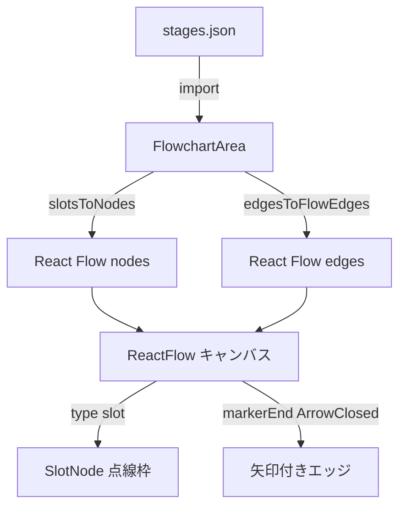

# 設計書: フローチャートの描画

## 概要

戦闘画面中段のフローチャート領域に、ステージ定義ファイルから読み込んだ
スロット（空き枠）とエッジ（線）を描画する。描画エンジンには既に依存関係に
含まれている **React Flow (@xyflow/react)** を採用し、スロットは
カスタムノードとして実装する。

本スペックのスコープは「静的データを読み込んで描画するだけ」であり、
ドラッグ/ドロップ・ホバー・クリック・カード配置は扱わない。そのため
React Flow のインタラクション系機能は原則すべて無効化する。

## アーキテクチャ

### コンポーネント

| コンポーネント | 責務 | ファイル |
|---|---|---|
| `BattleScreen` | 戦闘画面全体のレイアウト。中段に `FlowchartArea` を埋め込む | `features/battle/BattleScreen.jsx`（既存を修正） |
| `FlowchartArea` | ステージデータを受け取り React Flow のキャンバスを描画。ノード/エッジへの変換と、不正エッジのフィルタリングを行う | `features/flowchart/FlowchartArea.jsx`（新規） |
| `SlotNode` | 単一スロットのカスタムノード。空き枠（点線ボーダー）として表示する | `features/flowchart/SlotNode.jsx`（新規） |
| （ステージデータ） | スロット・エッジ定義の JSON | `data/stages.json`（新規） |

### データモデル

`frontend/src/data/stages.json` のスキーマ：

```json
{
  "stages": [
    {
      "id": "stage-00",
      "slots": [
        { "id": "slot-1", "position": { "x": 80,  "y": 120 } },
        { "id": "slot-2", "position": { "x": 280, "y": 120 } },
        { "id": "slot-3", "position": { "x": 480, "y": 120 } }
      ],
      "edges": [
        { "id": "e1-2", "source": "slot-1", "target": "slot-2" },
        { "id": "e2-3", "source": "slot-2", "target": "slot-3" }
      ]
    }
  ]
}
```

型イメージ（JSDoc 相当）：

```js
/** @typedef {{ x: number, y: number }} Position */
/** @typedef {{ id: string, position: Position }} SlotDef */
/** @typedef {{ id: string, source: string, target: string }} EdgeDef */
/** @typedef {{ id: string, slots: SlotDef[], edges: EdgeDef[] }} StageDef */
```

位置座標 (`x`, `y`) は React Flow のキャンバス座標系（px）を直接表す。
本スペックでは 1 ステージ固定なので、`FlowchartArea` は `stages[0]` を使う。

### API / インターフェース

```jsx
// FlowchartArea: propsで受け取ったステージ定義を描画する
<FlowchartArea stage={stageDef} />

// SlotNode: React Flow のカスタムノードとして登録
// ノードの data には本スペックでは特別な値は入れない（将来の拡張ポイント）
const nodeTypes = { slot: SlotNode };
```

変換関数（`FlowchartArea` 内で定義）：

```js
// SlotDef[] → React Flow Node[]
slotsToNodes(slots) => [{ id, type: 'slot', position, data: {} }, ...]

// EdgeDef[] + SlotDef[] → React Flow Edge[]
//   source/target が slots に存在しないものは除外（要件2-3）
edgesToFlowEdges(edges, slots) =>
  [{ id, source, target, markerEnd: { type: MarkerType.ArrowClosed } }, ...]
```

## データフロー



## 実装方針

### React Flow の設定

本スペックは「描画のみ」のため、インタラクションを全て無効化する：

| prop | 値 | 理由 |
|---|---|---|
| `nodesDraggable` | `false` | スロットを動かされないため |
| `nodesConnectable` | `false` | ユーザーがエッジを作れないようにするため |
| `elementsSelectable` | `false` | 選択状態を持たせない |
| `panOnDrag` | `false` | 1 ステージ固定でパンは不要 |
| `zoomOnScroll` | `false` | 誤操作防止 |
| `zoomOnPinch` | `false` | 誤操作防止 |
| `zoomOnDoubleClick` | `false` | 誤操作防止 |
| `proOptions` | `{ hideAttribution: true }` | UI をシンプルに保つ |
| `fitView` | `true` | 初期表示でスロット全体を画面に収める |

### SlotNode の見た目（要件1-2）

- サイズ: カード型を想起させる比率（例: 幅 80px × 高さ 112px、4:5.6 程度）
- 枠線: 点線（`border: 2px dashed #6a6a78`）
- 背景: 戦闘画面の背景より少し明るいグレー（空きであることを強調）
- 角丸: `border-radius: 6px`
- 中身: 空。将来カード ID を描画する拡張ポイントのみ用意

React Flow のカスタムノードは `Handle` コンポーネントで接続点を持つが、
本スペックではユーザー操作で接続を作らないため、**非表示の Handle**
（`source` 右端 / `target` 左端）だけを置く。これによりエッジが
ノードにきれいに接続される。

### エッジの見た目（要件2-2）

- `markerEnd`: `MarkerType.ArrowClosed`（向きが分かる矢印）
- タイプ: React Flow の `default`（ベジェ曲線）
- 色: `stroke: #8a8a95`

### 不正エッジの扱い（要件2-3）

`edgesToFlowEdges` 内で、`source`/`target` が slots に存在しないエッジを
silent に除外する。エラー throw はしない（1 件の不整合で画面全体が
落ちないようにするため）。開発時は `console.warn` で検知可能にする。

### ステージデータの読み込み（要件3）

`stages.json` は Vite の JSON インポートでビルド時にバンドルする：

```js
import stagesData from '../../data/stages.json';
const stage = stagesData.stages[0];
```

動的取得（fetch）は現時点では不要。ステージ切り替え UI が必要になった
時点で、このインポートを「ステージ選択ストアから参照する」形に置き換える。

### 初期ステージデータの内容（要件3-3）

動作確認用に 3 スロットを直列に繋いだ単純な構成を 1 ステージ分定義する：

```
slot-1 ──▶ slot-2 ──▶ slot-3
```

### レイアウトの変更（`BattleScreen`）

既存の `BattleScreen.jsx` のフローチャートエリアのプレースホルダ文言
（「[フローチャートエリア] ここにノードを配置」）を削除し、
`<FlowchartArea stage={stage} />` に置き換える。
`flowchartArea` クラスの flex レイアウトは維持したまま、中に React Flow の
キャンバスが広がるように `.flowchartArea` を `position: relative` かつ
`padding: 0` に調整する（React Flow はキャンバスのサイズを親から取得する）。

## 依存関係

| パッケージ | 用途 | 導入済み？ |
|---|---|---|
| `@xyflow/react` | フローチャート描画（ノード/エッジ/カスタムノード/矢印マーカー） | ✅ 導入済み |
| `react` / `react-dom` | UI | ✅ 導入済み |

新規導入パッケージは **なし**。

## ディレクトリ追加

本スペックで新規に作成するディレクトリ（`README.md` の「ディレクトリ構造」
セクションも同時に更新する）：

- `frontend/src/features/flowchart/` — `FlowchartArea.jsx`, `SlotNode.jsx`, それぞれの CSS Modules
- `frontend/src/data/` — `stages.json`

## 要件トレーサビリティ

| 要件 | 対応する設計箇所 |
|---|---|
| 要件1-1（全スロット描画） | `slotsToNodes` でステージの全スロットを React Flow ノードに変換 |
| 要件1-2（空き枠と分かる外観） | 実装方針「SlotNode の見た目」：点線枠・空のカード型 |
| 要件1-3（位置情報通りに配置） | `SlotDef.position` を React Flow ノードの `position` にそのまま渡す |
| 要件2-1（全エッジを描画） | `edgesToFlowEdges` でステージの全エッジを React Flow エッジに変換 |
| 要件2-2（向きが分かる矢印） | `markerEnd: MarkerType.ArrowClosed` |
| 要件2-3（不正エッジは無視） | `edgesToFlowEdges` 内で source/target の存在チェックをして silent に除外 |
| 要件3-1（JSON を `data/` 配下に配置） | `frontend/src/data/stages.json` |
| 要件3-2（ID・位置・始点/終点が取り出せる） | データモデル定義（`SlotDef`, `EdgeDef`） |
| 要件3-3（1 ステージのみ） | `stages[0]` 固定、`slot-1 → slot-2 → slot-3` の 3 スロット定義 |

## トレードオフと検討した代替案

- **決定**: 描画エンジンに React Flow を使う / **理由**: `package.json` に既に含まれており、README の技術スタックにも明記されている。後続スペックでカード配置やエッジのハイライト等を追加する際もそのまま使える。
- **代替案**: 素の SVG で描画 / **却下理由**: 短期的には軽量だが、後続でインタラクションを追加する段階で React Flow に移行し直すことになり、二度手間。
- **決定**: スロット位置を JSON で手動定義する / **理由**: 要件3で明示されている。また初期段階はステージ数が少なくレイアウトをデザイナブルに調整したい。
- **代替案**: dagre 等で自動レイアウト / **却下理由**: 要件「エッジの自動レイアウト計算」はスコープ外。ステージ数が増えてから検討。
- **決定**: 不正エッジは silent に除外（`console.warn` のみ） / **理由**: 1 件の不整合で画面全体が落ちるのを防ぎ、ステージデータの段階的な編集を許容するため。
- **代替案**: 例外を throw して開発者に強く知らせる / **却下理由**: 本スペックはデータ検証ではなく描画が主目的。データ検証が必要になったら別スペックで CI 的なバリデーションを入れる方が筋が良い。
- **決定**: React Flow のパン・ズーム等のインタラクションを全無効化 / **理由**: 本スペックでは 1 ステージが画面に固定で収まる想定で、パン/ズームできると「スロットが画面外に消える」バグ様の挙動を生みやすい。
- **代替案**: パン・ズームは有効のまま / **却下理由**: UX のブレを生むだけで、現スコープでは利得がない。
