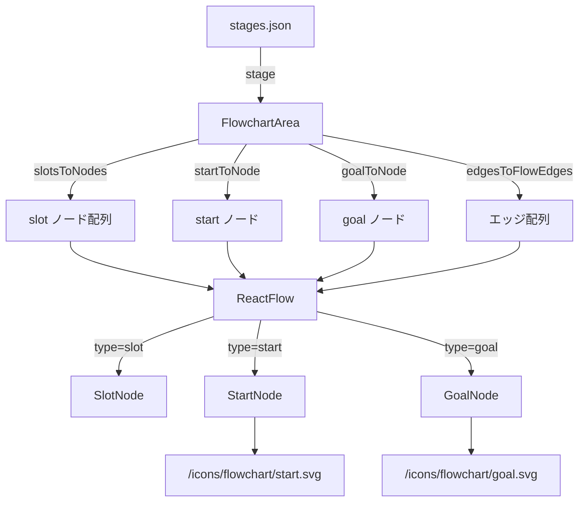
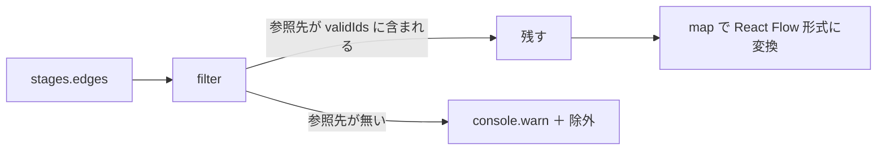

# 設計書: フローチャートのスタート／ゴールマーカー

## 概要

`stages.json` に新フィールド `start` / `goal` を追加し、フローチャートの両端にカード非対応のマーカーを描画する。React Flow のカスタムノード機構を使い、既存の `SlotNode` とは別に専用ノード（`StartNode` / `GoalNode`）を `nodeTypes` に登録することで、マーカー専用の見た目と「ドロップターゲットにしない」挙動を 1 箇所に閉じ込める。

主要な設計判断は 4 つ：

1. **`stages.json` のスキーマは独立フィールド**：`start: { position }` / `goal: { position }` を `slots` 配列とは別に持つ。スロットは「複数・カード受け先」、マーカーは「単数・装飾」と性質が違うため、配列の中で `type` 判別する案より構造で意味を表したほうが読みやすい
2. **アイコンは SVG ファイル**：`public/icons/flowchart/start.svg` と `goal.svg` を新規追加し、`` タグで参照。ピクセルアート系のカード画像と違って解像度に依存しないモノクロ図形なので SVG が最適
3. **専用ノード型を 2 つ作る**：`StartNode` と `GoalNode` を分け、それぞれに `Handle`（source / target）を 1 つだけ持たせる。`useDroppable` を呼ばないので dnd-kit のヒットテストに登録されず、要件 4「ドロップターゲットから除外」が自然に成立する
4. **エッジは `stages.json` で従来どおり明示**：`source` / `target` に `'start'` や `'goal'` の ID 文字列を書くだけで既存の `edgesToFlowEdges` がそのまま使える。整合性チェック（`slotIds.has`）の対象集合に start/goal の ID を追加する変更だけで済む

## アーキテクチャ

### コンポーネント

| コンポーネント | 責務 |
|--------------|------|
| `StartNode`（新規） | 右向き矢印アイコンを表示する React Flow カスタムノード。右辺に `source` Handle のみ持つ。`useDroppable` は使わない |
| `GoalNode`（新規） | モノクロ旗アイコンを表示する React Flow カスタムノード。左辺に `target` Handle のみ持つ。`useDroppable` は使わない |
| `FlowchartArea`（変更） | `stages.json` の `start` / `goal` を読み取って React Flow ノード配列に追加。`nodeTypes` に新型を登録。エッジ整合性チェックに start/goal の ID を含める |
| `stages.json`（変更） | `start: { position }` と `goal: { position }` を各ステージに追加。`edges` に start/goal を含む矢印を追記 |
| `public/icons/flowchart/start.svg`（新規） | スタートマーカーの右向き矢印アイコン |
| `public/icons/flowchart/goal.svg`（新規） | ゴールマーカーのモノクロ旗アイコン |

`SlotNode` は変更なし、`battleStore` も変更なし（マーカーは状態を持たないため）。

### データモデル

`stages.json` のステージ定義に追加するフィールド：

```jsonc
{
  "stages": {
    "1-1": {
      "enemyId": "slime",
      "cards": [...],
      "start": {                       // ← 新規
        "position": { "x": -120, "y": 120 }
      },
      "slots": [
        { "id": "slot-1", "position": { "x": 80,  "y": 120 } },
        { "id": "slot-2", "position": { "x": 280, "y": 120 } },
        { "id": "slot-3", "position": { "x": 480, "y": 120 } }
      ],
      "goal": {                        // ← 新規
        "position": { "x": 680, "y": 120 }
      },
      "edges": [
        { "id": "e-start-1", "source": "start",  "target": "slot-1" },  // ← 新規
        { "id": "e1-2",      "source": "slot-1", "target": "slot-2" },
        { "id": "e2-3",      "source": "slot-2", "target": "slot-3" },
        { "id": "e-3-goal",  "source": "slot-3", "target": "goal" }     // ← 新規
      ]
    }
  }
}
```

ノード ID の予約：`'start'` と `'goal'` は予約語として、スロット ID では使わない。エッジは `source: 'start'`、`target: 'goal'` と書くことで接続を表現する。

### API / インターフェース

**FlowchartArea のノード生成ヘルパー**

```js
// 既存
function slotsToNodes(slots) { ... }

// 新規：start オブジェクトを 1 つの React Flow ノードに変換
function startToNode(start) {
  if (!start) return null;
  return { id: 'start', type: 'start', position: start.position, data: {} };
}

// 新規：goal オブジェクトを 1 つの React Flow ノードに変換
function goalToNode(goal) {
  if (!goal) return null;
  return { id: 'goal', type: 'goal', position: goal.position, data: {} };
}
```

**整合性チェックの拡張**

```js
// 既存
function edgesToFlowEdges(edges, slots) {
  const slotIds = new Set(slots.map((slot) => slot.id));
  ...
}

// 変更：有効なノード ID 集合をスロット＋スタート＋ゴールから作る
function edgesToFlowEdges(edges, slots, hasStart, hasGoal) {
  const validIds = new Set(slots.map((slot) => slot.id));
  if (hasStart) validIds.add('start');
  if (hasGoal) validIds.add('goal');
  ...
}
```

**コンポーネントインターフェース**

```jsx
// React Flow から id, data などが渡る
<StartNode />   // 内部で右向き矢印アイコンを描画 + source Handle
<GoalNode />    // 内部でモノクロ旗アイコンを描画 + target Handle
```

`stage` props 経由のインターフェースは変わらず、`FlowchartArea` の入口は同じ。

## データフロー

### コンポーネント関係



### エッジ整合性チェック



## 実装方針

### `StartNode` / `GoalNode` の実装

両者ほぼ同じ構造で、Handle の type と表示するアイコンが違うだけ。CLAUDE.md の「1 ファイル 1 クラス」に従い、ファイルを分ける（共通化の旨味は薄く、別物として宣言したほうが将来の機能差分も入れやすい）。

```jsx
// StartNode.jsx
function StartNode() {
  return (
    <div className={styles.marker}>
      
      <Handle type="source" position={Position.Right} className={styles.handle} isConnectable={false} />
    </div>
  );
}

// GoalNode.jsx
function GoalNode() {
  return (
    <div className={styles.marker}>
      <Handle type="target" position={Position.Left} className={styles.handle} isConnectable={false} />
      
    </div>
  );
}
```

ポイント：

- `useDroppable` を **使わない** ことが要件 4-1 を実装上満たすキー。dnd-kit が知らないノードはドロップターゲット候補にならず、`over` イベントも発火しない
- `isConnectable={false}` で React Flow 側からの接続もブロック
- `pointer-events: none` を CSS で付ければ要件 4-3（ノードドラッグ無効）も自動的に成立（既に `nodesDraggable={false}` で動かないが、念のため）

### CSS（マーカーのスタイル）

`StartNode.module.css` と `GoalNode.module.css` をそれぞれ用意。基本構造は同じだが、サイズや色を将来別々に調整できるよう分けておく。

```css
.marker {
  width: 80px;
  height: 120px;
  display: flex;
  align-items: center;
  justify-content: center;
  /* スロットと違って枠線なし。アイコンが直接見える */
  pointer-events: none;
}

.icon {
  width: 48px;
  height: 48px;
  /* SVG のモノクロを夜空背景でも視認できる白に近い色で表示 */
  filter: brightness(0.95);
}

.handle {
  /* SlotNode と同じく非表示 */
  width: 1px;
  height: 1px;
  opacity: 0;
  pointer-events: none;
  background: transparent;
  border: none;
}
```

サイズ 80×120 は既存スロットと揃えて、エッジが矢印接続したときに線がそろう。中央のアイコンサイズ 48×48 はマーカー領域の半分弱で、目立ちすぎない控えめなサイズ。

### SVG アセット

新規 2 ファイル。色は `#e5e5ff`（既存 UI と同じトーン）の単色。

`public/icons/flowchart/start.svg`：

- viewBox: 0 0 80 80
- 内容：右向きの矢印（線の太さ 6〜8px、stroke-linecap: round で柔らかい印象）

`public/icons/flowchart/goal.svg`：

- viewBox: 0 0 80 80
- 内容：左に縦のポール、右に三角の旗（fill されたシンプルなシルエット）

### `FlowchartArea` の変更

ノード配列を組み立てる箇所で `slotsToNodes` の結果に `startToNode` と `goalToNode` の結果を結合する。`null` のときは含めない（要件 2-3：定義無しでもクラッシュしない）。

```js
const nodes = useMemo(() => {
  const result = slotsToNodes(stage.slots);
  const startNode = startToNode(stage.start);
  const goalNode = goalToNode(stage.goal);
  if (startNode) result.unshift(startNode);  // 順序は描画には影響しないが、配列を見やすくする
  if (goalNode) result.push(goalNode);
  return result;
}, [stage.slots, stage.start, stage.goal]);

const edges = useMemo(
  () => edgesToFlowEdges(stage.edges, stage.slots, !!stage.start, !!stage.goal),
  [stage.edges, stage.slots, stage.start, stage.goal],
);
```

`nodeTypes` に新規 2 種類を登録：

```js
const nodeTypes = { slot: SlotNode, start: StartNode, goal: GoalNode };
```

### 定義欠落時の警告

`startToNode` / `goalToNode` は `null`/`undefined` をそのまま `null` で返すだけで、警告は出さない（無いステージもあり得るのでノイズになる）。

ただし「`edges` で `'start'` を参照しているのに `start` 定義が無い」場合は既存の `edgesToFlowEdges` が参照先未存在として `console.warn` を出すので、自然に検知できる。要件 2-3 の「警告しつつクラッシュ回避」と整合する。

### 拡大／縮小ズーム

`StartNode` / `GoalNode` は React Flow のカスタムノードなので、`fitView` の対象に **自動的に含まれる**。フローチャート全体の bounding box が start/goal を含めて計算され、`fitView` が全体を収めるように拡縮する。要件 5 を満たすために特別な実装は不要。

### リセット動作

リセットボタンは `initializeBattle(stage)` を呼ぶだけで、ストアの `slotAssignments` / `handCards` を初期化する。マーカーはストアの状態に依存していないため、リセットの影響を受けない。要件 6 を満たすために特別な実装は不要。

### コンポーネント配置とファイル命名

```
frontend/
├── public/
│   └── icons/
│       └── flowchart/
│           ├── start.svg                    （新規）
│           └── goal.svg                     （新規）
└── src/
    ├── data/
    │   └── stages.json                      （変更：start / goal / 関連エッジを追加）
    └── features/
        └── battle/
            └── flowchart/
                ├── FlowchartArea.jsx        （変更：ノード生成・nodeTypes 登録・整合性チェック拡張）
                ├── StartNode.jsx            （新規）
                ├── StartNode.module.css     （新規）
                ├── GoalNode.jsx             （新規）
                └── GoalNode.module.css      （新規）
```

README の「ディレクトリ構造」セクションも、`public/icons/flowchart/` 追加と `flowchart/` 配下のファイル増加に合わせて更新する。

## 依存関係

| パッケージ | 用途 | 導入済み？ |
|---|---|---|
| `@xyflow/react` | カスタムノード（`Handle` / nodeTypes）を流用 | はい |
| `@dnd-kit/core` | 不使用（マーカーには適用しない）。既存 `SlotNode` 側でのみ利用 | はい |

新規パッケージの導入はなし。

## トレードオフと検討した代替案

- **決定内容**：`stages.json` のスキーマで `start` / `goal` を独立フィールドにする（案 B）
  **理由**：マーカーは「ステージごとに 1 つずつ・カードを置けない・常に最左／最右」という性質を持ち、「複数あって順序自由・カード受け先」のスロットとは役割が違う。配列の `type` フィールドで判別する案 A だと、コード上で毎回 `if (type === 'start')` などの分岐が必要になる一方、独立フィールドなら `stage.start` / `stage.slots` で意味的に取り出せる。スキーマもより自己説明的になる
  **検討した代替案**：案 A（`slots` 配列に `type` を追加）。配列で統一できるのは魅力だが、上記の通り意味的に異なるものを 1 つの配列に押し込むことで生まれる分岐の重複が割に合わない

- **決定内容**：アイコンは SVG ファイルを `public/` に配置（案 Y）
  **理由**：モノクロでスッキリした幾何学図形（矢印・旗）は SVG が最適。テキスト絵文字（「→」「🏁」）にすると OS / ブラウザのフォントによって見た目が変わってしまい、特に旗絵文字は OS デフォルトでカラフルな絵柄になるため「モノクロ」要件を満たさない。SVG なら見た目がプラットフォーム間で安定する
  **検討した代替案**：案 X（テキスト絵文字をそのまま CSS で表示）。最もシンプルだが OS 依存の見た目変動が問題。Unicode 6 のシンボル（U+2192 RIGHT ARROW など）でも、フォントのウェイトや色が制御しきれない

- **決定内容**：`StartNode` と `GoalNode` を別ファイルに分離する
  **理由**：CLAUDE.md の「1 ファイル 1 クラス」ルールに従う。両者は Handle の方向（source / target）と表示するアイコンが違うため、共通化しても薄い `if (type === 'start') ... else ...` 分岐が残るだけ。ファイル分離のほうが意図が明確で、将来「ゴールに特殊演出を入れる」などの拡張に向いている
  **検討した代替案**：1 つの `MarkerNode` に `data.type` を渡して描画分岐させる案。DRY を優先するならこちらだが、現状そこまでの共通項は無く、`StartNode` / `GoalNode` 分離のほうが見通しが良い

- **決定内容**：エッジは `stages.json` に明示する（自動導出しない）
  **理由**：スロット定義を `stages.json` で明示する方針と整合する。「スタート → 最初のスロット」を自動で繋ぐ案も考えたが、複数行への将来拡張時に「最初のスロット」「最後のスロット」をどう識別するかというルールを別途決める必要が出てくる。明示しておけば、ステージ作成者の意図がそのままファイルに残る
  **検討した代替案**：start から最も近いスロットへ自動でエッジを張る案。シンプルなステージでは便利だが、複数行や分岐がある場合の扱いが曖昧になる

- **決定内容**：マーカーのサイズ・位置をスロットと揃える（80×120）
  **理由**：水平配置のときにエッジ（矢印）が直線になり、視覚的に整う。アイコン本体は 48×48 と小さめにして、領域全体は枠線無しで控えめに見せることで「マーカー（背景なし）」と「スロット（点線枠あり）」の見た目を区別できる
  **検討した代替案**：マーカーを小さくする（例 60×60）。コンパクトにはなるが、エッジの接続点が垂直方向にズレやすく、見た目の整合性が下がる
