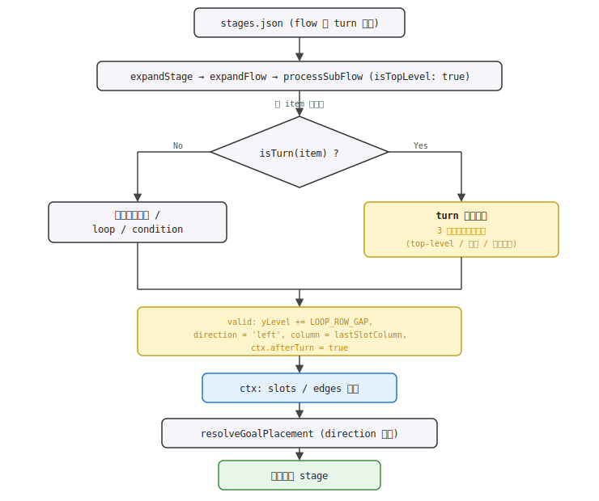
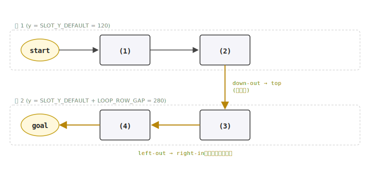
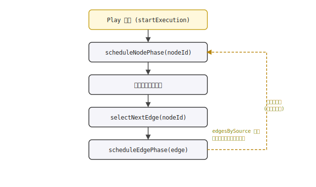

# 設計書: フローチャートの折り返し（turn）構文

## 概要

`flow` ショートカットに **turn 構文** を新設し、ローダー（`stagesLoader.js`）が `{"turn": {}}` 以降のスロットを **次の行に右から左へ** 配置するように展開する。turn 自体は視覚ノードを生成せず、レイアウトのメタデータとしてのみ機能する。

**leftward 文脈での condition 対応（要件 9〜16、stage 3-4 の動機）**：turn 直後の line 状スロットだけでなく、**turn 後に置かれた `condition` 要素** も自然な左向きレイアウトで展開できるよう、`processSubFlow` の condition 分岐を direction-aware に拡張する。column 増減・mergeColumn 集約（`min` / `max`）・trueDir / falseDir の既定値・エッジハンドルの選択がすべて `currentDirection` を見て切り替わる。これにより stage 3-4 のように「行 1 で線形 → cond → 線形 → turn → 線形 → cond → 線形 → goal」というパズル構造をフローチャートを書き換えずに 2 段化できる。新規に必要な視覚要素は `MergeNode` の左右ハンドル 2 個のみ。

設計上の最重要事実：**ランタイム（`battleStore.startExecution` / `simulateBattle`）は座標方向を一切意識しない**。`edgesBySource` を辿って動的に次エッジを選ぶだけなので、折り返しエッジ（垂直下 + 左向き）も既存パスでそのまま実行できる。本機能でランタイムに加える変更は **ゼロ**（leftward 文脈での condition 展開も含めて）。

描画側（React Flow）は任意座標＋任意エッジを描けるため、折り返しは「ノード集合の座標 + 新ハンドルの追加 + エッジの sourceHandle/targetHandle 指定」だけで完結する。残る作業は (1) ローダーの方向対応展開（slot / condition / merge すべて）、(2) `SlotNode` / `GoalNode` / `MergeNode` への新ハンドル追加、(3) goal 配置の方向対応の 3 つに集約される。

`AnimatedProgressEdge` の `shouldUseStep` 判定はすでに `targetHandleId === 'top'` / `'bottom'` / `sourceHandleId === 'false'` を含んでいるため、垂直下エッジ・cond の false→merge エッジ・loop 戻りエッジはそのまま smoothstep で描かれる。左向きエッジは `getStraightPath` で純粋な水平直線として描かれる。**エッジ描画コードへの変更も不要**（leftward cond / merge を導入しても同じ判定でカバーされる）。

---

## アーキテクチャ

### 変更コンポーネント

| ファイル | 変更内容 | 関連要件 |
|---|---|---|
| `frontend/src/data/stagesLoader.js` | `isTurn(item)` 追加、`processSubFlow` に方向 (`direction`) と `isTopLevel` 引数追加、turn 要素のハンドリング、turn 配置バリデーション（top-level only / 最大 1 個）、`resolveGoalPlacement` の左向き対応、**condition ブランチの direction-aware 化**（column 増減 / mergeColumn の `min` or `max` / trueDir/falseDir の既定値 / エッジハンドル選択 / merge 座標計算）、**leftward 文脈の condition 入口エッジに `left-out` / `right-in` を付与** | 1, 2, 3, 5, 6, 7, 9, 10, 11, 13, 14, 16 |
| `frontend/src/features/battle/flowchart/SlotNode.jsx` | 新ハンドル 3 個追加（Bottom source `id="down-out"`、Left source `id="left-out"`、Right target `id="right-in"`） | 4 |
| `frontend/src/features/battle/flowchart/GoalNode.jsx` | 新ハンドル 1 個追加（Right target `id="right-in"`） | 4 |
| `frontend/src/features/battle/flowchart/MergeNode.jsx` | **新ハンドル 2 個追加**（Right target `id="right-in"`、Left source `id="left-out"`、leftward 文脈で true 分岐入力と merge → 後続出力のため） | 12 |
| `frontend/src/data/stages.json` | stage 3-4 は **本拡張完了後に turn 込みの 2 段で正常動作する**（cond の `trueDir` / `falseDir` を明示せず leftward 既定値で動く、要件 15）。stages.json 自体への変更はなし。 | 15 |

変更ファイルは 4 つ、すべて既存ファイルの編集。新規ファイルなし、新規パッケージ追加なし、`README.md` のディレクトリ構造変更なし。

> stage 3-4 はユーザーが既に `{"turn": {}}` を flow に挿入済み。本拡張完了後はそのまま 2 段レイアウトで正常表示されるべき（フローチャート構造を一切いじらない、要件 15-5）。

### データモデル

#### turn 構文（`stages.json` の `flow` 要素）

```jsonc
{
  "turn": {}            // デフォルトの折り返し（垂直下 → 左向き）
}
```

**将来拡張のための予約スキーマ**（今回は無視）：
```jsonc
{
  "turn": {
    "direction": "down"   // 将来：方向指定の予約フィールド（今回は無視）
  }
}
```

#### 展開後の `stage` オブジェクト（ローダー出力）

ローダー出力の形状は既存と同じ `{ slots, conditions, mergeNodes, edges, start, goal }`。turn 由来のスロットも `slots` 配列に並び、座標 (`position.x`, `position.y`) で行 2 にあることが分かる。エッジは `sourceHandle` / `targetHandle` で接続方向を指定する：

```jsonc
// 例: flow: [{}, {}, {"turn": {}}, {}, {}]（行 1 がスロットのみの単純なケース）
{
  slots: [
    { id: "slot-1", position: { x: 80,  y: 120 } },    // 行 1, 列 0
    { id: "slot-2", position: { x: 280, y: 120 } },    // 行 1, 列 1
    { id: "slot-3", position: { x: 280, y: 280 } },    // 行 2, 列 1（slot-2 の真下）
    { id: "slot-4", position: { x: 80,  y: 280 } },    // 行 2, 列 0
  ],
  edges: [
    { id: "e-start-slot-1",  source: "start",  target: "slot-1" },
    { id: "e-slot-1-slot-2", source: "slot-1", target: "slot-2" },
    { id: "e-slot-2-slot-3", source: "slot-2", target: "slot-3",
      sourceHandle: "down-out", targetHandle: "top" },      // 垂直下
    { id: "e-slot-3-slot-4", source: "slot-3", target: "slot-4",
      sourceHandle: "left-out", targetHandle: "right-in" }, // 左向き
    { id: "e-slot-4-goal",   source: "slot-4", target: "goal",
      sourceHandle: "left-out", targetHandle: "right-in" }, // 左向き
  ],
  goal: { position: { x: -120, y: 280 } },               // 行 2 の左端
}
```

> **行 2 の y 座標は動的計算**：上の例では行 1 がスロットのみで構成されるため `max_y = SLOT_Y_DEFAULT = 120` となり、行 2 = `120 + LOOP_ROW_GAP = 280` になる。一方、行 1 に `condition` を含むケースでは false 分岐のスロットが `SLOT_Y_DEFAULT + LOOP_ROW_GAP = 280` に置かれるため `max_y = 280` となり、行 2 = `280 + LOOP_ROW_GAP = 440` に下がる。詳しくは「実装方針 1-3」を参照（要件 2-5）。

### ハンドル構成（追加点）

| ノード | ハンドル | 種別 | id | 用途 |
|---|---|---|---|---|
| SlotNode | **Bottom（新規 source）** | source | `down-out` | 折り返し開始用：垂直下エッジの出口 |
| SlotNode | **Left（新規 source）** | source | `left-out` | 左向きエッジの出口（折り返し後のスロット同士） |
| SlotNode | **Right（新規 target）** | target | `right-in` | 左向きエッジの入口 |
| SlotNode | Left / Top(`top`) / Right / Top(`loop-out`) | 既存 | - | 既存のまま、変更なし |
| GoalNode | **Right（新規 target）** | target | `right-in` | 左向きで進入するゴール用 |
| GoalNode | Left / Top(`top`) | 既存 | - | 既存のまま、変更なし |
| MergeNode | **Right（新規 target）** | target | `right-in` | leftward 文脈で true 分岐からの集約入力（要件 11-5 / 12-1） |
| MergeNode | **Left（新規 source）** | source | `left-out` | leftward 文脈で merge → 後続スロットへの出力（要件 11-4 / 12-1） |
| MergeNode | Left target / Top(`top`) / Bottom(`bottom`) / Right source | 既存 | - | 既存のまま、変更なし（rightward 文脈は完全保持） |

> 新ハンドルは `className={styles.handle}`（既存の透明ハンドルスタイル）を再利用し、未使用ハンドル（折り返しを使わないステージ）でも視覚に影響を出さない。`isConnectable={false}` で手動エッジ作成を防ぐ。

### API / インターフェース

#### ローダー新ヘルパー

```js
function isTurn(item)
```
- Returns: `boolean` — `item.turn` がオブジェクト（`!== null`）なら `true`
- 用途: `processSubFlow` 内で turn 要素を識別

#### `processSubFlow` のシグネチャ拡張

```js
function processSubFlow(items, {
  startColumn,
  yLevel,
  prevNodeId,
  prevSourceHandle,
  ctx,
  isTopLevel,        // NEW: top-level 呼び出しのみ true
  direction,         // NEW: 'right'（既定）/ 'left'（turn 後）
})
```

- 既存呼び出し（`expandFlow` から）: `isTopLevel: true, direction: 'right'`
- 再帰呼び出し（condition の true/false / loop body）: `isTopLevel: false`、direction は親の値を継承
- 戻り値に `direction` と `yLevel` を追加（goal 配置で使う）

#### `expandFlow` の戻り値拡張

`processSubFlow` の result から `direction` / `yLevel` / `endColumn` を取り、`resolveGoalPlacement` に渡す。

---

## データフロー

### turn を含む展開のフロー



### 折り返しレイアウトのトポロジ



> 実体は `slot-2 → slot-3` の垂直下エッジ（`sourceHandle: "down-out"` / `targetHandle: "top"`）と、`slot-3 → slot-4 → goal` の左向きエッジ（`sourceHandle: "left-out"` / `targetHandle: "right-in"`）で構成される。行 2 のスロットは実座標で右から左に並ぶ（x が `SLOT_X_STEP` ずつ減る）。
>
> **上の図は行 1 がスロットのみの単純なケース**（行 2 y = 280）。行 1 に `condition` の false 分岐がある場合、行 2 は更に下にずれる（要件 2-5、実装方針 1-3-1 の表を参照）。垂直下エッジが false 分岐の上を視覚的に横切る可能性については「未確定」セクションを参照。

### ランタイムの実行（変更なし）



折り返しエッジ（`down-out` → `top` / `left-out` → `right-in`）も `edgesBySource[nodeId]` の配列に含まれているため、`selectNextEdge` は方向を意識せず次エッジを返せる。AnimatedProgressEdge も `sourceX/Y/targetX/Y` だけ見ているため、座標の向きに依存しない。

---

## 実装方針

### 1. ローダー：turn 検出と方向対応展開（`stagesLoader.js`）

#### 1-1. `isTurn(item)` ヘルパーの追加

`isCondition` / `isLoop` と並べて追加：

```js
function isTurn(item) {
  return typeof item?.turn === 'object' && item.turn !== null;
}
```

#### 1-2. `processSubFlow` の引数拡張と方向対応

`processSubFlow` に `isTopLevel` と `direction` を追加。x 座標計算は方向を考慮：

```js
function processSubFlow(items, {
  startColumn, yLevel, prevNodeId, prevSourceHandle, ctx,
  isTopLevel = false,
  direction = 'right',
  startYLevel = yLevel,
}) {
  let column = startColumn;
  let currentYLevel = yLevel;
  let currentDirection = direction;
  // ... 既存の endings 初期化 ...

  for (const item of items) {
    if (isTurn(item)) {
      // 1-3 のハンドリングへ
    } else if (isLoop(item)) {
      // 既存：expandLoop に委譲。current direction / yLevel を渡す
    } else if (isCondition(item)) {
      // 既存：再帰呼び出し。isTopLevel: false で呼ぶ
    } else {
      // 通常スロット：x = SLOT_X_START + column * SLOT_X_STEP
      // y = currentYLevel
      // 配置後、column += (currentDirection === 'right' ? 1 : -1)
    }
  }

  return { endings, endColumn: column, direction: currentDirection, yLevel: currentYLevel };
}
```

`column` は **符号付き整数** として扱う。`currentDirection === 'left'` のとき column は減少する。x 座標計算は `SLOT_X_START + column * SLOT_X_STEP` で、column が負の値でも自然に左方向の座標を返す。

#### 1-3. turn 要素のハンドリング

```js
if (isTurn(item)) {
  // バリデーション 1: top-level でない場合は warn + skip
  if (!isTopLevel) {
    console.warn('[stagesLoader] turn must be at flow top level (not inside loop body or condition branch). Ignoring.');
    continue;
  }
  // バリデーション 2: 既に turn を 1 個処理済みの場合は warn + skip
  if (ctx.turnCount >= 1) {
    console.warn('[stagesLoader] multiple turns in flow are not yet supported. Ignoring extra turn(s).');
    continue;
  }
  // バリデーション 3: turn より前にスロットが無い（空 flow）場合は warn + skip
  if (endings[0]?.nodeId === 'start') {
    console.warn('[stagesLoader] turn must follow at least one slot/loop/condition. Ignoring.');
    continue;
  }
  // 行 2 の y 座標を動的計算: 既に配置済みの全ノードの max y + LOOP_ROW_GAP
  // 行 1 がスロットのみなら max_y = SLOT_Y_DEFAULT、condition の false 分岐
  // があれば max_y = SLOT_Y_DEFAULT + LOOP_ROW_GAP となり、行 2 がさらに下に
  // ずれる（要件 2-5）
  const maxY = Math.max(
    SLOT_Y_DEFAULT,
    ...ctx.slots.map((s) => s.position.y),
    ...ctx.conditions.map((c) => c.position.y),
  );
  // 折り返し実施
  const lastSlotColumn = column - (currentDirection === 'right' ? 1 : -1);
  currentYLevel = maxY + LOOP_ROW_GAP;
  currentDirection = 'left';
  column = lastSlotColumn;  // 次スロットは前のスロットと同じ x
  ctx.turnCount += 1;
  // endings は変更しない。次のスロット展開時に endings → そのスロットへのエッジが
  // sourceHandle: "down-out" / targetHandle: "top" で生成される
  ctx.afterTurn = true;  // 次エッジに down-out / top を付ける一時フラグ
  continue;
}
```

#### 1-3-1. `maxY` 動的計算の根拠

| 行 1 の内容 | max_y | 行 2 y | 備考 |
|---|---|---|---|
| スロットのみ | `SLOT_Y_DEFAULT` (120) | 280 | 単純ケース、従来想定どおり |
| loop あり | 120 | 280 | loop の merge / cond / body は yLevel = 120 |
| condition あり（false 分岐に slot あり） | 280 | 440 | false 分岐は `yLevel + 160` に置かれる |
| ネストした condition（false 内 false 分岐に slot あり） | 440 | 600 | 再帰的に下にずれる |

`Math.max(SLOT_Y_DEFAULT, ...slots, ...conditions)` で `SLOT_Y_DEFAULT` を必ず含めることで、`ctx.slots` / `ctx.conditions` が空（理論上のエッジケース、バリデーション 3 で防がれる）でも下限値 120 が保証される。`mergeNodes` は `MERGE_SIZE / 2` のオフセット込みで y が記録されているが、merge は常に `yLevel` 行（行 1 のとき 120）に置かれるため max_y への寄与は無視できる。

#### 1-4. turn 直後のエッジに `down-out` / `top` を付与

通常スロット展開時、`ctx.afterTurn` が立っていれば、その 1 本目のエッジに `sourceHandle: "down-out"` / `targetHandle: "top"` を付ける：

```js
// 通常スロット展開時
const slotId = buildBodySlot(ctx, item, {
  x: SLOT_X_START + column * SLOT_X_STEP,
  y: currentYLevel,
});
for (const ending of endings) {
  if (ctx.afterTurn) {
    ctx.edges.push(buildEdge({ ...ending, sourceHandle: 'down-out', targetHandle: 'top' }, slotId));
  } else if (currentDirection === 'left') {
    ctx.edges.push(buildEdge({ ...ending, sourceHandle: 'left-out', targetHandle: 'right-in' }, slotId));
  } else {
    ctx.edges.push(buildEdge(ending, slotId));  // 既存：方向指定なし（右向き既定）
  }
}
ctx.afterTurn = false;  // 1 回だけ消費
// 配置後の column 更新
column += (currentDirection === 'right' ? 1 : -1);
```

#### 1-5. `ctx` の拡張

`expandFlow` で `ctx` を作るときに以下を追加：

```js
const ctx = {
  slotCounter: 0,
  condCounter: 0,
  mergeCounter: 0,
  slots: [],
  conditions: [],
  mergeNodes: [],
  edges: [],
  turnCount: 0,        // NEW: 1 個目以降の turn を弾くため
  afterTurn: false,    // NEW: 直後エッジに down-out/top を付ける一時フラグ
};
```

#### 1-6. `resolveGoalPlacement` の左向き対応

現在の `resolveGoalPlacement` は cond の出口方向と endColumn を見るだけ。`direction === 'left'` の場合は専用処理を加える：

```js
function resolveGoalPlacement(result, ctx) {
  // 既存：最終終端が cond 出口なら cond 起点で配置
  const lastEnding = result.endings[0];
  if (lastEnding) {
    const cond = ctx.conditions.find((c) => c.id === lastEnding.nodeId);
    if (cond && (lastEnding.sourceHandle === 'true' || lastEnding.sourceHandle === 'false')) {
      // 既存パスのまま
    }
  }
  // NEW: direction === 'left' の場合は左向きで配置
  if (result.direction === 'left') {
    return {
      position: {
        x: SLOT_X_START + result.endColumn * SLOT_X_STEP,
        y: result.yLevel,
      },
      targetHandle: 'right-in',
      sourceHandle: 'left-out',   // 最終終端 → goal エッジに付ける
    };
  }
  // 既存パス: 右向き
  return {
    position: { x: SLOT_X_START + result.endColumn * SLOT_X_STEP, y: 120 },
    targetHandle: undefined,
  };
}
```

`expandFlow` 側で `goalPlacement.sourceHandle` も buildEdge に渡せるよう、`expandFlow` の最終エッジ生成箇所を調整：

```js
for (const ending of result.endings) {
  ctx.edges.push(buildEdge({
    ...ending,
    sourceHandle: goalPlacement.sourceHandle ?? ending.sourceHandle,
    targetHandle: goalPlacement.targetHandle,
  }, 'goal'));
}
```

#### 1-7. leftward 文脈での condition / merge の direction-aware 化（要件 9〜14）

`processSubFlow` の `else if (isCondition(item))` ブランチを direction-aware に拡張する。**rightward 文脈（既存）の挙動は完全保持** しつつ、`currentDirection === 'left'` のときだけ符号と方向を反転させる。

##### 1-7-1. condition ノード配置と column 増分の方向対応

```js
} else if (isCondition(item)) {
  ctx.condCounter += 1;
  const condId = `cond-${ctx.condCounter}`;
  // condition ノード自体の x 座標は currentDirection 不問（column ベース）
  ctx.conditions.push({
    id: condId,
    position: { x: 80 + column * 200, y: currentYLevel },
    expression: item.condition,
    label: item.label,
    // 既定値を direction-aware に：
    //   rightward: trueDir='right' / falseDir='down'（既存どおり）
    //   leftward:  trueDir='left'  / falseDir='down'（要件 10-1 / 10-2）
    trueDir:  item.trueDir  ?? (currentDirection === 'left' ? 'left' : undefined),
    falseDir: item.falseDir ?? undefined,
  });

  // 入口エッジ：leftward なら left-out → right-in、rightward は従来どおり
  for (const ending of endings) {
    if (currentDirection === 'left') {
      ctx.edges.push(buildEdge({ ...ending, sourceHandle: 'left-out', targetHandle: 'right-in' }, condId));
    } else {
      ctx.edges.push(buildEdge(ending, condId));
    }
  }

  // column 増減を direction-aware に（要件 9-5）
  column += currentDirection === 'right' ? 1 : -1;
  // ...
```

`ConditionNode.jsx` 側は **無変更**。`trueDir` / `falseDir` が `'left'` を受けて Left ハンドル位置に置く挙動はすでに `flowchart-loop` 仕様で実装済み（`directionToPosition(dir)` 経由）。ローダーで既定値を変えるだけで自然に左向きの「はい」ラベルと出口位置が出る。

##### 1-7-2. true / false 再帰サブフローへの direction 伝播

```js
  const trueItems = item.true ?? [];
  const trueResult = processSubFlow(trueItems, {
    startColumn: column,
    yLevel: currentYLevel,
    prevNodeId: condId,
    prevSourceHandle: 'true',
    ctx,
    isTopLevel: false,
    direction: currentDirection,   // 既存どおり親の direction を継承
  });

  const falseItems = item.false ?? [];
  const falseResult = processSubFlow(falseItems, {
    startColumn: column,
    // false 分岐は方向不問で「下の行」へ（要件 14-1）
    yLevel: currentYLevel + 160,
    prevNodeId: condId,
    prevSourceHandle: 'false',
    ctx,
    isTopLevel: false,
    direction: currentDirection,
  });
```

サブフロー内のスロット配置は **タスク 1 で既に direction-aware** になっているため（`column += currentDirection === 'right' ? 1 : -1`）、`direction: 'left'` を渡せばその中で leftward に並ぶ。**この点の追加実装は不要**。

##### 1-7-3. mergeColumn 計算の direction-aware 化（要件 9-4 / 13-1）

```js
  // rightward: 「より右」へ進んだ方を採用 → Math.max
  // leftward:  「より左」へ進んだ方を採用 → Math.min（要件 9-4 / 14-4）
  const mergeColumn = currentDirection === 'right'
    ? Math.max(trueResult.endColumn, falseResult.endColumn)
    : Math.min(trueResult.endColumn, falseResult.endColumn);
```

##### 1-7-4. merge ノード座標の direction-aware 化（要件 13-1）

rightward では merge は `slot[mergeColumn-1]` と `slot[mergeColumn]` の中間に置かれる（次に来るスロットの左隣）。leftward では mirror で `slot[mergeColumn]` と `slot[mergeColumn+1]` の中間（次に来るスロットの右隣）に置く。

```js
  ctx.mergeCounter += 1;
  const mergeId = `merge-${ctx.mergeCounter}`;

  // 中心アンカー：rightward では (mergeColumn - 0.5) の x、leftward では (mergeColumn + 0.5) の x
  const mergeAnchorOffset = currentDirection === 'right' ? -SLOT_X_STEP / 2 : SLOT_X_STEP / 2;
  ctx.mergeNodes.push({
    id: mergeId,
    position: {
      x: SLOT_X_START + mergeColumn * SLOT_X_STEP + mergeAnchorOffset + SLOT_WIDTH / 2 - MERGE_SIZE / 2,
      y: currentYLevel + SLOT_HEIGHT / 2 - MERGE_SIZE / 2,   // y は方向不問（要件 13-2）
    },
  });
```

##### 1-7-5. true / false → merge エッジのハンドル選択（要件 11-5 / 11-6）

- **true → merge**: rightward は既存どおり「default → default」、leftward は merge の右辺 `right-in` で受ける（要件 11-5）。
- **false → merge**: 方向不問で merge の **下辺** `bottom` で受ける（要件 11-6、rightward / leftward 共通）。これは false 分岐が常に下の行に展開されることに対応する自然な経路。

```js
  for (const ending of trueResult.endings) {
    if (currentDirection === 'left') {
      ctx.edges.push(buildEdge({ ...ending, targetHandle: 'right-in' }, mergeId));
    } else {
      ctx.edges.push(buildEdge(ending, mergeId));
    }
  }
  for (const ending of falseResult.endings) {
    ctx.edges.push(buildEdge({ ...ending, targetHandle: 'bottom' }, mergeId));
  }

  endings = [{ nodeId: mergeId, sourceHandle: undefined }];
  column = mergeColumn;
}
```

##### 1-7-6. merge → 後続スロットへのエッジ（要件 11-4）

merge から次の通常スロットへのエッジ生成は、すでにあるスロット側の処理（実装方針 1-4 / 通常スロット展開時の 3 分岐）で:
- leftward 文脈なら `sourceHandle: 'left-out'` / `targetHandle: 'right-in'`
- rightward なら従来どおり

として正しく付与される。これは merge ノードの `MergeNode` 側に追加する `left-out`（source）/ `right-in`（target）が新ハンドルとして提供されることで成立する（実装方針 4 の `MergeNode` 拡張）。**ローダー側の追加実装は不要**。

##### 1-7-7. ConditionNode の出口ハンドル位置

`ConditionNode.jsx` は `flowchart-loop` 仕様で `data.trueDir` / `data.falseDir` を `directionToPosition(dir)` で `Position.Left` / `Right` / `Top` / `Bottom` に変換する処理が **既に入っている**。`trueDir: 'left'` を渡すと自動的に左辺ハンドルになり、`AnimatedProgressEdge` の「はい」ラベルも左辺基準で配置される。**`ConditionNode.jsx` への変更は不要**。

##### 1-7-8. 既存ステージへの非破壊性の担保（要件 16）

すべての変更が `currentDirection === 'left'` 分岐の中に局所化されている。`currentDirection === 'right'`（既存のすべてのステージ）では：
- `column += 1`（rightward 分岐）
- `mergeColumn = Math.max(...)`（rightward 分岐）
- `mergeAnchorOffset = -SLOT_X_STEP / 2`（rightward 分岐）
- `trueDir / falseDir` 既定値: `undefined`（`ConditionNode.jsx` 側で `'right'` / `'down'` にフォールバック、既存挙動）
- エッジハンドル指定なし（`buildEdge(ending, ...)`、既存挙動）

これらすべてが本拡張導入前と **完全に一致** する。stages.json 出力のバイト等価は実装方針 1-7 完了後にスナップショットテストで担保する。

### 2. 描画：`SlotNode` のハンドル追加

`SlotNode.jsx` の return 内に 3 つの新 `Handle` を追加する。既存のハンドルパターンを踏襲し、`className={styles.handle}` で透明・`isConnectable={false}` でユーザー操作不可：

```jsx
<Handle
  type="source"
  position={Position.Bottom}
  id="down-out"
  className={styles.handle}
  isConnectable={false}
/>
<Handle
  type="source"
  position={Position.Left}
  id="left-out"
  className={styles.handle}
  isConnectable={false}
/>
<Handle
  type="target"
  position={Position.Right}
  id="right-in"
  className={styles.handle}
  isConnectable={false}
/>
```

React Flow はハンドル ID で接続を識別するため、新 ID を追加しても既存の Left target（default）/ Right source（default）/ Top target `top` / Top source `loop-out` の動作は完全に保持される。

### 3. 描画：`GoalNode` のハンドル追加

`GoalNode.jsx` の return 内に 1 つの新 `Handle` を追加：

```jsx
<Handle
  type="target"
  position={Position.Right}
  id="right-in"
  className={styles.handle}
  isConnectable={false}
/>
```

### 4. 描画：`MergeNode` のハンドル追加（要件 12）

`MergeNode.jsx` の return 内に 2 つの新 `Handle` を追加する。既存の Left target / Top target `top` / Bottom target `bottom` / Right source は無変更。

```jsx
<Handle
  type="target"
  position={Position.Right}
  id="right-in"
  className={styles.handle}
  isConnectable={false}
/>
<Handle
  type="source"
  position={Position.Left}
  id="left-out"
  className={styles.handle}
  isConnectable={false}
/>
```

- **Right target `right-in`**: leftward 文脈で condition の true 分岐から merge へ集約するエッジを受ける（要件 11-5）。
- **Left source `left-out`**: leftward 文脈で merge から後続スロット（または goal）へ出力するエッジの起点（要件 11-4）。

`MergeNode.module.css` への変更は不要（既存の `.handle` 透明スタイルを再利用）。rightward 文脈の既存ステージは `right-in` / `left-out` をどのエッジからも参照されないため、未使用ハンドルとして無害に存在するだけ（要件 12-2、SlotNode / GoalNode の追加ハンドルと同じパターン）。

### 5. エッジ描画（変更なし）

`AnimatedProgressEdge.shouldUseStep` の判定：
```js
const shouldUseStep = sourceHandleId === 'false' || targetHandleId === 'bottom' || targetHandleId === 'top';
```

- 垂直下エッジ（turn 直後）: `targetHandleId === 'top'` で既に smoothstep に該当 → 自動的に `getSmoothStepPath` 適用。source/target が同 x の場合、smoothstep は純粋な垂直線になる。
- 左向きエッジ: 上記条件に該当しないため `getStraightPath` で水平直線として描画。

矢印（`markerEnd`）の向きは React Flow が `<marker orient="auto-start-reverse">` でパスの接線方向に追従させるため、垂直下では下向き矢印、左向きでは左向き矢印として自動で描画される。**エッジコンポーネントへの変更は不要**。

### 6. ランタイム（変更なし）

`battleStore.startExecution` の `selectNextEdge` は `edgesBySource[nodeId]` から次エッジを取るだけで、エッジの方向は意識しない。`simulateBattle` も同様。turn を含むステージでも従来の動的エッジ追跡がそのまま動く。

---

## 依存関係

| パッケージ | 用途 | 導入済み？ |
|---|---|---|
| `@xyflow/react` | カスタムノード・新ハンドル・`getSmoothStepPath` / `getStraightPath` | はい |

新規パッケージ不要。

---

## トレーサビリティ（要件 → 設計）

| 要件 | 対応する設計セクション |
|---|---|
| 1: turn 構文の追加とローダー認識 | 実装方針 1-1（`isTurn`）・1-3（バリデーション）、データモデル |
| 2-1〜2-4: 折り返し後のレイアウト | 実装方針 1-2（方向対応 column 計算）・1-3（turn ハンドラ）・1-6（goal 配置） |
| 2-5: false 分岐がある場合の動的 y 計算 | 実装方針 1-3（`maxY` 計算）・1-3-1（根拠表）、データモデルの注記 |
| 2-6: 垂直下エッジが false 分岐の上を横切る可能性の許容 | 未確定（エッジルーティングはステージデザイナーの責務） |
| 3: 折り返し時のエッジ描画 | 実装方針 1-4（down-out / left-out / top / right-in 指定）、エッジ描画（変更なし） |
| 4: ハンドル構成の拡張 | 実装方針 2（SlotNode）・3（GoalNode）、ハンドル構成表 |
| 5: 将来拡張を見込んだスキーマ | データモデル（オブジェクト形式）、実装方針 1-3（複数 turn は最初の 1 個のみ採用） |
| 6: turn の配置制約 | 実装方針 1-3（`isTopLevel` チェックで loop body / condition 内 turn を warn + 無視） |
| 7: 既存ステージへの非破壊性 | データモデル（新ハンドル ID は既存と衝突なし）、実装方針 1-2（direction 既定 'right' で従来パス）、エッジ描画（変更なし）、ランタイム（変更なし） |
| 8: ランタイムでの実行 | ランタイム図（変更なし、既存の動的エッジ追跡で十分） |
| 9-1〜9-3: leftward cond 配置と direction 伝播 | 実装方針 1-7-1（cond ノード配置）・1-7-2（true/false 再帰、`direction: currentDirection` 伝播） |
| 9-4〜9-5: mergeColumn 計算と column 増減の direction 対応 | 実装方針 1-7-3（`Math.min` / `Math.max` 切替）・1-7-1（column 増減の三項演算） |
| 10-1〜10-4: trueDir / falseDir の direction-aware 既定値 | 実装方針 1-7-1（`item.trueDir ?? (currentDirection === 'left' ? 'left' : undefined)`、`falseDir` 共通 down）、1-7-7（ConditionNode は無変更で対応） |
| 11-1〜11-6: leftward cond 周辺のエッジハンドル | 実装方針 1-7-1（入口エッジ）・1-7-5（true/false → merge）・1-7-6（merge → 後続） |
| 12: MergeNode のハンドル拡張 | 実装方針 4（MergeNode に right-in / left-out 追加）、ハンドル構成表 |
| 13-1〜13-3: merge ノードの座標計算 direction-aware | 実装方針 1-7-4（`mergeAnchorOffset` 切替）・既存座標計算の保持 |
| 14-1〜14-4: false 分岐の行配置と column 採用 | 実装方針 1-7-2（false 分岐 yLevel = `currentYLevel + 160`）・1-7-3（leftward は `Math.min`、rightward は `Math.max`） |
| 15-1〜15-5: stage 3-4 への適用（具体成果物） | 実装方針 1-7 全体（leftward cond が既定値で動く）、データモデルの注記（stages.json への変更不要） |
| 16-1〜16-3: 既存ステージ非破壊性の再確認 | 実装方針 1-7-8（rightward 分岐の局所性、バイト等価担保の方針） |

---

## トレードオフと検討した代替案

- **決定**：column を符号付き整数として扱い、direction に応じて加減算する。
  **理由**：既存の x 計算式 `SLOT_X_START + column * SLOT_X_STEP` をそのまま使え、`column = -1` で goal が x = -120 になる（既存 start と同じ位置）。コード変更が最小限で済む。
  **代替案**：column を捨てて `currentX` を直接持つ → 既存コード全体（条件分岐展開・ループ展開）の column 計算を全て書き換えるため変更範囲が大きく、デグレリスクが高い。

- **決定**：turn は視覚ノードを生成しない（要件のとおり）。
  **理由**：merge ノードのような小さなマーカーを追加すると、子ども向けには「これ何？」という追加情報になりノイズ。L 字エッジで折り返し位置は伝わる。
  **代替案**：merge と同じ 16x16 の小さな丸を turn 位置に置く → 視覚は明示的になるが、merge の意味（条件分岐の合流）と turn の意味（レイアウト折り返し）が混ざる。

- **決定**：turn は `ctx.afterTurn` フラグで「次の 1 エッジだけ」down-out/top を付ける一時状態として扱う。
  **理由**：`processSubFlow` の各 iteration ローカルでフラグを持つよりも `ctx` に持たせる方が、loop / condition が turn を跨がない（top-level only）前提と整合する。
  **代替案**：turn 直後の slot 配置で個別に判定 → コードが分散して読みにくくなる。

- **決定**：`SlotNode` / `GoalNode` の新ハンドル ID は `down-out` / `left-out` / `right-in` という意味のある命名にする。
  **理由**：「下に出る」「左に出る」「右から入る」が一目で分かり、デバッグ時の把握コストが下がる。loop の既存ハンドル `loop-out` と命名パターンが揃う。
  **代替案**：`bottom-source` / `left-source` / `right-target` のような型ベース命名 → React Flow の `type="source/target"` と冗長で、何のための出口かが伝わらない。

- **決定**：複数 turn を不正値として `console.warn` で 1 個目以降を弾く（要件 5-4 のフォールバック）。
  **理由**：「最初の 1 個だけ動く」ので、ステージデザイナーがミスして 2 個書いてもアプリは落ちず、最低限の動作はする。将来複数 turn に対応する際は `turnCount` の制約を緩めるだけで拡張できる。
  **代替案**：throw して展開を中断 → アプリ全体が落ちる。子ども向けプレイ環境では避けるべき。

- **決定**：turn の前のスロット数が 0（`endings[0]?.nodeId === 'start'`）の場合は warn + skip。
  **理由**：`flow: [{"turn": {}}, ...]` のように turn が flow 先頭にあると「直前最終列」が存在しないため折り返し基準が決まらない。安全側で turn を無視して通常展開する。
  **代替案**：turn を先頭で許可し、最初のスロットを直接 y=280 に置く → 「start から行 2 へ垂直に降りる」という想定外のレイアウトを生み、混乱の元。

- **決定**：エッジ描画コード（`AnimatedProgressEdge`）は無変更とし、既存の `shouldUseStep` 判定をそのまま流用する。
  **理由**：垂直下エッジは `targetHandle === 'top'` で既に smoothstep に該当する（同 x の source/target なら smoothstep は自然な垂直線になる）。左向きエッジは straight でちょうど水平直線として描かれる。新たな条件追加は不要。
  **代替案**：`down-out` を `shouldUseStep` に追加 → 動作は同じだが冗長。

- **決定**：leftward 文脈での condition 対応は、既存の `else if (isCondition(item))` ブランチ内で direction を見て局所的に分岐させる方式を採用する（実装方針 1-7）。
  **理由**：(a) 既存のロジックフローを保ったまま分岐を増やすだけなので、rightward の挙動が壊れにくい。(b) 入れ子 condition も `direction: currentDirection` を再帰呼び出しに渡すだけで自然に対応できる。(c) 新しい関数を切り出すと cond 専用の状態（mergeColumn, mergeAnchorOffset 等）を多数引き渡すことになりかえって複雑。
  **代替案**：cond ブランチを `handleCondition(item, ctx, direction)` のように切り出し、direction 別の関数 `handleConditionRightward` / `handleConditionLeftward` に分割する → 確かに各関数は読みやすくなるが、コードの 80% が同じ（重複）で、修正時に両方更新し忘れるリスクが高い。

- **決定**：condition の `trueDir` 既定値だけを direction-aware にし、`falseDir` 既定値は方向不問で `'down'` のままにする（要件 10-1 / 10-2）。
  **理由**：false 分岐は意味的に「主流から外れる」ので、leftward / rightward どちらの主流でも「下にずらす」のが視覚的にわかりやすい。`trueDir` は「主流の続き方向」なので direction を見て切り替えるのが自然。
  **代替案**：`falseDir` も leftward では `'up'` に → 行 3 を上に作ると行 1 と衝突する。`'down'` 一貫が無難。

- **決定**：`MergeNode` に追加するハンドル ID は `right-in` / `left-out` で、`SlotNode` / `GoalNode` と完全に揃える。
  **理由**：「同じ id == 同じ意味（左向きエッジの片端）」という規約を全ノードで一貫させると、ローダーのエッジ生成ロジックが「leftward 文脈なら sourceHandle: 'left-out', targetHandle: 'right-in'」の一律パターンで書け、ノード種別ごとに ID を覚える必要がない。
  **代替案**：merge 専用に `merge-right-in` のような prefix を付ける → 命名が冗長で、ノード種別を含むのは ID の役割ではない（React Flow は `${source}-${sourceHandle}` のペアでエッジを識別する）。

- **決定**：rightward 文脈で `MergeNode.right-in` と `MergeNode.left-out` は **未使用ハンドル** として無害に存在させる（要件 12-2）。
  **理由**：rightward 文脈の既存ステージは新ハンドルを参照するエッジを一切生成しないため、描画はおろか React Flow の bounds 計算にも影響しない（ハンドルは透明・`pointer-events: none`）。条件分岐なしの単純追加で済む。
  **代替案**：rightward / leftward で `MergeNode` の Handle 構成を動的に切り替える → どこかに「このノードは leftward 文脈で使われている」という情報を持たせる必要があり、ノード単位の独立性が崩れる。

## 未確定（実装/レビューで確定）

- 行 2 の y 座標オフセット：design では `LOOP_ROW_GAP`（160px）を流用する想定だが、実機で UI 全体（HP バー・敵スプライト・手札パネル）と並べて圧迫感が出るなら調整可能。
- 左向きエッジの矢印が React Flow のデフォルト marker 設定で自然に左を向くかは実機確認。期待動作だが、もし向きが不自然なら `AnimatedProgressEdge` の白色 traversed marker と同様に方向対応の調整が要るかもしれない。
- `start` から行 1 最初スロットへの既存エッジ（`e-start-slot-1`）は変更なし。turn を持つステージでも開始は行 1 の左端から。
- **垂直下エッジが既存ノードの上を視覚的に横切る可能性**（要件 2-6）：行 1 に `condition` の false 分岐があると、turn 直後の垂直下エッジ（pre-turn 最終スロット → post-turn 最初のスロット）が、false 分岐スロットの上を視覚的に横切る可能性がある。`getSmoothStepPath` は障害物回避ルーティングを行わないため、エッジが他ノードと重なって見える。**機能的には壊れない**（エッジ追跡は座標と関係なく動的に行われる）が、視覚の綺麗さはステージデザイナーが flow 配列の構造を工夫する責務とする（例: 「condition は turn の前に置かない」「condition は turn の後に置く」等の慣習で回避）。本機能のスコープではエッジルーティングの障害物回避は実装しない。将来必要になった場合は React Flow のカスタムエッジパスや Dagre / ELK 等のレイアウトエンジン導入を検討する。
- **turn 後の loop は依然スコープ外**：本拡張で leftward 文脈の `condition` は正式サポートされるが、`expandLoop` 側の direction 対応は別タスクとして残す（要件のスコープ外セクションに明記）。stages.json で turn の後に `loop` 要素を書いたステージは挙動が崩れる。デザイナーは慣習として turn 後に loop を置かない、もしくは loop は turn より前のセクションで完結させる。必要になれば別 spec として設計しなおす。
- **leftward 文脈での cond 入れ子の深さ**：行 2 で cond → 行 3 で false 分岐 → 行 3 内に更に cond → 行 4 で false 分岐、と再帰的に下にずれる挙動は **理論上動く**（再帰呼び出しが `currentYLevel + 160` を伝播する）が、実機で 3 段以上ずれると画面下に出てしまう懸念がある。stage 3-4 では 1 段のみで済むため動作確認は 1 段で行い、深い入れ子は将来必要になったときに UX 観点で再検討する。
- **stage 3-4 の実機確認時に注目すべきこと**：(a) 最後の cond の「はい」ラベルが左辺に表示されるか、(b) false 分岐の monster:100 が行 3（y=600 付近）に左向きで配置されるか、(c) merge ノードが cond と次スロットの中間（少し右側）に配置されるか、(d) merge から次の `{}`・monster:10・`{}`・goal までが左向きに直線で並ぶか。1 個でも崩れる箇所があれば実装方針 1-7 のサブセクション単位で原因を切り分ける。
