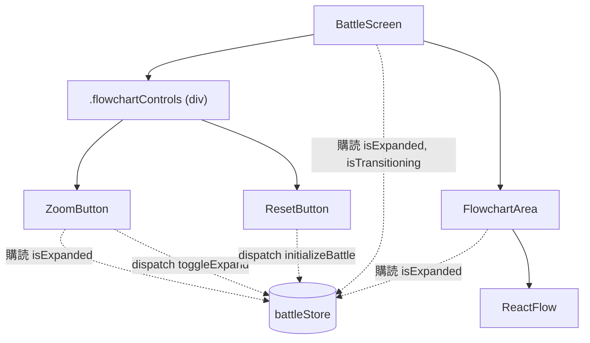
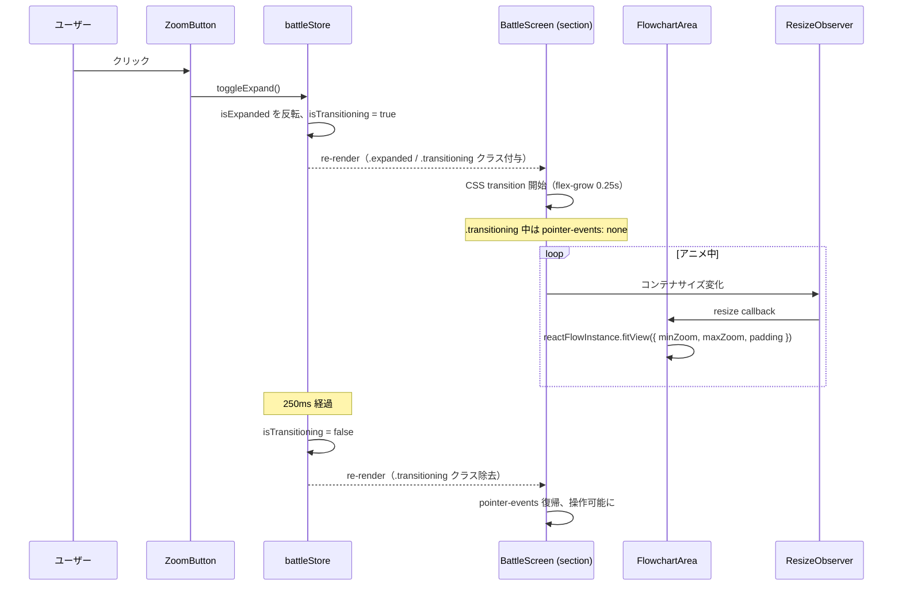

# 設計書: フローチャート拡大／縮小トグル

## 概要

CSS Flexbox の `flex-grow` トランジションでレイアウトを滑らかに変化させ、`battleStore` に拡大／縮小状態と遷移中フラグを持たせる。`ZoomButton` は既存の `ResetButton` と同じ見た目にし、両者を「ボタングループ」という absolute-positioned な小さなラッパー内で並べる。

中のフローチャートは React Flow の `fitView` に制御を委ねる：コンテナサイズの変化を `ResizeObserver` で検出して毎フレーム `fitView()` を呼ぶことで、CSS トランジション中もスロットの自動縮小が滑らかに追従する。拡大状態では `minZoom=maxZoom=1` でズームを 1.0 に固定し、あふれた領域は `panOnScroll` でスクロールアクセスできるようにする。

主要な設計判断は 3 つ：
1. **状態は `battleStore` に集約**（既存のストアにフィールドを追加。UI 側コンポーネントはストア購読のみで結合を薄く保つ）
2. **アニメ中のブロックは CSS の `pointer-events: none`**（dnd-kit のセンサーを条件分岐する手間を避け、トグルボタン・リセットボタンも含めて「全操作を止める」を 1 行で実現）
3. **スロットのスケーリングは React Flow 側で完結**（自前の計算や CSS transform を書かず、`fitView` の `minZoom` / `maxZoom` オプションだけで縮小/拡大を表現）

## アーキテクチャ

### コンポーネント

| コンポーネント | 責務 |
|--------------|------|
| `ZoomButton`（新規） | `battleStore` の `isExpanded` を購読して「↑」/「↓」を切替表示。クリック時に `toggleExpand()` を呼ぶ |
| `battleStore`（拡張） | `isExpanded` / `isTransitioning` を追加。`toggleExpand()` アクションで両フラグを同時に更新し、`setTimeout` でアニメ終了時に `isTransitioning` を戻す |
| `BattleScreen`（変更） | `isExpanded` / `isTransitioning` に応じてルート `<section>` に `.expanded` / `.transitioning` クラスを付ける。ボタングループに `ZoomButton` を追加 |
| `FlowchartArea`（変更） | `onInit` で ReactFlow インスタンスを保持、`ResizeObserver` でコンテナ変化時に `fitView()` を呼ぶ。`isExpanded` に応じて `fitView` のオプションと `panOnScroll` を切り替える |
| `ResetButton`（CSS のみ変更） | 自前の `position: absolute` を廃止し、親のボタングループに位置決めを委ねる |

### データモデル

`battleStore` に追加する状態：

```js
{
  // ... 既存フィールド ...
  isExpanded: boolean,       // 拡大状態か。初期 false（＝縮小がデフォルト）
  isTransitioning: boolean,  // アニメーション進行中か。初期 false
}
```

### API / インターフェース

**`battleStore` に追加するアクション**

| 関数 | 引数 | 役割 |
|---|---|---|
| `toggleExpand()` | なし | `isTransitioning` が既に `true` なら no-op。そうでなければ `isExpanded` を反転して `isTransitioning = true` に。`setTimeout` で 250ms 後に `isTransitioning = false` に戻す |

**既存アクションへの影響**

- `initializeBattle(stage)` は `handCards` / `slotAssignments` / `activeInstanceId` のみ更新。Zustand の `set` は部分マージなので `isExpanded` / `isTransitioning` には触れない（要件 6-1 を満たす）

**コンポーネントインターフェース**

```jsx
<ZoomButton />  {/* props なし。状態はすべてストアから取得 */}
```

## データフロー

### コンポーネント関係



### トグル操作のシーケンス



## 実装方針

### 状態管理（`battleStore` 拡張）

- `isExpanded` / `isTransitioning` をストアに追加。既存フィールドは変更しない
- `toggleExpand` 内で `setTimeout` を使いアニメ終了時刻に `isTransitioning = false` を反映する。タイマー時間は CSS トランジション時間と合わせて **250ms**
- 連打対策として `if (state.isTransitioning) return;` で早期リターン（要件 4-3、5-3, 5-4 をコード側でも保証）
- `initializeBattle` は Zustand の部分マージ挙動により `isExpanded` を触らない（要件 6-1）

### レイアウトアニメーション

- `.root` に `.expanded` クラスを条件付与。`.enemyArea` / `.flowchartArea` の `flex-grow` を CSS トランジションで変化させる

```css
.enemyArea     { flex: 40 0 0; transition: flex-grow 0.25s ease; }
.flowchartArea { flex: 40 0 0; transition: flex-grow 0.25s ease; }
.playerArea    { flex: 20 0 0; }  /* 変えない */

.root.expanded .enemyArea     { flex-grow: 0; }
.root.expanded .flowchartArea { flex-grow: 80; }
```

- 合計は常に 100（縮小：40+40+20、拡大：0+80+20）なので `height: 100svh` 下で全体が自然に縮伸する
- `enemyArea` が `flex-grow: 0` になると高さが 0 になり、中の `EnemySprite` / `HpBar` は `overflow: hidden` の親 `.root` により自然に見えなくなる（アンマウントはしないので敵データは保持。要件 6-3）

### ユーザー操作ブロック

- `.root.transitioning { pointer-events: none; }` を CSS で追加
- 全子要素（ボタン、ドラッグ対象のカード、手札）が pointer 操作を受け付けなくなる
- dnd-kit のセンサーを disabled にするより薄い実装で済み、リセットボタン・トグルボタン含めて「アニメ中は触れない」を統一できる

### React Flow との連携

- `FlowchartArea` で `useRef` に ReactFlow インスタンスを保持。`onInit={(instance) => { ref.current = instance; }}` で取得
- `ResizeObserver` を `.canvas` に張り、resize callback で以下を呼ぶ：

```js
reactFlowInstance.fitView({
  padding: 0.1,
  // 拡大時は「1.0 を下限」の自動フィット：小さい図なら 2x 程度まで
  // 自動拡大し、大きい図なら 1.0 を維持して overflow を panOnScroll で
  // 吸収する（要件 3-3, 3-4）
  minZoom: isExpanded ? 1 : undefined,
  // 縮小時は自前の上限カットを付けない（React Flow 既定の 2.0 に任せる）。
  // 現在 1 行の状態では拡大時と同じ ~2x で表示され、多段になったら
  // 自動縮小されて全体が領域に収まる（要件 2-3）
  duration: 0,  // ResizeObserver からは即時反映、CSS 側の遷移と一緒にヌルっと動く
});
```

- **縮小時**：`minZoom`/`maxZoom` を自前で付けず、React Flow の自動フィット（既定 0.5〜2.0 の範囲）に任せる。1 行でエリアが余っているときは ~2x まで自動拡大、多段で溢れるときは自動縮小（要件 2-3）
- **拡大時**：`minZoom: 1` で「最小でも原寸」を保証し、上限は React Flow 既定（2.0）。1 行の図では 2x 付近まで自動拡大して視認性を上げる一方、多段でスケール 1.0 でも収まらないときは `panOnScroll` でスクロールして閲覧（要件 3-3, 3-4）
- **設計の要点**：縮小は overview（自動フィット任せ、必要なら縮む）、拡大は detail（1x を下限に確保、溢れはスクロール）という非対称な役割分担。現在 1 行の状態では両状態とも ~2x で同じ見た目になり、多段時に差が現れる設計

### スクロール（拡大時のオーバーフロー対応）

- `FlowchartArea` で `panOnScroll` を `isExpanded` に連動させる：
  - 縮小時：`panOnScroll={false}`（スクロールホイールで誤パンを防ぐ、現状維持）
  - 拡大時：`panOnScroll={true}`（オーバーフロー時のスクロール手段、要件 3-4）
- スクロールホイールとドラッグ（カード操作）は別イベントなのでドラッグ&ドロップと衝突しない
- `panOnDrag` は常に `false` のまま（背景ドラッグで誤パンしない。ドラッグは常にカード操作）

### ボタングループのレイアウト

- BattleScreen.module.css に `.flowchartControls` を追加し、`position: absolute; top: 0.5rem; right: 0.5rem; z-index: 10; display: flex; gap: 0.5rem;` にする
- `ResetButton` と `ZoomButton` はこのラッパー内に並ぶ。どちらも自前の `position: absolute` を持たない
- ResetButton.module.css から `position: absolute; top; right; z-index` を削除（padding 等は残す）
- ZoomButton はリセットボタンと見た目を揃える（同じ背景色・padding・ボーダー。ラベルだけ「↑」「↓」）

### ZoomButton のラベル切替

```jsx
function ZoomButton() {
  const isExpanded = useBattleStore((s) => s.isExpanded);
  const toggleExpand = useBattleStore((s) => s.toggleExpand);
  return (
    <button type="button" className={styles.button} onClick={toggleExpand}>
      {isExpanded ? '↓' : '↑'}
    </button>
  );
}
```

### コンポーネント配置とファイル命名

```
frontend/src/
├── stores/
│   └── battleStore.js               （変更：isExpanded / isTransitioning / toggleExpand）
└── features/battle/
    ├── BattleScreen.jsx             （変更：.expanded/.transitioning クラス付与、ボタングループ）
    ├── BattleScreen.module.css      （変更：.flowchartControls、.expanded 派生、.transitioning）
    └── flowchart/
        ├── FlowchartArea.jsx        （変更：onInit, ResizeObserver, fitView, panOnScroll）
        ├── ResetButton.module.css   （変更：position: absolute を削除）
        ├── ZoomButton.jsx           （新規）
        └── ZoomButton.module.css    （新規）
```

## 依存関係

| パッケージ | 用途 | 導入済み？ |
|---|---|---|
| `zustand` | `battleStore` 拡張 | はい |
| `@xyflow/react` | `fitView` / `panOnScroll` / `onInit` | はい |
| `@dnd-kit/core` | 既存 DnD をそのまま流用（特別な変更不要） | はい |

新規パッケージの導入はなし。

## トレードオフと検討した代替案

- **決定内容**：状態を `battleStore`（Zustand）に追加する
  **理由**：既存の `isExpanded` 同等の状態管理パターン（`isExpanded` は複数コンポーネントから購読される — `BattleScreen`（クラス付与）/ `FlowchartArea`（fitView オプション）/ `ZoomButton`（ラベル））と整合する。`BattleScreen` 内の `useState` でも動くが、props をフローチャート側まで流す必要があり結合が増える
  **検討した代替案**：`BattleScreen` で `useState` を持ち props で渡す案。シンプルだが、`FlowchartArea` が `isExpanded` を受け取るために props 経路を通す必要があり、将来「拡大時にボタンを別の挙動にしたい」などの拡張時に影響箇所が広がる

- **決定内容**：アニメ中の操作ブロックは `pointer-events: none`（CSS ベース）
  **理由**：dnd-kit のセンサーを条件で disable するより実装量が少なく、ボタン・カード・背景を含む全操作を「1 行のクラス付与」で止められる。フォーカスやキーボード操作まで完全にブロックしたいわけではない（=遷移中でも Tab で移動できる、など）が、本スペックではポインタ操作のみブロックで十分
  **検討した代替案**：dnd-kit の `useSensors` を条件付きで生成する案、トグル/リセットボタンにも disabled を付ける案。どちらも実装が分散し、追加するたびに disabled 対応が必要になる

- **決定内容**：スロットのスケーリングは `fitView` + `minZoom`/`maxZoom` で制御
  **理由**：React Flow 標準 API だけで要件が表現でき、自前で transform を書かなくて済む。`ResizeObserver` との組合せで CSS トランジション中の連続フィットも自然に表現できる
  **検討した代替案**：`transform: scale()` を React Flow キャンバスに被せる案。実装は可能だが、React Flow の内部ポジション計算・ドラッグ判定（dnd-kit 側のヒットテスト）と座標系がズレる危険があり、CSS サブピクセルの扱いも難しい

- **決定内容**：拡大時のオーバーフローは `panOnScroll` で対応
  **理由**：React Flow 標準機能で、要件 3-4 の「スクロールでアクセス」を満たせる。パン操作はドラッグでは起きないため DnD と競合しない
  **検討した代替案**：外側 `<div>` に `overflow: auto` を付けて CSS スクロールする案。React Flow の座標系と CSS スクロール座標系が別になり、dnd-kit のヒットテストと整合性を取るのが面倒

- **決定内容**：遷移中フラグ `isTransitioning` の解除は `setTimeout` でタイマー管理
  **理由**：CSS トランジションの終了を React から捕捉する他の方法（`onTransitionEnd` / Framer Motion の `onAnimationComplete`）もあるが、`onTransitionEnd` はトランジション対象プロパティごとに何度も発火するためフィルタが必要で、Framer Motion は導入済みだが今回のレイアウト遷移では CSS 側で完結できるので追加採用は過剰
  **検討した代替案**：`onTransitionEnd` で `event.propertyName === 'flex-grow'` の時だけ解除する案。正確だが、`flex-grow` がトランジションされるのは `.enemyArea` と `.flowchartArea` の両方で、両方のイベントが上がってきた後にクリアする必要があり、ロジックが一段複雑になる
