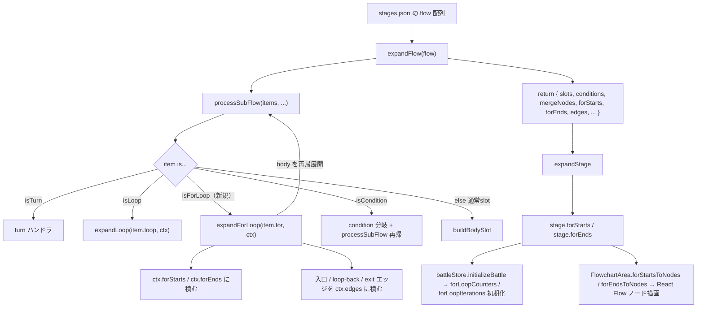
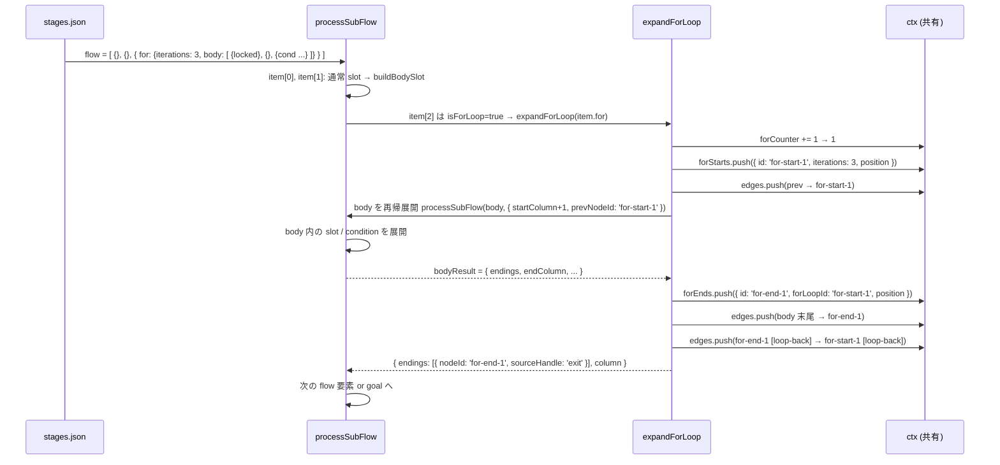

# 設計書: for ループ短縮記法（stagesLoader 拡張）

## 概要

`stagesLoader.js` に **`expandForLoop(forDef, options)` 関数** と **`isForLoop(item)` 型ガード** を新規追加し、既存の `processSubFlow` の if/else チェーンに **`isForLoop(item)` 分岐** を挟むことで、`{ "for": { "iterations": N, "body": [...] } }` 形式の flow 要素を自動展開する。`expandForLoop` は for-start / for-end ノードを `ctx.forStarts` / `ctx.forEnds` に積み、body は既存の `processSubFlow` を **再帰呼び出し** することで condition / loop / ネストした for を含む任意のネスト構造をサポートする。既存の `expandLoop` の流儀（merge の代わりに for-start / for-end を使う）と `processSubFlow` の再帰パターン（`processSubFlow` を呼んで endings と endColumn を受け取る）を両方継承する。ID 採番は `ctx.forCounter` を追加して flow 全体で共有し、`for-start-N` / `for-end-N` のペアで採番する。既存の全ステージ（`for` 要素を含まない）は本改修で **完全に無変化**（既存の if/else チェーンに新規分岐を挟むだけで、既存分岐のロジックには一切触らない）。

## アーキテクチャ

### コンポーネント

| コンポーネント | 責務 |
|--------------|------|
| `isForLoop(item)`（新規） | 型ガード。`typeof item?.for === 'object' && item.for !== null` で判定 |
| `expandForLoop(forDef, options)`（新規） | for 要素 1 個を完全形式に展開。for-start / for-end ノード生成、body の再帰展開、入口／loop-back／exit エッジ生成 |
| `processSubFlow`（改修） | if/else チェーンの **`isLoop(item)` の直後** に `isForLoop(item)` 分岐を追加 |
| `expandFlow`（改修） | `ctx` 初期化に `forCounter: 0` / `forStarts: []` / `forEnds: []` を追加、return object に `forStarts` / `forEnds` を含める |
| `expandStage`（改修） | 完全形式の stage オブジェクトに `forStarts` / `forEnds` を含める（slots ルートでは空配列） |
| `expandFlow` の不正入力フォールバック（改修） | 早期 return の空ステージにも `forStarts: []` / `forEnds: []` を含める |
| `collectSlotTypeIds`（改修） | `visitFlow` の再帰処理に `isForLoop(item)` 分岐を追加。`for` 要素を検出したら **既存の `'counter'`** を Set に追加、`item.for.body` を再帰 |

### データモデル

新規 `ctx` フィールド（`expandFlow` で初期化、`processSubFlow` / `expandForLoop` で共有）:

| 名前 | 型 | 用途 |
|---|---|---|
| `forCounter` | `number` | for 要素の通し番号カウンタ。展開ごとに +1 して `for-start-${N}` / `for-end-${N}` の採番に使う |
| `forStarts` | `Array<{id, iterations, position}>` | 完成した for-start ノード配列。`expandFlow` の return object に載せる |
| `forEnds` | `Array<{id, forLoopId, position}>` | 完成した for-end ノード配列。`forLoopId` は対応する for-start の id |

flow 要素の新シンタックス:

```jsonc
{
  "for": {
    "iterations": 3,
    "body": [
      { "lockedCard": {"id": "monster", "power": 80 } },
      {},
      {
        "condition": "forCounter('for-start-1') === 2",
        "true":  [{}, {}],
        "false": [{}]
      }
    ]
  }
}
```

### API / インターフェース

#### `isForLoop(item)` 新規関数

```javascript
function isForLoop(item) {
  return typeof item?.for === 'object' && item.for !== null;
}
```

`isLoop` / `isCondition` / `isTurn` と同じ型ガード戦略。`for: true` や `for: "3"` などの誤記を弾く。

#### `expandForLoop(forDef, options)` 新規関数

```javascript
function expandForLoop(forDef, { column, yLevel, endings, ctx }) {
  // 1. バリデーション
  if (!Number.isInteger(forDef.iterations) || forDef.iterations < 1) {
    console.warn(`[stagesLoader] invalid for.iterations "${forDef.iterations}". Must be integer >= 1. Skipping.`);
    return { endings, column };
  }
  if (!Array.isArray(forDef.body)) {
    console.warn('[stagesLoader] invalid for.body. Must be an array. Skipping.');
    return { endings, column };
  }
  
  // 2. ID 採番
  ctx.forCounter += 1;
  const forStartId = `for-start-${ctx.forCounter}`;
  const forEndId = `for-end-${ctx.forCounter}`;
  
  // 3. for-start を作って ctx.forStarts に積む
  const forStartColumn = column;
  ctx.forStarts.push({
    id: forStartId,
    iterations: forDef.iterations,
    position: { x: SLOT_X_START + forStartColumn * SLOT_X_STEP, y: yLevel },
  });
  
  // 4. 入口エッジ: prev endings → for-start
  for (const ending of endings) {
    ctx.edges.push(buildEdge(ending, forStartId));
  }
  
  // 5. body を再帰展開（processSubFlow 経由で condition / loop / ネスト for に対応）
  const bodyResult = processSubFlow(forDef.body, {
    startColumn: forStartColumn + 1,
    yLevel,
    prevNodeId: forStartId,
    prevSourceHandle: undefined,
    ctx,
    isTopLevel: false,
    direction: 'right',
  });
  
  // 6. for-end を作って ctx.forEnds に積む
  const forEndColumn = bodyResult.endColumn;
  ctx.forEnds.push({
    id: forEndId,
    forLoopId: forStartId,
    position: { x: SLOT_X_START + forEndColumn * SLOT_X_STEP, y: yLevel },
  });
  
  // 7. body 末尾 → for-end エッジ
  for (const ending of bodyResult.endings) {
    ctx.edges.push(buildEdge(ending, forEndId));
  }
  
  // 8. loop-back エッジ: for-end → for-start
  ctx.edges.push(buildEdge(
    { nodeId: forEndId, sourceHandle: 'loop-back', targetHandle: 'loop-back' },
    forStartId
  ));
  
  // 9. 次の要素向けに exit エッジで出す
  return {
    endings: [{ nodeId: forEndId, sourceHandle: 'exit' }],
    column: forEndColumn + 1,
  };
}
```

#### `processSubFlow` の if/else チェーン改修

現状は `isTurn → isLoop → isCondition → else(通常スロット)` の順序。**`isLoop` と `isCondition` の間に `isForLoop` 分岐を追加**:

```javascript
} else if (isLoop(item)) {
  const loopResult = expandLoop(item.loop, { column, yLevel, endings, ctx });
  endings = loopResult.endings;
  column = loopResult.column;
} else if (isForLoop(item)) {
  const forResult = expandForLoop(item.for, { column, yLevel, endings, ctx });
  endings = forResult.endings;
  column = forResult.column;
} else if (isCondition(item)) {
  // 既存
```

`expandLoop` と完全に同じインターフェース（`{ column, yLevel, endings, ctx }` を受け取り `{ endings, column }` を返す）にすることで、統合パターンを踏襲。

#### `expandFlow` の ctx 初期化と return

```javascript
const ctx = {
  slotCounter: 0,
  condCounter: 0,
  mergeCounter: 0,
  forCounter: 0,          // 新規
  slots: [],
  conditions: [],
  mergeNodes: [],
  forStarts: [],          // 新規
  forEnds: [],            // 新規
  edges: [],
  turnCount: 0,
  afterTurn: false,
};

// ...（既存の processSubFlow 呼び出し・resolveGoalPlacement・goal エッジ生成）

return {
  slots: ctx.slots,
  conditions: ctx.conditions,
  mergeNodes: ctx.mergeNodes,
  forStarts: ctx.forStarts,  // 新規
  forEnds: ctx.forEnds,      // 新規
  edges: ctx.edges,
  start: { position: { x: -120, y: 120 } },
  goal: { position: goalPlacement.position },
};
```

不正入力フォールバック（`Array.isArray(flow)` が false のケース）にも `forStarts: []` / `forEnds: []` を追加。

#### `expandStage` の slots ルート

```javascript
const stage = {
  enemyId: raw.enemyId,
  maxEnemyHp: raw.maxEnemyHp,
  cards: raw.cards ?? [],
  slotTypeIds: collectSlotTypeIds(raw),
  slots,
  conditions: expandConditions(raw.conditions),
  mergeNodes: [],
  forStarts: [],   // 新規（明示的な空配列で state 初期化の予測可能性を上げる）
  forEnds: [],     // 新規
  start: expandStart(raw.start),
  goal: expandGoal(raw.goal, slots.length),
  edges: raw.edges ?? buildLinearEdges(slots),
};
```

#### `collectSlotTypeIds` の visitFlow 改修

```javascript
const visitFlow = (items) => {
  if (!Array.isArray(items)) return;
  for (const item of items) {
    if (isLoop(item)) {
      ids.add('loop');
      visitFlow(item.loop.body);
    } else if (isForLoop(item)) {           // 新規
      ids.add('counter');                    // for-start は「数字が変わるマス」= counter 種別で扱う
      visitFlow(item.for.body);              // ネスト再帰
    } else if (isCondition(item)) {
      ids.add('condition');
      visitFlow(item.true);
      visitFlow(item.false);
    } else if (!isTurn(item)) {
      visitSlot(item);
    }
  }
};
```

## データフロー





## 実装方針

### 座標レイアウトの選択

for ループの body は **`processSubFlow` を再帰呼び出し** することで既存の座標管理をそのまま利用する。for-start / for-end は body と同じ `yLevel` に置く（横一列）。

- **for-start の column** = 呼び出し時の `column`（`for` 要素が置かれた場所）
- **body の startColumn** = `forStartColumn + 1`
- **for-end の column** = `bodyResult.endColumn`（body 展開後の次の空 column）
- **次の要素の startColumn** = `forEndColumn + 1`

body 内で condition の false 分岐が下段に伸びても、`processSubFlow` が `endColumn` を **メイン経路（true と false の max column）** で返すため、for-end は自然にメイン経路の右隣に配置される。

### body の再帰展開と `isTopLevel: false`

`processSubFlow(body, { ..., isTopLevel: false })` を渡すことで、**body 内での turn 要素は既存ガード**（"turn must be at flow top level" warn + skip）で自動的に弾かれる。要件 10-3 を追加コードなしで達成。

### ID 採番の一貫性（ネスト対応）

`ctx.forCounter` は `ctx` に持たせるので、ネストした for ループでも **flow 全体で共有** される:

```jsonc
"flow": [
  { "for": { "iterations": 3, "body": [
    { "for": { "iterations": 2, "body": [ {} ] } }  // ← 内側の for
  ]}}
]
```

展開順序:
1. 外側 for に到達 → `ctx.forCounter` = 1 → `for-start-1` / `for-end-1`
2. 外側 body を再帰展開 → 内側 for に到達 → `ctx.forCounter` = 2 → `for-start-2` / `for-end-2`
3. ID 衝突なし

### エッジのハンドル指定

for-start / for-end のハンドルは `for-loop` 仕様で定義済み（設計は既存）:

- **入口エッジ**（prev → for-start）: `buildEdge(ending, forStartId)` でハンドル指定なし → React Flow デフォルト（Left target）
- **body 先頭エッジ**（for-start → body[0]）: `processSubFlow` 内で `buildEdge` により生成、for-start の Right source が使われる
- **body 末尾エッジ**（body[last] → for-end）: `buildEdge(ending, forEndId)` でハンドル指定なし → for-end の Left target
- **loop-back エッジ**（for-end → for-start）: `buildEdge({ nodeId: forEndId, sourceHandle: 'loop-back', targetHandle: 'loop-back' }, forStartId)` → for-end の Top source (id="loop-back") から for-start の Top target (id="loop-back") へ
- **exit エッジ**（for-end → next）: `expandForLoop` の return endings に `sourceHandle: 'exit'` を含めることで、次要素の `buildEdge` が自動的に付与

### バリデーションと安全側フォールバック

`iterations` / `body` の不正時は `console.warn` を出して **当該 for 要素をスキップ**（`return { endings, column }` で入力を素通し）:

- `for.iterations` が 1 未満・非整数・undefined → 警告 + スキップ
- `for.body` が非配列 → 警告 + スキップ

いずれも `expandLoop` の既存パターン（`condition` が非文字列・`body` が非配列で警告 + スキップ）を踏襲。

### 空 body の扱い

`for.body = []` の場合、`processSubFlow([])` は `{ endings: [{ nodeId: forStartId, ... }], endColumn: forStartColumn + 1, ... }` を返す。この場合:

- for-end は `forStartColumn + 1` に配置される
- body 末尾 → for-end エッジ = for-start → for-end の直接エッジ 1 本
- loop-back は通常通り

実行時は for-start → for-end → decrement → loop-back を iterations 回繰り返す。LOOP_MAX_VISITS = 100 の runaway ガードで iterations > 100 は安全に停止する（要件 2-5）。

### `for-loop` 仕様との整合

本仕様は **`for-loop` 仕様の runtime 機構を一切変更しない**。以下は既に実装済みで再利用する:

- `battleStore` の `forLoopCounters` / `forLoopIterations` state
- `decrementForLoopCounter` action
- `initializeBattle` で `stage.forStarts` から `forLoopIterations` を初期化
- `retryFromFail` で `forLoopIterations` から `forLoopCounters` を復元
- `scheduleNodePhase` の for-end decrement
- `selectNextEdge` の for-end 分岐（`sourceHandle: 'loop-back' | 'exit'`）
- `evaluateCondition` の `forCounter('<id>')` 構文
- `simulateBattle` の for-end ミラー
- `ForStartNode` / `ForEndNode` / `ForNode.module.css` の JSX + CSS
- `FlowchartArea.nodeTypes` / `forStartsToNodes` / `forEndsToNodes` / `edgesToFlowEdges` の validation

本仕様が触るのは **`stagesLoader.js` のみ**。

## 依存関係

| パッケージ | 用途 | 導入済み？ |
|----------|------|----------|
| なし（stagesLoader.js の内部関数のみ） | - | - |

新規依存なし。

## トレードオフと検討した代替案

- **決定内容**：body を **`processSubFlow` の再帰呼び出し** で展開する
  **理由**：既存の condition / loop / turn などのネスト対応がそのまま body 内でも効く（要件 3）。座標管理・エッジ生成・ID 採番のロジックが 1 箇所に集約される
  **検討した代替案**：**`expandLoop` の body ように `buildBodySlot` のみで展開**（body の各要素は通常スロットのみ） → 要件 3-2 のネスト condition が実現できない、stage 4-2 の案が書けない

- **決定内容**：`ctx.forCounter` を **flow 全体で共有**
  **理由**：ネストした for でも通し番号（`for-start-1`, `for-start-2`, ...）で ID 衝突を防ぐ。デバッグ時に「N 番目の for」で参照しやすい
  **検討した代替案**：**ネストごとに独立採番**（例: `for-start-1.1`） → ID 命名規則が複雑化、`forLoopCounters` の Map キーとしても扱いにくい

- **決定内容**：**新規 slot type ID `'for'` を追加せず、既存の `'counter'` を流用する**
  **理由**：for-start は「実行中に数字が変わるマス」という点で既存の counter マスと概念的に同じ。ヘルプウィンドウを別途書く必要がない（要件 8）
  **検討した代替案**：**新規の `'for'` slot type ID と slot_help.json エントリを追加** → ヘルプ文言の重複、ステージデザイナーが混乱するリスク

- **決定内容**：`slots` ベースの stage にも `forStarts: []` / `forEnds: []` を **明示的に空配列** で付与する
  **理由**：`battleStore.initializeBattle` で `stage.forStarts ?? []` フォールバックが効くが、明示的に空配列を持たせることで下流コードの予測可能性が上がる（要件 7-2）
  **検討した代替案**：**フィールド自体を追加しない** → 下流の `?? []` フォールバックに依存し続けることになる。ステージ形式のバージョン差異が生じる

- **決定内容**：body が空配列でも **警告なしで許容**（要件 2-5）
  **理由**：ユーザー確認済み（「間違って空のfor文を書いても致命的なバグにはならないのでそのままでも大丈夫」）。runaway ガードで暴走も防げる
  **検討した代替案**：**空 body で警告 or skip** → デザイナーの試行錯誤（body を後で埋める予定で空にしておく等）を阻害

- **決定内容**：for-start / for-end を body と **同じ yLevel** に横一列配置
  **理由**：既存の `flow` レイアウトと整合的。デザイナーが座標を考えずに書ける
  **検討した代替案**：**for-start / for-end を body の上下に配置**（縦にループを表現） → 既存の flow 横並びレイアウトと大きく異なる、複雑

## トレーサビリティ

| 要件 | 対応する設計セクション |
|---|---|
| 1: `for` 要素の flow 内サポート | コンポーネント表（`isForLoop`）、`processSubFlow` の if/else チェーン改修 |
| 2: `iterations` と `body` フィールド | `expandForLoop` のバリデーション部、空 body 対応（実装方針「空 body の扱い」） |
| 3: body 内のネスト構造 | `expandForLoop` の body 再帰展開（`processSubFlow(body, ..., isTopLevel: false)`） |
| 4: 座標の自動計算 | 実装方針「座標レイアウトの選択」、`processSubFlow` の endColumn 継承 |
| 5: ID の一貫性 | データモデル `ctx.forCounter`、実装方針「ID 採番の一貫性（ネスト対応）」 |
| 6: エッジの自動生成 | `expandForLoop` の 5 種類のエッジ生成、実装方針「エッジのハンドル指定」 |
| 7: `forStarts` / `forEnds` 統合 | `expandFlow` の return 改修、`expandStage` の slots ルート改修 |
| 8: `collectSlotTypeIds` 統合 | `collectSlotTypeIds` の visitFlow 改修（既存 `'counter'` 流用） |
| 9: 既存機能との非干渉 | if/else チェーンに新規分岐を挟むだけ、既存分岐は無変更（トレードオフ「共有 forCounter」）、runtime 機構は無変更（実装方針「`for-loop` 仕様との整合」） |
| 10: バリデーションと警告 | `expandForLoop` のバリデーション部、`processSubFlow` の既存 turn ガード継承 |

全 10 要件が設計に対応しています。孤立した要件はありません。
