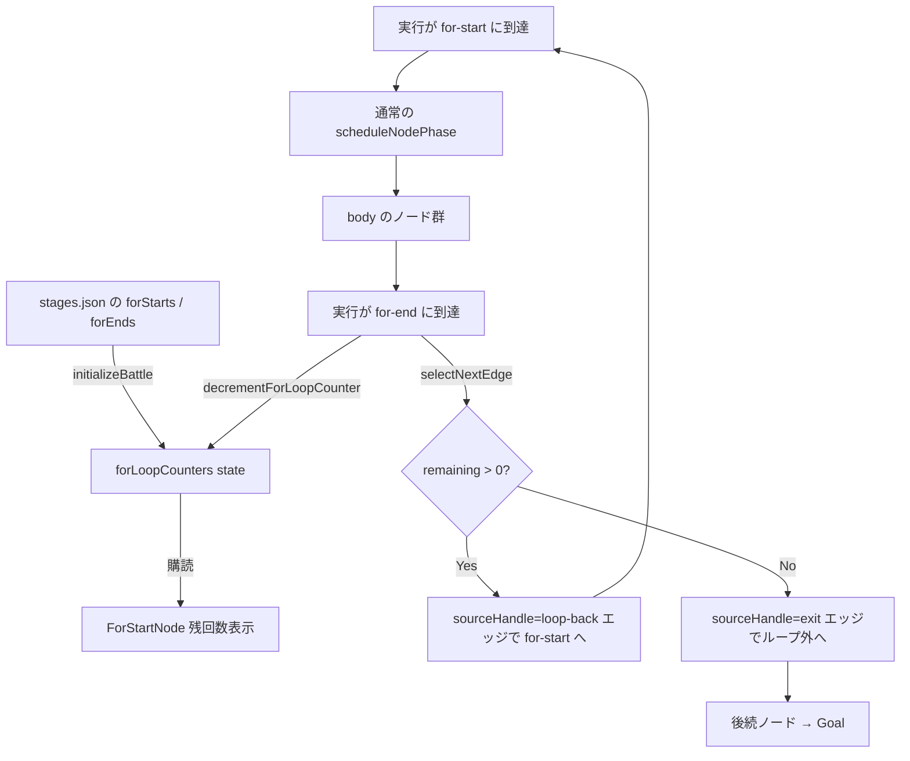
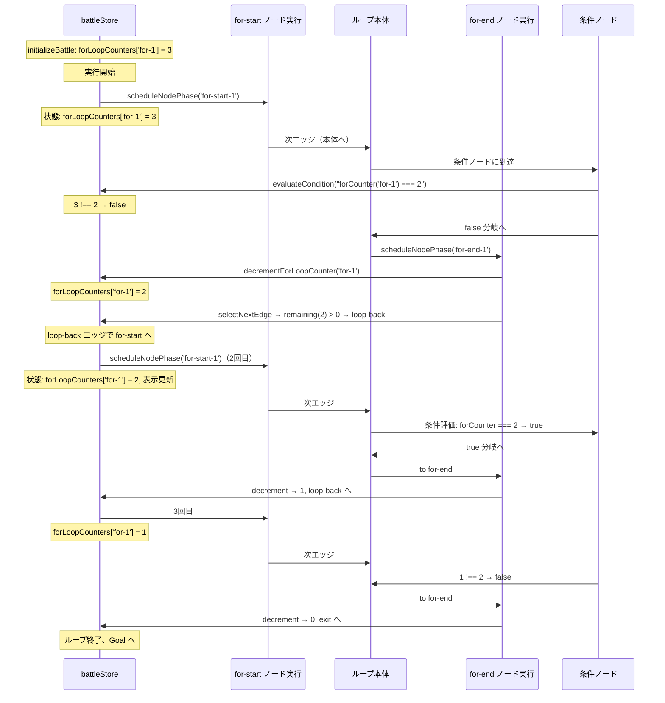

# 設計書: for ループノード（stage 4-2 「for 文」）

## 概要

`for-start` と `for-end` の 2 種類の React Flow カスタムノードを新規追加し、`battleStore` に **`forLoopCounters` state**（ループ ID → 現在残回数の Map）を持たせて for ループの反復状態を管理する。for-start はカウンタ値を大きく表示する **左角カット長方形**、for-end はループバック／出口の分岐点となる **右角カット長方形**。実行機構は既存の `scheduleNodePhase` に「for-end で decrement」「for-end 用の selectNextEdge 分岐（残 > 0 なら loop-back、== 0 なら exit）」を追加する形で実装する。既存の `ConditionNode` の branching pattern（`sourceHandle` に `'true' / 'false'` を使う）を踏襲し、for-end の 2 本の outgoing エッジは `sourceHandle: 'loop-back' | 'exit'` で区別する。条件式評価には `forCounter('<id>')` 構文を追加し、`counter()` とは名前空間・関数を分離する。

## アーキテクチャ

### コンポーネント

| コンポーネント | 責務 |
|--------------|------|
| `ForStartNode`（新規） | `.forNode.start` クラスの左角カット長方形。`useBattleStore` で自身の `forLoopCounters[id]` を購読して残回数を大きく表示。source Handle（右）と target Handle 2 個（左：初回入場、上または特定辺：loop-back 受け）を持つ |
| `ForEndNode`（新規） | `.forNode.end` クラスの右角カット長方形。数字表示なし。target Handle（左：body から）、source Handle 2 個（`id='loop-back'`：for-start へ戻る、`id='exit'`：ループ外へ抜ける）を持つ |
| `FlowchartArea`（改修） | `nodeTypes` に `'for-start': ForStartNode, 'for-end': ForEndNode` を追加。`forStartToNodes` / `forEndToNodes` 変換関数を追加してステージ定義から React Flow node 配列を作る |
| `battleStore`（改修） | `forLoopCounters` state 追加、`initializeBattle` で for-start ノードを走査して初期化、`scheduleNodePhase` の for-end 処理で decrement、`selectNextEdge` に for-end 分岐追加、`retryFromFail` でリセット |
| `evaluateCondition`（改修） | 新規パターン `FORCOUNTER_PATTERN` で `forCounter('<id>') <op> <literal>` 構文を評価。`buildEvalContext` に `forCounter(id)` 関数を追加 |
| `simulateBattle`（改修） | `forLoopCounters` を初期状態に受け取り、for-end で decrement を模倣。live 実行と outcome が一致するようにする |

### データモデル

新規 store フィールド:

| 名前 | 型 | 用途 |
|---|---|---|
| `forLoopCounters` | `Record<string, number>` | for-loop ノード ID → 現在の残回数。ステージ start 時に `iterations` で初期化、for-end で decrement |

新規 stage 定義スキーマ:

```jsonc
{
  "id": "stage-4-2",
  // ... 既存フィールド
  "forLoops": [
    {
      "id": "for-1",
      "startNodeId": "for-start-1",
      "endNodeId": "for-end-1",
      "iterations": 3,
      "position": { "x": 100, "y": 50 }   // for-start の座標（for-end 用に別途position）
    }
  ],
  // for-end も個別に position を持つのでシンプルには:
  "forStarts": [
    { "id": "for-start-1", "iterations": 3, "position": {"x": ..., "y": ...} }
  ],
  "forEnds": [
    { "id": "for-end-1", "forLoopId": "for-start-1", "position": {"x": ..., "y": ...} }
  ]
}
```

**選択肢**: `forStarts` / `forEnds` を分けるか、`forLoops` にまとめるか。実装のシンプルさから **for-start と for-end を別配列で** 定義する形（既存の `slots` / `conditions` / `mergeNodes` の並びと整合）を採用する。for-end は `forLoopId` フィールドで対応する for-start を指す。

### API / インターフェース

#### 新規 store action

```javascript
decrementForLoopCounter: (forLoopId) => {
  set((s) => {
    if (s.forLoopCounters[forLoopId] === undefined) return s;
    return {
      forLoopCounters: {
        ...s.forLoopCounters,
        [forLoopId]: Math.max(0, s.forLoopCounters[forLoopId] - 1),
      },
    };
  });
}
```

#### `evaluateCondition` の新パターン

```javascript
const FORCOUNTER_PATTERN = /^forCounter\(\s*(['"])([^'"]+)\1\s*\)\s*(>=|<=|===|!==|>|<)\s*(.+)$/;

// evaluateAtom 内で処理を追加
const forCounterMatch = expression.match(FORCOUNTER_PATTERN);
if (forCounterMatch) {
  const forLoopId = forCounterMatch[2];
  const op = forCounterMatch[3];
  const rightExpr = forCounterMatch[4].trim();
  const left = context.forCounter(forLoopId);   // 新規 context 関数
  const right = parseLiteral(rightExpr);
  if (right === undefined) return false;
  return compareValues(left, op, right);
}
```

`buildEvalContext` に追加:
```javascript
forCounter: (forLoopId) => state.forLoopCounters[forLoopId] ?? 0,
```

#### `selectNextEdge` の for-end 分岐

```javascript
if (node?.type === 'for-end') {
  const forLoopId = node.forLoopId;
  const remaining = get().forLoopCounters[forLoopId] ?? 0;
  const target = remaining > 0 ? 'loop-back' : 'exit';
  return edges.find((e) => e.sourceHandle === target);
}
```

#### `scheduleNodePhase` の for-end 処理（decrement）

card 効果分岐の直後に追加:
```javascript
if (nodeMap[nodeId]?.type === 'for-end') {
  const forLoopId = nodeMap[nodeId].forLoopId;
  get().decrementForLoopCounter(forLoopId);
}
```

**順序が重要**: decrement → set (executionStep 等) は既に済んでいる → selectNextEdge で decremented 値を参照。selectNextEdge は set の中ではなく後で呼ばれるため、decrement 反映後の値を読める。

#### `initializeBattle` の for-loop 初期化

```javascript
const forLoopCounters = Object.fromEntries(
  (stage.forStarts ?? []).map((f) => [f.id, f.iterations])
);
// set 内で forLoopCounters を追加
```

## データフロー





## 実装方針

### state の初期化と リセット

`initializeBattle`:
```javascript
const forLoopCounters = Object.fromEntries(
  (stage.forStarts ?? []).map((f) => [f.id, f.iterations])
);
set(() => ({
  // 既存フィールド
  forLoopCounters,
}));
```

`retryFromFail` の set 内:
```javascript
forLoopCounters: Object.fromEntries(
  Object.keys(state.forLoopCounters).map((id) => {
    // 対応する stage.forStarts から iterations を引く必要がある
    // → stage を state に持たないので、代わりに再度 iterations を引き出す仕組み
    // 案: initializeBattle と同じく forStarts 情報を保持し retryFromFail で再利用する
  })
),
```

**課題**: `retryFromFail` は既存の `slotAssignments` / `handCards` を維持する設計上、stage 定義を保持していない。for ループの iterations を復元するには **stage を state に持たせる** か、**forLoopIterations という別 map を追加**して initial 値を保持する。

**採用案**: `forLoopIterations: Record<string, number>` を state に追加。`initializeBattle` で `forStarts` から作り、`retryFromFail` は `forLoopIterations` を使って `forLoopCounters` をリセット。

```javascript
// initializeBattle 内
const forLoopIterations = Object.fromEntries(
  (stage.forStarts ?? []).map((f) => [f.id, f.iterations])
);
set(() => ({
  forLoopIterations,
  forLoopCounters: { ...forLoopIterations },  // 初回は同値
}));

// retryFromFail 内
forLoopCounters: { ...state.forLoopIterations },
```

### `for-start` ノードの描画

`ForStartNode.jsx`:
```jsx
function ForStartNode({ id, data }) {
  const isActive = useBattleStore(
    (s) => s.executionStep?.type === 'node' && s.executionStep?.id === id,
  );
  const isTraversed = useBattleStore((s) => s.traversedNodeIds.includes(id));
  const remaining = useBattleStore((s) => s.forLoopCounters[id] ?? data.iterations ?? 0);

  const className = [
    styles.forNode,
    styles.start,
    isActive && styles.active,
    isTraversed && styles.traversed,
  ].filter(Boolean).join(' ');

  return (
    <div className={className}>
      <span className={styles.count}>{remaining}</span>
      <Handle type="target" position={Position.Left} className={styles.handle} />
      <Handle type="target" position={Position.Top} id="loop-back" className={styles.handle} />
      <Handle type="source" position={Position.Right} className={styles.handle} />
    </div>
  );
}
```

CSS で角カット:
```css
.forNode {
  width: 80px;
  height: 80px;
  background: #2a2a33;
  border: 2px solid #4a4a52;
  display: flex;
  align-items: center;
  justify-content: center;
  box-sizing: border-box;
}
.forNode.start {
  clip-path: polygon(0 20%, 20% 0, 100% 0, 100% 100%, 20% 100%, 0 80%);
}
.forNode.end {
  clip-path: polygon(0 0, 80% 0, 100% 20%, 100% 80%, 80% 100%, 0 100%);
}
.count {
  font-family: 'Press Start 2P', monospace;
  font-size: 1.75rem;
  color: #f5f5f5;
}
```

### `for-end` ノードの描画

`ForEndNode.jsx`:
```jsx
function ForEndNode({ id }) {
  const isActive = useBattleStore(
    (s) => s.executionStep?.type === 'node' && s.executionStep?.id === id,
  );
  const isTraversed = useBattleStore((s) => s.traversedNodeIds.includes(id));

  return (
    <div className={[styles.forNode, styles.end, ...].filter(Boolean).join(' ')}>
      <Handle type="target" position={Position.Left} className={styles.handle} />
      <Handle type="source" position={Position.Top} id="loop-back" className={styles.handle} />
      <Handle type="source" position={Position.Right} id="exit" className={styles.handle} />
    </div>
  );
}
```

### `FlowchartArea` の nodeTypes / 変換関数

```javascript
import ForStartNode from './ForStartNode';
import ForEndNode from './ForEndNode';

const nodeTypes = {
  slot: SlotNode,
  start: StartNode,
  goal: GoalNode,
  condition: ConditionNode,
  merge: MergeNode,
  'for-start': ForStartNode,
  'for-end': ForEndNode,
};

function forStartsToNodes(forStarts) {
  return forStarts.map((f) => ({
    id: f.id,
    type: 'for-start',
    position: f.position,
    data: { iterations: f.iterations },
  }));
}

function forEndsToNodes(forEnds) {
  return forEnds.map((f) => ({
    id: f.id,
    type: 'for-end',
    position: f.position,
    data: { forLoopId: f.forLoopId },
  }));
}
```

`useMemo` の nodes 結合部に追加:
```javascript
const forStartNodes = forStartsToNodes(stage.forStarts ?? []);
const forEndNodes = forEndsToNodes(stage.forEnds ?? []);
result.push(...forStartNodes, ...forEndNodes);
```

### `battleStore` の scheduleNodePhase 拡張

現状の scheduleNodePhase の card 効果分岐の直後（`if (nodeId === 'goal')` の前）に追加:

```javascript
// for-end に到達したら decrement
if (nodeMap[nodeId]?.type === 'for-end') {
  const forLoopId = nodeMap[nodeId].forLoopId;
  get().decrementForLoopCounter(forLoopId);
}
```

`selectNextEdge` に for-end 分岐を追加（前述 API 節参照）。

`nodeMap` の構築に for-start / for-end を含める:
```javascript
for (const f of stage.forStarts ?? []) {
  nodeMap[f.id] = { type: 'for-start', iterations: f.iterations };
}
for (const f of stage.forEnds ?? []) {
  nodeMap[f.id] = { type: 'for-end', forLoopId: f.forLoopId };
}
```

### `simulateBattle` の同期

`simulateBattle` は effectively duplicate execution。同じロジックを追加する必要がある:
- initialState に `forLoopCounters` を含める
- selectNextEdge に for-end 分岐
- 各ステップで for-end に到達したら simulated counters を decrement
- LOOP_MAX_VISITS の判定は既存通り（runaway ガード）

## 依存関係

| パッケージ | 用途 | 導入済み？ |
|----------|------|----------|
| `@xyflow/react` | `Handle`, `Position` を新ノードで使用 | はい（既存） |
| `zustand` | `battleStore` に新 state / action を追加 | はい（既存） |

新規依存なし。

## トレードオフと検討した代替案

- **決定内容**：for-start と for-end を **別ノード種** として実装する
  **理由**：ユーザーの意図が明確（見た目も別、意味も別）。for-start に「exit」ロジックを持たせない方が理解しやすい（for-start = 表示・入場、for-end = 分岐・終端）
  **検討した代替案**：**for-start に両方の役割**（decrement + exit 判定）を持たせて for-end を単なる「pass-through」にする → ノード対の意味が不明確、教材として「for 開始／for 終了」の対を強調したい意図に反する

- **決定内容**：`forLoopCounters` を既存の `counterValues` と **別 map** で管理する
  **理由**：セマンティクスが違う（`counterValues` はカードで手動 increment、`forLoopCounters` は自動 decrement）。名前空間・値・初期化タイミングが混線しないようにする。要件4-2 と整合
  **検討した代替案**：**同じ map で管理**して ID プレフィックスで区別 → 意図しない ID 衝突・混乱のリスクがある

- **決定内容**：条件式で `forCounter('<id>')` **専用構文** を追加する
  **理由**：要件4-2 で「別関数として評価」と決定済み。既存 `counter()` は `counter()` として温存し、`forCounter()` で明示的に for ループカウンタを参照
  **検討した代替案**：既存の `counter()` を拡張 → 混乱の元。`counter()` は multiplier-slot で使われている既存概念

- **決定内容**：for-end の 2 本の outgoing エッジは **`sourceHandle: 'loop-back' | 'exit'`** で区別する
  **理由**：既存の `ConditionNode`（`'true' | 'false'`）と同じ流儀。React Flow の `sourceHandle` 機構をそのまま流用でき、実装が既存パターンと整合
  **検討した代替案**：エッジに meta フィールド `edgeKind: 'loop-back' | 'exit'` を持たせる → 既存の condition と実装パターンが分岐、統一感が損なわれる

- **決定内容**：`forLoopIterations` state を追加して retryFromFail で復元に使う
  **理由**：`retryFromFail` は stage を再参照しない設計になっている（初期化状態を state に保持する方針）。`counterValues` も同様のパターンで復元する
  **検討した代替案**：**stage 参照を state に保持**（`currentStage: object`） → 影響範囲が広い、既存パターン外の設計変更を招く

- **決定内容**：for-start の残回数を **`useBattleStore` の細粒度購読** で駆動する
  **理由**：既存の `SlotNode` が `counterValues[meta.counterRef]` を細粒度購読するのと同じパターン。無関係な state 変更でノードが再描画されるのを防ぐ
  **検討した代替案**：ノード全体を `useMemo` 内で組み立てて data prop に注入 → 実行中の値変化を追いにくい

## トレーサビリティ

| 要件 | 対応する設計セクション |
|---|---|
| 1: `for-start` ノード追加 | コンポーネント表（`ForStartNode`）、実装方針「for-start ノードの描画」 |
| 2: `for-end` ノード追加 | コンポーネント表（`ForEndNode`）、実装方針「for-end ノードの描画」 |
| 3: for ループの実行セマンティクス | 実装方針「scheduleNodePhase 拡張」「selectNextEdge の for-end 分岐」、データフロー Mermaid、sequenceDiagram |
| 4: 残回数の可視化と分岐条件 | 実装方針「`evaluateCondition` の新パターン」、`buildEvalContext` 拡張 |
| 5: stage 4-2 基盤保証 | データモデル「新規 stage 定義スキーマ」（`forStarts` / `forEnds`）、`FlowchartArea` の変換関数 |
| 6: 見た目のバリアント | 実装方針「for-start ノードの描画」（CSS clip-path）、既存 `.active` / `.traversed` 演出流用 |
| 7: 既存機能との互換性 | トレードオフ「別 map で管理」、`nodeMap` 拡張が既存タイプに影響なし、`selectNextEdge` は type 判定で既存分岐に影響なし |
| 8: 実行速度と加速機構との整合 | for-start / for-end は既存の `scheduleNodePhase` の枠内で動作するため `nodePhaseMs / speedMultiplier` の適用対象になる（自動的に達成） |

全 8 要件が設計に対応しています。孤立した要件はありません。
