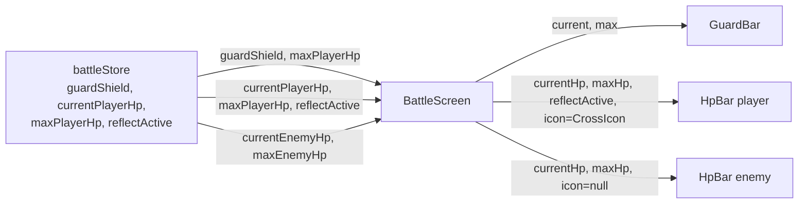
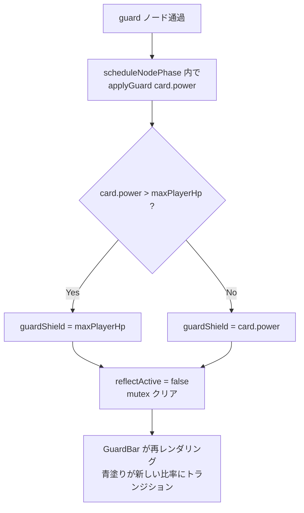
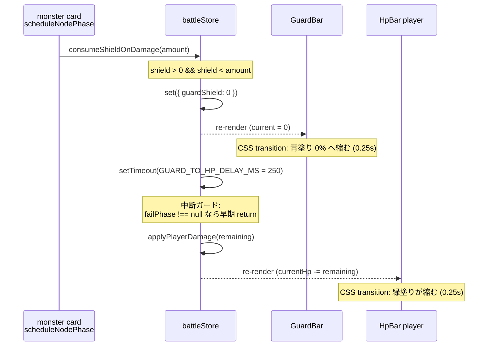
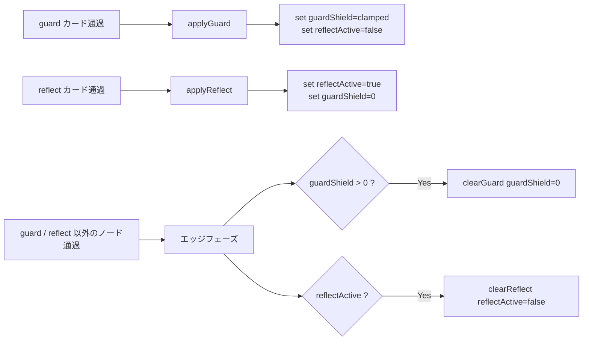

# 設計書: ガードバーの再設計（guard-bar-redesign）

## 概要

既存の `HpBar` コンポーネントは「HP 緑バー + 右側に青いシールド延長バー（`--shield-scale`）+ reflect 時の橙化」を 1 つの DOM 構造に詰め込んでいた（`guard-card-effect` / `reflect-card-effect` の 2 仕様の累積）。本仕様では、ガード表示を **HP バーの真上に並ぶ独立した水平バー（GuardBar）** に分離し、HP バーは「HP のみ＋ reflect 時の色変化」に責務を絞る。

両バーは同サイズ（180×14px）で揃え、左側に小さなインライン SVG アイコン（HP は十字、Guard は盾）を付ける。`battleStore` の `guardShield` は既存実装の `applyGuard` 上書き仕様を維持しつつ、`maxPlayerHp` で `Math.min` クランプを追加する。ダメージ吸収時はガードバーの減少を視認できる時間（CSS transition と同じ 250ms）を挟んでから HP バー減少を発火させ、「ガードが防いだ」印象を強調する。

Fortnite のシールドシステムを参照点とするが、加算式（Fortnite）ではなく上書き式（本プロジェクト既存挙動）を維持する点が相違点。

## アーキテクチャ

### コンポーネント

| コンポーネント | 種別 | 責務 |
|---|---|---|
| `HpBar.jsx` | **既存改修** | プレイヤー / 敵の HP を白枠＋緑（reflect 時オレンジ）フィルで描画。`shield` props と `--shield-scale` 拡張機構を撤去、`icon` props を新設して左側アイコンを描画。 |
| `GuardBar.jsx` | **新規** | ガード残量を白枠＋青フィルで描画。寸法とトランジション仕様は HpBar と完全に揃える。reflect 概念なし。アイコンは盾固定。 |
| `BattleScreen.jsx` | **既存改修** | プレイヤー HUD の `<HpBar shield={guardShield} reflectActive={...} />` 単体描画を、`<GuardBar />` + `<HpBar icon={<CrossIcon />} reflectActive={...} />` の 2 段スタックに置き換え。HP 数値テキストの「合算分子 + 条件付き色付け」は旧仕様のまま維持（`currentPlayerHp + guardShield` / `.hpNumeratorShielded` 青色 / `.hpNumeratorReflect` 橙色）。 |
| `battleStore.js` | **既存改修** | `applyGuard` に max クランプ（`Math.min(amount, maxPlayerHp)`）を追加。`consumeShieldOnDamage` に `setTimeout` ベースの段階遅延を追加。 |
| `HpBar.module.css` | **既存改修** | `.shield` 関連 CSS と `--shield-scale` 計算式を撤去。`.frame` の `width` を 180px 固定に戻す。flex 行 `.row` を追加。 |
| `GuardBar.module.css` | **新規** | HpBar.module.css と同形だが `.fill` の `background` を青色 `#4a8ef0` に。`box-shadow` で既存 `.shield` のグロー演出を流用。 |
| `BattleScreen.module.css` | **既存改修** | `.playerStatusBars` ラッパーで 2 バーを縦並びに追加。`.hpNumeratorShielded` / `.hpNumeratorReflect` は維持し色のみ整理（GuardBar / HpBar reflect の `.fill` 背景色と統一）。 |

### データモデル

新規 state は追加しない。既存の `battleStore` 状態をそのまま購読する。

| 状態 | 型 | 役割 | 変更 |
|---|---|---|---|
| `guardShield` | number ≥ 0 | ガード残量 | 既存。`applyGuard` で max クランプを追加 |
| `maxPlayerHp` | number > 0 | プレイヤー HP 最大値 | 既存。ガードバーの最大値兼用 |
| `currentPlayerHp` | number ≥ 0 | プレイヤー現在 HP | 既存 |
| `reflectActive` | boolean | リフレクト有効状態 | 既存。`guardShield > 0` と mutex（要件 7） |

### API / インターフェース

#### `HpBar({ currentHp, maxHp, reflectActive = false, icon = null })`

| props | 型 | 説明 |
|---|---|---|
| `currentHp` | number | 現在 HP（内部で `0〜maxHp` にクランプ） |
| `maxHp` | number | 最大 HP。0 以下なら `null` 返却（既存挙動を維持） |
| `reflectActive` | boolean | true で fill がオレンジ色（既存挙動を維持） |
| `icon` | ReactNode \| null | 左側アイコン。`null` のとき非表示（敵 HP バー呼び出しでの後方互換） |

**削除する props**: `shield`

#### `GuardBar({ current, max })`

| props | 型 | 説明 |
|---|---|---|
| `current` | number | 現在ガード残量（内部で `0〜max` にクランプ） |
| `max` | number | ガード最大値（`maxPlayerHp` を渡す） |

- アイコンは盾固定（コンポーネント内に SVG をインライン化）
- フィル色は青 `#4a8ef0` 固定
- `current === 0` でも `.frame` は常に表示（要件 1-5）

#### `battleStore.applyGuard(amount)` — シグネチャ維持、ロジック改修

```js
applyGuard: (amount) => set((state) => ({
  guardShield: Math.min(amount, state.maxPlayerHp),
  reflectActive: false,
}))
```

変更点: `set` を関数形式に変更し、`state.maxPlayerHp` を参照して `Math.min` クランプを掛ける。`reflectActive: false` はそのまま維持（mutex）。

#### `battleStore.consumeShieldOnDamage(amount)` — 段階遅延の追加

```js
const GUARD_TO_HP_DELAY_MS = 250;

consumeShieldOnDamage: (amount) => {
  const shield = get().guardShield;
  if (shield > 0) {
    const absorbed = Math.min(shield, amount);
    const remaining = amount - absorbed;
    set({ guardShield: shield - absorbed });
    if (remaining > 0) {
      const tid = setTimeout(() => {
        if (get().failPhase !== null) return;
        get().applyPlayerDamage(remaining);
      }, GUARD_TO_HP_DELAY_MS);
      executionTimers.push(tid);
    }
  } else {
    get().applyPlayerDamage(amount);
  }
}
```

変更点: ガード吸収後の `applyPlayerDamage` 呼び出しを `setTimeout` に包む。タイマー ID は既存の `executionTimers` 配列に push して中断機構と整合させる。

## データフロー

### バー描画



### Guard カード通過時の蓄積（要件 3）



### ダメージ吸収シーケンス（guard / HP 両方を消費するケース、要件 4-5）



### ガードとリフレクトの排他制御（要件 7、既存挙動の維持）



## 実装方針

### 1. HpBar の簡素化

撤去するもの:
- `shield` props
- `normalizedShield` / `total` / `hpRatio` / `shieldRatio` / `scale` のうち、`hpRatio` 以外の計算
- `.shield` div とその inline style
- `--shield-scale` CSS 変数とそれを参照する `.frame { width: calc(180px * var(--shield-scale, 1)) }`
- `.frame` の `transition: width 0.25s ease-out`（width が動的でなくなるので不要）

維持するもの:
- `reflectActive` props と `.fill.reflect` の `background: #ff8c42` 切替
- `.fill` の `transition: width 0.25s ease-out, background 0.25s ease-out`

追加するもの:
- `icon` props（ReactNode）
- `.row` ラッパー（flex で `[icon] + [frame]` を横並びに）

### 2. GuardBar の新規作成

ファイル:
- `frontend/src/components/GuardBar.jsx`
- `frontend/src/components/GuardBar.module.css`

構造:
- 外側 `.row`（flex）
- 左に盾 SVG（`.icon`）
- 右に `.frame`（白枠＋暗背景）
- `.frame` 内に `.fill`（青塗り、`width: ${ratio * 100}%`）

ガード値が 0 のときも `.frame` は描画する（要件 1-5）。`.fill` の `width: 0%` で塗りなしになる。

### 3. アイコン SVG（インライン定義）

ピクセルアート調を維持するため `shape-rendering="crispEdges"` を指定し、`<rect>` だけで構成する。

#### 十字（HP バー、緑色）

`BattleScreen.jsx` 内に `CrossIcon` 関数コンポーネントとして定義（HpBar の `icon` props に注入）。HpBar.module.css に依存せず SVG 自身に `width`/`height` 属性と `style.flex` を持たせて、flex コンテナ内で縮まないようにする。

```jsx
function CrossIcon() {
  return (
    <svg
      width="14"
      height="14"
      viewBox="0 0 14 14"
      shapeRendering="crispEdges"
      style={{ flex: '0 0 14px' }}
    >
      <rect x="5" y="2" width="4" height="10" fill="#3ad430" />
      <rect x="2" y="5" width="10" height="4" fill="#3ad430" />
    </svg>
  );
}
```

`fill: #3ad430` は HpBar の `.fill` 背景色と一致。GuardBar の盾アイコンが青（`#4a8ef0`、GuardBar の `.fill` 背景色と一致）であるのと対をなして、「緑 = HP 関連 / 青 = ガード関連」のカラーグルーピングを成立させる。

ただし `HpBar` の `icon` props で渡すため、`BattleScreen` から `<HpBar icon={<CrossIcon />} ... />` のように呼ぶ。`CrossIcon` の定義は `HpBar.jsx` の冒頭または `BattleScreen.jsx` どちらに置くかは実装時に判断（HpBar 側に置けば他の呼び出し元でも流用しやすい）。

#### 盾（Guard バー、青色）

`GuardBar.jsx` 内に固定で埋め込む（props 化しない、`GuardBar` 以外で使わないため）。

```jsx
<svg viewBox="0 0 14 14" className={styles.icon} shapeRendering="crispEdges">
  <rect x="3" y="2" width="8" height="2" fill="#4a8ef0" />
  <rect x="2" y="4" width="10" height="6" fill="#4a8ef0" />
  <rect x="3" y="10" width="8" height="1" fill="#4a8ef0" />
  <rect x="4" y="11" width="6" height="1" fill="#4a8ef0" />
  <rect x="5" y="12" width="4" height="1" fill="#4a8ef0" />
</svg>
```

サイズは CSS で `14×14px` 固定。`.frame` の高さ `14px` と揃える。

実装後に視認性が悪ければデザイン微調整（実装フェーズで調整）。

### 4. BattleScreen の差分

#### Before（line 404-415 付近）

```jsx
<HpBar currentHp={currentPlayerHp} maxHp={maxPlayerHp} shield={guardShield} reflectActive={reflectActive} />
<span className={styles.hpText}>
  <span className={guardShield > 0 ? styles.hpNumeratorShielded : reflectActive ? styles.hpNumeratorReflect : undefined}>
    {currentPlayerHp + guardShield}
  </span>
  /{maxPlayerHp}
</span>
```

#### After

```jsx
<div className={styles.playerStatusBars}>
  <GuardBar current={guardShield} max={maxPlayerHp} />
  <HpBar
    currentHp={currentPlayerHp}
    maxHp={maxPlayerHp}
    reflectActive={reflectActive}
    icon={<CrossIcon />}
  />
</div>
<span className={styles.hpText}>
  <span
    className={guardShield > 0
      ? styles.hpNumeratorShielded
      : reflectActive
        ? styles.hpNumeratorReflect
        : undefined}>
    {currentPlayerHp + guardShield}
  </span>
  /{maxPlayerHp}
</span>
```

維持するもの（旧仕様継承）:
- 分子の `currentPlayerHp + guardShield` 合算表示（要件 8-1）
- 三項演算子による条件付きクラス（`guardShield > 0 ? 青 : reflectActive ? 橙 : デフォルト`）

追加するもの:
- `.playerStatusBars`（flex column, gap 4px）で GuardBar と HpBar を縦並び
- HpBar の `icon={<CrossIcon />}` 注入

CSS 側で `.hpNumeratorShielded { color: #4a8ef0 }` と `.hpNumeratorReflect { color: #ff8c42 }` を維持（GuardBar `.fill` / HpBar `.fill.reflect` の背景色と完全に一致させ、テキスト色とバー塗り色のリンクを成立させる）。

#### 敵 HP バー（変更なし）

```jsx
<HpBar currentHp={currentEnemyHp} maxHp={maxEnemyHp} />
```

`icon` props を渡さないので左アイコンは表示されず、既存の見た目を維持する。

### 5. battleStore の改修

`applyGuard` と `consumeShieldOnDamage` を上記「API / インターフェース」セクションの通り改修する。

追加する定数 `GUARD_TO_HP_DELAY_MS = 250`（モジュールスコープ、`NODE_PHASE_MS` の隣に定義）。

#### 中断機構との整合

`consumeShieldOnDamage` 内の `setTimeout` 戻り値を `executionTimers` 配列に push する。これにより:
- ステージリトライ時の `cancelExecutionTimers()` でガード→HP 遅延タイマーも cleared される
- Fail フェーズ発火時の `failPhase !== null` ガードで HP 減算をスキップする

両方の中断パスが既存実装と一貫する。

#### NODE_PHASE_MS との関係

`NODE_PHASE_MS`（既存）は monster ノードの滞在時間。`consumeShieldOnDamage` はノード入口で発火し、`setTimeout(250)` で HP 減算が遅延する。`NODE_PHASE_MS > 250` であれば、HP 減算もノード滞在時間内に完了する。

`NODE_PHASE_MS` の値は別箇所で定義されているが、現状 600〜1000ms 程度のはず（要実装時確認）。250ms 程度の遅延は安全。

### 6. CSS の重複と命名

`HpBar.module.css` と `GuardBar.module.css` は意図的に独立させる（共有しない）。共有するなら別の primitive コンポーネント `StatBar` を作る形になり、props 数が増えて読みにくい。

両者で完全に揃えるべき値（マジックナンバー）:
- `.frame` の `width: 180px`
- `.frame` の `height: 14px`
- `.frame` の `border: 3px solid #f5f5f5`
- `.frame` の `background: #0b0b10`
- `.fill` の `transition: width 0.25s ease-out`
- `.icon` の `width: 14px; height: 14px`
- `.row` の `gap: 4px`

実装時、これらが両 CSS ファイルで完全に一致しているかをレビュー観点に挙げる。

## トレーサビリティ確認

| 要件 | 対応設計セクション |
|---|---|
| 1-1〜1-6（バーの独立表示） | 「BattleScreen の差分」「GuardBar の新規作成」「HpBar の簡素化」 |
| 2-1〜2-3（最大値 = maxPlayerHp） | 「API / GuardBar」（`max` props で `maxPlayerHp` を渡す）、`current / max` の比率計算 |
| 3-1〜3-4（上書き + クランプ） | 「API / `applyGuard`」（`Math.min(amount, maxPlayerHp)` で上書き） |
| 4-1〜4-3（吸収優先順位） | 既存 `consumeShieldOnDamage` のロジックを維持 |
| 4-4〜4-6（段階遅延） | 「API / `consumeShieldOnDamage`」、`setTimeout(GUARD_TO_HP_DELAY_MS)` |
| 5-1〜5-4（アイコン SVG） | 「アイコン SVG（インライン定義）」 |
| 6-1〜6-5（既存挙動の維持） | 敵 HP バー無変更、`applyGuard`/`applyReflect` mutex 維持、エッジ自動クリア維持 |
| 7-1〜7-5（mutex、既存挙動の維持） | 「ガードとリフレクトの排他制御」mermaid フロー、`applyGuard` の `reflectActive: false` 維持 |
| 8-1〜8-5（HP 数値テキストの合算 + 色付け） | 「BattleScreen の差分 / After」の `<span>` ネスト構造、`.hpNumeratorShielded` / `.hpNumeratorReflect` クラス維持 |

## 依存関係

| パッケージ | 用途 | 導入済み？ |
|---|---|---|
| 既存のみ | React / CSS Modules / zustand | はい |

新規依存ゼロ。

## トレードオフと検討した代替案

### 決定 1: HpBar と GuardBar を別コンポーネントとして実装する

- **理由**: HpBar は reflect 演出（オレンジ化）を持つ一方、GuardBar は持たない。共通化すると props と内部条件分岐が増え、可読性が落ちる。CSS 重複（frame・icon 領域の指定）は許容範囲で、定数の同期は実装レビューで担保する。
- **検討した代替案**: 汎用 `StatBar({ value, max, fillColor, icon, reflectActive? })` に統合。DRY 性は上がるが、HP / Guard / Enemy HP それぞれの細かい挙動差（reflect の有無、icon の有無、`maxHp` 0 ガードの有無）を props で表現するとシグネチャが複雑化する。将来 3 種類以上のバーが必要になったタイミングで再検討。

### 決定 2: アイコンはコンポーネント内にインライン SVG として埋め込む

- **理由**: 14×14px の小さなピクセル風アイコンを画像ファイル化（PNG）するとブラウザ解像度や DPR 違いで滲みやすい。インライン SVG なら `shape-rendering: crispEdges` でピクセル境界を保てる。アイコンのデザイン変更時もコード 1 ファイルで完結する。
- **検討した代替案**: `public/icons/hp_cross.svg` / `guard_shield.svg` に分離して `` 参照。`public/icons/` 既存規約とは揃うが、`` は CSS で色を上書きしにくく、将来「ダメージ時にアイコンを赤くフラッシュ」のような演出を加えづらいデメリットがあるため不採用。

### 決定 3: ガード吸収 → HP 減算の遅延に `setTimeout(250ms)` を使う

- **理由**: CSS transition の `0.25s ease-out` と揃えることで、青バーが完全に縮みきってから緑バーが動き出す視認順序が成立する。`executionTimers` 配列に push して既存の中断機構と統合できるため、Fail 時の暴走も防げる。実装が単純（`setTimeout` 1 行追加）。
- **検討した代替案 A**: CSS の `transition-delay` で HpBar の `.fill` の width 変化だけ 250ms 遅らせる。state は同フレームで更新されるため JS ロジック変更ゼロで済むが、HP 数値テキスト・ダメージフローター・死亡検知などの **同期挙動も遅延** させないとちぐはぐな見た目になるため不採用。
- **検討した代替案 B**: 段階遅延を `scheduleNodePhase` レイヤーで「shield 減算フェーズ → HP 減算フェーズ」の 2 つに分割。実装が大きくなるが、`executionStep` で「シールド吸収中」を明示できるためデバッグしやすい。複雑化に対して得られる利点が現時点では薄いため不採用（将来「シールド吸収中の特別演出（壊れる SE 等）」が必要になったら再考）。

### 決定 4: ガード値が 0 のときも GuardBar を常時表示する

- **理由**: 要件 1-5 で「常時表示」と確定済み（Fortnite 準拠）。プレイヤーがゲーム開始直後から「ここにガード値が来る」と空のバーで認識でき、ガードカードが初めて発動したときも `frame` 自体の出現アニメーションが不要になる（`.fill` の width だけ伸びれば良い）。
- **検討した代替案**: `current === 0` のとき `null` を返して非表示。フローティングする UI 要素が増減せず実装は若干シンプルだが、初回ガード時に「バー枠＋塗り」の 2 要素が同時に出現してアニメーションが派手になりすぎるため不採用。
