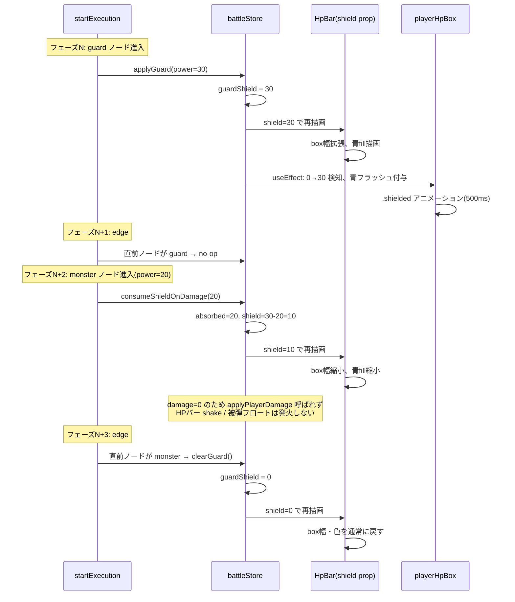
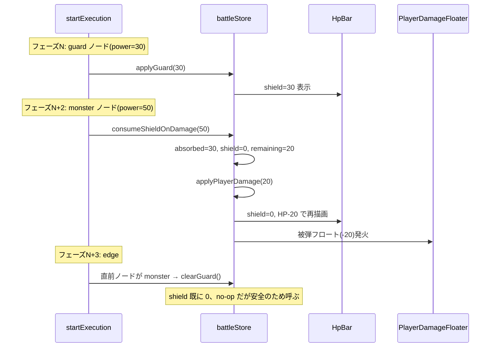
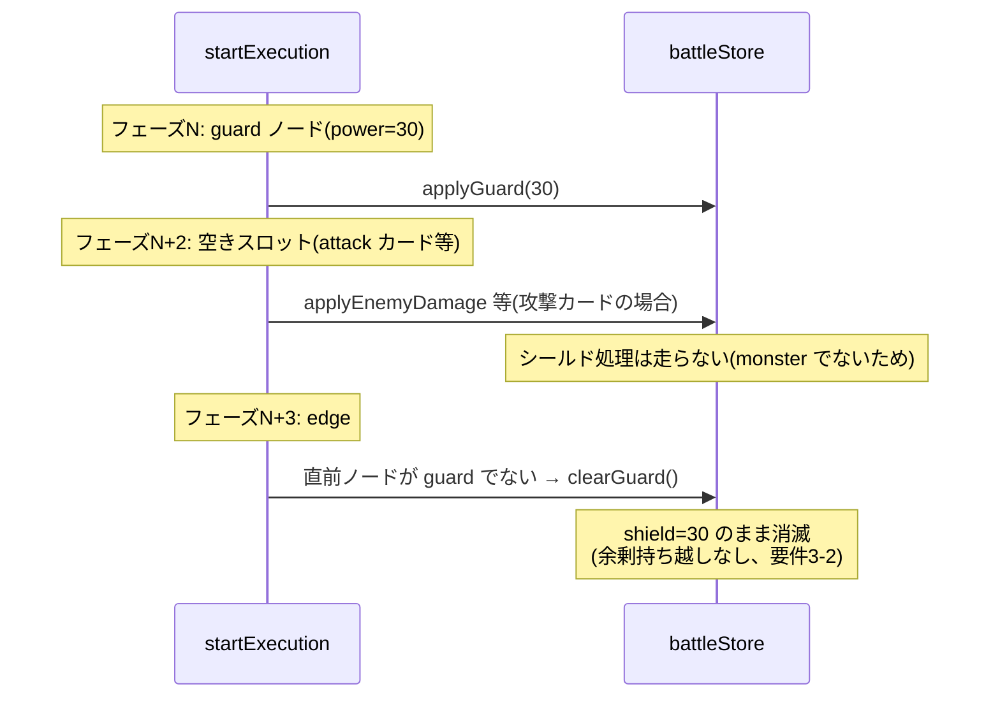

# 設計書: 防御カード効果（guard-card-effect）

## 概要

本機能は (1) `battleStore` に `guardShield` フィールドと関連アクションを追加し、(2) `startExecution` のフェーズ駆動ロジックに「防御カード通過時のシールド付与」「モンスターカード到達時のシールド消費」「エッジフェーズでのシールドクリア」を組み込み、(3) 既存の `HpBar` コンポーネントに `shield` プロパティを追加して box 幅と内部 fill を可変にする、という 3 つの柱で実装する。シールドの寿命管理は既存のフェーズ駆動モデル（`battle-fail-retry` 等で確立済み）に乗せ、「ノードフェーズで効果発火 → 次のエッジフェーズで残量クリア」というタイミング設計とする。これにより `setTimeout` の独自タイマーや状態フラグを増やさず、既存のフェーズ列の延長線上で完結する。

数値表示（`130 / 100` 形式）と青フラッシュ演出は `BattleScreen` の `playerHpBox` 領域に追加し、既存の被弾／ヒール演出（赤フラッシュ・緑フラッシュ）と同じパターンで統一感を保つ。

## アーキテクチャ

### コンポーネント

| コンポーネント | 責務 |
|---|---|
| `battleStore` | `guardShield` フィールドの状態管理。`applyGuard` / `consumeShieldOnDamage` / `clearGuard` アクションの提供 |
| `startExecution`（`battleStore` 内） | 各フェーズでカード種別を見て効果分岐。`guard` ノードで `applyGuard`、`monster` ノードで `consumeShieldOnDamage`、エッジで直前ノードに応じた `clearGuard` を判定 |
| `HpBar`（`components/HpBar.jsx`） | 既存の汎用コンポーネントに optional な `shield` プロパティを追加。box 幅可変、内部に通常 HP fill とシールド fill を併記 |
| `HpBar.module.css` | `.shield` クラス追加（青系カラー）、`.frame` の幅を CSS 変数 `--shield-scale` でスケーリング |
| `BattleScreen`（プレイヤー領域） | `guardShield` を購読し `<HpBar>` に渡す。数値表示を `(currentPlayerHp + guardShield) / maxPlayerHp` に変更。`guardShield` の正→正への変化を `useEffect` で検知して青フラッシュクラスを 500ms 付与 |
| `BattleScreen.module.css` | `.playerHpBox.shielded` クラス追加（青フラッシュアニメーション） |

### データモデル

`battleStore` の追加フィールド:

| フィールド | 型 | 初期値 | 説明 |
|---|---|---|---|
| `guardShield` | number | 0 | 現在のシールド残量。0 以上。`guard` ノード通過で `power` をセット、`monster` 被弾で `Math.min(shield, damage)` 分減算、エッジ通過で 0 クリア |

新規アクション:

| アクション | 引数 | 振る舞い |
|---|---|---|
| `applyGuard` | `amount: number` | `guardShield = amount` で上書き（累積しない）。要件 5 の連続防御カードに対応 |
| `consumeShieldOnDamage` | `amount: number` | シールド吸収量を計算してシールド減算、残ダメージを `applyPlayerDamage` で適用。シールド 0 のときは単に `applyPlayerDamage(amount)` を呼ぶだけ |
| `clearGuard` | なし | `guardShield = 0`。エッジフェーズで呼ばれる |

### API / インターフェース

**`HpBar.jsx`（拡張）:**

```js
function HpBar({ currentHp, maxHp, shield = 0 }) {
  // shield は optional、デフォルト 0 で従来挙動と完全互換
  // shield > 0 のとき:
  //   - box 幅を (maxHp + shield) / maxHp 倍に拡張
  //   - 内部に通常 fill（緑）と shield fill（青）を併記
}
```

**`battleStore` 新規アクションのシグネチャ:**

```js
applyGuard(amount: number) => void
consumeShieldOnDamage(amount: number) => void
clearGuard() => void
```

**`BattleScreen` 内での購読:**

```js
const guardShield = useBattleStore((s) => s.guardShield);
// 数値表示: {currentPlayerHp + guardShield}/{maxPlayerHp}
// HpBar 呼び出し: <HpBar currentHp={currentPlayerHp} maxHp={maxPlayerHp} shield={guardShield} />
// 青フラッシュ: useEffect で guardShield 変化を検知してクラス付与
```

## データフロー

### パターン 1: 防御カード → モンスターカード（シールド吸収）



### パターン 2: 防御カード → モンスターカード（軽減後ダメージあり）



### パターン 3: 防御カード → 空きスロット／別カード（シールド失効）



## 実装方針

### 1. `battleStore` への状態とアクション追加

**初期状態に追加:**
```js
guardShield: 0,
```

**`initializeBattle` の `set(() => ({...}))` 内に追加:**
```js
guardShield: 0,
```

**`retryFromFail` の `set((state) => ({...}))` 内に追加:**
```js
guardShield: 0,
```

**`startExecution.beginSequence` 開始時の `set((s) => ({...}))` 内に追加:**
```js
guardShield: 0,
```

**`applyPlayerDamage` の死亡検知ブロック（既存の `failPhase: 'shown'` セット箇所）に追加:**
```js
if (nextHp === 0 && state.isExecuting) {
  result.failPhase = 'shown';
  result.isExecuting = false;
  result.executionStep = null;
  result.currentPhaseMs = null;
  result.guardShield = 0;  // 追加：中断時にシールドもクリア
}
```

**新規アクション:**

```js
applyGuard: (amount) => set({ guardShield: amount }),

consumeShieldOnDamage: (amount) => {
  const shield = get().guardShield;
  if (shield > 0) {
    const absorbed = Math.min(shield, amount);
    const remaining = amount - absorbed;
    set({ guardShield: shield - absorbed });
    if (remaining > 0) {
      get().applyPlayerDamage(remaining);
    }
  } else {
    get().applyPlayerDamage(amount);
  }
},

clearGuard: () => set({ guardShield: 0 }),
```

### 2. `startExecution` のフェーズ処理拡張

既存の `phases.forEach((phase, i) => setTimeout(() => {...}, ...))` の `setTimeout` コールバック内、ノード／エッジ判定ブロックに以下を追加・変更する。

**ノードフェーズ:**

既存の `if (card && card.id === 'monster' && card.power > 0)` ブロックを `consumeShieldOnDamage` 呼び出しに差し替え、`guard` 分岐を新規追加する:

```js
if (phase.type === 'node') {
  const card = get().slotAssignments[phase.id];
  if (card && card.id === 'attack' && card.power > 0) {
    get().applyEnemyDamage(card.power);
  }
  if (card && card.id === 'monster' && card.power > 0) {
    get().consumeShieldOnDamage(card.power);  // 変更：シールド考慮
  }
  if (card && card.id === 'heal' && card.power > 0) {
    get().applyPlayerHeal(card.power);
  }
  if (card && card.id === 'guard' && card.power > 0) {
    get().applyGuard(card.power);  // 新規
  }
}
```

**エッジフェーズ（新規ブロック）:**

エッジフェーズでは「直前のノードが防御カードでなく、かつシールドが残っている」場合のみ `clearGuard()` を呼ぶ。これにより、防御カード自身の直後のエッジではシールドが維持され、次のノード（モンスター／空き／他カード）を通った後のエッジでシールドが消える。

```js
if (phase.type === 'edge') {
  const prevPhase = phases[i - 1];
  if (prevPhase && prevPhase.type === 'node') {
    const prevCard = get().slotAssignments[prevPhase.id];
    const isPrevGuard = prevCard && prevCard.id === 'guard';
    if (!isPrevGuard && get().guardShield > 0) {
      get().clearGuard();
    }
  }
}
```

### 3. `HpBar` の拡張（shield プロパティ）

CSS Custom Property（`--shield-scale`）でフレーム幅をスケーリングし、内部に通常 fill とシールド fill を併記する。

**`HpBar.jsx`:**
```jsx
function HpBar({ currentHp, maxHp, shield = 0 }) {
  if (maxHp == null || maxHp <= 0) {
    return null;
  }
  const clampedHp = Math.max(0, Math.min(maxHp, currentHp));
  const total = maxHp + Math.max(0, shield);
  const hpRatio = clampedHp / total;
  const shieldRatio = Math.max(0, shield) / total;
  const scale = total / maxHp;

  return (
    <div
      className={styles.frame}
      style={{ '--shield-scale': scale }}
    >
      <div className={styles.fill} style={{ width: `${hpRatio * 100}%` }} />
      {shield > 0 && (
        <div className={styles.shield} style={{ width: `${shieldRatio * 100}%` }} />
      )}
    </div>
  );
}
```

**`HpBar.module.css` 追加・変更:**
```css
.frame {
  width: calc(180px * var(--shield-scale, 1));
  /* 既存スタイルは維持 */
  transition: width 0.25s ease-out;
}

.fill {
  /* 既存維持 */
}

.shield {
  position: absolute;
  right: 0;
  top: 0;
  height: 100%;
  background: #4a8ef0;
  box-shadow: 0 0 6px rgba(120, 180, 255, 0.7);
  transition: width 0.25s ease-out;
}
```

`.frame` を `position: relative` にし、`.fill` を `position: absolute; left: 0` に、`.shield` を `position: absolute; right: 0` にすることで、左から HP、右からシールドの 2 セグメントを並べる構造にする。

### 4. `BattleScreen` の数値表示とフラッシュ演出

**プレイヤー HP 数値表示の変更（318-320 行目あたり）:**

数値表示を 2 つの `<span>` に分割し、分子部分（`currentPlayerHp + guardShield`）のみシールドありの状態で青色クラスを付与する。

```jsx
<span className={styles.hpText}>
  <span
    className={guardShield > 0 ? styles.hpNumeratorShielded : undefined}
  >
    {currentPlayerHp + guardShield}
  </span>
  /{maxPlayerHp}
</span>
```

`BattleScreen.module.css` に分子色用のクラスを追加:
```css
.hpNumeratorShielded {
  color: #6aaaff;
  text-shadow: 0 0 4px rgba(120, 180, 255, 0.6);
  transition: color 0.25s ease-out;
}
```

`color` プロパティに `transition` を効かせることで、シールドが付与／消滅する瞬間に青↔通常色が滑らかに切り替わる（要件 1-5, 1-6）。テキストシャドウは弱めの青系発光で、HpBar の `.shield` 領域の発光（`box-shadow: 0 0 6px rgba(120, 180, 255, 0.7)`）と色味を揃えて統一感を出す。

**プレイヤー HP バー呼び出しの変更（317 行目あたり）:**
```jsx
<HpBar currentHp={currentPlayerHp} maxHp={maxPlayerHp} shield={guardShield} />
```

**青フラッシュ演出（useEffect 方式）:**

`useEffect` で `guardShield` の値変化（特に 0 → 正の値）を検知し、`isShielded` フラグを 500ms 立てる。`playerHpBox` の className 配列に `isShielded && styles.shielded` を追加。

```js
const guardShield = useBattleStore((s) => s.guardShield);
const [isShielded, setIsShielded] = useState(false);
const prevGuardShieldRef = useRef(0);

useEffect(() => {
  if (guardShield > prevGuardShieldRef.current && guardShield > 0) {
    setIsShielded(true);
    const timer = setTimeout(() => setIsShielded(false), 500);
    prevGuardShieldRef.current = guardShield;
    return () => clearTimeout(timer);
  }
  prevGuardShieldRef.current = guardShield;
}, [guardShield]);
```

「前回値より増えたとき」のみフラッシュすることで、減算（吸収）やクリア時にはフラッシュしない（要件 6-5 を「付与時のフラッシュ」と解釈）。

**`BattleScreen.module.css` 追加:**
```css
.playerHpBox.shielded {
  animation: hpBoxShielded 500ms ease-out;
}

@keyframes hpBoxShielded {
  0%   { box-shadow: 0 0 0 0 rgba(120, 180, 255, 0); }
  30%  { box-shadow: 0 0 12px 4px rgba(120, 180, 255, 0.8); }
  100% { box-shadow: 0 0 0 0 rgba(120, 180, 255, 0); }
}
```

`isShielded` を `playerHpBox` の className 配列に追加:
```jsx
className={[
  styles.playerHpBox,
  isPlayerHit && styles.hit,
  isPlayerHealed && styles.healed,
  isShielded && styles.shielded,
].filter(Boolean).join(' ')}
```

## 依存関係

| パッケージ | 用途 | 導入済み？ |
|---|---|---|
| なし | 新規パッケージ不要 | - |

既存の `zustand`、React の `useEffect` / `useState` / `useRef`、既存の CSS Modules 体系のみで完結する。

## トレードオフと検討した代替案

- **決定内容**：`HpBar` 本体に `shield` プロパティを追加し、box 幅を可変にする
  **理由**：シールドは「HP バーの右側に連続して伸びる領域」という構造的な拡張であり、box 幅と内部 fill を 1 つのコンポーネントで管理した方が CSS のトランジション（`width 0.25s`）が同期する。座標計算や absolute positioning を BattleScreen 側に持ち込まずに済む。
  **検討した代替案**：
  - **代替 1: `playerHpBox` 内に独立した shield 要素を `absolute` で配置**：`HpBar` 本体に触らずに済むが、HpBar の右端の座標を JS で取得して shield 要素の位置を計算する必要があり、レイアウト変更時の追従が壊れやすい。
  - **代替 2: 新コンポーネント `PlayerHpBar` を作成し既存 HpBar をラップ**：階層が深くなるが「HpBar 本体に触らない」ポリシーは守れる。ただしシールドは HpBar の「構造的延長」なので、機能拡張のためのプロパティ追加は本体に乗せる方が意味的に正しいと判断。

- **決定内容**：`consumeShieldOnDamage` を独立アクションとして `battleStore` に追加する（`applyPlayerDamage` は変更しない）
  **理由**：`applyPlayerDamage` は将来 `reflect` の跳ね返しダメージ等、シールドを介さない経路からも呼ばれる可能性がある。シールド吸収は `monster` カードのフェーズ処理に固有のロジックなので、`startExecution` から呼ぶ専用アクションとして分離する。
  **検討した代替案**：
  - **代替 1: `applyPlayerDamage` 内でシールドを自動チェック**：すべてのダメージ経路がシールド経由になり、将来の経路追加で予期せぬ干渉が起きる。

- **決定内容**：シールドクリアを「エッジフェーズ進入時、直前ノードが guard でない場合」に行う
  **理由**：既存のフェーズ駆動モデル（`phases.forEach` の `setTimeout` 連鎖）にそのまま乗せられる。`setTimeout` を別途立てる必要がなく、`failPhase` の中断ガードもそのまま機能する。
  **検討した代替案**：
  - **代替 1: 独立タイマー（`setTimeout(clearGuard, phaseMs * 2)`）**：フェーズ駆動モデルから外れ、中断時に発火させないためのクリーンアップが必要になる。
  - **代替 2: ノードフェーズ進入時にクリア**：「防御カードの次のノードで消費／失効した後、その同じフェーズでクリア」のロジックになるが、フラッシュ演出や視覚的なシールド消費アニメーションを見せる時間が無くなる。

- **決定内容**：青フラッシュ演出を「`guardShield` の増加方向の変化のみ」発火する
  **理由**：シールド消費（減少）時には `monster` 被弾の演出（HP バー shake or シールド残量の縮小）で十分視覚的に伝わるため、青フラッシュは「新規付与」のシグナルに限定したい。要件 6-5 の「変動時」を厳密に解釈すると消費時も発火するが、UX 上は付与時のみが妥当と判断。
  **検討した代替案**：
  - **代替 1: 既存パターンに揃えて `guardShieldEvents` イベントキューを追加**：`playerDamageEvents` / `playerHealEvents` と同じ構造で実装できるが、シールドにはフローター表示が不要なのでキュー機構は過剰。`useEffect` + `useRef` で前回値を保持する軽量実装で十分。

## トレーサビリティ確認

| 要件 | 対応する設計セクション |
|---|---|
| 1-1（applyGuard 時に power をセット） | 実装方針 1（新規アクション `applyGuard`）、実装方針 2（`startExecution` の `guard` 分岐） |
| 1-2（power <= 0 で付与しない） | 実装方針 2（`card.power > 0` ガード） |
| 1-3（青い拡張領域表示） | 実装方針 3（`HpBar` の `.shield` 要素） |
| 1-4（数値表示 `(hp + shield) / max`） | 実装方針 4（プレイヤー HP テキストの 2 分割描画） |
| 1-5（分子のみ青色表示） | 実装方針 4（`hpNumeratorShielded` クラスを内側 `<span>` に条件付与） |
| 1-6（シールド消滅時に分子の色を戻す） | 実装方針 4（`guardShield > 0` 条件で 0 のときクラス不付与 + CSS `transition: color`） |
| 2-1（ダメージ = `Math.max(0, power - shield)`） | 実装方針 1（`consumeShieldOnDamage` のロジック） |
| 2-2（シールド減算、残量表示） | 実装方針 1（`shield - absorbed` で減算）、実装方針 3（`HpBar` の shield fill 縮小） |
| 2-3（damage 0 なら被弾演出なし） | 実装方針 1（`remaining > 0` ガードで `applyPlayerDamage` を呼ばない） |
| 2-4（damage > 0 なら applyPlayerDamage 発火） | 実装方針 1（`applyPlayerDamage(remaining)` 呼び出し） |
| 3-1（次のエッジで shield クリア） | 実装方針 2（エッジフェーズで `isPrevGuard` 判定後 `clearGuard`） |
| 3-2（モンスター以外なら失効） | 実装方針 2（`monster` 以外のカードでは `consumeShieldOnDamage` が呼ばれず、次のエッジで `clearGuard`） |
| 3-3（HP バー元に戻る） | 実装方針 3（`shield=0` で box 幅・色が元に戻る、CSS トランジション） |
| 4-1〜4-4（初期化・リセット時のクリア） | 実装方針 1（4 箇所への `guardShield: 0` 追加） |
| 5-1（連続防御で上書き） | 実装方針 1（`applyGuard` は `set({ guardShield: amount })` で上書き） |
| 6-1〜6-4（青い拡張領域の表示仕様） | 実装方針 3（`HpBar` の `.shield` 要素 + CSS Custom Property） |
| 6-5（青フラッシュ演出） | 実装方針 4（`isShielded` フラグ + `.shielded` キーフレーム） |
| 7-1〜7-5（既存システムとの整合） | 実装方針 1〜4（既存の `applyEnemyDamage` / `applyPlayerHeal` / `applyPlayerDamage` には触れない、フェーズ駆動と中断ガードを維持） |
