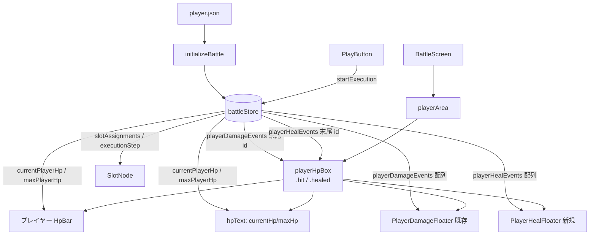
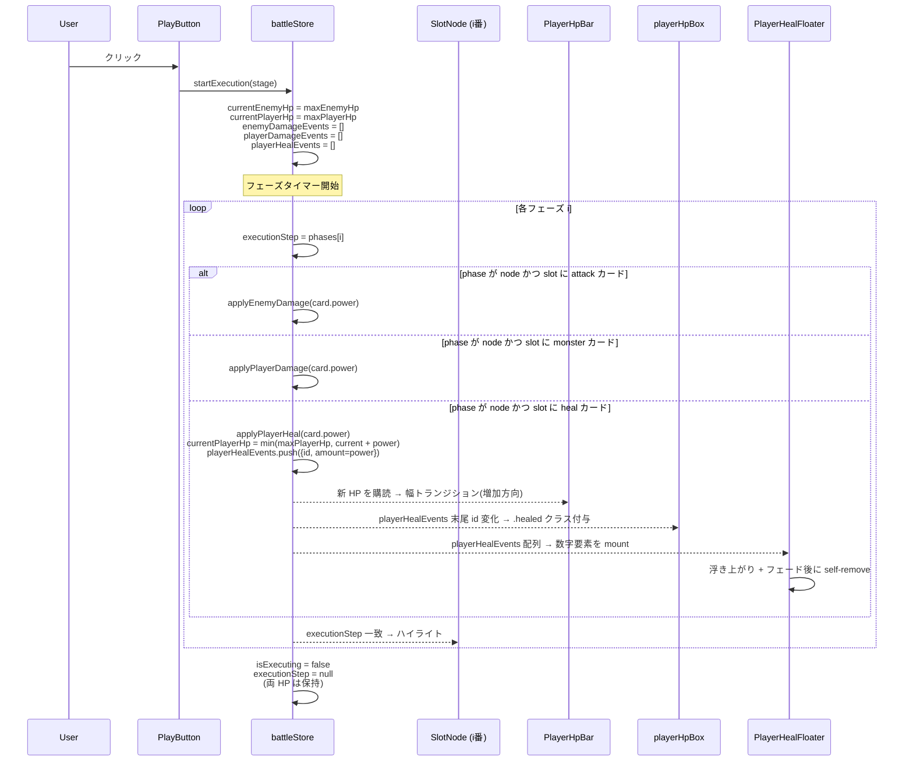

# 設計書: ヒールカード処理（HP回復と演出）

## 概要

`requirements.md` で定義したヒールカード処理を、`battleStore` のフェーズタイマーと `playerHpBox` の演出レイヤに、`monster-attack` で確立した「プレイヤー側演出パイプライン」と対称な形で接続する。中心となる設計判断は次の 4 点。

1. **回復ロジックは `applyPlayerDamage` の鏡像として `applyPlayerHeal(amount)` を新設**: 既存の `applyEnemyDamage` ／ `applyPlayerDamage` と命名・構造を揃え、加算 + `maxPlayerHp` クランプ + 演出キュー push を 1 メソッドで担う。減算用と加算用を 1 メソッドに兼ねさせない（負の amount を渡す等の暗黙慣習を避け、呼び出し側の意図を明示する）。
2. **演出キューは被弾とは別配列で持つ（`playerHealEvents`）**: 被弾用の `playerDamageEvents` と分離することで、フロート文字色（赤 / 緑）・フラッシュアニメーション（shake あり / なし）・購読側コンポーネント（`PlayerDamageFloater` / `PlayerHealFloater`）の独立性を保つ。同フェーズに被弾と回復が同時発生することは仕様上ないため、配列を 1 本に統合してタグで識別する選択肢は採らない（命名と購読箇所が複雑になる対価が大きい）。
3. **回復は `startExecution` のフェーズタイマー内に既存の `if` 並列構造で 1 行ずつ追加する**: `attack` / `monster` の隣に `card.id === 'heal'` 分岐を追加するだけ。順序依存の `else if` チェーンは使わない。
4. **満タン時でも演出は再生する（要件 2-3, 4-4）**: `applyPlayerHeal` は HP がクランプで動かなくても `playerHealEvents` に `card.power` を必ず push する。これにより「heal カードを通ったが HP が満タンだったから増えなかった」という結果を視覚的に追える。プログラミング学習として「実行されたが効果がなかった」を黙示しないことが重要。

本設計は要件 1〜6 をすべて満たし、既存の `attack-processing` / `monster-attack` / `play-button` / `flowchart-zoom` / `victory-clear` の挙動には変更を入れない（追加と既存 if 構造への 1 分岐追記のみ）。

## アーキテクチャ

### コンポーネント構成図



### データフロー（実行 → 回復適用 → 演出）



### 1 ヒール分の演出タイミング

```
  T=0ms                                                T=phaseMs
  │                                                    │
  ├─ executionStep = {node, slot-i (heal)}
  ├─ applyPlayerHeal(power)
  │    ├─ プレイヤー HP バー幅: 0.25s ease-out で新比率へ（増加）
  │    ├─ playerHpBox .healed: 0.3s で 1 回（緑系フラッシュ・shake なし）
  │    └─ PlayerHealFloater: 「+N」を 0.8s で上昇＋フェードアウト
  │                                                    │
  │                                                    └ 自己 unmount
  ├─ SlotNode .active: 0.3s × 2 alternate（既存）
  └────────────────────────────── 次フェーズへ
```

被弾演出（`hpBoxHit` 0.3s）と同等のタイムスケールで揃え、ユーザーが「ヒットも回復も同じテンポで起きる」と知覚できるようにする。

## データモデル

新しい JSON フォーマットは導入しない。`stages.json` の各ステージ `cards` 配列に既に `{ "id": "heal", "power": N }` が含まれており、`public/cards/heal.png` も配置済み。本スペック範囲では `stages.json` / `player.json` / カード画像群いずれも変更しない。

`CardInstance` 型・スロット ID 規約・`lockedCard` スキーマも無変更。`heal` カードは `attack` / `guard` と同様、ユーザーが手札から自由にスロットへ配置するカード（ロック対象ではない）。

## 状態管理（`battleStore` の拡張）

### 追加する state

| キー                  | 型                                  | 初期値 | 更新タイミング                                                                                |
| --------------------- | ----------------------------------- | ------ | --------------------------------------------------------------------------------------------- |
| `playerHealEvents`    | `Array<{id:string, amount:number}>` | `[]`   | 回復処理毎に `push`、`initializeBattle` と `startExecution` 開始時にクリア                    |
| `_playerHealCounter`  | `number`                            | `0`    | `applyPlayerHeal` 毎に +1（React `key` 用、内部のみ）                                         |

`currentPlayerHp` / `maxPlayerHp` は `monster-attack` 仕様で既に store に存在しているため、本仕様では追加しない。回復は `currentPlayerHp` を `maxPlayerHp` 上限でクランプして加算する形で扱う。

### 追加・変更するアクション

#### `initializeBattle(stage)` の拡張（要件 6-1）

`playerHealEvents` のクリアを 1 行追加するのみ。他の挙動（敵 HP 初期化、ロックカード復元、`victoryPhase` リセット等）は無変更。

```js
initializeBattle: (stage) => {
  const enemy = enemiesData.enemies.find((e) => e.id === stage.enemyId);
  const maxEnemyHp = enemy?.maxHp ?? 0;
  const maxPlayerHp = playerData.maxHp ?? 0;
  set(() => ({
    handCards: expandHandCards(stage.cards ?? []),
    slotAssignments: buildSlotAssignmentsFromStage(stage),
    activeInstanceId: null,
    maxEnemyHp,
    currentEnemyHp: maxEnemyHp,
    enemyDamageEvents: [],
    maxPlayerHp,
    currentPlayerHp: maxPlayerHp,
    playerDamageEvents: [],
    playerHealEvents: [],          // 追加
    victoryPhase: null,
  }));
}
```

#### `startExecution(stage)` の拡張（要件 1-1, 1-3, 1-4）

`beginSequence` 冒頭の state リセットに `playerHealEvents: []` を 1 行追加。フェーズタイマー内に `card.id === 'heal'` 分岐を追加する。既存の `attack` / `monster` 分岐の隣に同形で並べる。

```js
const beginSequence = () => {
  const phases = buildExecutionPath(stage);
  const totalMs = stage.slots.length * EXECUTION_PER_CARD_MS;
  const phaseMs = totalMs / phases.length;

  set((s) => ({
    isExecuting: true,
    currentPhaseMs: phaseMs,
    currentEnemyHp: s.maxEnemyHp,
    enemyDamageEvents: [],
    currentPlayerHp: s.maxPlayerHp,
    playerDamageEvents: [],
    playerHealEvents: [],           // 追加
  }));

  phases.forEach((phase, i) => {
    setTimeout(() => {
      set({ executionStep: phase });
      if (phase.type === 'node') {
        const card = get().slotAssignments[phase.id];
        if (card && card.id === 'attack' && card.power > 0) {
          get().applyEnemyDamage(card.power);
        }
        if (card && card.id === 'monster' && card.power > 0) {
          get().applyPlayerDamage(card.power);
        }
        // 要件 1-1, 1-3, 1-4: heal カードのフェーズで applyPlayerHeal
        if (card && card.id === 'heal' && card.power > 0) {
          get().applyPlayerHeal(card.power);
        }
      }
    }, i * phaseMs);
  });
  setTimeout(() => {
    set({ isExecuting: false, executionStep: null, currentPhaseMs: null });
    if (get().currentEnemyHp === 0) {
      get().startVictorySequence(stage.enemyId);
    }
  }, phases.length * phaseMs);
};
```

`if/if` の並列構造を維持することで「カード種別が 1 つ増えただけ」の追加に留まる。`else if` チェーン化はしない。

#### 新規アクション `applyPlayerHeal(amount)`（要件 1-1, 2-1, 4-4）

```js
applyPlayerHeal: (amount) => set((state) => {
  const nextHp = Math.min(state.maxPlayerHp, state.currentPlayerHp + amount);
  const id = `ph-${state._playerHealCounter}`;
  return {
    currentPlayerHp: nextHp,
    playerHealEvents: [...state.playerHealEvents, { id, amount }],
    _playerHealCounter: state._playerHealCounter + 1,
  };
})
```

設計上のポイント：

- **`maxPlayerHp` クランプ**（要件 2-1）: `Math.min(...)` で担保。`Math.max` は使わない（負の `amount` が来ない前提・ガードは `startExecution` 側 `card.power > 0` で済んでいる）。
- **満タン時も演出キューに push する**（要件 2-3, 4-4）: 演出側のキー判定は `playerHealEvents` 末尾の `id` 変化に依存する。HP が動かなくても `id` を進めれば演出だけ発火する。`amount` には実際の HP 増加分ではなく **カードの `power` 値そのまま** を保存する（要件 4-4：「`+<power>` をそのまま表示」）。
- **ID プレフィックス `ph-`**: 敵被弾 `d-` / プレイヤー被弾 `pd-` と区別するため `ph-`（player heal）。React `key` の衝突を防ぎ、デバッガで読んだときも由来がわかる。

#### 新規アクション `dismissPlayerHealEvent(id)`

```js
dismissPlayerHealEvent: (id) => set((state) => ({
  playerHealEvents: state.playerHealEvents.filter((e) => e.id !== id),
}))
```

`PlayerHealFloater` の各浮き数字が `onAnimationEnd` で呼び出して自身を unmount する。被弾側 `dismissPlayerDamageEvent` と完全対称。

### state リセット境界の整理

| イベント                                | `currentPlayerHp` | `playerHealEvents` |
| --------------------------------------- | ----------------- | ------------------ |
| 戦闘画面マウント (`initializeBattle`)   | `maxHp` で初期化  | `[]`               |
| 実行開始 (`startExecution`)             | `maxHp` に復帰    | `[]`               |
| 実行完了                                | 保持（結果値）    | 演出が終わるまで残り、各要素が自分で `dismiss` |
| リセットボタン (`initializeBattle` 経由) | `maxHp` で初期化  | `[]`               |
| 拡大トグル                              | 触らない          | 触らない           |

被弾と完全対称。`monster-attack` 仕様の HP リセット境界をそのまま踏襲する（要件 6-1, 6-6）。

## コンポーネント設計

### 1. `BattleScreen.jsx` の改修

`playerHpBox` の className に `.healed` クラスを追加できるよう、`isPlayerHealed` 派生計算と `PlayerHealFloater` のマウントを足す。`onAnimationEnd` の責務分岐に `event.animationName` 判定を導入する点が唯一の構造変更。

```jsx
// 既存
const lastPlayerDamageId = useBattleStore(
  (s) => s.playerDamageEvents.at(-1)?.id ?? null,
);
const [consumedPlayerDamageId, setConsumedPlayerDamageId] = useState(null);
const isPlayerHit = lastPlayerDamageId !== null && lastPlayerDamageId !== consumedPlayerDamageId;

// 追加
const lastPlayerHealId = useBattleStore(
  (s) => s.playerHealEvents.at(-1)?.id ?? null,
);
const [consumedPlayerHealId, setConsumedPlayerHealId] = useState(null);
const isPlayerHealed = lastPlayerHealId !== null && lastPlayerHealId !== consumedPlayerHealId;
```

`playerHpBox` の className とハンドラを書き換える：

```jsx
<div
  className={[
    styles.playerHpBox,
    isPlayerHit && styles.hit,
    isPlayerHealed && styles.healed,
  ].filter(Boolean).join(' ')}
  onAnimationEnd={(event) => {
    if (event.animationName === styles.hpBoxHit || event.animationName === 'hpBoxHit') {
      setConsumedPlayerDamageId(lastPlayerDamageId);
    } else if (event.animationName === styles.hpBoxHealed || event.animationName === 'hpBoxHealed') {
      setConsumedPlayerHealId(lastPlayerHealId);
    }
  }}
>
  <HpBar currentHp={currentPlayerHp} maxHp={maxPlayerHp} />
  <span className={styles.hpText}>
    {currentPlayerHp}/{maxPlayerHp}
  </span>
  <PlayerDamageFloater />
  <PlayerHealFloater />
</div>
```

#### `event.animationName` 判定にする理由

CSS Modules はキーフレーム名もハッシュ化するが、`onAnimationEnd` の `event.animationName` には **ハッシュ後の実際のアニメ名** が入る。CSS Modules で `@keyframes hpBoxHit` を書いた場合、`animation-name` プロパティ参照側では `composes` 規則上モジュール固有の名前で出力される。Vite + CSS Modules の挙動上、JSX 側からは `styles.hpBoxHit` で同じハッシュ値を取得できる（`@keyframes` 名もエクスポートに載る）。

万が一バンドラ設定差で `styles.hpBoxHit` が `undefined` になる環境を想定して、上記コードでは **論理 OR で生のキーフレーム名 `'hpBoxHit'` も併記** する保険ガードを入れている。

> 補足: 簡易な代替として「`isPlayerHit` と `isPlayerHealed` を 1 つの consumed 状態でまとめて進める」設計もありえるが、両者が同時に true になるとどちらの id を consumed に進めるべきか曖昧になる。実際には heal と被弾が同フェーズに同居することは仕様上ない（同一スロットには 1 種類のカードしか乗らない）が、配列は別なので id 系列が独立する。`event.animationName` で分岐するのが最もシンプルかつ正確。

#### 既存 `playerArea` レイアウトとの衝突回避

`playerHpBox` は既に `position: relative; flex-shrink: 0` を持っており、`PlayerDamageFloater` が絶対配置で重なっている。`PlayerHealFloater` も同様に `position: absolute; inset: 0; pointer-events: none;` で重ねるため、レイアウトに副作用は出ない（要件 3-3, 6-4）。

### 2. `PlayerHealFloater.jsx`（新規、要件 4-1, 4-2, 4-3, 4-5）

`playerDamageEvents` 用の `PlayerDamageFloater` と完全対称。文字色だけ緑系にし、文字記号を `+` にする。

#### コードスケッチ

```jsx
function PlayerHealFloater() {
  const playerHealEvents = useBattleStore((s) => s.playerHealEvents);
  const dismiss = useBattleStore((s) => s.dismissPlayerHealEvent);

  return (
    <div className={styles.layer}>
      {playerHealEvents.map((e) => (
        <span
          key={e.id}
          className={styles.number}
          onAnimationEnd={() => dismiss(e.id)}
        >
          +{e.amount}
        </span>
      ))}
    </div>
  );
}
```

配置場所は `frontend/src/features/battle/player/PlayerHealFloater.jsx`（既存の `PlayerDamageFloater.jsx` と同ディレクトリ）。

#### CSS（`PlayerHealFloater.module.css`、新規）

`PlayerDamageFloater.module.css` の構造を流用しつつ、文字色を緑系に変える。キーフレームは同一形状（上昇＋フェード）。

```css
.layer {
  position: absolute;
  inset: 0;
  pointer-events: none;
  display: flex;
  align-items: center;
  justify-content: center;
}

.number {
  position: absolute;
  font-family: 'Press Start 2P', 'Courier New', Courier, monospace;
  font-size: 1.25rem;
  color: #7dff7d;                    /* 緑系（被弾の #ff5d5d と対称） */
  text-shadow: 0 0 4px #000, 0 2px 0 #000;
  animation: healFloat 0.8s ease-out forwards;
}

@keyframes healFloat {
  0%   { transform: translateY(0)     scale(1.0);  opacity: 1; }
  20%  { transform: translateY(-12px) scale(1.15); opacity: 1; }
  100% { transform: translateY(-48px) scale(1.0);  opacity: 0; }
}
```

`@keyframes` 名は被弾側 `damageFloat` と区別するため `healFloat` にする。これで仮に同フェーズで両方発火する状況になっても、各 `<span>` のアニメは独立して終了する（要件 4-5）。

> 補足: 既存 `PlayerDamageFloater.module.css` のキーフレームと内容が同一なので、共通モジュール化（例 `frontend/src/features/battle/floaters/floater.module.css`）の選択肢もある。`monster-attack` 設計でも「重複コードが許容範囲を超えたら別タスクで共通化する」というスタンスが採られている。本仕様も追加スコープ最小化を優先し、CSS は重複させる。共通化は floater が 4 種類目以降に増えたタイミングで再検討する。

### 3. プレイヤー HP バーの回復フラッシュ演出（要件 3-1, 3-2, 3-3, 3-4）

`playerHpBox` 自体が `playerHealEvents` の末尾 ID を購読し、変化したら `.healed` クラスを 1 ショット付与する。`onAnimationEnd` でクラスを外し、次の回復でも再発火できるようにする。

#### 設計のポイント

- **演出はラッパー（`playerHpBox`）にかける**: HP バー本体（共通 `HpBar.jsx`）には手を入れない。被弾演出と同じ流儀。
- **shake は使わない**: 被弾の `hpBoxHit` は `translateX` で揺らすが、回復は「染み込む」イメージで揺れない方が自然。要件 3-3「位置・サイズ・既存レイアウトを変更しない」「演出は重ね描き」とも整合する。
- **既存の `HpBar` の `transition: width 0.25s ease-out`** はそのまま生きるので、HP の数値増加はバー側で滑らかに伸び（要件 5-1）、ラッパーの緑フラッシュは回復の瞬間にのみ走る。両者が独立して機能する。
- **1 つの `@keyframes` に合成する**: 被弾の `hpBoxHit` と同じ流儀で、`filter` 系プロパティを 1 キーフレームにまとめる（再発火タイミングの取り扱いを単純化）。

#### CSS（`BattleScreen.module.css` への追加）

```css
.playerHpBox.healed {
  animation: hpBoxHealed 0.3s ease-out 1;
}

@keyframes hpBoxHealed {
  0%   { filter: brightness(1)    saturate(1)   hue-rotate(0deg); }
  20%  { filter: brightness(1.35) saturate(1.6) hue-rotate(20deg); }
  50%  { filter: brightness(1.4)  saturate(1.7) hue-rotate(25deg); }
  80%  { filter: brightness(1.2)  saturate(1.3) hue-rotate(15deg); }
  100% { filter: brightness(1)    saturate(1)   hue-rotate(0deg); }
}
```

`hue-rotate(+20〜+25deg)` で HpBar のグリーン塗りをより鮮やかな緑に寄せる。`brightness/saturate` を上げることで「光る」感を演出。`translateX` は使わないため UI が揺れない（要件 3-3）。

被弾用の `hpBoxHit` と排他的にしか付かないので、両クラスが同時に乗っても挙動は分岐に依存しない。万が一同フェーズで両方付与されたとしても、`animation` は最後に評価された側が走るが、これは仕様上発生しないため考慮しない。

### 4. `PlayerDamageFloater` への変更は **なし**

被弾側のフローター・赤フラッシュは無変更。`playerHealEvents` を購読するのは新規 `PlayerHealFloater` のみで、既存コンポーネントの責務に手を入れない。

### 5. `Card.jsx` への変更は **なし**

`heal` カードは画像 `public/cards/heal.png` が既に存在し、`` で自動的に表示される。`monster` のような placeholder 分岐は不要。

### 6. `HpBar.jsx` / `HpBar.module.css` への変更は **なし**

既存の `transition: width 0.25s ease-out` は減少方向と増加方向の両方に効く（CSS Transition は値変化の方向を区別しない）。本仕様では HP 増加方向の補完アニメーションが自動で得られるため、`HpBar` 本体には手を入れない（要件 5-1）。

## ファイル変更一覧

| ファイル | 変更内容 | 種別 |
|---|---|---|
| `frontend/src/stores/battleStore.js` | state 2 件追加（`playerHealEvents` / `_playerHealCounter`）、`initializeBattle` の `set` 内に `playerHealEvents: []` を追加、`startExecution.beginSequence` の `set` 内に同上を追加、フェーズタイマー内に `heal` 分岐追加、`applyPlayerHeal` / `dismissPlayerHealEvent` 追加 | 編集 |
| `frontend/src/features/battle/BattleScreen.jsx` | `lastPlayerHealId` / `consumedPlayerHealId` / `isPlayerHealed` 派生計算追加、`playerHpBox` の className に `.healed` 条件付与、`onAnimationEnd` で `event.animationName` 分岐、`PlayerHealFloater` を `playerHpBox` 内にマウント、import 追加 | 編集 |
| `frontend/src/features/battle/BattleScreen.module.css` | `.playerHpBox.healed` ルール追加、`@keyframes hpBoxHealed` 追加 | 編集 |
| `frontend/src/features/battle/player/PlayerHealFloater.jsx` | 新規作成 | 新規 |
| `frontend/src/features/battle/player/PlayerHealFloater.module.css` | 新規作成 | 新規 |

`stages.json` / `player.json` / `cards/heal.png` / `Card.jsx` / `HpBar.jsx` / `PlayerDamageFloater*` は無変更。`features/battle/player/` ディレクトリは既存（`monster-attack` で新設済み）なので `README.md` のディレクトリ構造表も更新不要。

## エラーハンドリング・エッジケース

| ケース                                                       | 挙動                                                                                                  |
| ------------------------------------------------------------ | ----------------------------------------------------------------------------------------------------- |
| `card.power` が `0` または欠損                               | `startExecution` 内ガード `card.power > 0` で `applyPlayerHeal` 呼び出し前に弾く。`playerHealEvents` は積まれない。演出も起きない（要件 1-4）。 |
| プレイヤー HP が既に `maxPlayerHp` で heal カード通過        | `Math.min` で `currentPlayerHp` は変化なし。ただし `playerHealEvents` には `card.power` 値で push されるので緑フラッシュと「+N」フロートは通常通り再生される（要件 2-3, 4-4）。 |
| プレイヤー HP が 0 の状態で heal カード通過                  | `0 + power` を `maxPlayerHp` でクランプ。複活する。敗北判定は別仕様で扱われていないので、HP=0 中の経過状態として違和感なく挙動する。 |
| 同フェーズで attack も heal も判定（理屈上不可）             | `slotAssignments[phase.id]` は単一カード。`if (card.id === 'attack')` と `if (card.id === 'heal')` は同時には満たされない。 |
| 連続する heal カード（同実行内で 2 枚以上通過）              | 各フェーズでそれぞれ `applyPlayerHeal` が走り、`playerHealEvents` に独立した要素が push されるので干渉しない（要件 4-5）。 |
| `onAnimationEnd` でアニメ名が想定外                          | `event.animationName` が `hpBoxHit` でも `hpBoxHealed` でもなければ何もしない（既存・新規どちらの consumed id も進めない）。今後別のアニメを `playerHpBox` に追加した場合、ここに分岐を 1 つ増やせば済む。 |
| ヒール演出の途中でユーザーが画面遷移（マップへ戻る等）       | 戦闘画面アンマウント＝store も初期値に戻る。次回マウントで `initializeBattle` が走り、`playerHealEvents = []` でクリーンスタート。 |
| `playerHealEvents` の `onAnimationEnd` が発火しない（タブ非表示等） | 演出が残り続けても次の `startExecution` で `playerHealEvents = []` クリアにより自然に消える。被弾側と同じ挙動。 |
| HMR / ステージ切替で `playerHealEvents` の残骸              | `initializeBattle` で空配列に戻すので持ち越されない。                                                  |

## テスト戦略

人手で確認する。`vitest` 等は既存に未導入のため、本スペックでも導入はしない。確認項目は `tasks.md` のサニティチェックに記載する。

主要シナリオ:

1. **単発回復（HP 削れた状態から）**: 1-2 ステージで `slot-1` に attack カード、`slot-2` がモンスター（power 50）、`slot-3` に `heal:5` を配置 → 実行 → モンスター通過で HP `100 → 50`、heal 通過で HP `50 → 55`、HP バーが滑らかに増加、緑フラッシュ + 「+5」のフロート表示。
2. **オーバーヒール（満タン超え）**: 1-1 ステージで `slot-1`〜`slot-3` に全部 `heal` を置いて実行 → HP は `100/100` から動かないが、各スロット通過で緑フラッシュ + 「+12」「+3」など `power` 値そのままのフロートが順次表示される（要件 2-3, 4-4）。
3. **HP=0 からの復活**: 1-2 ステージで `slot-1` `slot-3` を空けて、モンスター通過で HP=50 → さらに別検証で 200 ダメージ程度のシナリオを手動で作って HP=0 に → 後続スロットに `heal:12` を置いて実行 → HP `0 → 12`、緑演出が走る。
4. **連続回復**: 1-1 ステージで `heal:12 / heal:3 / heal:12` を 3 スロット全部に置き、最初のフェーズで HP を強制的に削った仮想シナリオ（既存 `attack` 経路では現実には作れないので、開発者が一時的にシード初期値を `currentPlayerHp = 30` に変更して確認）→ 各回復が時系列で滑らかに反映される。
5. **再実行で HP 復帰**: シナリオ 1 を実行後、再度実行ボタン → 開始時に `100/100` に戻り、再度同じ結果が再現される。
6. **リセットボタン**: 配置済みの `heal` カードがあるとき、リセットボタン → 手札に戻る。HP は触られない。`heal` カードは `lockedCard` ではないので普通の attack / guard と同じ挙動。
7. **拡大時実行**: 拡大状態で実行ボタン → 縮小トランジション後にシーケンス開始、緑フラッシュ・「+N」フロート・HP バー増加が崩れない。
8. **既存 attack/monster への副作用なし**: 1-2 でモンスター被弾・1-1〜1-4 の attack 演出が以前どおり動く。`event.animationName` 分岐ハンドラの導入で被弾の `consumedPlayerDamageId` 進行が壊れていないか確認。
9. **マップへ戻る → 再戦闘**: ヒール演出の途中でマップへ戻り、再度戦闘画面へ → 初期化が正しく走り、`playerHealEvents` の残骸が無いことを確認。

## 要件への対応マトリックス

| 要件 | 対応箇所                                                                                                         |
| ---- | ---------------------------------------------------------------------------------------------------------------- |
| 1-1  | `startExecution` のフェーズタイマー内で `card.id === 'heal'` をチェックし `applyPlayerHeal(card.power)`           |
| 1-2  | 同上、`'heal'` 以外は分岐に入らないので適用されない                                                              |
| 1-3  | ハイライト発火と同じ `setTimeout` コールバック内で `applyPlayerHeal` → 演出起点が同期                            |
| 1-4  | 分岐条件 `card.power > 0` で 0 / 欠損を弾く                                                                       |
| 2-1  | `applyPlayerHeal` の `Math.min(state.maxPlayerHp, …)` クランプ                                                    |
| 2-2  | `Math.min` の結果として満タン時は `currentPlayerHp` が変化しない                                                  |
| 2-3  | `applyPlayerHeal` は HP 変化なしでも `playerHealEvents` に必ず push する → 緑フラッシュ・フロート表示が通常再生される |
| 3-1  | `playerHpBox.healed` クラスで `hpBoxHealed` アニメを 1 ショット起動                                              |
| 3-2  | `hpBoxHealed` キーフレームを 0.3s で 1 回（被弾の `hpBoxHit` と同等タイムスケール）                              |
| 3-3  | `hpBoxHealed` は `filter` 系のみで `translate` を使わない → 位置・サイズ・既存レイアウト不変                      |
| 3-4  | 緑系の `hue-rotate(+20〜+25deg)` + `brightness/saturate` で緑寄せ（被弾の赤系・敵側の白系フラッシュと識別可能）   |
| 4-1  | `PlayerHealFloater` が `playerHealEvents` 配列をマップして `<span>+{amount}</span>` を並べる                     |
| 4-2  | `healFloat` キーフレームで 0.8s の上昇＋フェード（被弾側 `damageFloat` と対称）                                 |
| 4-3  | `.number` の `color: #7dff7d`（緑系、被弾の `#ff5d5d` と対比）                                                    |
| 4-4  | `applyPlayerHeal` で `amount = card.power` を `playerHealEvents` に push（実際の HP 変化量ではなく `power` をそのまま表示） |
| 4-5  | 各 `<span>` が独立 `key`（`ph-${counter}`）で独立 animation                                                      |
| 5-1  | 既存 `HpBar.module.css` の `transition: width 0.25s ease-out` が増加方向にも適用される（CSS Transition は方向不問） |
| 5-2  | `HpBar` と `.hpText` は同じ store 値（`currentPlayerHp` / `maxPlayerHp`）を購読                                  |
| 6-1  | リセットボタンは `initializeBattle` を呼ぶだけ。`playerHealEvents` も `[]` に戻り、HP は `maxHp` 初期化される（既存仕様維持） |
| 6-2  | 拡大トグル / ドラッグは `currentPlayerHp` / `playerHealEvents` を変更しない                                       |
| 6-3  | `slotAssignments` / `handCards` の挙動は無変更                                                                    |
| 6-4  | プレイヤー HP バー数値・回復演出・回復数字は `playerHpBox` 内の絶対配置で完結し、`flowchartArea` の拡大には影響を受けない |
| 6-5  | `applyEnemyDamage` ／ `applyPlayerDamage` ／ それらの演出は無変更。`startExecution` の `attack` / `monster` 分岐も無変更で、隣に `heal` 分岐を追加するのみ |
| 6-6  | `startExecution.beginSequence` 冒頭の HP リセット時に `currentPlayerHp = maxPlayerHp`、`playerHealEvents = []` も合わせてクリア → リセット後の `maxPlayerHp` 状態から回復処理が走る |

## トレードオフと検討した代替案

- **決定内容**: 演出キューを `playerDamageEvents` と `playerHealEvents` で分離する。
  **理由**: 文字色・記号（`-` vs `+`）・フラッシュアニメ（shake あり vs なし）・購読側コンポーネントが完全に異なる。1 配列に統合してタグで識別するより、配列とコンポーネントを分けた方が責務が明確。
  **検討した代替案**: `playerEffectEvents: Array<{type:'damage'|'heal', amount, id}>` の単一配列で持ち、`PlayerEffectFloater` がタイプで分岐描画する。理論上シンプルだが、CSS クラスの動的切替・キーフレーム名の動的切替が必要になり、コンポーネント内の分岐が増える。現状の演出種類は 2 つだけで、3 つ目（毒・バフ等）が将来必要になっても各々別配列で増やせば済む。配列分離の方が拡張性も保つ。

- **決定内容**: `applyPlayerHeal` を独立アクションとして新設し、`applyPlayerDamage` を再利用しない（負の amount を渡さない）。
  **理由**: 「HP を減らす」と「HP を増やす」は意味的に別の操作で、クランプ境界（`0` か `maxHp` か）も異なる。1 メソッドで兼ねると `if (amount < 0) Math.min(maxHp, ...) else Math.max(0, ...)` のような分岐を中に持つことになり、呼び出し側の意図が読み取りづらくなる。`startExecution` のタイマー内での分岐コードと一対一対応させる方が「カード種別 → 関数」のマッピングが明示される。
  **検討した代替案**: `applyPlayerHpDelta(amount)` を 1 つだけ持ち、heal は正、damage は負を渡す。ID プレフィックスや push 先も 1 統合する。コード行数は減るが、意図の読み取りやすさが下がる。`monster-attack` 設計でも `applyPlayerDamage` を独立アクションにしているので、本仕様もその流儀を踏襲する。

- **決定内容**: 回復フラッシュは shake なしの緑系のみで、被弾側の `hpBoxHit` を hue-rotate で再利用しない。
  **理由**: 被弾は「衝撃を受けた」感を出すため shake が効くが、回復は「染み込む」感の方がイメージに合う。要件 3-3「位置・サイズ・既存レイアウトを変更しない」「演出は重ね描き」とも整合する。`translate` を使わないことで、フローター類との空間関係も保たれる。
  **検討した代替案**: `hpBoxHit` のキーフレームを共通化し、`.hit` `.healed` でフィルタの hue-rotate 値だけ差し替える。CSS が短くなるが、shake の有無を演出意図に合わせて分けたい本仕様では合わない。被弾と回復で `@keyframes` を 2 つ持つ追加コストは小さく、それぞれの演出を独立に調整できる柔軟性の方が価値が高い。

- **決定内容**: `onAnimationEnd` ハンドラ内で `event.animationName` で分岐する。
  **理由**: `playerHpBox` に `.hit` `.healed` の 2 種類のアニメーションが付き得る。1 つの consumed 状態で兼ねると、2 つのアニメ完了タイミングが交錯したときに id 進行を間違える。アニメ名で分岐すれば各演出の id 系列が独立して進む。
  **検討した代替案**: ラッパーを 2 重にする（外側 `playerHpBox` に `.hit`、内側 `playerHpHealEffectLayer` に `.healed`）。DOM が増えてレイアウトに影響しない設計が必要になる。`event.animationName` 分岐の方がコスト小。
