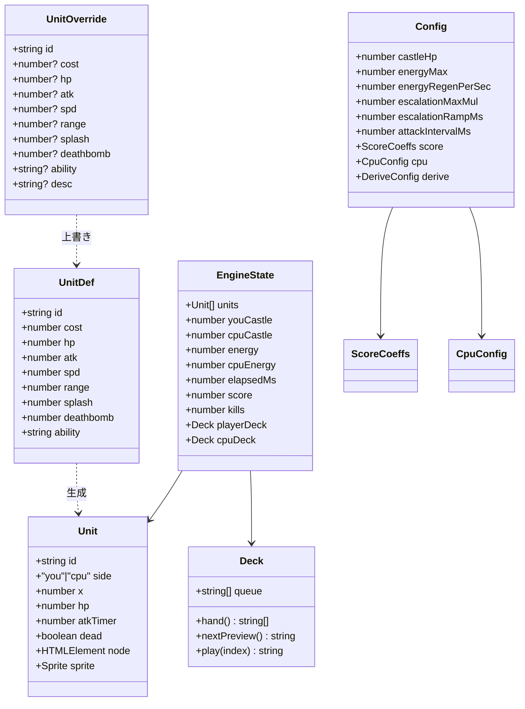
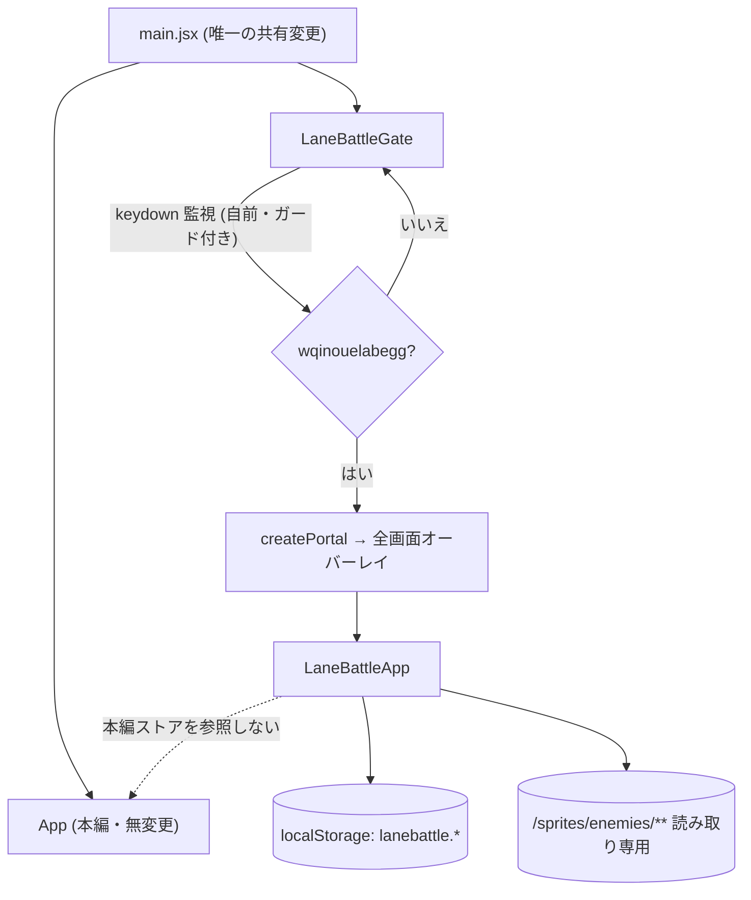
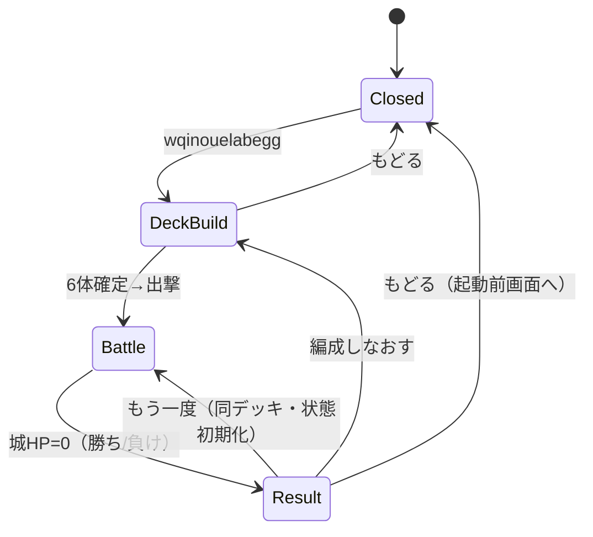
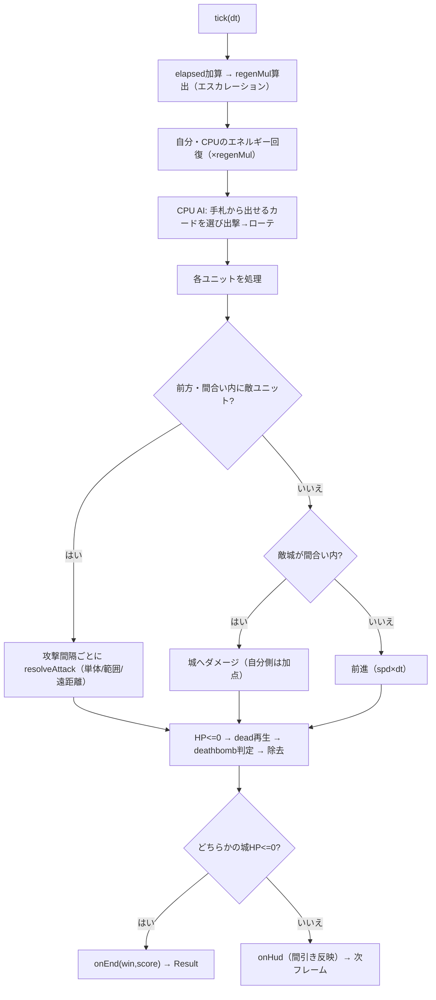
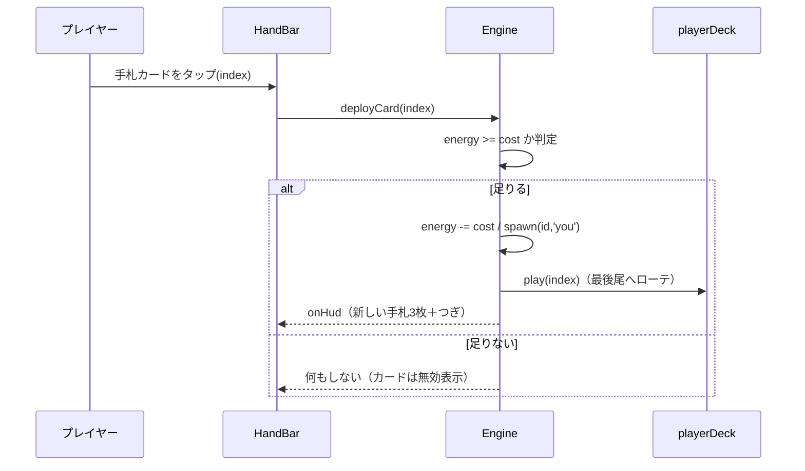

# 設計書: なかまの城（レーン大戦争ミニゲーム）

## 概要

本ミニゲームは、本編・エンディングと**コードを共有しない自己完結モジュール**として `frontend/src/features/lanebattle/` に実装する。共有コードへの変更は `main.jsx` に `<LaneBattleGate />` を 1 行足すだけ（要件15）。ゲート自身が隠しコマンド `wqinouelabegg` を検知し、検知したら React ポータルで全画面オーバーレイを被せる。本編の画面遷移（`App.jsx`）・隠しコマンド機構（`useDebugCommands.js`）・各ストアには一切触れない。

描画は「多数のユニットを毎フレーム動かす」ため、**React の再レンダリングに頼らないエンジン駆動（命令的 DOM 操作＋`requestAnimationFrame`）**を採用する（企画プレゼンの実プレイ版で成立を確認済みの方式）。React は静的な枠（HUD・手札・ボタン）とフェーズ遷移だけを担当し、レーン上のユニットはエンジンが直接 DOM を更新する。スプライトのパス組み立てだけは、命名規則の唯一の実装である既存の純関数 `getEnemyFramePath` を読み取り専用で再利用する（`enemies.json` からアニメ定義・`maxHp`・`sizeRatio` も読み取り専用で参照）。

ゲームの数値（ユニット性能・エネルギー・エスカレーション・城 HP・スコア係数・CPU ペース）は `lanebattle_config.json` と `lanebattle_units.json` に集約し、ロジックを触らず調整できるようにする（要件14）。特殊能力は `range` / `splash` / `deathbomb` ＋ステータス上書きという**データ駆動のパラメータ**で表現し、既存能力種別で足りる新キャラはデータ追加のみで対応する（要件7）。

## アーキテクチャ

### コンポーネント（React 層）

| コンポーネント | 責務 | 関連要件 |
|---|---|---|
| `LaneBattleGate` | 隠しコマンド `wqinouelabegg` の打鍵検出（自前 keydown リスナー＋既存と同じガード）。検出でオーバーレイをマウント／終了でアンマウント。起動前フォーカスを退避 | 1, 15 |
| `LaneBattleApp` | ミニゲームのルート。フェーズ状態（`deckbuild` / `battle` / `result`）を管理。本編ストアを一切参照しない | 1, 2, 13 |
| `DeckBuilder` | ロスター16体の一覧表示と6体選択、開始ボタンの活性制御 | 3 |
| `BattleView` | アリーナ描画（HUD・レーン枠・手札・エネルギー・見分けモード）。`useLaneBattleEngine` を保持し、レーン DOM コンテナ参照をエンジンに渡す | 4, 5, 6, 8, 9, 10, 11 |
| `HandBar` | 手札3枚＋「つぎ」プレビュー。カードのタップで `engine.deployCard(index)` を呼ぶ | 4, 5 |
| `ResultOverlay` | 勝敗・今回スコア・自己ベスト・更新表示・「もう一度」「もどる」 | 11, 12, 13 |

### エンジン層（React 非依存の素の JS）

| モジュール | 責務 | 関連要件 |
|---|---|---|
| `createLaneBattleEngine(opts)` | 状態保持と `requestAnimationFrame` ループ。ユニット配列・城 HP・エネルギー・エスカレーション・CPU AI・スコアを進行させ、レーン DOM を命令的に更新 | 5, 6, 9, 10, 11 |
| `createDeck(ids)` | 6枚キューと手札3枚のローテ制御。プレイヤー・CPU 共通で使う純ロジック | 4, 9 |
| `deriveUnitDef(enemyId)` | `enemies.json` の `maxHp`/`sizeRatio` を基に既定ステータスを算出し、`lanebattle_units.json` の上書きを適用して最終ユニット定義を返す | 7, 14 |
| `resolveAttack(engine, unit, target)` | 通常／範囲（splash）／遠距離（range）の攻撃解決 | 7 |
| `computeScore(state, coeffs)` | 撃破・与ダメージ・勝利ボーナスからスコアを算出 | 11 |
| `laneSprite(container, unitDef)` | エンジンが所有する 1 ユニットの DOM（オーラ・スプライト``・HP バー）を生成し、フレーム/位置を命令的に更新（`getEnemyFramePath` 使用） | 6, 8 |

### フック / ユーティリティ

| 名前 | 責務 | 関連要件 |
|---|---|---|
| `useHiddenCommand(word, onFire)` | `wqinouelabegg` の打鍵バッファ検出。入力欄フォーカス中・修飾キー同時押しは無視（既存 `useDebugCommands` のガードを feature 内に自前再現） | 1, 15 |
| `useLaneBattleEngine(opts)` | エンジンの生成・破棄と、HUD 値（エネルギー/スコア/城HP/手札）を React state へ間引き反映 | 5, 10, 11 |
| `useLaneBattleBest()` | 自己ベストの読み書き。`localStorage` キー `lanebattle.bestScore`（本編セーブと別名前空間） | 2, 12 |

### データモデル



- `lanebattle_units.json`：`UnitOverride[]`（**上書きだけ**を持つ。未指定項目は `deriveUnitDef` が `enemies.json` から自動算出＝要件14-3）。特殊能力の具体割り当ては、このファイルを実装と並行して育てる（要件7）。
- `lanebattle_config.json`：`Config`（調整パラメータの集約点＝要件14-1）。
- ロスターは `enemies.json` を読み取り、`dragon_final` を除く16体を対象にする（`UnitOverride` 側の許可リストで制御）。

### API / インターフェース

```js
// engine/createLaneBattleEngine.js
createLaneBattleEngine({
  laneEl,                    // レーンDOMコンテナ(ref.current)
  config, playerDeckIds, cpuDeckIds,
  onHud,                     // (hud) => void  エネルギー/スコア/城HP/手札を通知（間引き）
  onEnd,                     // ({win, score, kills}) => void
}) => {
  start(), destroy(),
  deployCard(handIndex),     // プレイヤーの手札出撃（要件4,5）
  setDiffMode('both'|'face'|'color'),  // 見分けモード（要件8。既定 both）
}

// engine/createDeck.js  … player/cpu 共通（要件4,9）
createDeck(ids) => { hand(), nextPreview(), play(index) }

// engine/deriveUnitDef.js  （要件7,14）
deriveUnitDef(enemyId) => UnitDef

// hooks/useLaneBattleBest.js  （要件12）
useLaneBattleBest() => { best, submit(score) => {isNewBest:boolean} }
```

## データフロー

### 起動と隔離（共有コードへの接点は1箇所）



### ゲームのフェーズ遷移



### エンジンの毎フレーム処理（tick）



### カード出撃（プレイヤー）とローテ



## 実装方針

### 隔離とマウント（要件15）
- 共有変更は `main.jsx` の `<><App /><LaneBattleGate /></>` のみ。`LaneBattleGate` は既定で不可視・ゼロコスト（未起動時は keydown リスナーのみ）。
- 起動中はオーバーレイ（`position: fixed; inset:0; z-index: 最前面`）で本編を覆う。本編は裏で動き続けるが、ミニゲームは本編の state を読み書きしないため副作用は無い（要件2）。
- 削除は `features/lanebattle/` 削除＋`main.jsx` の1行除去で完結（要件15-5）。

### 隠しコマンド検出（要件1）
- `useHiddenCommand('wqinouelabegg', open)` を feature 内に実装。`window` の keydown を capture で監視し、直近打鍵バッファ末尾一致で発火。`input`/`textarea`/`contentEditable` フォーカス時と Ctrl/Cmd/Alt 同時押し・リピートは無視（既存 `useDebugCommands` と同方針を**コピーで再現**し、共有フックへ依存しない）。

### 描画方式（要件6, 8）
- React はチャンク（HUD・手札・結果）のみ描画。レーン上のユニットはエンジンが `laneSprite` を通じて DOM を直接生成・更新（`left` を割合で、`.src` を `getEnemyFramePath(id, state, frame)` で毎フレーム更新）。多数ユニットでも React 再レンダリングを起こさない。
- 位置は仮想座標（0〜1000）で計算し、`left: x/1000*100%` で解像度非依存に描画。
- 見分け（要件8）：`.unit.you` は青オーラ＋`` を `scaleX(-1)`（右向き）、`.unit.cpu` は赤オーラ＋等倍（左向き）。`setDiffMode` で `both`/`face`/`color` を切替（既定 `both`＝採用案C）。
- スプライトは使用キャラのフレームをマウント時に `new Image()` で先読みしてチラつきを防ぐ（`EnemySprite` の先読み方針を踏襲、ただし実装は自前）。

### デッキ／手札ローテ（要件4, 9）
- `createDeck(ids)` を player/cpu 共通で使用。`play(index)` で該当を最後尾へ移動。手札＝`queue.slice(0,3)`、つぎ＝`queue[3]`。
- CPU は `cpuAI(dt)` で「エネルギーがたまったら手札の出せるカードから1枚選び、出撃→`play`」。出撃間隔に下限乱数を設け、一度に吐き出さない（要件9-3）。乱数は演出上のゆらぎ用途で、シード管理は不要。

### 特殊能力（要件7）
- `resolveAttack` が `splash>0` なら着弾点周囲の敵全員に、`range>90` なら弾（遠距離）演出付きで解決、いずれも無ければ単体。
- 死亡処理で `deathbomb>0` なら周囲の敵にダメージ＋リング演出。
- 能力は `ability` 文字列（表示ラベル）と数値パラメータの組。既存種別（近接／範囲／遠距離／死亡爆弾／ステータス上書き）で足りる新キャラは `lanebattle_units.json` への追記のみ（要件7-6）。新種別が要るときだけ `resolveAttack`/死亡処理に分岐を1つ足す。

### バランス調整の集約（要件14）
- 調整対象を `lanebattle_config.json`（全体）と `lanebattle_units.json`（個別上書き）に限定。エンジンはこれらを読むだけで、ロジック定数を内部に埋め込まない。
- 既定ステータスは `deriveUnitDef` が `maxHp`/`sizeRatio` から算出（小型＝安く速い、大型＝高く硬い）。上書きがあれば優先（要件14-3）。
- **調整の進め方**：Claude が config を書き換え→企画プレゼントと同じ手法（ヘッドレスでの自動対戦シミュレーション）で「平均決着時間・勝率・撃破数」を計測→数値を追い込む、を反復できる。

### スコアと自己ベスト（要件11, 12）
- スコアは `撃破数×kill点 + 敵城与ダメージ×dmg点`、勝利時は `残り城HP×hpBonus + 速度ボーナス` を加算。係数は `config.score`。
- `useLaneBattleBest` が `localStorage['lanebattle.bestScore']` を読み書き。`submit(score)` が更新可否を返し、`ResultOverlay` が「自己ベスト更新！」を出す。

### 勝敗・結果・再戦（要件10, 13）
- どちらかの城 HP が 0 以下で `onEnd`。`ResultOverlay` を表示。
- 「もう一度」＝同じ `playerDeckIds` で `engine.start()` を再実行（城HP・エネルギー・スコア・elapsed を初期化）。「もどる」＝オーバーレイを閉じ、`LaneBattleGate` が起動前フォーカスへ復帰。

## 依存関係

| パッケージ / 既存モジュール | 用途 | 導入済み？ |
|---|---|---|
| `react` / `react-dom`（`createPortal`） | オーバーレイのマウント | はい |
| `zustand` | 使わない（feature 内は React state と素のエンジンで完結。本編ストアに非依存＝要件2,15） | 導入済みだが不使用 |
| `frontend/src/features/battle/enemy/enemySpritePath.js`（`getEnemyFramePath`） | スプライトURL生成（命名規則の唯一実装を読み取り専用で再利用） | はい |
| `frontend/src/data/enemies.json` | アニメ定義・`maxHp`・`sizeRatio` の参照（読み取り専用） | はい |
| `frontend/public/sprites/enemies/**` | スプライト画像（読み取り専用） | はい |
| 追加npm | なし | — |

## トレードオフと検討した代替案

- **決定**：レーン描画をエンジン駆動の命令的 DOM 更新にする。
  **理由**：数十体が毎フレーム動く。React コンポーネント＋per-sprite フックだと再レンダリングが重く、`EnemySprite` は `battleStore` 依存でもある。
  **代替案**：既存 `EnemySprite`/`useSpriteAnimation` を流用 → `battleStore` 結合と再レンダリングコストのため不採用。純関数 `getEnemyFramePath` だけ再利用する。

- **決定**：`main.jsx` に 1 行マウントし、`App.jsx`/`useDebugCommands.js`/ストアを変更しない。
  **理由**：本編（相方担当）との相互干渉を物理的に無くす（要件15）。
  **代替案**：`App.jsx` に `screen==='lanebattle'` を追加＋`useDebugCommands` にコマンド登録 → 既存の隠しコマンド群と一貫するが、共有ファイルを2つ変更し干渉面が増えるため不採用（隔離を優先）。

- **決定**：ユニット数値はデータ2ファイルに集約し、能力はパラメータ表現。
  **理由**：能力を実装と並行で確定・調整する前提（要件7,14）。ロジックを触らず反復できる。
  **代替案**：能力をクラス/ストラテジのコードで表現 → 型安全だが、追加のたびコード改修が要り、非エンジニアの調整もしづらいため MVP では不採用（新“種別”が増えたときだけコード分岐を足す折衷）。

- **決定**：単発マッチ＋自己ベスト（ローカル）。
  **理由**：MVP 最小で「もっと上手く」の反復価値を出す（要件11,12）。
  **代替案**：連戦/ウェーブ・オンラインランキング → スコープ外（将来拡張）。
