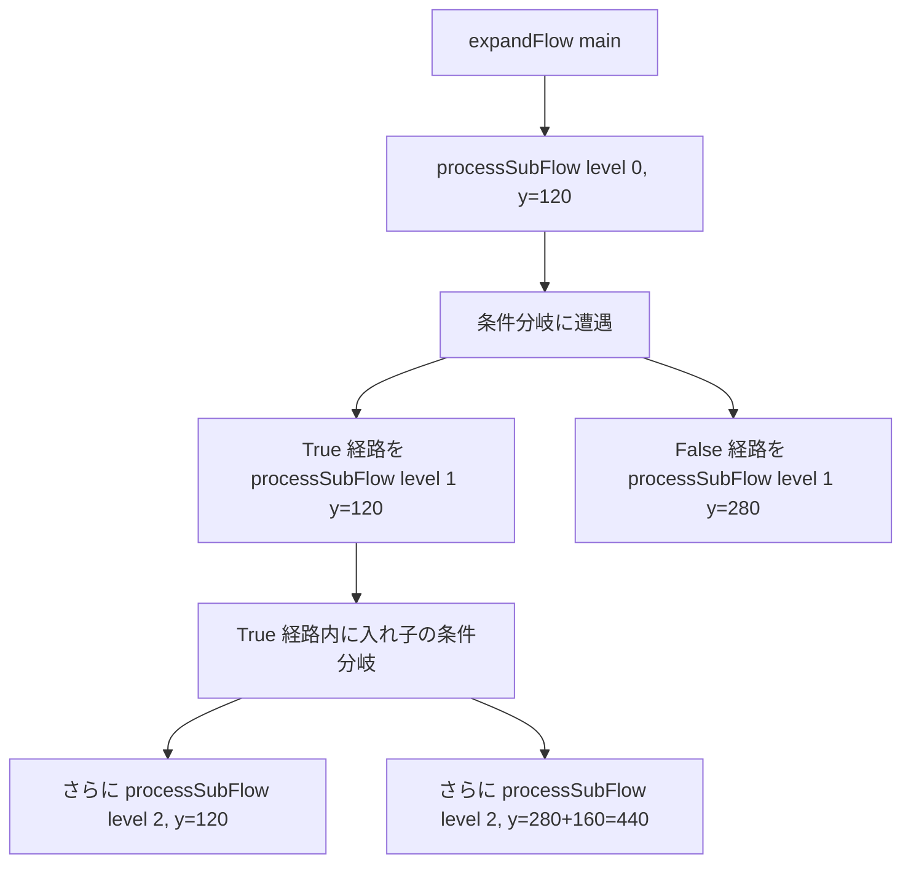

# 設計書: 条件分岐ステージの短縮形式ローダー（loader-branching-shortcut）

## 概要

本機能は `stagesLoader.js` 内に「`flow` 形式の階層構造から完全形式（`slots` / `conditions` / `edges`）を自動生成するロジック」を追加する。`expandStage` を改修し、ステージ定義に `flow` キーがあれば新規 `expandFlow` ルートを使い、`slots` キーのみのステージは既存ルートを使う「内部ルーティング」方式で後方互換を保つ。

`expandFlow` は **再帰的なサブフロー展開** で構成される。`flow` 配列を順に走査し、各要素が「通常スロット」なら直線に並べ、「条件分岐」なら True / False の各経路を再帰的にサブフローとして展開、合流先（条件分岐の次の要素）への edges を後付けで生成する。これにより、入れ子の分岐（True 経路の中にさらに分岐）も自然に再帰でカバーできる設計。

座標は「メイン経路 y=120、False 経路 y=120+160=280、入れ子の False は親 y からさらに +160」というシンプルなルールで自動算出する。id は `slot-N` / `cond-M` のグローバル連番で、フロー全体を走査する順番で振る。

## アーキテクチャ

### コンポーネント

| コンポーネント | 責務 |
|---|---|
| `stagesLoader.js`（既存編集） | `expandStage` を改修し `flow` キー有無で内部ルーティング |
| 新規関数 `expandFlow(flow)`（同ファイル内） | `flow` 配列を展開して完全形式の `{slots, conditions, edges, start, goal}` を返す |
| 新規関数 `processSubFlow(...)`（同ファイル内） | サブフロー（メイン経路 or 分岐経路）を再帰的に展開する内部ヘルパー |
| 新規関数 `buildFlowResult(items, ctx)`（同ファイル内、必要に応じて） | 共通の context（counters、accumulator）を管理 |

### データモデル

#### `flow` 形式の入力 JSON

```json
"2-1": {
  "enemyId": "wolf",
  "cards": [...],
  "flow": [
    { "lockedCard": { "id": "monster", "power": 50 } },  // 通常スロット
    {},                                                    // 通常スロット（空き）
    {
      "condition": "playerHp > 50",                       // 条件分岐
      "true":  [ { "lockedCard": {...} } ],
      "false": []
    },
    {}                                                     // 合流先（通常スロット）
  ]
}
```

#### `expandFlow` の戻り値

```js
{
  slots: [
    { id: 'slot-1', position: { x: 80,  y: 120 }, lockedCard: { id: 'monster', power: 50 } },
    { id: 'slot-2', position: { x: 280, y: 120 } },
    { id: 'slot-3', position: { x: 680, y: 120 }, lockedCard: { id: 'attack', power: 20 } },
    { id: 'slot-4', position: { x: 880, y: 120 } }
  ],
  conditions: [
    { id: 'cond-1', position: { x: 480, y: 120 }, expression: 'playerHp > 50' }
  ],
  edges: [
    { id: 'e-start-slot-1',     source: 'start',  target: 'slot-1' },
    { id: 'e-slot-1-slot-2',    source: 'slot-1', target: 'slot-2' },
    { id: 'e-slot-2-cond-1',    source: 'slot-2', target: 'cond-1' },
    { id: 'e-cond-1-slot-3',    source: 'cond-1', target: 'slot-3', sourceHandle: 'true' },
    { id: 'e-slot-3-slot-4',    source: 'slot-3', target: 'slot-4' },
    { id: 'e-cond-1-slot-4',    source: 'cond-1', target: 'slot-4', sourceHandle: 'false' },
    { id: 'e-slot-4-goal',      source: 'slot-4', target: 'goal' }
  ],
  start: { position: { x: -120, y: 120 } },
  goal:  { position: { x: 1080, y: 120 } }
}
```

### API / インターフェース

#### `expandFlow(flow)`

```js
/**
 * @param {Array<FlowItem>} flow - flow 配列（メイン経路）
 * @returns {{
 *   slots: Array<Slot>,
 *   conditions: Array<Condition>,
 *   edges: Array<Edge>,
 *   start: { position: { x, y } },
 *   goal:  { position: { x, y } }
 * }}
 */
function expandFlow(flow) { ... }
```

#### `expandStage` のルーティング修正

```js
function expandStage(raw) {
  if (raw.flow) {
    if (raw.slots) {
      console.warn('[stagesLoader] both `flow` and `slots` defined, using `flow`');
    }
    const expanded = expandFlow(raw.flow);
    return {
      enemyId: raw.enemyId,
      cards: raw.cards ?? [],
      ...expanded,  // slots / conditions / edges / start / goal
    };
  }
  // 既存の slots ルート
  const slots = expandSlots(raw.slots ?? []);
  return {
    enemyId: raw.enemyId,
    cards: raw.cards ?? [],
    slots,
    conditions: expandConditions(raw.conditions),
    start: expandStart(raw.start),
    goal: expandGoal(raw.goal, slots.length),
    edges: raw.edges ?? buildLinearEdges(slots),
  };
}
```

## データフロー

### `flow` 展開の全体フロー

```mermaid
flowchart TD
    A[stage.flow 配列] --> B{flow キー有無}
    B -->|あり| C[expandFlow]
    B -->|なし| D[既存 slots ルート]
    C --> E[ctx 初期化: counters, slots[], conditions[], edges[]]
    E --> F[processSubFlow: main, startColumn=0, y=120, prevId='start']
    F --> G{各要素を順に走査}
    G -->|通常スロット| H[slot 生成, 連番採番, edge追加, prevId更新]
    G -->|条件分岐| I[cond 生成, edge追加]
    H --> G
    I --> J[True 経路を processSubFlow で再帰展開]
    I --> K[False 経路を processSubFlow で再帰展開]
    J --> L[両経路の終端を保持]
    K --> L
    L --> M[次の要素を合流先として deferred edges を確定]
    M --> G
    G -->|完了| N[最終要素から goal へ edge 追加]
    N --> O[start / goal の position 確定]
    O --> P[完全形式 stage を返す]
```

### 入れ子分岐の再帰展開



## 実装方針

### 1. 内部状態（ctx）

`expandFlow` の処理中、以下を一貫した「context」オブジェクトで管理する：

```js
const ctx = {
  slotCounter: 0,        // slot-N の N
  condCounter: 0,        // cond-M の M
  slots: [],             // 生成されたスロット配列
  conditions: [],        // 生成された条件分岐配列
  edges: [],             // 生成されたエッジ配列
  edgeCounter: 0,        // edge id 衝突回避用（必要なら）
};
```

`processSubFlow` は `ctx` を引数で受け取り、副作用で `ctx` の配列を更新する。

### 2. `expandFlow` の本体

```js
function expandFlow(flow) {
  const ctx = {
    slotCounter: 0,
    condCounter: 0,
    slots: [],
    conditions: [],
    edges: [],
  };

  if (!Array.isArray(flow)) {
    console.warn('[stagesLoader] flow must be an array');
    return makeEmptyResult();
  }

  // メイン経路を展開（start から始まり、終端は goal へ繋ぐ）
  const result = processSubFlow(flow, {
    startColumn: 0,
    yLevel: 120,
    prevNodeId: 'start',
    prevSourceHandle: undefined,
    ctx,
  });

  // メイン経路の終端を goal に繋ぐ
  // 条件分岐が最後だった場合は True / False 両経路の終端から goal へ
  for (const ending of result.endings) {
    ctx.edges.push({
      id: `e-${ending.nodeId}-goal`,
      source: ending.nodeId,
      target: 'goal',
      ...(ending.sourceHandle ? { sourceHandle: ending.sourceHandle } : {}),
    });
  }

  // start / goal の position
  const start = { position: { x: -120, y: 120 } };
  const goal = { position: { x: 80 + result.endColumn * 200, y: 120 } };

  return {
    slots: ctx.slots,
    conditions: ctx.conditions,
    edges: ctx.edges,
    start,
    goal,
  };
}
```

### 3. `processSubFlow` の本体

サブフローを順に展開し、「最終的にどこから合流先へ繋がるか」（`endings`）と、「使用した最終 column」（`endColumn`）を返す。

```js
function processSubFlow(items, { startColumn, yLevel, prevNodeId, prevSourceHandle, ctx }) {
  let column = startColumn;
  let endings = [{ nodeId: prevNodeId, sourceHandle: prevSourceHandle }];

  for (const item of items) {
    if (isCondition(item)) {
      // 条件分岐ノード生成
      ctx.condCounter += 1;
      const condId = `cond-${ctx.condCounter}`;
      ctx.conditions.push({
        id: condId,
        position: { x: 80 + column * 200, y: yLevel },
        expression: item.condition,
      });

      // 直前の endings から cond へ edge を引く
      for (const ending of endings) {
        ctx.edges.push(buildEdge(ending, condId));
      }

      column += 1;

      // True 経路を展開
      const trueItems = item.true ?? [];
      const trueResult = processSubFlow(trueItems, {
        startColumn: column,
        yLevel,  // True は親と同じ y
        prevNodeId: condId,
        prevSourceHandle: 'true',
        ctx,
      });

      // False 経路を展開
      const falseItems = item.false ?? [];
      const falseResult = processSubFlow(falseItems, {
        startColumn: column,
        yLevel: yLevel + 160,  // False は親 y + 160
        prevNodeId: condId,
        prevSourceHandle: 'false',
        ctx,
      });

      // 合流位置 column = max(trueResult.endColumn, falseResult.endColumn)
      const mergeColumn = Math.max(trueResult.endColumn, falseResult.endColumn);

      column = mergeColumn;

      // 次のループ周回（合流先の通常スロット）に向けた endings を集める
      endings = [...trueResult.endings, ...falseResult.endings];
    } else {
      // 通常スロット
      ctx.slotCounter += 1;
      const slotId = `slot-${ctx.slotCounter}`;
      const slot = {
        id: slotId,
        position: { x: 80 + column * 200, y: yLevel },
      };
      if (item.lockedCard) {
        slot.lockedCard = item.lockedCard;
      }
      ctx.slots.push(slot);

      // 直前の endings から この slot へ edge を引く
      for (const ending of endings) {
        ctx.edges.push(buildEdge(ending, slotId));
      }

      column += 1;
      endings = [{ nodeId: slotId, sourceHandle: undefined }];
    }
  }

  return { endings, endColumn: column };
}

function buildEdge(ending, targetId) {
  return {
    id: `e-${ending.nodeId}-${targetId}`,
    source: ending.nodeId,
    target: targetId,
    ...(ending.sourceHandle ? { sourceHandle: ending.sourceHandle } : {}),
  };
}

function isCondition(item) {
  return typeof item?.condition === 'string';
}
```

### 4. ステージ 2-1 の `flow` 形式書き換え

`stages.json` のステージ 2-1 を以下に置き換える（要件 6 の構造）：

```json
"2-1": {
  "enemyId": "wolf",
  "cards": [
    { "id": "attack", "power": 10 },
    { "id": "heal",   "power": 10 }
  ],
  "flow": [
    { "lockedCard": { "id": "monster", "power": 50 } },
    {},
    {
      "condition": "playerHp > 50",
      "true": [
        { "lockedCard": { "id": "attack", "power": 20 } }
      ],
      "false": []
    },
    {}
  ]
}
```

## 依存関係

| パッケージ | 用途 | 導入済み？ |
|---|---|---|
| なし | 新規パッケージ不要 | - |

`stagesLoader.js` 内に純粋関数を追加するだけで完結する。

## トレードオフと検討した代替案

- **決定内容**: `expandFlow` を再帰関数として実装する
  **理由**: `flow` 配列の中に条件分岐が含まれ、条件分岐の `true` / `false` が再び `flow` 配列であるため、自然に再帰構造になる。再帰で書くことで、入れ子分岐（要件 7）が追加コードなしで動く。
  **検討した代替案**:
  - **代替 1: スタックベースの反復で展開**: 再帰呼び出しを避けるが、自分でスタック管理する必要があり、コードが長くなる。再帰の深さがそれほど深くならない（人間が書く JSON のネスト深度は数階層）想定なので、再帰で十分。

- **決定内容**: `endings` 配列で「合流前の直前ノード群」を保持する設計
  **理由**: 条件分岐後、True / False の終端から「次の要素」への edges を引く必要がある。シングルポインタ（直前ノード 1 つ）では分岐に対応できないので、配列で複数の終端を保持する。
  **検討した代替案**:
  - **代替 1: 合流ノードを明示的に作る**: 「merge」という新規ノードタイプを作り、両経路を merge ノードに収束させる。新規ノードタイプの React Flow 描画コードが必要になり、複雑度が増す。要件では「合流は次の要素が引き受ける」というシンプルな設計を採用しているので不要。

- **決定内容**: id を `slot-N` / `cond-M` のグローバル連番で振る
  **理由**: フロー全体で一意な id が自動的に得られる。深さ優先・走査順に振ることで、視覚的にも「左上から右下へ」の順番が反映され、デバッグ時に追いやすい。
  **検討した代替案**:
  - **代替 1: 階層構造を含めた id（例: `slot-true-1`、`slot-false-2`）**: 構造が見える分、id 長が伸びてデバッグ時の視認性が悪い。階層が深くなるとさらに伸びる。
  - **代替 2: UUID やハッシュ**: 完全にユニークになるが、人間が読めない。

- **決定内容**: 合流先の column は `max(trueResult.endColumn, falseResult.endColumn)`
  **理由**: True 経路と False 経路の長さが違う場合、両者が同じ列で合流するために最長を採用する。短い方の経路は「分岐後の余白」を消費する形になるが、合流先で確実に揃う。
  **検討した代替案**:
  - **代替 1: 各経路の長さに応じて合流先の column を動的調整**: 実装が複雑、見た目の改善も限定的。

- **決定内容**: `flow` と `slots` の両方が定義されたら `flow` を優先 + 警告
  **理由**: 片方しか定義しないのが正しい使い方だが、誤って両方書いた場合に無音で挙動が決まると混乱する。明示的に警告を出して開発者に伝える。
  **検討した代替案**:
  - **代替 1: エラーを投げる**: ステージ全体が落ちると影響が大きい。警告 + 優先選択でフォールトトレラント。

## トレーサビリティ確認

| 要件 | 対応する設計セクション |
|---|---|
| 1-1（`flow` キー解析） | 実装方針 2（`expandFlow`）、実装方針 3（`processSubFlow`） |
| 1-2（`slots` のみのステージは既存ルート） | 実装方針 - API（`expandStage` のルーティング） |
| 1-3（両キー定義時は警告 + `flow` 優先） | 実装方針 - API（`expandStage` の警告ロジック） |
| 1-4（戻り値の形が既存と同じ） | データモデル（`expandFlow` の戻り値）、実装方針 - API |
| 2-1〜2-5（`flow` 要素の種類と `true` / `false` の省略可） | 実装方針 3（`isCondition` 判定、`item.true ?? []`） |
| 2-6（`condition` 要素の追加フィールド無視） | 実装方針 3（`condition` 分岐で `expression` のみ抽出） |
| 3-1〜3-3（id の自動採番） | 実装方針 1（`ctx.slotCounter` / `ctx.condCounter`）、実装方針 3（深さ優先走査） |
| 4-1〜4-7（座標の自動計算） | 実装方針 3（`column * 200 + 80`、`yLevel + 160`、合流時の `max`） |
| 5-1〜5-9（edges の自動生成） | 実装方針 3（`buildEdge`、`endings` 配列、`sourceHandle` の付与） |
| 6-1〜6-3（ステージ 2-1 の書き換え） | 実装方針 4（`stages.json` の `flow` 形式置き換え） |
| 7-1〜7-3（入れ子分岐への対応） | 実装方針 3（`processSubFlow` の再帰呼び出し、`yLevel + 160` で階層ごとにずらす） |
| 8-1〜8-3（バリデーション） | 実装方針 2（`Array.isArray` チェック）、実装方針 3（`item.true ?? []` のフォールバック） |
| 9-1〜9-3（既存システムとの整合） | 実装方針 - API（`expandStage` のルーティング、`slots` のみは既存ルート維持） |
