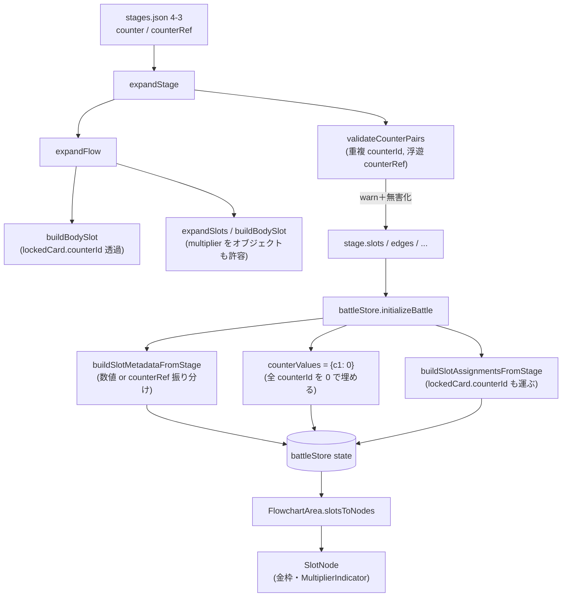
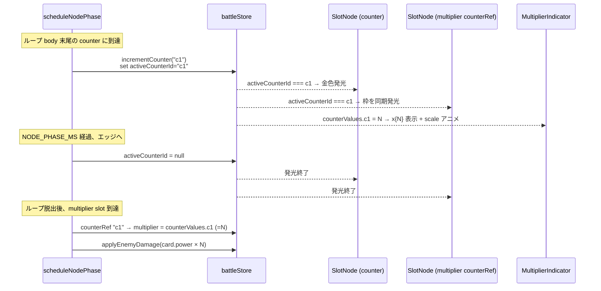
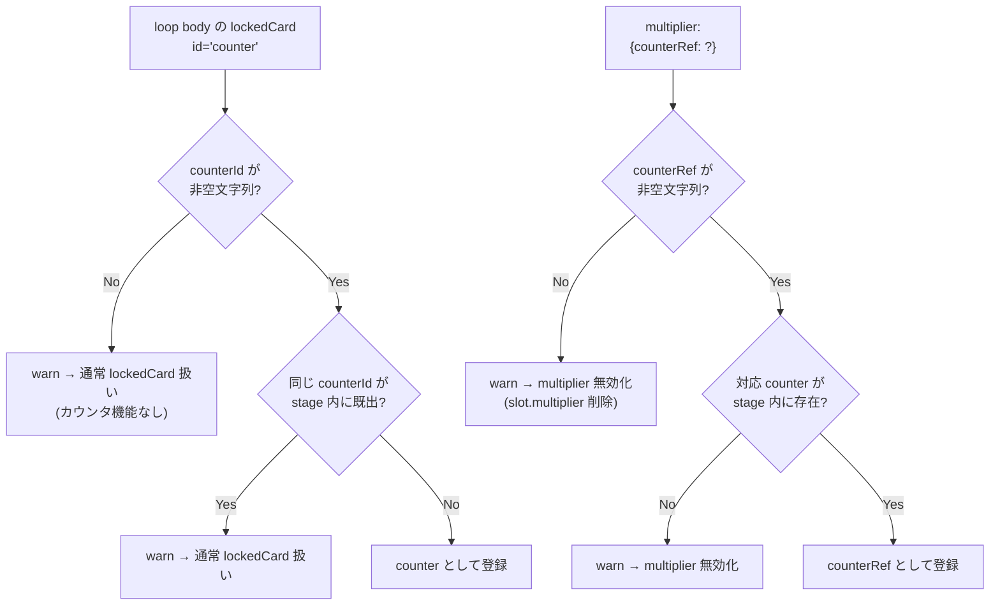

# 設計書: ループカウンタ機能

## 概要

`flowchart-loop` が導入した while / do-while ループに、**「カウンタ ID で紐付けられた lockedCard ペア」** という新しい意味づけを追加する。`stages.json` 側のスキーマは 2 点のみ拡張する：

- 既存の `lockedCard: { id, power }` に `lockedCard: { id: "counter", counterId: "<id>" }` を許容
- 既存の `multiplier: <数値>` に `multiplier: { counterRef: "<id>" }` を許容

ローダー（`stagesLoader.js`）が ID の整合性（重複・参照不整合）を **静的検証** してから完全形式に展開する。実行時の状態（カウンタ値）は `battleStore` に **`counterValues: { [counterId]: number }`** を 1 つ足すだけで、既存の `slotAssignments` / `slotMetadata` の仕組みを壊さない。

設計上の最重要事実：**MultiplierIndicator は `value` の数値だけを描画する dumb component で、倍率の解決は SlotNode 側に集中している**（`SlotNode.jsx:139, 193`）。これと **`scheduleNodePhase` の倍率取得が `state.slotMetadata[nodeId]?.multiplier ?? 1` の 1 行に集中している**（`battleStore.js:920`）ことから、本機能で触る実行ロジックは「この 1 行を `counterRef → counterValues` 解決込みに拡張する」だけで済む。

視覚側の主要追加は (1) counter / カウンタ連動 multiplier 双方の **金枠**、(2) counter ノード通過時の **両ノード同期発光**、(3) counter カードの新規画像 `public/cards/counter.png`、(4) MultiplierIndicator の **値変化時の軽い強調アニメ**。シミュレーション側（`simulateBattle`）も `slotMetadata` の解決ロジックと整合させて runaway 判定精度を維持する。

---

## アーキテクチャ

### 変更コンポーネント

| ファイル | 変更内容 | 関連要件 |
|---|---|---|
| `frontend/src/data/stages.json` | stage 4-3 を新スキーマで書き換え（body 末尾に counter 追加、`multiplier:5` を `{counterRef:"c1"}` に置換） | 9 |
| `frontend/src/data/stagesLoader.js` | `isValidMultiplier` をオブジェクト記法対応に拡張、counter `lockedCard` の `counterId` 検証＋重複検出、`counterRef` の参照健全性検証、いずれも warn＋安全フォールバック | 1, 2, 11 |
| `frontend/src/stores/battleStore.js` | `counterValues` state 追加、`incrementCounter` action 追加、`initializeBattle` で `counterValues` を 0 で埋める、`scheduleNodePhase` 内で counter 到達時の +1 と multiplier 取得時の counterRef 解決、`buildSlotMetadataFromStage` を新 multiplier 形に対応、`activeCounterId` state（ペア同期発光用） | 3, 4, 7, 8 |
| `frontend/src/engine/simulateBattle.js` | `simulateBattle` に `counterValues` を内包し、counter 通過で +1、multiplier 解決で counterRef を見るよう同期 | 3, 4, 10 |
| `frontend/src/features/battle/flowchart/SlotNode.jsx` | counter スロット判定（`lockedCard.id === 'counter'`）と counterRef multiplier 判定で金枠クラスを付与、counterRef のとき `counterValues[counterRef]` を購読して MultiplierIndicator に渡す、`activeCounterId === counterRef` のとき同期発光クラス | 5, 6, 7, 8 |
| `frontend/src/features/battle/flowchart/SlotNode.module.css` | `.counterPaired` 金枠スタイル、`.counterFlash` 発光キーフレーム追加 | 5, 7 |
| `frontend/src/features/battle/flowchart/MultiplierIndicator.jsx` | 値変化時の軽い強調アニメ（framer-motion の key 駆動 scale 動作）、`x0` 表示にも対応 | 8 |
| `frontend/src/features/battle/flowchart/MultiplierIndicator.module.css` | 金枠ペア時の文字色・サイズ調整（必要なら） | 5, 8 |
| `frontend/src/features/battle/flowchart/FlowchartArea.jsx` | `slotsToNodes` で `slot.multiplier` をオブジェクト/数値の両方そのまま `data` に転記（型を変えない） | 2 |
| `frontend/src/features/cards/Card.jsx` | （変更なし、`/cards/counter.png` を自動解決） | 6 |
| `frontend/public/cards/counter.png` | **新規アセット**：力こぶ／パワーアップを連想させるピクセルアートのカード画像 | 6 |
| `frontend/src/features/battle/preloadBattleAssets.js` | counter カードのプリロード対象追加（既存パターンを踏襲） | 6 |

新規ファイルは `frontend/public/cards/counter.png` の 1 つのみ。それ以外はすべて既存ファイルの編集。ディレクトリ追加は無いため `README.md` の構造図への変更も不要。

### データモデル

#### `stages.json` 側のスキーマ拡張

```jsonc
// counter スロット（lockedCard で固定配置）
{ "lockedCard": { "id": "counter", "counterId": "c1" } }

// カウンタ連動 multiplier スロット（プレイヤーが任意カードを置く）
{ "multiplier": { "counterRef": "c1" } }

// 既存の数値リテラル multiplier は完全後方互換
{ "multiplier": 5 }
```

`counterId` / `counterRef` は同じ stage 内で一致する文字列。複数ステージ間で同じ ID が現れても、ローダーは stage ごとに展開するため衝突しない。

#### ローダー出力（`stage.slots[]`）

`expandSlots` / `buildBodySlot` を経た後の `stage.slots` 要素は次の 3 系統:

```jsonc
// 1. counter スロット
{ id: "slot-N", position: {...}, lockedCard: { id: "counter", counterId: "c1" } }

// 2. カウンタ連動 multiplier スロット
{ id: "slot-N", position: {...}, multiplier: { counterRef: "c1" } }

// 3. 既存の数値倍率スロット（変更なし）
{ id: "slot-N", position: {...}, multiplier: 5 }
```

`slot.multiplier` の **型が数値 or オブジェクト** に拡張される点に注意（既存の `Number.isInteger` 前提の検証は更新が必要）。

#### `battleStore` の新 state

```js
// 既存
slotAssignments: { [slotId]: card | null }
slotMetadata:    { [slotId]: { acceptOnly?, multiplier?: number, counterRef?: string } }

// 新規（本機能で追加）
counterValues:   { [counterId]: number }      // 実行開始時 0、counter ノード到達で +1
activeCounterId: string | null                // 「いま光っているカウンタ」。同期発光用
```

- `counterValues` のキー集合は `initializeBattle` で stage.slots を走査して決定（counter スロットの全 counterId）。
- `activeCounterId` は counter ノードフェーズ突入時にセットし、次のエッジフェーズで `null` に戻す。ペア multiplier スロットがこれを購読して同期発光する。

#### `slotMetadata` の構造変更

`buildSlotMetadataFromStage` は現在 `multiplier` を「数値ならコピー」しているだけ（`battleStore.js:334`）。新スキーマでは以下の規則:

| `slot.multiplier` | metadata に入る形 |
|---|---|
| `5`（数値） | `{ multiplier: 5 }` （既存どおり） |
| `{ counterRef: "c1" }` | `{ counterRef: "c1" }` （新規。`multiplier` キーは入れない） |
| 未指定 | エントリ作らない（既存どおり） |

`multiplier` キーと `counterRef` キーは **排他**にすることで、参照側の分岐がシンプルになる（数値ならそのまま使う／`counterRef` あればそれを解決）。

### API / インターフェース

#### `battleStore` 新 action

```js
incrementCounter(counterId: string): void
// counterValues[counterId] を +1。存在しない counterId なら何もしない（防御的）。
```

#### `scheduleNodePhase` 内の倍率解決（擬似コード）

```js
const meta = get().slotMetadata[nodeId];
let multiplier;
if (typeof meta?.multiplier === 'number') {
  multiplier = meta.multiplier;                              // 既存パス
} else if (typeof meta?.counterRef === 'string') {
  multiplier = get().counterValues[meta.counterRef] ?? 0;    // 新パス、未到達なら 0
} else {
  multiplier = 1;                                            // 既存どおり
}
```

#### counter ノード到達時の動作（`scheduleNodePhase` 冒頭の効果分岐に追加）

```js
const card = get().slotAssignments[nodeId];
if (card && card.id === 'counter' && card.locked) {
  const counterId = card.counterId;
  get().incrementCounter(counterId);
  set({ activeCounterId: counterId });
}
// 次フェーズへのエッジ突入時に activeCounterId = null へ
```

`card.counterId` は `slotAssignments` 構築時に `lockedCard.counterId` を一緒に運ぶ。既存の `lockedCard` パススルー（`buildSlotAssignmentsFromStage` 系）と整合させる。

---

## データフロー

### スキーマ読み込みから初期化まで



### 実行時のカウンタ更新と表示の同期



### 不正状態のフォールバック分岐（ローダー段階）



---

## 実装方針

### 1. ローダー：スキーマ拡張と検証（`stagesLoader.js`）

#### 1-1. `isValidMultiplier` の拡張

現在: `Number.isInteger(value) && value >= 2`（`stagesLoader.js:278`）。
新: 「数値（>= 2 の整数）」または「`{ counterRef: 非空文字列 }`」を受け入れる。

```js
function isValidMultiplier(value) {
  if (Number.isInteger(value) && value >= 2) return true;
  if (typeof value === 'object' && value !== null) {
    return typeof value.counterRef === 'string' && value.counterRef.length > 0;
  }
  return false;
}
```

これは `expandSlots`（線形ステージ）と `buildBodySlot`（flow / loop body）の両ルートから呼ばれる。両方とも一括で新スキーマに対応する（要件 2-1 / 2-2 / 2-4）。

#### 1-2. counter `lockedCard` の `counterId` 検証

`buildBodySlot` / `expandSlots` の `lockedCard` コピー時に分岐を追加:

```js
if (raw.lockedCard) {
  if (raw.lockedCard.id === 'counter') {
    if (typeof raw.lockedCard.counterId === 'string' && raw.lockedCard.counterId.length > 0) {
      slot.lockedCard = raw.lockedCard;     // counterId 込みでコピー
    } else {
      console.warn(`[stagesLoader] slot "${slotId}": counter lockedCard requires a non-empty "counterId". Treating as plain lockedCard.`);
      slot.lockedCard = { id: raw.lockedCard.id };   // counterId を落として通常扱い
    }
  } else {
    slot.lockedCard = raw.lockedCard;        // 既存どおり
  }
}
```

要件 1-1 / 1-3 を満たす。

#### 1-3. ステージ単位の重複・参照検証（新規 `validateCounterPairs`）

`expandStage` の最後で stage.slots を一度走査し、(1) 重複 counterId と (2) 浮遊 counterRef を検出する純関数を追加:

```js
function validateCounterPairs(stage, stageId) {
  const seenCounterIds = new Set();
  for (const slot of stage.slots) {
    if (slot.lockedCard?.id === 'counter') {
      const cid = slot.lockedCard.counterId;
      if (seenCounterIds.has(cid)) {
        console.warn(`[stagesLoader] stage "${stageId}" slot "${slot.id}": duplicate counterId "${cid}". Treating as plain lockedCard.`);
        slot.lockedCard = { id: 'counter' };   // counterId を剥がして無効化
      } else {
        seenCounterIds.add(cid);
      }
    }
  }
  for (const slot of stage.slots) {
    if (typeof slot.multiplier === 'object' && slot.multiplier !== null) {
      const ref = slot.multiplier.counterRef;
      if (!seenCounterIds.has(ref)) {
        console.warn(`[stagesLoader] stage "${stageId}" slot "${slot.id}": counterRef "${ref}" not found in stage. Ignoring multiplier.`);
        delete slot.multiplier;                // 1 倍にフォールバック
      }
    }
  }
}
```

要件 1-4 / 2-5 / 11-1 / 11-2 を満たす。`expandStage` から `flow` ルートでも `slots` ルートでも呼ぶ。

要件 11-3（counter はあるが参照先 multiplier が無い）はこの関数では検出しない（counter 単独でも体験は壊れないため）。検出を望むなら同じ走査で逆向きチェックを追加するが、本仕様では「ガード厳しすぎは不要」と判断（warn 1 行で足りる）。

### 2. ランタイム：カウンタ値の管理（`battleStore.js`）

#### 2-1. state 追加と初期化

```js
// 初期 state
counterValues: {},
activeCounterId: null,

// initializeBattle 内に追加
const counterIds = stage.slots
  .filter(s => s.lockedCard?.id === 'counter' && typeof s.lockedCard.counterId === 'string')
  .map(s => s.lockedCard.counterId);
const counterValues = Object.fromEntries(counterIds.map(id => [id, 0]));

set({
  // ...既存フィールド
  counterValues,
  activeCounterId: null,
});
```

`retryFromFail` でも `counterValues` を 0 リセット（既存パスで `currentEnemyHp` 等をリセットしている箇所に並べる）。

要件 3-1 / 3-3 を満たす。

#### 2-2. `incrementCounter` action

```js
incrementCounter: (counterId) => set((s) => {
  if (s.counterValues[counterId] === undefined) return s;
  return {
    counterValues: {
      ...s.counterValues,
      [counterId]: s.counterValues[counterId] + 1,
    },
  };
}),
```

#### 2-3. `scheduleNodePhase` 内のカウンタ通過処理

カード効果分岐の **冒頭** に counter 専用処理を追加（既存の attack/monster/heal/guard/reflect 分岐に並べる）:

```js
if (card && card.id === 'counter') {
  const counterId = card.counterId;
  if (counterId) {
    get().incrementCounter(counterId);
    set({ activeCounterId: counterId });
  }
}
```

そして倍率取得を既存 1 行から拡張:

```js
const meta = get().slotMetadata[nodeId];
const multiplier =
  typeof meta?.multiplier === 'number'    ? meta.multiplier :
  typeof meta?.counterRef === 'string'    ? (get().counterValues[meta.counterRef] ?? 0) :
  1;
```

`scheduleEdgePhase` 冒頭で `activeCounterId` を null に戻す:

```js
if (get().activeCounterId !== null) set({ activeCounterId: null });
```

要件 3-2 / 3-4 / 4-1 / 4-2 / 4-3 / 7 系（活性状態のセット） / 8 系（counterValues 変更が React 経由で UI へ伝播）を満たす。

#### 2-4. `slotAssignments` への counterId 伝播

既存の `buildSlotAssignmentsFromStage` 系で lockedCard を `slotAssignments` に積む際、`lockedCard.id === 'counter'` のときは `counterId` も一緒にカードオブジェクトに含める:

```js
// 該当箇所
if (slot.lockedCard) {
  const card = { ...slot.lockedCard, locked: true };
  // counter の場合は counterId が既にスプレッドで入っている
  assignments[slot.id] = card;
}
```

既存実装が `{ ...slot.lockedCard, locked: true }` の形になっていれば `counterId` も自然に乗る（要 1 行の調査確認）。乗っていなければ明示コピー追加。

### 3. シミュレーション：`simulateBattle.js`

実行前の runaway 判定が live の倍率計算とドリフトしないよう、新スキーマに同期:

#### 3-1. `simulateBattle` の state に `counterValues` を追加

```js
let counterValues = {}; // initialState から渡されるか、内部で初期化
```

`initialState` に `counterValues` を含める形にし、`battleStore.startExecution` 側で stage の全 counterId を 0 で埋めて渡す。

#### 3-2. `applyNodeEffect` の引数を拡張

現在 `applyNodeEffect(state, card, multiplier)` で外から確定済みの multiplier 数値を渡している。これに `counterValues` 解決ロジックを足すには 2 案:

- **案 A**: `simulateBattle` 内で multiplier を解決してから `applyNodeEffect` に渡す（純粋性維持、`applyNodeEffect` のシグネチャ不変）。**採用**。
- 案 B: `applyNodeEffect` の引数に `slotMetadata` と `counterValues` を渡して内部解決。シグネチャが大きくなる。

採用案 A:

```js
// simulateBattle 内
const meta = slotMetadata[nodeId];
let multiplier =
  typeof meta?.multiplier === 'number' ? meta.multiplier :
  typeof meta?.counterRef === 'string' ? (counterValues[meta.counterRef] ?? 0) :
  1;

// counter 通過時
if (card?.id === 'counter' && card.counterId) {
  counterValues = { ...counterValues, [card.counterId]: (counterValues[card.counterId] ?? 0) + 1 };
}

state = applyNodeEffect(state, card, multiplier);
```

これで live と sim の計算が一致し、要件 10 で参照される「導入前後の挙動完全一致」が既存ステージで保たれる（counterRef を使わなければ `multiplier: number` 既存パスをそのまま通る）。

`battleStore.scheduleComplete` の整合チェック（`liveOutcome !== simOutcome` の warn、`battleStore.js:988-992`）は無変更でそのまま動く。

### 4. 描画：`SlotNode` の金枠とペア同期発光

#### 4-1. 金枠クラスの付与（要件 5）

`SlotNode.jsx` の `className` 計算に分岐を追加:

```js
const isCounterSlot = assignedCard?.id === 'counter' && assignedCard?.locked;
const isCounterLinkedMultiplier =
  data?.multiplier !== undefined &&
  typeof data.multiplier === 'object' &&
  typeof data.multiplier.counterRef === 'string';
const isCounterPaired = isCounterSlot || isCounterLinkedMultiplier;

// className 配列に追加
isCounterPaired && styles.counterPaired,
```

CSS（`SlotNode.module.css`）:

```css
.slot.counterPaired {
  border-color: #FFD54A;          /* 金 */
  box-shadow: 0 0 6px rgba(255, 213, 74, 0.5);
}
```

`lockedCard` 抑制スタイル（`.lockedCard` の outline 抑制）と衝突する場合は `:not(.counterPaired)` で隔離。

#### 4-2. 同期発光（要件 7）

counter ノードフェーズ中に counter slot と ペア multiplier slot の両方を金色に強くフラッシュさせる。

```js
const activeCounterId = useBattleStore(s => s.activeCounterId);
const myCounterId = isCounterSlot ? assignedCard?.counterId : null;
const myCounterRef = isCounterLinkedMultiplier ? data.multiplier.counterRef : null;
const isCounterFlashing =
  (myCounterId && activeCounterId === myCounterId) ||
  (myCounterRef && activeCounterId === myCounterRef);

// className 配列に追加
isCounterFlashing && styles.counterFlash,
```

CSS:

```css
.slot.counterFlash {
  box-shadow: 0 0 12px 4px rgba(255, 213, 74, 0.95);
  animation: counterFlash 360ms ease-out;
}
@keyframes counterFlash {
  from { box-shadow: 0 0 18px 6px rgba(255, 213, 74, 1.0); }
  to   { box-shadow: 0 0 6px 2px rgba(255, 213, 74, 0.5); }
}
```

`activeCounterId` の null → counterId → null の遷移により、React の再レンダリングで `.counterFlash` クラスが付いたり外れたりして 1 回光る。同一周回中に同じ counter が 1 回だけアクティブになるため、要件 7-4 を自然に満たす。

要件 7-5（参照先が無いとき counter のみ発光）は、ローダー側で `counterRef` 浮遊が削除されているため、自然に「ペア multiplier が flow 内に存在しない」状態が成立し、`isCounterFlashing` の OR が counter 側のみ true になる（=  counter は光り multiplier 側は存在しないので光れない）。

#### 4-3. MultiplierIndicator への値伝播

```js
// SlotNode 内
const counterValue = useBattleStore(s => {
  if (!isCounterLinkedMultiplier) return undefined;
  return s.counterValues[data.multiplier.counterRef] ?? 0;
});
const displayMultiplier =
  typeof data?.multiplier === 'number' ? data.multiplier :
  isCounterLinkedMultiplier ? counterValue :
  undefined;

// JSX
{displayMultiplier !== undefined && <MultiplierIndicator value={displayMultiplier} />}
```

`useBattleStore` のセレクタを `isCounterLinkedMultiplier` のときだけ「値を引く」ようにし、それ以外のスロットでは undefined を返して **再レンダリングのトリガーにしない**（counterValues 更新で全スロットが再レンダリングされないよう、セレクタの粒度を効かせる）。

要件 8-3（表示と内部値の常時一致）は zustand の購読で自動的に達成される。

### 5. 描画：`MultiplierIndicator` の値変化アニメ（要件 8-1 / 8-2）

framer-motion の `motion.div` で `key={value}` 駆動の再マウントアニメを採用:

```jsx
import { motion, AnimatePresence } from 'framer-motion';

function MultiplierIndicator({ value }) {
  return (
    <AnimatePresence mode="popLayout">
      <motion.div
        key={value}
        className={styles.indicator}
        initial={{ scale: 1.6, opacity: 0.5 }}
        animate={{ scale: 1.0, opacity: 1 }}
        transition={{ duration: 0.18, ease: 'easeOut' }}
      >
        x{value}
      </motion.div>
    </AnimatePresence>
  );
}
```

`value` が変わるたびに key が変わって新しい `motion.div` がマウントされ、scale 1.6 → 1.0 の小さなパチンと音のするような強調が出る。既存のリテラル `multiplier: 5` でも初回マウント時に 1 回だけ動くが、初回は実行時演出として無害（むしろ「カードが認識された」感が出る）。本番でも気になるなら `initial={{ scale: 1 }}` にして counter 連動時のみアニメするように変える余地は残す。

### 6. アセット：`counter.png`

- 配置：`frontend/public/cards/counter.png`
- 解像度・スタイル：既存 `attack.png` / `guard.png` 等と同じピクセルアート風カードイラスト（同寸、同色のフレームを意識）
- 視覚要素：力こぶ／パワーアップ感（金色のオーラ、上向き矢印 + 拳など）
- カードに `power` は持たせない → `Card.jsx` の `<span>{undefined}</span>` で数値が描画されない（要件 6-1 / 6-2）

`preloadBattleAssets.js` に `/cards/counter.png` を追加して、戦闘開始時のプリロード対象に含める（既存パターン踏襲）。

### 7. ステージ定義：stage 4-3 の差し替え（要件 9）

```jsonc
"4-3": {
  "enemyId": "wolf",
  "maxEnemyHp": 100,
  "cards": [
    { "id": "attack", "power": 5 },
    { "id": "attack", "power": 15 },
    { "id": "guard",  "power": 30 },
    { "id": "heal",   "power": 10 },
    { "id": "heal",   "power": 10 },
    { "id": "heal",   "power": 10 }
  ],
  "flow": [
    {
      "loop": {
        "mode": "post",
        "condition": "playerHp <= 50 && enemyHp <= 50",
        "label": "自分のHPが50以下で敵のHPも50以下",
        "trueDir": "right",
        "falseDir": "up",
        "body": [
          {},
          { "lockedCard": { "id": "monster", "power": 60 } },
          {},
          {},
          {},
          { "lockedCard": { "id": "counter", "counterId": "c1" } }
        ]
      }
    },
    {},
    { "lockedCard": { "id": "monster", "power": 50 } },
    { "multiplier": { "counterRef": "c1" } }
  ]
}
```

`enemyId` / `maxEnemyHp` / `cards` / `loop.mode` / `loop.condition` / `loop.label` / `loop.trueDir` / `loop.falseDir` は無変更（要件 9-3）。`body` 末尾に 6 番目として counter を追加、ループ後 multiplier を参照記法に置換。`demoStageIds` には既に `"4-3"` が含まれているため変更不要。

---

## 依存関係

| パッケージ | 用途 | 導入済み？ |
|---|---|---|
| `@xyflow/react` | SlotNode のカスタムノード | はい |
| `zustand` | `counterValues` / `activeCounterId` state | はい |
| `framer-motion` | MultiplierIndicator の値変化アニメ（key 駆動 scale） | はい |
| `@dnd-kit/core` | SlotNode のドロップターゲット（既存） | はい |

新規パッケージ追加なし。

---

## トレーサビリティ（要件 → 設計）

| 要件 | 対応する設計セクション |
|---|---|
| 1: counter `lockedCard` の宣言と認識 | 実装方針 1-2（`buildBodySlot` の counter 分岐）、1-3（重複検出） |
| 2: multiplier の counterRef 記法 | 実装方針 1-1（`isValidMultiplier` 拡張）、1-3（浮遊参照削除）、データモデル |
| 3: カウントのランタイム管理 | 実装方針 2-1（`counterValues` 初期化）、2-2（`incrementCounter`）、2-3（scheduleNodePhase 統合） |
| 4: 倍率反映と効果適用 | 実装方針 2-3（multiplier 解決の三分岐） |
| 5: 金枠表現 | 実装方針 4-1（`counterPaired` クラス） |
| 6: 力こぶアイコン | 実装方針 6（`counter.png` 新規アセット）、プリロード追加 |
| 7: counter 通過時のペア同期発光 | 実装方針 4-2（`activeCounterId` 駆動の `counterFlash`） |
| 8: multiplier 数字のリアルタイム更新 | 実装方針 4-3（zustand 購読）、5（framer-motion 値変化アニメ） |
| 9: stage 4-3 の書き換え | 実装方針 7（具体 JSON） |
| 10: 既存ステージ非破壊性 | データモデル（数値リテラル既存パス維持）、実装方針 2-3（三分岐の 1 番目で既存挙動を保つ）、実装方針 3-2（sim も同じ三分岐） |
| 11: 不正状態の防御 | 実装方針 1-2 / 1-3（warn＋フォールバック）、2-2（`incrementCounter` の防御的 undefined 早期 return） |

---

## トレードオフと検討した代替案

- **決定**：`slot.multiplier` を「数値 or `{ counterRef }`」の Sum 型にする。
  **理由**：既存ステージの `multiplier: 5` を完全後方互換で残せ、新スキーマも 1 キーで完結する。`slotMetadata` 側でも `multiplier`（数値）と `counterRef`（参照）を排他キーに振り分けることで、実行時の分岐が `typeof` 一発で済む。
  **代替案**：別キー `dynamicMultiplier: { counterRef }` を導入 → スロット定義のキーが増え、将来「カウンタ以外の動的倍率」が出たときに毎回キーが増える。Sum 型に統一しておけば「`multiplier` がオブジェクトかどうか」で拡張先を吸収できる。

- **決定**：counter の +1 を `scheduleNodePhase` 内で `incrementCounter` action 経由で行う。
  **理由**：カード効果の他種別（attack / heal / guard / monster / reflect）と並べて分岐するのが既存パターンと整合的で、修正範囲が局所化する。
  **代替案**：エッジフェーズで +1 する → counter ノードが「カード効果」ではなくなり、既存の発光・トラバース演出と整合が取れない。

- **決定**：`activeCounterId` で同期発光を駆動する。
  **理由**：「counter slot 自体」「ペアの multiplier slot」「（将来）複数の連動 multiplier」のすべてが 1 つの state を見るだけで同期する。zustand の細粒度購読で他スロットに再レンダリング影響を出さない。
  **代替案**：multiplier slot 側で「ペアの counter slot id が `executionStep.id` に一致するか」を計算 → counter slot id を multiplier slot 側で解決する必要があり、ローダーが ID 解決を追加で渡す結合が増える。`activeCounterId` 経由なら counterRef 文字列だけで完結する。

- **決定**：runaway 判定（`simulateBattle`）も counter / counterRef の解決を同期させる。
  **理由**：solve できる正解配置を runaway と誤判定すると即負け化されてプレイヤー体験が壊れる（既存仕様の整合チェック `simOutcome !== liveOutcome` の `console.warn` を出さないため）。
  **代替案**：sim では multiplier=1 で雑に評価 → 「正解配置で attack の合計 power×count が敵HPを削り切るか」が sim では分からず、runaway 誤判定の温床になる。

- **決定**：「カウンタ 0 で multiplier 0 倍 = ダメージ 0」をそのまま受け入れる。
  **理由**：stage 4-3 は post-mode で必ず body が 1 回回るため counter は最低 1 にカウントされる。理論上 0 が出る経路がないので安全弁として 0 のままで十分。`max(1, count)` で底上げすると pre-mode で「ループを通らないと不発」というパズル意図（counter 必須）を逆に壊す。
  **代替案**：`max(1, count)` で底上げ → 学習意図（「ループ通らないと貯まらない」）が崩れる。要件 4-2 の決定どおり 0 倍を維持。

- **決定**：MultiplierIndicator の値変化アニメに framer-motion の `key={value}` 再マウントを使う。
  **理由**：既存依存のみで実現でき、CSS アニメの再起動トリガーが React の再マウントに自然に乗る。
  **代替案**：手書きの useState + setTimeout でクラス付け替え → ロジックが散らかり、エッジケース（高速連続更新）でフラッシュが詰まる。

---

## 未確定（実装/レビューで確定）

- counter カード画像 `counter.png` の具体的なピクセルアート意匠（力こぶ＋金色オーラの方向性は固定だが、最終デザインは制作後に微調整）。
- `.counterPaired` の正確な金色トーン（`#FFD54A` 等は仮、実機で他の UI と並べて違和感が無いか確認）。
- MultiplierIndicator のアニメ尺（180ms 想定、connect 時に長すぎ／短すぎがあれば調整）。
- stage 4-3 のバランス（敵 HP / 手札 / loop 条件はそのままだが、`counter` 追加により body が 5 → 6 列に延びるため、座標的に画面右端からはみ出さないか実機確認）。
