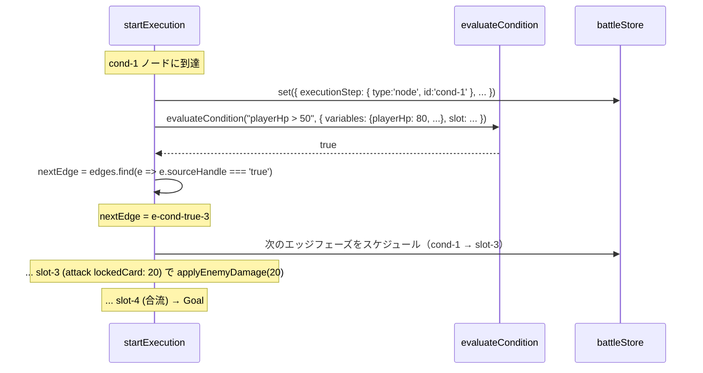
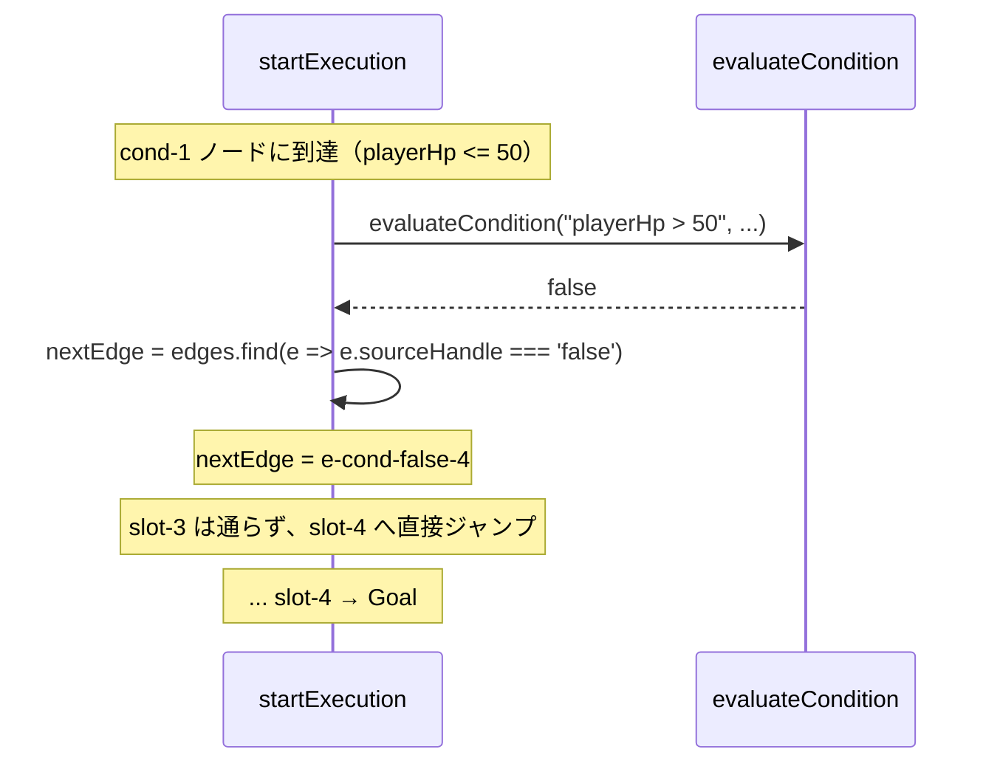
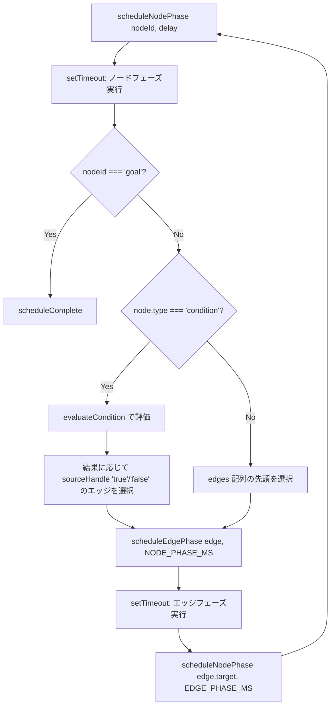

# 設計書: マップ 2 ステージ 1（map-2-stage-1）

## 概要

本機能は (1) 新規ノードタイプ `condition`（菱形）の React Flow カスタムノードを追加、(2) 条件式の安全な評価関数 `evaluateCondition` を新規実装（正規表現ベースのシンプルパーサー）、(3) `startExecution` のフェーズ実行を「事前計算の配列ループ」から「ランタイムで次のノードを選ぶ再帰スケジュール」方式に書き換え、(4) `stagesLoader.js` を分岐ステージ対応に拡張、(5) ステージ 2-1 を `stages.json` に追加、の 5 つの柱で実装する。

条件式の評価はランタイムで行う設計とし、`evaluateCondition` は `playerHp > 50` のような **変数比較式** と `slot('slot-1') === 'attack'` のような **関数式** をサポートする。`eval` / `new Function` は使わず、正規表現ベースのパターンマッチで安全に評価する。

実行ロジックは現状の「`phases.forEach` で一括スケジュール」を撤回し、「各フェーズ完了時点で次のフェーズを `setTimeout` で予約する」再帰スケジュール方式に置き換える。これにより条件評価結果が次のエッジ選択に反映される動的な実行モデルを実現する。既存のマップ 1 線形ステージ（1-1〜1-4）は同じ再帰スケジュール上で「次のエッジが常に 1 本」のケースとして矛盾なく動作する。

## アーキテクチャ

### コンポーネント

| コンポーネント | 責務 |
|---|---|
| `ConditionNode.jsx`（新規） | 菱形ノードの React Flow カスタム描画。中央に条件式テキスト、右頂点に `true` ハンドル、下頂点に `false` ハンドル |
| `ConditionNode.module.css`（新規） | 菱形（`clip-path: polygon`）、ハンドル位置、通過軌跡ハイライト |
| `evaluateCondition.js`（新規） | 条件式文字列を評価して `true` / `false` を返す。正規表現パーサー + 安全な値比較 |
| `battleStore.js` | `startExecution` を再帰スケジュール方式に書き換え、条件分岐ノード対応 |
| `stagesLoader.js` | 分岐ステージのフォールバック対応（明示 edges + position 必須を許容） |
| `FlowchartArea.jsx` | `nodeTypes` に `condition` を追加、`edgesToFlowEdges` で `sourceHandle` をサポート |
| `stages.json` | ステージ 2-1 を追加、`demoStageId` を `"2-1"` に変更 |

### データモデル

#### `stages.json` の構造拡張（ステージ 2-1）

```json
"2-1": {
  "enemyId": "wolf",
  "cards": [
    { "id": "attack", "power": 10 },
    { "id": "heal",   "power": 10 }
  ],
  "start": { "position": { "x": -120, "y": 120 } },
  "slots": [
    { "id": "slot-1", "position": { "x": 80,  "y": 120 }, "lockedCard": { "id": "monster", "power": 50 } },
    { "id": "slot-2", "position": { "x": 280, "y": 120 } },
    { "id": "slot-3", "position": { "x": 680, "y": 120 }, "lockedCard": { "id": "attack", "power": 20 } },
    { "id": "slot-4", "position": { "x": 880, "y": 120 } }
  ],
  "conditions": [
    { "id": "cond-1", "position": { "x": 480, "y": 120 }, "expression": "playerHp > 50" }
  ],
  "goal": { "position": { "x": 1080, "y": 120 } },
  "edges": [
    { "id": "e-start-1",      "source": "start",  "target": "slot-1" },
    { "id": "e-1-2",          "source": "slot-1", "target": "slot-2" },
    { "id": "e-2-cond",       "source": "slot-2", "target": "cond-1" },
    { "id": "e-cond-true-3",  "source": "cond-1", "sourceHandle": "true",  "target": "slot-3" },
    { "id": "e-3-4",          "source": "slot-3", "target": "slot-4" },
    { "id": "e-cond-false-4", "source": "cond-1", "sourceHandle": "false", "target": "slot-4" },
    { "id": "e-4-goal",       "source": "slot-4", "target": "goal" }
  ]
}
```

**新規フィールド:**
- `stage.conditions`: 条件分岐ノードの配列。各要素は `{ id, position, expression }` を持つ。
- `edges[].sourceHandle`: optional。条件分岐ノードからのエッジで `'true'` または `'false'` を指定。線形ステージでは省略。

#### `condition` ノードの構造

```js
{
  id: 'cond-1',
  type: 'condition',
  position: { x: 480, y: 120 },
  data: { expression: 'playerHp > 50' }
}
```

`FlowchartArea` 内で `stage.conditions` から React Flow ノード形式に変換する。

### API / インターフェース

#### `evaluateCondition(expression, context)`

```js
/**
 * @param {string} expression - 条件式文字列
 * @param {object} context - 実行時状態
 * @param {object} context.variables - 変数マップ。例: { playerHp: 70, enemyHp: 30, ... }
 * @param {(slotId: string) => string|null} context.slot - スロットに置かれているカードの id を返す関数
 * @returns {boolean}
 */
function evaluateCondition(expression, context) { ... }
```

**サポートする構文:**

| パターン | 例 |
|---|---|
| `変数 演算子 数値` | `playerHp > 50`、`enemyHp <= 30` |
| `変数 演算子 boolean` | `reflectActive === true` |
| `slot('id') 演算子 文字列` | `slot('slot-1') === 'attack'` |
| `slot('id') 演算子 null` | `slot('slot-3') === null` |

**演算子:** `>`、`<`、`>=`、`<=`、`===`、`!==`

**リテラル:** 整数、文字列（シングル/ダブルクォート）、`null`、`true`、`false`

#### `ConditionNode` の Handle 配置

```jsx
<Handle type="target" position={Position.Left}  isConnectable={false} />
<Handle type="source" position={Position.Right} id="true"  isConnectable={false} />
<Handle type="source" position={Position.Bottom} id="false" isConnectable={false} />
```

`Position.Right` と `Position.Bottom` は React Flow が「菱形の右頂点」「下頂点」相当の位置にハンドルを配置する。`id` 属性が `edges[].sourceHandle` と一致したエッジが対応するハンドルから引かれる。

## データフロー

### パターン 1: 条件分岐の True 経路実行



### パターン 2: 条件分岐の False 経路実行



### 再帰スケジュールの構造



## 実装方針

### 1. 条件式パーサー（`evaluateCondition.js`）

ファイル位置: `frontend/src/engine/evaluateCondition.js`

**実装方針:** 正規表現ベースの 2 パターンマッチ。AST を作らず、トップレベルの式をマッチさせる。

```js
const SLOT_PATTERN = /^slot\(\s*(['"])([^'"]+)\1\s*\)\s*(===|!==)\s*(.+)$/;
const VAR_PATTERN = /^(\w+)\s*(>=|<=|===|!==|>|<)\s*(.+)$/;

function evaluateCondition(expression, context) {
  if (typeof expression !== 'string') return false;
  const trimmed = expression.trim();

  // パターン 1: slot('id') op literal
  const slotMatch = trimmed.match(SLOT_PATTERN);
  if (slotMatch) {
    const [, , slotId, op, rightExpr] = slotMatch;
    const left = context.slot(slotId);  // 'attack' or null
    const right = parseLiteral(rightExpr.trim());
    return op === '===' ? left === right : left !== right;
  }

  // パターン 2: variable op literal
  const varMatch = trimmed.match(VAR_PATTERN);
  if (varMatch) {
    const [, varName, op, rightExpr] = varMatch;
    if (!(varName in context.variables)) {
      console.warn(`[evaluateCondition] unknown variable: ${varName}`);
      return false;
    }
    const left = context.variables[varName];
    const right = parseLiteral(rightExpr.trim());
    return compareValues(left, op, right);
  }

  console.warn(`[evaluateCondition] unparseable expression: "${expression}"`);
  return false;
}

function parseLiteral(str) {
  if (str === 'null') return null;
  if (str === 'true') return true;
  if (str === 'false') return false;
  if (/^-?\d+$/.test(str)) return parseInt(str, 10);
  const strMatch = str.match(/^(['"])([^'"]*)\1$/);
  if (strMatch) return strMatch[2];
  return undefined;
}

function compareValues(left, op, right) {
  switch (op) {
    case '>':   return left >  right;
    case '<':   return left <  right;
    case '>=':  return left >= right;
    case '<=':  return left <= right;
    case '===': return left === right;
    case '!==': return left !== right;
    default:    return false;
  }
}

export default evaluateCondition;
```

**安全性:**
- `eval` / `new Function` を使わないので任意コード実行リスクなし
- 正規表現でマッチしないパターンは `console.warn` + `false` を返すため、不正な式が来てもクラッシュしない
- 変数名は `context.variables` に事前に登録されたものだけアクセス可能

**`engine/` ディレクトリ:** `frontend/src/engine/` は README の「今後追加予定」に明記済み（UI 非依存の純粋ロジック置き場）。本機能で実体ファイルを置く好機。

### 2. `ConditionNode` の描画（菱形）

ファイル位置: `frontend/src/features/battle/flowchart/ConditionNode.jsx` および `.module.css`

```jsx
function ConditionNode({ id, data }) {
  const isActive = useBattleStore(
    (s) => s.executionStep?.type === 'node' && s.executionStep?.id === id,
  );
  const isTraversed = useBattleStore((s) => s.traversedNodeIds.includes(id));

  const className = [
    styles.diamond,
    isActive && styles.active,
    isTraversed && styles.traversed,
  ].filter(Boolean).join(' ');

  return (
    <div className={className}>
      <Handle type="target" position={Position.Left}  className={styles.handle} isConnectable={false} />
      <Handle type="source" position={Position.Right} id="true"  className={styles.handle} isConnectable={false} />
      <Handle type="source" position={Position.Bottom} id="false" className={styles.handle} isConnectable={false} />
      <div className={styles.expression}>{data.expression}</div>
    </div>
  );
}
```

**CSS（要点）:**

```css
.diamond {
  width: 140px;
  height: 140px;
  background: #15151c;
  border: 2px solid #6a6a78;
  clip-path: polygon(50% 0, 100% 50%, 50% 100%, 0 50%);
  display: flex;
  align-items: center;
  justify-content: center;
  box-sizing: border-box;
}

.expression {
  color: #f5f5f5;
  font-size: 0.75rem;
  text-align: center;
  padding: 0 1.5rem;  /* 菱形の左右が切れないよう内側にマージン */
  pointer-events: none;
}

.diamond.active {
  animation: slotHighlight 0.3s ease-in-out 2 alternate;
}

.diamond.traversed {
  filter: brightness(1.6) drop-shadow(0 0 10px rgba(229, 229, 255, 0.9));
}
```

`SlotNode` と同じ `@keyframes slotHighlight` を再利用する（共通化のため CSS で `composes` を使うか、両モジュールで同じキーフレーム名を宣言する形）。

**注意点:** `clip-path` で菱形を作ると、CSS の `border` が削れる可能性がある。`outline` で代替するか、内側に `::before` で同じ菱形を一回り小さく重ねる方式も検討。実装時に微調整。

### 3. 分岐対応のフェーズ実行（`battleStore.js` の `startExecution` 書き換え）

現状の `phases.forEach((phase, i) => setTimeout(..., phaseStartMs[i]))` パターンを破棄し、**再帰スケジュール方式** に切り替える。

```js
const beginSequence = () => {
  cancelExecutionTimers();

  // ノード/エッジのインデックス構築
  const nodeMap = buildNodeMap(stage);  // { 'start': {type:'start'}, 'slot-1': {type:'slot'}, 'cond-1': {type:'condition', expression:'...'}, ... }
  const edgesBySource = buildEdgesBySource(stage);  // { 'start': [edge], 'cond-1': [edgeTrue, edgeFalse], ... }

  set((s) => ({
    isExecuting: true,
    currentEnemyHp: s.maxEnemyHp,
    // ...既存のクリア
  }));

  scheduleNodePhase('start', 0);
};

const scheduleNodePhase = (nodeId, delay) => {
  const tid = setTimeout(() => {
    if (get().failPhase !== null) return;

    set((s) => ({
      executionStep: { type: 'node', id: nodeId },
      currentPhaseMs: NODE_PHASE_MS,
      traversedNodeIds: [...s.traversedNodeIds, nodeId],
    }));

    fireNodeEffect(nodeId);  // 既存の attack/monster/heal/guard/reflect 分岐

    if (nodeId === 'goal') {
      scheduleComplete(NODE_PHASE_MS);
      return;
    }

    const nextEdge = selectNextEdge(nodeId, nodeMap, edgesBySource);
    if (!nextEdge) {
      // 進めない → 強制完了（防御的）
      scheduleComplete(NODE_PHASE_MS);
      return;
    }

    scheduleEdgePhase(nextEdge, NODE_PHASE_MS);
  }, delay);
  executionTimers.push(tid);
};

const scheduleEdgePhase = (edge, delay) => {
  const tid = setTimeout(() => {
    if (get().failPhase !== null) return;

    set((s) => ({
      executionStep: { type: 'edge', id: edge.id },
      currentPhaseMs: EDGE_PHASE_MS,
      traversedEdgeIds: [...s.traversedEdgeIds, edge.id],
    }));

    // 既存の guard / reflect クリアロジック
    const prevNodeId = edge.source;
    const prevCard = get().slotAssignments[prevNodeId];
    const isPrevGuard = prevCard && prevCard.id === 'guard';
    const isPrevReflect = prevCard && prevCard.id === 'reflect';
    if (!isPrevGuard && get().guardShield > 0) get().clearGuard();
    if (!isPrevReflect && get().reflectActive) get().clearReflect();

    scheduleNodePhase(edge.target, EDGE_PHASE_MS);
  }, delay);
  executionTimers.push(tid);
};

const selectNextEdge = (nodeId, nodeMap, edgesBySource) => {
  const edges = edgesBySource[nodeId] ?? [];
  const node = nodeMap[nodeId];

  if (node?.type === 'condition') {
    const result = evaluateCondition(node.expression, buildEvalContext(get()));
    const target = result ? 'true' : 'false';
    return edges.find((e) => e.sourceHandle === target);
  }
  return edges[0];
};

const buildEvalContext = (state) => ({
  variables: {
    playerHp: state.currentPlayerHp,
    enemyHp: state.currentEnemyHp,
    maxPlayerHp: state.maxPlayerHp,
    maxEnemyHp: state.maxEnemyHp,
    guardShield: state.guardShield,
    reflectActive: state.reflectActive,
  },
  slot: (slotId) => {
    const card = state.slotAssignments[slotId];
    return card?.id ?? null;
  },
});

const scheduleComplete = (delay) => {
  const tid = setTimeout(() => {
    if (get().failPhase !== null) return;
    set({ isExecuting: false, executionStep: null, currentPhaseMs: null });
    const { currentEnemyHp, currentPlayerHp } = get();
    if (currentEnemyHp === 0 && currentPlayerHp > 0) {
      get().startVictorySequence(stage.enemyId);
    } else {
      set({ failPhase: 'shown' });
    }
  }, delay);
  executionTimers.push(tid);
};
```

**`fireNodeEffect(nodeId)`** は既存のカード効果分岐（attack/monster/heal/guard/reflect）をヘルパー関数に切り出した形。`condition` ノードに対しては何もしない（効果発火なし、ただ評価して次のエッジを選ぶ）。

**既存マップ 1 ステージとの互換性:**
- `node.type === 'condition'` でない場合は `edges[0]` を選ぶ（線形ステージは常に 1 本のエッジしか持たないので一致）
- `nodeMap` 構築時に、stage に `conditions` 配列がなくても問題なく動く（空マップに `start`/`slot-N`/`goal` を埋めるだけ）

### 4. `stagesLoader.js` の拡張

短縮形式のステージ（マップ 1）は既存ロジックで動作。分岐ステージは「明示形式」で書く前提で、ローダーは以下の対応を追加：

```js
function expandConditions(conditions) {
  if (!conditions) return [];
  return conditions.map((raw) => ({
    id: raw.id,
    position: raw.position,
    expression: raw.expression,
  }));
}

function expandStage(raw) {
  const slots = expandSlots(raw.slots ?? []);
  const conditions = expandConditions(raw.conditions);
  return {
    enemyId: raw.enemyId,
    cards: raw.cards ?? [],
    slots,
    conditions,
    start: expandStart(raw.start),
    goal: expandGoal(raw.goal, slots.length),
    edges: raw.edges ?? buildLinearEdges(slots),
  };
}
```

`conditions` フィールドが未指定なら空配列で展開し、既存ステージに影響しない。

### 5. `FlowchartArea.jsx` の対応

```js
import ConditionNode from './ConditionNode';

const nodeTypes = {
  slot: SlotNode,
  start: StartNode,
  goal: GoalNode,
  condition: ConditionNode,  // 新規
};
```

`stage.conditions` から React Flow ノードを生成する `conditionsToNodes` 関数を追加：

```js
function conditionsToNodes(conditions) {
  return conditions.map((c) => ({
    id: c.id,
    type: 'condition',
    position: c.position,
    data: { expression: c.expression },
  }));
}
```

`useMemo` 内で `nodes` 配列に condition ノードを追加：

```js
const nodes = useMemo(() => {
  const result = slotsToNodes(stage.slots);
  const startNode = startToNode(stage.start);
  const goalNode = goalToNode(stage.goal);
  const conditionNodes = conditionsToNodes(stage.conditions ?? []);
  if (startNode) result.unshift(startNode);
  if (goalNode) result.push(goalNode);
  result.push(...conditionNodes);
  return result;
}, [stage.slots, stage.start, stage.goal, stage.conditions]);
```

`edgesToFlowEdges` も `sourceHandle` を渡せるよう変更：

```js
function edgesToFlowEdges(edges, slots, conditions, hasStart, hasGoal) {
  const validIds = new Set(slots.map((s) => s.id));
  for (const c of conditions ?? []) validIds.add(c.id);
  if (hasStart) validIds.add('start');
  if (hasGoal) validIds.add('goal');
  return edges
    .filter((edge) => validIds.has(edge.source) && validIds.has(edge.target))
    .map((edge) => ({
      id: edge.id,
      source: edge.source,
      target: edge.target,
      sourceHandle: edge.sourceHandle,  // optional、condition ノードからのエッジで使う
      type: 'animated-progress',
      markerEnd: { type: MarkerType.ArrowClosed, color: '#6a6a78' },
    }));
}
```

### 6. ステージ 2-1 のデータ定義

`stages.json` に追加（具体的なノード配置と edges は「データモデル」セクション参照）。`demoStageId` を `"1-1"` から `"2-1"` に変更。

## 依存関係

| パッケージ | 用途 | 導入済み？ |
|---|---|---|
| なし | 新規パッケージ不要 | - |

既存の `zustand` / React / React Flow / CSS Modules / dnd-kit ですべて完結する。

## トレードオフと検討した代替案

- **決定内容**: 条件式パーサーを正規表現ベースで実装する
  **理由**: 現状の要件は「`変数 op リテラル`」「`slot(...) op リテラル`」の 2 パターンのみで、AST を作る必要がない。正規表現マッチ + 値比較で 50 行程度に収まる。将来 `&&` / `||` / 算術演算子を導入する必要が出たときに、トークナイザ + 再帰下降パーサーに置き換える（その時点で要件と複雑度が見えるので適切な実装に切り替えやすい）。
  **検討した代替案**:
  - **代替 1: トークナイザ + 再帰下降パーサー**: 拡張性は高いが、現状の要件には過剰。実装コードが 200+ 行になる。
  - **代替 2: 構造化オブジェクトで条件を表現**: JSON で `{ left: 'playerHp', op: '>', right: 50 }` と書く。パーサー不要だが、人が読みにくく `stages.json` が冗長になる。ユーザーの「文字列で書きたい」要望に反する。

- **決定内容**: 実行ロジックを「再帰スケジュール方式」に置き換える
  **理由**: 条件評価結果を反映するため、フェーズ列を事前計算するモデルが使えない。各ノード到達時にランタイムで次を決める必要がある。再帰スケジュール（`setTimeout` の中で次の `setTimeout` を予約）は実装がシンプルで、`executionTimers` の一括キャンセル機構（Fail 中断後の retryFromFail）もそのまま使える。
  **検討した代替案**:
  - **代替 1: 事前計算 + 全経路の組み合わせを保持**: 条件式の `true` / `false` で異なる経路をすべて事前に展開し、実行時に切り替える。経路数が指数的に増えるため非現実的。
  - **代替 2: 全ノードを巡回しつつ「実際に通った経路だけ実行」**: ノードを順番に巡るが、条件分岐で「通っていない」ノードはスキップ。フェーズ列に通っていないものまで含まれる構造になり、`traversedNodeIds` との整合が崩れる。

- **決定内容**: `evaluateCondition` を `engine/` ディレクトリに配置する
  **理由**: UI 非依存の純粋ロジックなので、`engine/` の典型例。将来 Python サーバーに移植する場合の「移植対象」明示にもなる（README で `engine/` の役割として明記済み）。
  **検討した代替案**:
  - **代替 1: `stores/battleStore.js` 内のローカル関数として書く**: ファイルが大きくなる。
  - **代替 2: `utils/` ディレクトリに置く**: `engine/` のほうがゲームロジックとしての意味合いが強い。

- **決定内容**: `condition` ノードは `stage.conditions` 配列で別管理する（`stage.slots` には含めない）
  **理由**: `slots` は dnd-kit のドロップターゲット・カード配置・効果発火の対象という意味的にまとまった概念。条件ノードはこれらをすべて持たない別系統なので、配列を分けてデータの責務を明確化する。
  **検討した代替案**:
  - **代替 1: `slots` に `type: 'condition'` を持たせて混在**: スロット番号体系（`slot-1` 等）と混ざって id 規約が曖昧になる。

- **決定内容**: `condition` ノードの hover / drop 関連挙動を持たせない
  **理由**: dnd-kit の `useDroppable` を呼ばないので、カードのドロップ判定対象にならない。`SlotNode` のように `pointer-events: auto` 等のドラッグ関連 CSS も不要。React Flow のノードとしては純粋に「視覚要素 + ハンドル」のみ。

- **決定内容**: ロック attack カードは既存の `lockedCard` 仕組みをそのまま流用する
  **理由**: `buildSlotAssignmentsFromStage` は `lockedCard.id` を見ているだけで、`id` の値に制限はない。`monster` でも `attack` でも、`{ instanceId, id, power, locked: true }` の形で構築される。`startExecution` 内の `attack` 分岐（`applyEnemyDamage`）もそのまま発火する。視覚区別は不要（要件 5-4 で `.lockedCard` クラスにより hover ハイライトが抑制される）。

## トレーサビリティ確認

| 要件 | 対応する設計セクション |
|---|---|
| 1-1〜1-3（condition ノードの定義と描画） | 実装方針 2（ConditionNode.jsx）、実装方針 5（FlowchartArea の nodeTypes 追加） |
| 1-4〜1-5（True / False ハンドル + sourceHandle） | 実装方針 2（Handle 配置）、実装方針 5（edgesToFlowEdges の sourceHandle サポート） |
| 2-1〜2-4（条件式の評価と安全性） | 実装方針 1（evaluateCondition の正規表現パーサー、eval 不使用） |
| 2-5〜2-6（変数と演算子） | 実装方針 1（VAR_PATTERN、compareValues） |
| 2-7〜2-9（関数式 slot(...) と リテラル） | 実装方針 1（SLOT_PATTERN、parseLiteral） |
| 3-1〜3-6（分岐対応のフェーズ実行） | 実装方針 3（再帰スケジュール、selectNextEdge での条件評価） |
| 4-1〜4-3（通過軌跡） | 実装方針 3（scheduleNodePhase / scheduleEdgePhase での traversedXxxIds 蓄積） |
| 5-1〜5-3（ロック attack カード） | 実装方針 6（既存 lockedCard 仕組みの流用） |
| 5-4（lockedCard クラスで hover 抑制） | 既存実装（SlotNode の lockedCard クラス、reflect-card-effect 後の追加分） |
| 6-1〜6-4（ステージ 2-1 のデータ） | データモデル（stages.json 構造）、実装方針 6 |
| 7-1〜7-3（demoStageId 変更） | 実装方針 6（stages.json の demoStageId 更新） |
| 8-1〜8-4（既存マップ 1 との整合） | 実装方針 3（線形ステージは `edges[0]` を選ぶケース）、実装方針 4（stagesLoader の `conditions ?? []` フォールバック） |
