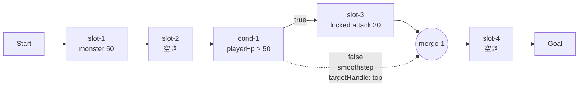
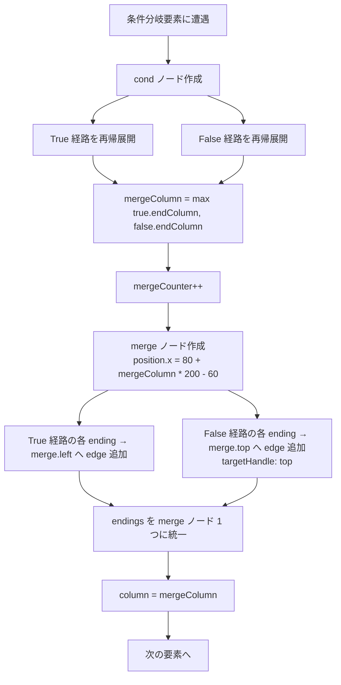

# 設計書: 合流ノードの追加（merge-node）

## 概要

本機能は (1) 新規ノードタイプ `merge`（小さな円）の React Flow カスタムノードを `MergeNode.jsx` として追加、(2) `stagesLoader.js` の `processSubFlow` を改修して条件分岐展開時に合流ノードを自動挿入、(3) `expandFlow` の戻り値に `mergeNodes` フィールドを追加して `FlowchartArea` がそれを描画、(4) `battleStore.js` の `startExecution` のノード効果分岐で `merge` 種別を「素通り」として処理、の 4 つの柱で実装する。

合流ノードは `stagesLoader` 内部で自動生成されるため、ステージデザイナーは `stages.json` の `flow` 配列に合流ノードを書く必要がない。合流ノードの座標は **「合流先ノードの x 座標 - 60px」** で算出し、合流先ノード（次の通常スロット または goal）の直前にマーカーとして配置される。

エッジの接続は、True 経路の終端 → `merge.left`（水平直線）、False 経路の終端 → `merge.top`（smoothstep）、`merge.right` → 合流先（水平直線）の 3 種類で、既存の `AnimatedProgressEdge` の `sourceHandleId === 'false' || targetHandleId === 'top'` 判定がそのまま機能する。

## アーキテクチャ

### コンポーネント

| コンポーネント | 責務 |
|---|---|
| `MergeNode.jsx`（新規） | 小さな円のカスタムノード描画。Left target / Top target / Right source の 3 Handle |
| `MergeNode.module.css`（新規） | 円のスタイル（直径 16px、白枠 + 暗背景）、ハンドル不可視、`.active` / `.traversed` 演出 |
| `stagesLoader.js`（既存編集） | `ctx` に `mergeCounter` / `mergeNodes` を追加、`processSubFlow` の条件分岐展開ロジックに合流ノード生成を組み込む、`expandFlow` の戻り値に `mergeNodes` を含める |
| `FlowchartArea.jsx`（既存編集） | `nodeTypes` に `merge: MergeNode` を追加、`mergeNodesToNodes` 関数を新規追加、`useMemo` の `nodes` 構築で `stage.mergeNodes` を含める、`edgesToFlowEdges` で `validIds` に merge id を追加 |
| `battleStore.js`（既存編集） | `nodeMap` 構築時に合流ノードを `{ type: 'merge' }` で登録、`scheduleNodePhase` で `node.type === 'merge'` のときカード効果分岐をスキップ |

### データモデル

#### `expandFlow` の戻り値（拡張）

```js
{
  slots: [...],
  conditions: [...],
  mergeNodes: [               // 新規
    { id: 'merge-1', position: { x: 820, y: 120 } },
  ],
  edges: [...],
  start: { position: { x: -120, y: 120 } },
  goal:  { position: { x: 1080, y: 120 } },
}
```

#### `ctx` の拡張（`processSubFlow` 内部状態）

```js
const ctx = {
  slotCounter: 0,
  condCounter: 0,
  mergeCounter: 0,       // 新規
  slots: [],
  conditions: [],
  mergeNodes: [],        // 新規
  edges: [],
};
```

#### MergeNode のデータ

```js
{
  id: 'merge-1',
  type: 'merge',
  position: { x: 820, y: 120 },
  data: {},  // 空オブジェクト（条件式や lockedCard を持たない）
}
```

### API / インターフェース

#### `MergeNode.jsx` のシグネチャ

```jsx
function MergeNode({ id }) {
  const isActive = useBattleStore(
    (s) => s.executionStep?.type === 'node' && s.executionStep?.id === id,
  );
  const isTraversed = useBattleStore((s) => s.traversedNodeIds.includes(id));
  // ... className 組み立て、3 ハンドル配置
}
```

#### Handle 構成

```jsx
<Handle type="target" position={Position.Left}  className={styles.handle} isConnectable={false} />
<Handle type="target" position={Position.Top} id="top" className={styles.handle} isConnectable={false} />
<Handle type="source" position={Position.Right} className={styles.handle} isConnectable={false} />
```

## データフロー

### ステージ 2-1 のノード/エッジ構造（合流ノード追加後）



### processSubFlow の合流ノード生成フロー



## 実装方針

### 1. `MergeNode.jsx` の新規作成

ファイル位置: `frontend/src/features/battle/flowchart/MergeNode.jsx`

```jsx
import { Handle, Position } from '@xyflow/react';
import useBattleStore from '../../../stores/battleStore';
import styles from './MergeNode.module.css';

function MergeNode({ id }) {
  const isActive = useBattleStore(
    (s) => s.executionStep?.type === 'node' && s.executionStep?.id === id,
  );
  const isTraversed = useBattleStore((s) => s.traversedNodeIds.includes(id));

  const className = [
    styles.circle,
    isActive && styles.active,
    isTraversed && styles.traversed,
  ]
    .filter(Boolean)
    .join(' ');

  return (
    <div className={className}>
      <Handle
        type="target"
        position={Position.Left}
        className={styles.handle}
        isConnectable={false}
      />
      <Handle
        type="target"
        position={Position.Top}
        id="top"
        className={styles.handle}
        isConnectable={false}
      />
      <Handle
        type="source"
        position={Position.Right}
        className={styles.handle}
        isConnectable={false}
      />
    </div>
  );
}

export default MergeNode;
```

### 2. `MergeNode.module.css` の新規作成

ファイル位置: `frontend/src/features/battle/flowchart/MergeNode.module.css`

```css
.circle {
  width: 16px;
  height: 16px;
  background: #f5f5f5;
  border-radius: 50%;
  box-sizing: border-box;
  position: relative;
  display: flex;
  align-items: center;
  justify-content: center;
}

.circle::before {
  content: '';
  position: absolute;
  inset: 3px;
  background: #15151c;
  border-radius: 50%;
}

.handle {
  width: 1px;
  height: 1px;
  min-width: 0;
  min-height: 0;
  background: transparent;
  border: none;
  opacity: 0;
  pointer-events: none;
}

.circle.active {
  animation: mergeHighlight 0.3s ease-in-out 2 alternate;
}

@keyframes mergeHighlight {
  from {
    filter: brightness(1) drop-shadow(0 0 0 rgba(229, 229, 255, 0));
  }
  to {
    filter: brightness(1.6) drop-shadow(0 0 8px rgba(229, 229, 255, 0.9));
  }
}

.circle.traversed {
  filter: brightness(1.6) drop-shadow(0 0 8px rgba(229, 229, 255, 0.9));
}
```

**意匠**:
- 外側 `.circle`: 直径 16px、白(`#f5f5f5`)で塗る
- 内側 `::before`: 3px 内側に暗色(`#15151c`)で塗る → 結果として「外側 3px の白い縁、内側暗色」の二重円リング
- `ConditionNode` の枠線実装と同じパターン

### 3. `stagesLoader.js` の `processSubFlow` 改修

#### 3a. `ctx` に新規フィールドを追加

`expandFlow` 関数内で `ctx` を初期化する箇所：

```js
const ctx = {
  slotCounter: 0,
  condCounter: 0,
  mergeCounter: 0,      // 追加
  slots: [],
  conditions: [],
  mergeNodes: [],       // 追加
  edges: [],
};
```

#### 3b. `processSubFlow` の条件分岐ブロックを書き換え

既存の条件分岐ブロック（True / False 経路の `endings` を合体させる箇所）を、合流ノードを介する形に変更：

```js
if (isCondition(item)) {
  ctx.condCounter += 1;
  const condId = `cond-${ctx.condCounter}`;
  ctx.conditions.push({
    id: condId,
    position: { x: 80 + column * 200, y: yLevel },
    expression: item.condition,
  });
  for (const ending of endings) {
    ctx.edges.push(buildEdge(ending, condId));
  }
  column += 1;

  const trueItems = item.true ?? [];
  const trueResult = processSubFlow(trueItems, {
    startColumn: column,
    yLevel,
    prevNodeId: condId,
    prevSourceHandle: 'true',
    ctx,
  });

  const falseItems = item.false ?? [];
  const falseResult = processSubFlow(falseItems, {
    startColumn: column,
    yLevel: yLevel + 160,
    prevNodeId: condId,
    prevSourceHandle: 'false',
    ctx,
  });

  // 合流ノード作成（新規ロジック）
  const mergeColumn = Math.max(trueResult.endColumn, falseResult.endColumn);
  ctx.mergeCounter += 1;
  const mergeId = `merge-${ctx.mergeCounter}`;
  ctx.mergeNodes.push({
    id: mergeId,
    position: { x: 80 + mergeColumn * 200 - 60, y: yLevel },
  });

  // True 経路の終端 → merge.left（直線）
  for (const ending of trueResult.endings) {
    ctx.edges.push(buildEdge(ending, mergeId));
  }

  // False 経路の終端 → merge.top（smoothstep）
  for (const ending of falseResult.endings) {
    ctx.edges.push(buildEdge({ ...ending, targetHandle: 'top' }, mergeId));
  }

  // endings を merge ノード 1 つに統一（次の通常スロット へのエッジは merge → slot.left）
  endings = [{ nodeId: mergeId, sourceHandle: undefined }];

  // column を進める（次の通常スロットは mergeColumn 位置に置く）
  column = mergeColumn;
}
```

**重要なポイント**:
- 合流ノードの `position.x = 80 + mergeColumn * 200 - 60`：合流先ノードの左端 60px 手前。slot-4 が x=880 なら、merge は x=820 に配置される
- `endings` を **merge ノード 1 つに統一**：次のループ周回で通常スロット要素が来たとき、merge から slot.left へ直線エッジが引かれる
- `column = mergeColumn`：次の通常スロットは mergeColumn の位置に置かれる（合流ノードと同じ列扱いだが、merge は x=820、slot は x=880 で重ならない）

#### 3c. `expandFlow` の戻り値に `mergeNodes` を追加

```js
return {
  slots: ctx.slots,
  conditions: ctx.conditions,
  mergeNodes: ctx.mergeNodes,  // 追加
  edges: ctx.edges,
  start: { position: { x: -120, y: 120 } },
  goal: { position: { x: 80 + result.endColumn * 200, y: 120 } },
};
```

#### 3d. `expandStage` の `slots` ルートに `mergeNodes: []` を追加（後方互換）

線形ステージ（`slots` ルート）の戻り値にも `mergeNodes: []` を含める：

```js
const slots = expandSlots(raw.slots ?? []);
return {
  enemyId: raw.enemyId,
  cards: raw.cards ?? [],
  slots,
  conditions: expandConditions(raw.conditions),
  mergeNodes: [],  // 追加
  start: expandStart(raw.start),
  goal: expandGoal(raw.goal, slots.length),
  edges: raw.edges ?? buildLinearEdges(slots),
};
```

これにより、`battleStore` / `FlowchartArea` は常に `stage.mergeNodes` が配列であることを前提にできる。

### 4. `FlowchartArea.jsx` の改修

#### 4a. `MergeNode` の import 追加

```jsx
import MergeNode from './MergeNode';
```

#### 4b. `nodeTypes` に `merge` を追加

```js
const nodeTypes = {
  slot: SlotNode,
  start: StartNode,
  goal: GoalNode,
  condition: ConditionNode,
  merge: MergeNode,  // 追加
};
```

#### 4c. `mergeNodesToNodes` 関数の新規追加

`conditionsToNodes` の隣に：

```js
function mergeNodesToNodes(mergeNodes) {
  return mergeNodes.map((m) => ({
    id: m.id,
    type: 'merge',
    position: m.position,
    data: {},
  }));
}
```

#### 4d. `useMemo` の `nodes` 構築で `mergeNodes` を含める

```jsx
const nodes = useMemo(() => {
  const result = slotsToNodes(stage.slots);
  const startNode = startToNode(stage.start);
  const goalNode = goalToNode(stage.goal);
  const conditionNodes = conditionsToNodes(stage.conditions ?? []);
  const mergeNodes = mergeNodesToNodes(stage.mergeNodes ?? []);  // 追加
  if (startNode) result.unshift(startNode);
  if (goalNode) result.push(goalNode);
  result.push(...conditionNodes);
  result.push(...mergeNodes);  // 追加
  return result;
}, [stage.slots, stage.start, stage.goal, stage.conditions, stage.mergeNodes]);
```

#### 4e. `edgesToFlowEdges` の `validIds` に merge id を追加

```js
function edgesToFlowEdges(edges, slots, conditions, mergeNodes, hasStart, hasGoal) {
  const validIds = new Set(slots.map((slot) => slot.id));
  for (const c of conditions) validIds.add(c.id);
  for (const m of mergeNodes) validIds.add(m.id);  // 追加
  if (hasStart) validIds.add('start');
  if (hasGoal) validIds.add('goal');
  // ...以下既存
}
```

呼び出し側も `mergeNodes` を渡す：

```jsx
const edges = useMemo(
  () => edgesToFlowEdges(
    stage.edges,
    stage.slots,
    stage.conditions ?? [],
    stage.mergeNodes ?? [],  // 追加
    !!stage.start,
    !!stage.goal,
  ),
  [stage.edges, stage.slots, stage.conditions, stage.mergeNodes, stage.start, stage.goal],
);
```

### 5. `battleStore.js` の `nodeMap` と `scheduleNodePhase` の改修

#### 5a. `nodeMap` 構築に merge ノードを追加

`scheduleNodePhase` 直前の `nodeMap` 構築箇所：

```js
const nodeMap = {};
nodeMap['start'] = { type: 'start' };
nodeMap['goal'] = { type: 'goal' };
for (const slot of stage.slots ?? []) {
  nodeMap[slot.id] = { type: 'slot' };
}
for (const c of stage.conditions ?? []) {
  nodeMap[c.id] = { type: 'condition', expression: c.expression };
}
for (const m of stage.mergeNodes ?? []) {  // 追加
  nodeMap[m.id] = { type: 'merge' };
}
```

#### 5b. `scheduleNodePhase` のカード効果分岐に変更なし

既存の効果分岐（`attack` / `monster` / `heal` / `guard` / `reflect`）は `card` 変数を見ているが、merge ノードは `slotAssignments[mergeId]` が `undefined` なので `card` も `undefined` になり、どの分岐にも該当しない。**追加コードなしで「素通り」が成立する**。

`executionStep` / `traversedNodeIds` への追加は既存ロジックで自動的に行われる（要件 4-2 を満たす）。

### 6. ステージ 2-1 の動作確認

`stages.json` のステージ 2-1 は **無変更**。`stagesLoader` が自動的に合流ノードを挿入する。

期待される展開結果：
- `slots`: 4 件（slot-1〜slot-4）
- `conditions`: 1 件（cond-1）
- `mergeNodes`: 1 件（merge-1、position.x = 820）
- `edges`: 8 件
  - `e-start-slot-1`、`e-slot-1-slot-2`、`e-slot-2-cond-1`：メイン経路
  - `e-cond-1-slot-3`（sourceHandle: 'true'）：True 経路
  - `e-slot-3-merge-1`：True 経路終端 → 合流
  - `e-cond-1-merge-1`（sourceHandle: 'false'、targetHandle: 'top'）：False 経路 → 合流（smoothstep）
  - `e-merge-1-slot-4`：合流 → 次のスロット
  - `e-slot-4-goal`：メイン経路最後

## 依存関係

| パッケージ | 用途 | 導入済み？ |
|---|---|---|
| なし | 新規パッケージ不要 | - |

既存の `@xyflow/react` / `zustand` / CSS Modules ですべて完結する。

## トレードオフと検討した代替案

- **決定内容**: 合流ノードを `ctx.mergeNodes` 配列で `slots` / `conditions` とは別管理する
  **理由**: 合流ノードは「素通りするマーカー」であり、`slot` のようなカード配置場所でも `condition` のような評価対象でもない。配列を分けることで、`battleStore` / `FlowchartArea` で「これは合流ノードか?」を `type` で 1 行判定できる。
  **検討した代替案**:
  - **代替 1: `slots` に `type: 'merge'` のフラグを追加**: スロット番号の規約と混在し、id 衝突や効果分岐の意図が曖昧になる。

- **決定内容**: 合流ノードの座標を `80 + mergeColumn * 200 - 60` で計算する（合流先の 60px 手前）
  **理由**: 合流ノードと合流先ノードの間に「短いエッジ」を確保しつつ、合流ノードと True 経路の終端ノードの間にも余裕を持たせる。`-60` は「合流ノードのサイズ 16 + 余白」を考慮した値。
  **検討した代替案**:
  - **代替 1: `mergeColumn` の次の列に置く**（合流先 column を +1）: 合流ノードと合流先の間隔が広がりすぎて、合流の意味が薄れる。
  - **代替 2: 合流ノードを合流先と同じ列に置く（重ねる）**: ノードが重なって視認性が悪い。

- **決定内容**: 合流ノードを `battleStore` で「素通り」させる（カード効果分岐に追加しない）
  **理由**: 合流ノードに `slotAssignments[id]` が存在しないため、`card` が `undefined` になり、既存の効果分岐は自然にスキップされる。**追加コードなしで素通りが成立する**シンプルな設計。
  **検討した代替案**:
  - **代替 1: `node.type === 'merge'` を明示的にチェックする `if` を追加**: 冗長。既存ロジックがそのまま機能するなら追加しない方が良い（YAGNI）。

- **決定内容**: 合流ノードを視覚的に「小さな円（直径 16px）」で描画する
  **理由**: IEC 5807 等のフローチャート慣習で「合流」は円で表現される。条件分岐の菱形と視覚的に明確に区別される。
  **検討した代替案**:
  - **代替 1: 完全に見えない 4px 透明点**: 視覚マーカーがないと「ここで合流している」が分かりにくい。
  - **代替 2: 菱形（条件分岐と同じ形）**: 条件分岐と混同するリスクがある。

- **決定内容**: 合流ノードの id 採番を `merge-K`（`slot-N` / `cond-M` と独立した連番）
  **理由**: id 衝突を避けつつ、ノード種別がそのまま id 接頭辞で分かる（デバッグ性）。
  **検討した代替案**:
  - **代替 1: グローバル連番（種別ごとに分けない）**: 種別が id から読み取れず、デバッグ時に手間。

## トレーサビリティ確認

| 要件 | 対応する設計セクション |
|---|---|
| 1-1〜1-5（MergeNode の追加と描画） | 実装方針 1（`MergeNode.jsx`）、実装方針 2（`.module.css`） |
| 2-1〜2-3（自動挿入と id 採番） | 実装方針 3a（`ctx.mergeCounter`）、3b（`processSubFlow` の合流ノード作成） |
| 2-3（座標計算 `合流先.x - 60`） | 実装方針 3b（`position.x = 80 + mergeColumn * 200 - 60`） |
| 2-4〜2-6（エッジの自動付与） | 実装方針 3b（True/False 経路の終端から merge へのエッジ生成） |
| 2-7（合流先が goal の場合） | 実装方針 3b（`endings = [{merge}]` を返し、ループ後に `merge → goal` のエッジが既存ロジックで引かれる） |
| 3-1〜3-3（`mergeNodes` フィールド追加） | 実装方針 3c（`expandFlow` の戻り値）、3d（`expandStage` の `slots` ルートにも `mergeNodes: []`） |
| 4-1〜4-3（合流ノードの素通り） | 実装方針 5（`nodeMap` に追加するが、`slotAssignments` に存在せず効果分岐スキップ） |
| 5-1〜5-4（エッジの描画） | 実装方針 3b（エッジ生成時に `targetHandle: 'top'` を False 経路のみに付与）、既存の `AnimatedProgressEdge` の判定 |
| 6-1〜6-3（入れ子分岐への対応） | 実装方針 3b（`ctx.mergeCounter` がグローバルカウンター、再帰呼び出しで各レベルが独立した合流ノードを生成） |
| 7-1〜7-4（ステージ 2-1 の動作確認） | 実装方針 6（具体的な展開結果の例示） |
| 8-1〜8-3（マップ 1 への影響なし） | 実装方針 3d（`slots` ルートで `mergeNodes: []`）、実装方針 4（既存ノード描画に影響なし） |
