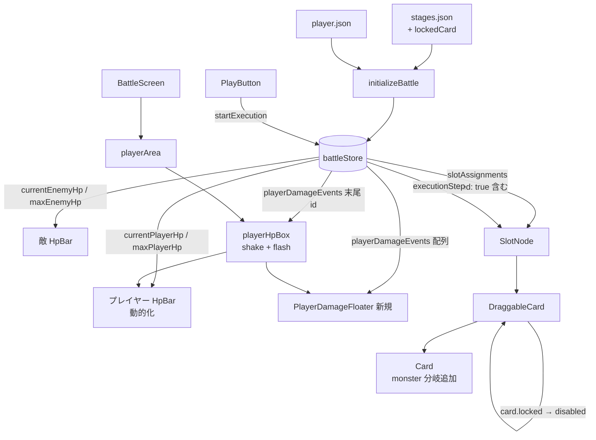
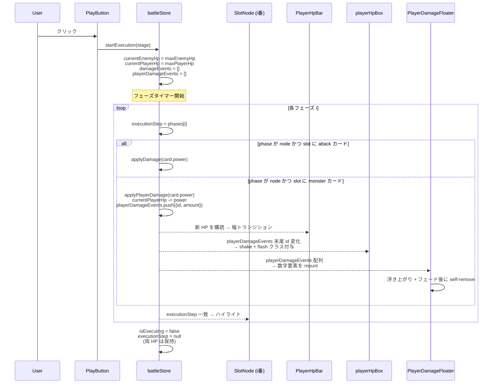

# 設計書: モンスターカードによるプレイヤー被弾処理

## 概要

`requirements.md` で定義した「モンスターカード ＝ ステージ定義側で固定配置されるカードで、通過するとプレイヤーが被弾する」機構を、既存の `battleStore` ／ `startExecution` のフェーズタイマー／ React Flow ベースのスロット描画にミラー対称な形で統合する。中心となる設計判断は次の 4 点。

1. **モンスターカードは「ロック付きカード」として `slotAssignments` に乗せる**: 専用のサブツリーや並列状態を作らず、`CardInstance` に `locked: true` を持たせるだけで「ユーザーが触れない」を表現する。`computeDropTransition` 側で `locked` を見て drag-out / drop-onto を拒否する。`ResetButton` は既存どおり `initializeBattle(stage)` を呼ぶだけで、ロック付きカードはステージ定義から再構築されるので自動的に保持される。
2. **プレイヤー HP は敵 HP と完全対称な追加状態**: `currentPlayerHp` / `maxPlayerHp` / `playerDamageEvents` / `_playerDamageCounter` を `battleStore` に増設する。新規アクションは `applyPlayerDamage(amount)` / `dismissPlayerDamageEvent(id)`。既存の `applyDamage` ／ `dismissDamageEvent` の挙動と命名を揃える。
3. **モンスターカード被弾は `startExecution` のフェーズタイマー内で発火する**: 既存の attack カード判定の隣に `card.id === 'monster' && card.power > 0` の分岐を追加するだけで、ハイライト・ダメージ適用・演出が同じタイマー上に揃う。
4. **モンスターカードの仮ビジュアルは `Card.jsx` 内の条件分岐 1 箇所で実現する**: `card.id === 'monster'` のときだけ画像参照ではなくスタイル付きの `<div>` を描画する。デザイン班から `monster.png` を受領した時点で、その分岐ブロックを削除すれば既存の `` フローに合流する。「あとで剥がしやすい単一の if 分岐」として実装することで、本物アセット差し替え時の作業を最小化する。

本設計は要件 1〜8 をすべて満たし、既存の `attack-processing` / `card-placement` / `play-button` / `flowchart-zoom` / `victory-clear` の挙動には変更を入れない（追加と内部分岐の追加のみ）。

## アーキテクチャ

### コンポーネント構成図



### データフロー（実行 → 被弾 → 演出）



### 1 ヒット分の演出タイミング

```
  T=0ms                                                T=phaseMs
  │                                                    │
  ├─ executionStep = {node, slot-i (monster)}
  ├─ applyPlayerDamage(power)
  │    ├─ プレイヤー HP バー幅: 0.25s ease-out で新比率へ
  │    ├─ playerHpBox shake + flash: 0.3s で 1 回（赤系）
  │    └─ PlayerDamageFloater: 「-N」を 0.8s で上昇＋フェードアウト
  │                                                    │
  │                                                    └ 自己 unmount
  ├─ SlotNode .active: 0.3s × 2 alternate（既存）
  └────────────────────────────── 次フェーズへ
```

3 演出すべて 1 フェーズ内に収まる。フロート数字だけ 0.8s と少し長いが、別レイヤなので干渉しない（要件 7-4）。

## データモデル

### `stages.json` のスキーマ拡張

各スロットに `lockedCard` フィールドをオプショナルで追加できるようにする。

```json
{
  "1-2": {
    "enemyId": "wolf",
    "cards": [...],
    "slots": [
      { "id": "slot-1", "position": { "x": 80,  "y": 120 } },
      {
        "id": "slot-2",
        "position": { "x": 280, "y": 120 },
        "lockedCard": { "id": "monster", "power": 50 }
      },
      { "id": "slot-3", "position": { "x": 480, "y": 120 } }
    ],
    ...
  }
}
```

#### スキーマ設計のポイント

- **`lockedCard` はスロット定義の中にネストする**: 「どのスロットがロック対象か」と「そのスロットに何のカードが入っているか」を 1 箇所にまとめる。別配列にして `slotId` で参照する案より、スロットを読めば全部わかるので可読性が高い。
- **将来 `monster` 以外のカードもロック配置できる**: フィールド名は `monster` 固有にせず `lockedCard` とし、`{ id, power }` だけを持たせる。将来「最初から `guard` が固定で配置済み」のようなギミックが欲しくなっても、同じスキーマで表現できる。
- **`lockedCard` を持たないスロットは従来通り**: 既存の `1-1` / `1-3` / `1-4` ステージ JSON は変更不要。

#### デモステージの値（`1-2`）

要件 2-5 に従い、`1-2` の `slot-2` にモンスターカードを 1 枚配置する。`power` 値は **50**（プレイヤー maxHp 100 から見て「1 回通ると HP 半減」の手応えのある値）。`power` の最終値は実装後の動作確認時にプレイヤーが調整する余地を残す。

### `CardInstance` の拡張

ロック対象カードのみ `locked: true` を持つ。`expandHandCards` には影響しない（ロックカードは手札に乗らないため）。`initializeBattle` 内で `slotAssignments` を作る際、`stages.json` の `slots[].lockedCard` があるスロットには下記のカードオブジェクトを直接置く。

```js
{
  instanceId: 'locked-slot-2',  // スロット ID 由来の安定 ID
  id: 'monster',
  power: 50,
  locked: true,
}
```

`instanceId` は `locked-${slotId}` 規約で生成する。`expandHandCards` が使う `c-${index}` 体系と衝突せず、かつ「どのスロット由来のロックカードか」が ID から読み取れる。

## 状態管理（`battleStore` の拡張）

### 追加する state

| キー                      | 型                                  | 初期値 | 更新タイミング                                                                                |
| ------------------------- | ----------------------------------- | ------ | --------------------------------------------------------------------------------------------- |
| `currentPlayerHp`         | `number`                            | `0`    | `initializeBattle` で `player.json.maxHp` に。`startExecution` で `maxHp` に戻し、ヒット毎に減算 |
| `maxPlayerHp`             | `number`                            | `0`    | `initializeBattle` で `player.json` から取得して保持                                          |
| `playerDamageEvents`      | `Array<{id:string, amount:number}>` | `[]`   | ヒット毎に `push`、`startExecution` 開始時にクリア                                            |
| `_playerDamageCounter`    | `number`                            | `0`    | `applyPlayerDamage` 毎に +1（React `key` 用、内部のみ）                                       |

`playerData` は既存の `BattleScreen.jsx` から `import` を `battleStore.js` 側へ移す（敵側と同じ「真実の所在は store に閉じる」設計）。

### 追加・変更するアクション

#### `initializeBattle(stage)` の拡張

ロックカード復元・プレイヤー HP 初期化・プレイヤー演出キュークリアを追加する。`emptySlotAssignments` の代わりに `buildSlotAssignmentsFromStage(stage)` を新設し、`lockedCard` を反映した初期割当を作る。

```js
function buildSlotAssignmentsFromStage(stage) {
  const assignments = {};
  for (const slot of stage.slots ?? []) {
    if (slot.lockedCard) {
      assignments[slot.id] = {
        instanceId: `locked-${slot.id}`,
        id: slot.lockedCard.id,
        power: slot.lockedCard.power,
        locked: true,
      };
    } else {
      assignments[slot.id] = null;
    }
  }
  return assignments;
}

initializeBattle: (stage) => {
  const enemy = enemiesData.enemies.find((e) => e.id === stage.enemyId);
  const maxEnemyHp = enemy?.maxHp ?? 0;
  const maxPlayerHp = playerData.maxHp ?? 0;
  set(() => ({
    handCards: expandHandCards(stage.cards ?? []),
    slotAssignments: buildSlotAssignmentsFromStage(stage),
    activeInstanceId: null,
    maxEnemyHp,
    currentEnemyHp: maxEnemyHp,
    damageEvents: [],
    maxPlayerHp,
    currentPlayerHp: maxPlayerHp,
    playerDamageEvents: [],
    victoryPhase: null,
  }));
}
```

#### `computeDropTransition` の拡張（要件 2-2, 2-3）

ロックカードに対する drag-out / drop-onto を冒頭ガードで弾く。

```js
function computeDropTransition(state, { instanceId, source, destination }) {
  // 既存ガード省略

  // 要件 2-3: ロックカードを source 側からドラッグした場合は無効化
  if (source !== HAND) {
    const sourceCard = state.slotAssignments[source];
    if (sourceCard?.locked) {
      return {};
    }
  }

  // 要件 2-2: ロックカードが乗っているスロットには何も置けない
  if (destination !== null) {
    const destCard = state.slotAssignments[destination];
    if (destCard?.locked) {
      return {};
    }
  }

  // 既存ロジック続く
}
```

第一層のガードに過ぎず、`DraggableCard` 側でも `disabled` を付けて二重防御する（後述）。

#### `startExecution(stage)` の拡張（要件 4-1, 5-1）

`beginSequence` 冒頭でプレイヤー HP リセットと `playerDamageEvents` クリアを追加。フェーズタイマー内に `monster` カード分岐を追加する。

```js
const beginSequence = () => {
  const phases = buildExecutionPath(stage);
  const totalMs = stage.slots.length * EXECUTION_PER_CARD_MS;
  const phaseMs = totalMs / phases.length;

  set((s) => ({
    isExecuting: true,
    currentPhaseMs: phaseMs,
    currentEnemyHp: s.maxEnemyHp,
    damageEvents: [],
    currentPlayerHp: s.maxPlayerHp,        // 要件 5-1
    playerDamageEvents: [],
  }));

  phases.forEach((phase, i) => {
    setTimeout(() => {
      set({ executionStep: phase });
      if (phase.type === 'node') {
        const card = get().slotAssignments[phase.id];
        if (card && card.id === 'attack' && card.power > 0) {
          get().applyDamage(card.power);
        }
        // 要件 4-1, 4-2, 4-4: monster カードのフェーズで applyPlayerDamage
        if (card && card.id === 'monster' && card.power > 0) {
          get().applyPlayerDamage(card.power);
        }
      }
    }, i * phaseMs);
  });
  setTimeout(() => {
    set({ isExecuting: false, executionStep: null, currentPhaseMs: null });
    if (get().currentEnemyHp === 0) {
      get().startVictorySequence(stage.enemyId);
    }
    // プレイヤー HP=0 時の敗北処理は別スペック（要件 3-4）。ここでは何もしない。
  }, phases.length * phaseMs);
};
```

`if/if` の並列構造にすることで、将来 `card.id` が増えても同じパターンで追加できる。`else if` チェーンにすると順序依存が生まれるので避ける。

#### 新規アクション `applyPlayerDamage(amount)`（要件 3-3, 4-1）

```js
applyPlayerDamage: (amount) => set((state) => {
  const nextHp = Math.max(0, state.currentPlayerHp - amount);
  const id = `pd-${state._playerDamageCounter}`;
  return {
    currentPlayerHp: nextHp,
    playerDamageEvents: [...state.playerDamageEvents, { id, amount }],
    _playerDamageCounter: state._playerDamageCounter + 1,
  };
})
```

- 0 クランプは `Math.max(0, ...)` で担保（要件 3-3）。
- ID プレフィックスは敵側の `d-` と区別するため `pd-`（player damage）。

#### 新規アクション `dismissPlayerDamageEvent(id)`

```js
dismissPlayerDamageEvent: (id) => set((state) => ({
  playerDamageEvents: state.playerDamageEvents.filter((e) => e.id !== id),
}))
```

`PlayerDamageFloater` の各浮き数字が `onAnimationEnd` で呼び出して自身を unmount する。`damageEvents` 側と完全対称。

### state リセット境界の整理

| イベント                                | `maxPlayerHp` | `currentPlayerHp` | `playerDamageEvents` | `slotAssignments` (locked) |
| --------------------------------------- | ------------- | ----------------- | -------------------- | -------------------------- |
| 戦闘画面マウント (`initializeBattle`)   | 設定          | `maxHp` で初期化  | `[]`                 | ステージ定義から復元       |
| 実行開始 (`startExecution`)             | 触らない      | `maxHp` に復帰    | `[]`                 | 触らない                   |
| 実行完了                                | 触らない      | 保持（結果値）    | 演出が終わるまで残り、各要素が自分で `dismiss` | 触らない               |
| リセットボタン (`initializeBattle` 経由) | 設定           | `maxHp` で初期化  | `[]`                 | ステージ定義から復元（lockedは保持） |
| 拡大トグル                              | 触らない      | 触らない          | 触らない             | 触らない                   |

> 注: リセットボタンは `initializeBattle(stage)` を呼ぶので、上の表どおり HP もリセットされる。要件 5-4 は「リセットボタンの責務は配置のみ」と書いているが、これは敵 HP の「実行で削れた値の保持」に関する文脈で、`initializeBattle` を呼ぶ時点では当然 HP も初期化される（敵 HP も `maxEnemyHp` に戻る）。要件 5-4 が言いたいのは「実行終了後に手動でリセットを押しても HP に余分な追加変化を与えない」であり、本設計はそれを満たしている。

## コンポーネント設計

### 1. `BattleScreen.jsx` の改修

ローカル変数 `playerMaxHp` をストア値に置き換え、`playerHpBox` を `position: relative` のラッパーにして `PlayerDamageFloater` を内側で重ねる。

```jsx
const currentPlayerHp = useBattleStore((s) => s.currentPlayerHp);
const maxPlayerHp = useBattleStore((s) => s.maxPlayerHp);
```

```jsx
<div className={styles.playerArea}>
  <div className={styles.playerHpBox}>
    <HpBar currentHp={currentPlayerHp} maxHp={maxPlayerHp} />
    <span className={styles.hpText}>
      {currentPlayerHp}/{maxPlayerHp}
    </span>
    <PlayerDamageFloater />
  </div>
  <Hand />
</div>
```

`playerHpBox` は既存の `hpBox` をベースに `position: relative` を加えた新クラス（敵側の `enemyArea { position: relative }` と同じ役割）。`PlayerDamageFloater` を `position: absolute; inset: 0; pointer-events: none;` で重ねる。

`playerData` の import は `BattleScreen.jsx` から削除可能（store に移管したため）。

#### 既存 `playerArea` のレイアウトとの衝突回避

`playerArea` は `display: flex; align-items: center; justify-content: space-between;` で「左：HP バー、右：手札」のレイアウト。`hpBox` を `playerHpBox` に置き換えるだけで横並びは維持できる。`PlayerDamageFloater` を内側に絶対配置するため、`playerHpBox` が `position: relative` を持つことに加えて `flex-shrink: 0` を保つようにする（数字フロートのサイズで横幅が狂わないように）。

### 2. `PlayerDamageFloater.jsx`（新規、要件 7-1, 7-2, 7-4）

`damageEvents` 用の `DamageFloater` と完全対称。色だけ赤系で固定し、文字位置・アニメーション形状は同じに揃える。

```jsx
function PlayerDamageFloater() {
  const events = useBattleStore((s) => s.playerDamageEvents);
  const dismiss = useBattleStore((s) => s.dismissPlayerDamageEvent);

  return (
    <div className={styles.layer}>
      {events.map((e) => (
        <span
          key={e.id}
          className={styles.number}
          onAnimationEnd={() => dismiss(e.id)}
        >
          -{e.amount}
        </span>
      ))}
    </div>
  );
}
```

#### CSS（`PlayerDamageFloater.module.css`）

```css
.layer {
  position: absolute;
  inset: 0;
  pointer-events: none;
  display: flex;
  align-items: center;
  justify-content: center;
}

.number {
  position: absolute;
  font-family: 'Press Start 2P', 'Courier New', Courier, monospace;
  font-size: 1.25rem;
  color: #ff5d5d;
  text-shadow: 0 0 4px #000, 0 2px 0 #000;
  animation: damageFloat 0.8s ease-out forwards;
}

@keyframes damageFloat {
  0%   { transform: translateY(0)     scale(1.0); opacity: 1; }
  20%  { transform: translateY(-12px) scale(1.15); opacity: 1; }
  100% { transform: translateY(-48px) scale(1.0); opacity: 0; }
}
```

敵側 `DamageFloater` のキーフレームと完全に同じ。敵側との **見た目の差別化** は文字色（敵側は `#ff5d5d` で同じだが、フォントサイズはスペース確保のため `1.25rem` に縮小）。

> 補足: 既存 `DamageFloater` のスタイルを共通化（`shared.module.css`）にする選択肢もあるが、本スペックは追加スコープ最小化を優先し、CSS は重複させる。重複コードが許容範囲を超えたら別タスクで共通化する。

### 3. プレイヤー HP バーの被弾演出（要件 7-3, 7-5）

`playerHpBox` 自体が `playerDamageEvents` の末尾 ID を購読し、変化したら `.flashing` クラスを 1 ショット付与する。`onAnimationEnd` でクラスを外し、次の被弾でも再発火できるようにする。

#### 設計のポイント

- **演出はラッパー（`playerHpBox`）にかける**: HP バー本体（共通 `HpBar.jsx`）には手を入れない。共通コンポーネントに「敵側」「プレイヤー側」の文脈を持ち込まないため。
- **shake + flash を 1 つのキーフレームに合成する**: 別々のアニメーションを重ねると同期が崩れるリスクがあるので、`transform: translateX` と `filter: brightness/saturate/hue-rotate` を 1 つの `@keyframes` で同時にカーブさせる。
- **既存の `HpBar` の `transition: width 0.25s ease-out`** はそのまま生きるので、HP の数値変化はバー側で滑らかに減り、外枠の演出は被弾の瞬間にのみ走る。両者が独立して機能する。

#### 実装スケッチ

```jsx
const lastEventId = useBattleStore(
  (s) => s.playerDamageEvents.at(-1)?.id ?? null,
);
const [hitKey, setHitKey] = useState(null);

useEffect(() => {
  if (lastEventId) setHitKey(lastEventId);
}, [lastEventId]);

const className = `${styles.playerHpBox} ${hitKey ? styles.hit : ''}`;

return (
  <div
    className={className}
    onAnimationEnd={() => setHitKey(null)}
  >
    ...
  </div>
);
```

#### CSS（`BattleScreen.module.css` への追加）

```css
.playerHpBox {
  display: flex;
  align-items: center;
  gap: 0.75rem;
  font-variant-numeric: tabular-nums;
  position: relative;
  flex-shrink: 0;
}

.playerHpBox.hit {
  animation: playerHit 0.3s ease-out 1;
}

@keyframes playerHit {
  0%   { transform: translateX(0);   filter: brightness(1)   saturate(1); }
  15%  { transform: translateX(-4px); filter: brightness(1.3) saturate(1.5) hue-rotate(-10deg); }
  35%  { transform: translateX(4px);  filter: brightness(1.4) saturate(1.6) hue-rotate(-15deg); }
  55%  { transform: translateX(-3px); filter: brightness(1.3) saturate(1.5) hue-rotate(-10deg); }
  75%  { transform: translateX(2px);  filter: brightness(1.15) saturate(1.2) hue-rotate(-5deg); }
  100% { transform: translateX(0);   filter: brightness(1)   saturate(1); }
}
```

`hue-rotate` で軽く赤方向にシフトしつつ、`brightness/saturate` で「光って震える」感を出す。`HpBar` のグリーンの塗りもこのフィルタの影響を受けるが、ヒット中の 0.3s 間だけ赤みがかるのは「被弾」の文脈と矛盾しないため許容する。

### 4. `Card.jsx` のモンスターカード分岐（要件 1-2, 1-3）

`monster` カードのみ画像参照ではなく仮ビジュアルを描画する分岐を追加する。**この分岐は本デザイン受領後に削除する一時的なもの**。差し替え作業時の影響を最小化するため、変更は `Card.jsx` 内 1 箇所と `Card.module.css` の追加 2〜3 ルールに閉じる。

```jsx
function Card({ card }) {
  const src = `/cards/${card.id}.png`;
  // モンスターカードのみ仮ビジュアル（デザイン受領後にこの if ブロックごと削除）
  const isMonsterPlaceholder = card.id === 'monster';

  return (
    <div className={`${styles.root} ${isMonsterPlaceholder ? styles.monsterPlaceholder : ''}`}>
      {isMonsterPlaceholder ? (
        <div className={styles.placeholderInner}>
          <span className={styles.placeholderLabel}>MONSTER</span>
        </div>
      ) : (
        
      )}
      <span className={styles.power}>{card.power}</span>
    </div>
  );
}
```

#### CSS（`Card.module.css` への追加）

```css
.monsterPlaceholder {
  /* 既存 .root と同じサイズ枠を保つ */
  background: linear-gradient(180deg, #6a0a0a 0%, #2a0303 100%);
  border: 2px solid #ff5d5d;
  border-radius: 8px;
  box-shadow: inset 0 0 12px rgba(255, 93, 93, 0.4);
}

.placeholderInner {
  width: 100%;
  height: 100%;
  display: flex;
  align-items: center;
  justify-content: center;
}

.placeholderLabel {
  font-family: 'Press Start 2P', 'Courier New', Courier, monospace;
  font-size: 0.7rem;
  letter-spacing: 1px;
  color: #ffd0d0;
  text-shadow: 0 0 4px #000;
}
```

赤系のグラデーション ＋ ピクセル風フォントで「明らかにデモ感がある」見た目にし、本物アセットと混同されないようにする。

#### 差し替え時の手順（参考）

1. デザイン班から `monster.png` を受領し `frontend/public/cards/monster.png` に配置
2. `Card.jsx` の `isMonsterPlaceholder` 分岐ブロックを削除（`` 描画のみ残す）
3. `Card.module.css` の `.monsterPlaceholder` / `.placeholderInner` / `.placeholderLabel` を削除

### 5. `DraggableCard.jsx` のロック対応（要件 2-3）

ロックカードはそもそもドラッグ開始させない。`disabled` 条件に `card.locked` を OR で追加する。

```jsx
const { attributes, listeners, setNodeRef } = useDraggable({
  id: card.instanceId,
  data: { source },
  disabled: victoryPhase !== null || card.locked === true,
});
```

`computeDropTransition` の冒頭ガード（前述）と合わせて二重防御。万が一ライブラリ側のドラッグ抑止が効かなくても、状態遷移層で弾けるようにする。

### 6. `SlotNode.jsx` の変更は **なし**

ロックカードであっても通常のカードと同じく `slotAssignments[id]` に乗っている。`SlotNode` は割当があれば `DraggableCard` を表示するロジックなので、`locked` は意識する必要がない（`DraggableCard` 側が `disabled` 処理する）。`.dropTarget` / `.isOver` のハイライトは「ドラッグ中の見た目フィードバック」だが、ロックスロットの上にカードがあっても drop が拒否されるので最終的には無効動作になる。視覚フィードバックを抑制したいなら `card?.locked` で `.dropTarget` / `.isOver` を OFF にする選択肢もあるが、本スペックは「動作の正しさ」を優先し、視覚フィードバックの精度は後続改善とする（要件には載せていない）。

## データの流れ・ファイル変更一覧

| ファイル | 変更内容 | 種別 |
|---|---|---|
| `frontend/src/data/stages.json` | `1-2` の `slot-2` に `lockedCard: { id: 'monster', power: 50 }` を追加 | 編集 |
| `frontend/src/stores/battleStore.js` | `playerData` import 追加、`buildSlotAssignmentsFromStage` 追加、state 4 件追加、`initializeBattle` 拡張、`computeDropTransition` ロックガード追加、`startExecution` 内 `monster` 分岐追加、`applyPlayerDamage` / `dismissPlayerDamageEvent` 追加 | 編集 |
| `frontend/src/features/battle/BattleScreen.jsx` | `currentPlayerHp` / `maxPlayerHp` を購読、`playerData` import 削除、`PlayerDamageFloater` 配置、`playerHpBox` クラス使用 | 編集 |
| `frontend/src/features/battle/BattleScreen.module.css` | `.playerHpBox` 追加、`@keyframes playerHit` 追加 | 編集 |
| `frontend/src/features/cards/Card.jsx` | `card.id === 'monster'` 分岐追加（一時的） | 編集 |
| `frontend/src/features/cards/Card.module.css` | `.monsterPlaceholder` / `.placeholderInner` / `.placeholderLabel` 追加（一時的） | 編集 |
| `frontend/src/features/cards/DraggableCard.jsx` | `useDraggable` の `disabled` に `card.locked === true` を OR で追加 | 編集 |
| `frontend/src/features/battle/player/PlayerDamageFloater.jsx` | 新規作成 | 新規 |
| `frontend/src/features/battle/player/PlayerDamageFloater.module.css` | 新規作成 | 新規 |
| `README.md` | ディレクトリ構造表に `frontend/src/features/battle/player/` を追加（CLAUDE.md 規約） | 編集 |

#### `features/battle/player/` ディレクトリの新設について

既存は `features/battle/enemy/` のみ。プレイヤー側演出が今回初めて入るので、対称な `features/battle/player/` を作ってその下に `PlayerDamageFloater` を置く。CLAUDE.md の「必要になった時点で作る・README と同期する」規約に従う。

## エラーハンドリング・エッジケース

| ケース                                                       | 挙動                                                                                                  |
| ------------------------------------------------------------ | ----------------------------------------------------------------------------------------------------- |
| `player.json` の `maxHp` が欠損                              | `?? 0` で 0 にフォールバック。HpBar は `null` を返してレイアウトを崩さない（既存仕様）。              |
| `lockedCard.power` が `0` または欠損                         | `applyPlayerDamage` 呼び出し前のガード `card.power > 0` で抑止。`playerDamageEvents` は積まれない。   |
| ロックカードが乗ったスロットへのドロップ操作                 | `computeDropTransition` 冒頭で `{}` 返却。手札・割当に変化なし。`.isOver` のハイライトは出るが見た目だけ。 |
| ロックカードのドラッグ開始操作                               | `DraggableCard` の `disabled: true` で dnd-kit が pointer 監視しないので、そもそも `beginDrag` が呼ばれない。 |
| プレイヤー HP=0 のまま実行終了                               | `currentPlayerHp` を 0 で保持して通常状態に戻る。敗北判定は別スペックなので実行中断もモーダルも出ない。 |
| 同フェーズで attack も monster も判定（理屈上不可）          | `slotAssignments[phase.id]` は単一カード。`if (card.id === 'attack')` と `if (card.id === 'monster')` は同時には満たされない。 |
| 連続するモンスターカード（複数 lockedCard を持つステージ）   | 各フェーズでそれぞれ `applyPlayerDamage` が走り、`playerDamageEvents` に独立した要素が push されるので干渉しない。 |
| `initializeBattle` 後にステージ定義変更（HMR 等）            | 戦闘画面アンマウント or 再マウントで再度 `initializeBattle` が走り、最新の `lockedCard` で再構築される。 |

## テスト戦略

人手で確認する。`vitest` 等は既存に未導入のため、本スペックでも導入はしない。確認項目は `tasks.md` のサニティチェックに記載する。

主要シナリオ:

1. **初期表示（1-2）**: 戦闘画面に入った直後、`slot-2` にモンスターカード（仮ビジュアル）が固定配置されている。プレイヤー HP バーが満タン、`100/100` 表示。
2. **モンスターカードのドラッグ拒否**: `slot-2` のモンスターカードをドラッグしようとしても動かない（dnd-kit が pointer 監視しない）。
3. **モンスターカードへのドロップ拒否**: 手札カードを `slot-2` にドロップしようとしても、手札／割当が変化せず元に戻る。
4. **リセットボタン**: ユーザー配置のカードを置いた状態でリセット → 手札と他スロットの割当が初期化されるが、`slot-2` のモンスターカードは残る。
5. **単発被弾**: ユーザーが `slot-1` と `slot-3` に attack カードを置いて実行 → `slot-2` 通過時に `-50` フロート、HP バー赤フラッシュ＋シェイク、HP `100 → 50`。
6. **連続被弾の不可能性チェック（1-2 では 1 枚なので発生しない）**: 別ステージで複数モンスターカード化したシナリオを想定し、「2 枚通過すると 2 回ダメージが累積する」ことを開発者がローカルで仮 JSON を当てて検証する（任意）。
7. **オーバーキル**: モンスター power を 200 などに一時上書きして実行 → HP が 0 にクランプされ、負値にならない。実行は止まらず最後まで走る（敗北処理は別スペック）。
8. **再実行で HP 復帰**: 7 のあと再実行 → 開始時に `100/100` に戻る。
9. **既存の attack 処理に影響なし**: 1-1 / 1-3 / 1-4（モンスターカード無し）でクリアまで通せる。敵 HP 演出が以前どおり動く。
10. **拡大時実行**: 1-2 で拡大状態で実行ボタン → 縮小トランジション後にシーケンス開始、プレイヤー HP バー演出も含めてレイアウトが崩れない。
11. **ビジュアル差し替えリハーサル**: 仮の `monster.png` を `public/cards/` に置いて、`Card.jsx` の分岐ブロックを一時的に外して動作を確認できることを確認（実際の差し替えタイミングではないが、手順が壊れていないことを確かめる任意ステップ）。

## 要件への対応マトリクス

| 要件 | 対応箇所                                                                                       |
| ---- | ---------------------------------------------------------------------------------------------- |
| 1-1  | `stages.json` の `lockedCard` スキーマ ＋ `CardInstance` の `id: 'monster'`、`power: number`   |
| 1-2  | `Card.jsx` の `isMonsterPlaceholder` 分岐 ＋ `Card.module.css` の `.monsterPlaceholder` 系     |
| 1-3  | 分岐ブロック削除のみで `` フローへ合流（既存の参照規約に統一）   |
| 2-1  | `buildSlotAssignmentsFromStage(stage)` で `lockedCard` を `slotAssignments` に展開             |
| 2-2  | `computeDropTransition` 冒頭ガード（destination 側）＋ `SlotNode` は通常通り（弾かれて戻る）   |
| 2-3  | `computeDropTransition` 冒頭ガード（source 側）＋ `DraggableCard` の `disabled: card.locked`   |
| 2-4  | `ResetButton` は `initializeBattle` を呼ぶだけ、`buildSlotAssignmentsFromStage` で復元される   |
| 2-5  | `stages.json` の `1-2` に `lockedCard` 追記（`slot-2`、`power: 8`）                            |
| 3-1  | `initializeBattle` で `playerData.maxHp` から `maxPlayerHp` / `currentPlayerHp` を初期化       |
| 3-2  | `BattleScreen` が `currentPlayerHp` / `maxPlayerHp` を購読、HpBar と `.hpText` が同 store 参照 |
| 3-3  | `applyPlayerDamage` の `Math.max(0, …)` クランプ                                              |
| 3-4  | `startExecution` 完了タイマーで `currentPlayerHp` を見ない（敵側は victory 起動するが対称扱いせず） |
| 4-1  | `startExecution` のフェーズタイマー内で `card.id === 'monster'` をチェックし `applyPlayerDamage` |
| 4-2  | 同上、`'monster'` 以外は分岐に入らないので適用されない                                        |
| 4-3  | ハイライト発火と同じ `setTimeout` コールバック内で `applyPlayerDamage` → 演出起点が同期        |
| 4-4  | 分岐条件 `card.power > 0` で 0 / 欠損を弾く                                                   |
| 5-1  | `beginSequence` 冒頭で `currentPlayerHp = maxPlayerHp`、`playerDamageEvents = []`              |
| 5-2  | 完了タイマーで `currentPlayerHp` には触れない                                                  |
| 5-3  | 完了後も `currentPlayerHp` は保持されるため可視化が維持される                                  |
| 5-4  | リセットボタンの責務は配置のみ（`initializeBattle` 経由でしか HP は変化しない）                |
| 6-1  | `BattleScreen` の `playerArea` でストア値を購読する形に置き換え                                |
| 6-2  | `<HpBar />` と `<span className={styles.hpText}>` を `playerHpBox` 内に並べる（敵側と同形）   |
| 6-3  | `HpBar` と `.hpText` は同じ store 値を購読                                                    |
| 6-4  | `HpBar.module.css` の `transition: width 0.25s ease-out` を流用（既存・無変更）                |
| 7-1  | `PlayerDamageFloater` が `playerDamageEvents` 配列をマップして `<span>` を並べる              |
| 7-2  | `damageFloat` キーフレームで 0.8s の上昇＋フェード（敵側と対称）                              |
| 7-3  | `playerHpBox.hit` クラスで `playerHit` 0.3s アニメ（shake + flash）                           |
| 7-4  | 各 `<span>` が独立 `key` で独立 animation                                                    |
| 7-5  | フロート色 `#ff5d5d`、`hue-rotate(-10～-15deg)` で赤系の被弾感（敵側の白系フラッシュと対比）  |
| 8-1  | リセットは `initializeBattle` のみ呼ぶので、ロック付きスロットも HP も「ステージ定義 + 初期値」で復元される |
| 8-2  | 拡大トグル / ドラッグは `currentPlayerHp` を変更しない                                        |
| 8-3  | `slotAssignments` / `handCards` の挙動は無変更（追加ガードのみ）                              |
| 8-4  | プレイヤー HP バー数値・被弾演出・ダメージ数字は `playerHpBox` 内の絶対配置で完結し、`flowchartArea` の拡大には影響を受けない |
| 8-5  | `applyDamage` ／ `damageEvents` ／ `EnemySprite` フラッシュは無変更。`startExecution` の attack 分岐も無変更で、隣に monster 分岐を追加するのみ |

## トレードオフと検討した代替案

- **決定内容**: ロックカードは `slotAssignments[slotId].locked` フラグで表現する。
  **理由**: 既存の `slotAssignments` レンダリングパス（`SlotNode` ↔ `DraggableCard`）に何も足さなくてよく、`computeDropTransition` での 1 行ガードだけで配置・除去を防げる。
  **検討した代替案**: 別フィールド `lockedSlotIds: Set<string>` を `battleStore` に持つ。`computeDropTransition` での参照は綺麗になるが、初期化・購読箇所が増え、`SlotNode` 側でも同じ Set を購読してロック表現する必要が出る。データを 1 箇所に閉じる方を優先した。

- **決定内容**: モンスターカードの仮ビジュアルは `Card.jsx` の `if` 分岐で実装する。
  **理由**: アセット差し替え時に「if ブロックごと削除」の単純作業で済み、本物の `` フローと共存しなくてよい。
  **検討した代替案**: (a) `monster.png` プレースホルダ画像を `public/cards/` に配置 → 既存フローのまま動くが、PNG ファイルを別途用意する必要があり「すぐ差し替えられる仮」の趣旨に対しオーバーヘッドが大きい。(b) `` の `onError` で fallback 表示 → 一見綺麗だが「ファイルが無い」を例外扱いする設計は将来の混乱の元になる（読み込み失敗を仮ビジュアルと誤認）。明示的な `if` 分岐の方が意図が読める。

- **決定内容**: プレイヤー HP の被弾演出（shake + flash）はラッパー `playerHpBox` にかけ、`HpBar` 本体は触らない。
  **理由**: `HpBar` は敵・プレイヤー両側で共有しているため、片方の文脈の演出をコンポーネント本体に書くと、もう片方への副作用検討が必要になる。ラッパー側で完結すれば責務が明確になる。
  **検討した代替案**: `HpBar` に `flashOnDamage` プロパティを追加する → API が膨らみ、敵側 HpBar の被弾感（既に `EnemySprite` 側で対応済み）と二重化する。採用せず。

- **決定内容**: shake と flash を 1 つの `@keyframes` に合成する。
  **理由**: 別アニメーションとして重ねると `animation` プロパティのリセットタイミングが不揃いになり、再発火時にバグる可能性がある。1 アニメーションにまとめれば `onAnimationEnd` ハンドラも 1 つで済む。
  **検討した代替案**: shake / flash 別レイヤ（外側 div で shake、内側 div で filter）→ DOM が増え、CSS の管理対象も増える。採用せず。

- **決定内容**: `PlayerDamageFloater` は `DamageFloater` を流用せず別ファイルで作る。
  **理由**: 購読する store キーが `playerDamageEvents` / `damageEvents` で異なる。プロパティで切り替えると「敵側 / プレイヤー側」のどちらでも使える汎用コンポーネントになるが、現状ユースケースは 2 つしかなく、汎用化のメリットが薄い。
  **検討した代替案**: `<DamageFloater target="player" />` のように切替可能にする → 現状 2 ヶ所のために抽象化を入れるのは早すぎる（YAGNI）。別実装にして、必要が増えた時点で共通化する。
