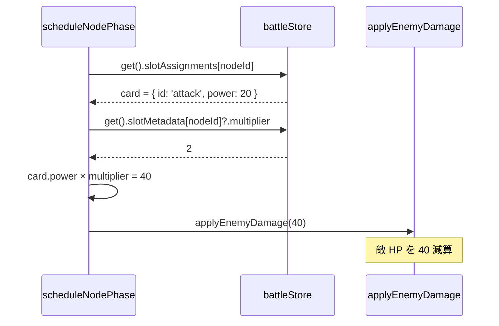
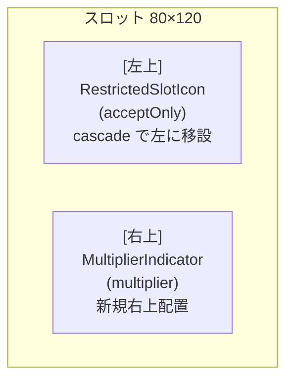

# 設計書: 倍率スロット（multiplier-slot）

## 概要

スロット定義に `multiplier: <整数 ≥ 2>` を追加すると、そのスロットを通過する `attack` / `guard` / `heal` カードの `power` が倍率分だけ増幅される。ローダー（`stagesLoader.js`）で値の検証と取り込みを行い、`battleStore.slotMetadata` に `acceptOnly` と同じマップで静的情報として保存。`scheduleNodePhase` の効果適用箇所で `state.slotMetadata[nodeId]?.multiplier ?? 1` を参照して `card.power` に掛けるシンプルな構造。`monster` / `reflect` は要件 2-5/2-6 に従い倍率非適用（コード分岐で除外）。

視覚的にはスロットの **右上** に白色テキスト「x2」「x3」を新規 `MultiplierIndicator` コンポーネントで描画。既存の `acceptOnly` アイコンは衝突回避のため **左上に移設** する（cascade 変更：`restricted-slot` spec と `RestrictedSlotIcon.module.css` も同期更新）。

## アーキテクチャ

### コンポーネント

| コンポーネント | 種別 | 責務 |
|---|---|---|
| `stages.json` | データ | スロット定義に `multiplier: <integer>` フィールド追加（任意） |
| `stagesLoader.js` | **既存改修** | `expandSlots` / `processSubFlow` で `multiplier` を転記。`isValidMultiplier` ヘルパー追加。不正値は warning + 無視 |
| `battleStore.js` | **既存改修** | `buildSlotMetadataFromStage` で `multiplier` も map に含める。`scheduleNodePhase` の attack/heal/guard 分岐で倍率適用 |
| `FlowchartArea.jsx` | **既存改修** | `slotsToNodes` で `data.multiplier` を React Flow node に渡す |
| `SlotNode.jsx` | **既存改修** | `data.multiplier` を読んで `MultiplierIndicator` を条件付き描画 |
| `MultiplierIndicator.jsx` | **新規** | `value` props を受け取り「x<n>」テキストを描画する純粋関数コンポーネント |
| `MultiplierIndicator.module.css` | **新規** | 絶対配置（右上）、白色テキスト、ピクセル風フォント |
| `RestrictedSlotIcon.module.css` | **既存改修** | cascade: `right: 2px` → `left: 2px`（acceptOnly 左上移設）。完了済みの `restricted-slot` spec はあえて更新しない（履歴として「初期実装は右上」を残し、コードと現行 design.md がギャップを持つ前提で運用） |

### データモデル

#### `stages.json` のスロット定義（拡張後）

```jsonc
{
  "id": "slot-1",                                     // 既存
  "position": { "x": 80, "y": 120 },                   // 既存
  "lockedCard": { "id": "attack", "power": 20 },       // 既存（任意）
  "acceptOnly": "attack",                              // 既存（任意）
  "multiplier": 2                                      // 新規（任意、整数 ≥ 2）
}
```

`multiplier` は他の制限フィールド（`lockedCard` / `acceptOnly`）と **独立** で、自由に組み合わせ可能（要件 4）。

#### `battleStore.slotMetadata` の構造（拡張後）

| 状態 | 型 | 用途 | 変更 |
|---|---|---|---|
| `slotMetadata` | `{ [slotId]: { acceptOnly?: string, multiplier?: number } }` | スロット側の静的メタ情報 | **拡張**: `multiplier?` を追加 |

`multiplier` 未指定スロットは `slotMetadata[slotId]?.multiplier` が `undefined` のままで、参照側は `?? 1` フォールバックで判定する設計を維持。

### API / インターフェース

#### `isValidMultiplier(value)` ヘルパー（stagesLoader.js）

```js
function isValidMultiplier(value) {
  return Number.isInteger(value) && value >= 2;
}
```

`multiplier: 1` は明示指定でも倍率なしと同義（要件 1-5、5-4）なので、ローダーが 1 以下を弾く。`Number.isInteger` で小数・文字列・null/undefined・boolean をすべて拒否（要件 1-3）。

#### `scheduleNodePhase` の効果適用ロジック（変更後）

```js
const card = get().slotAssignments[nodeId];
const multiplier = get().slotMetadata[nodeId]?.multiplier ?? 1;

if (card && card.id === 'attack' && card.power > 0) {
  get().applyEnemyDamage(card.power * multiplier);
}
if (card && card.id === 'monster' && card.power > 0) {
  // multiplier は適用しない（要件 2-5）
  if (get().reflectActive) {
    get().applyReflectDamage(card.power);
  } else {
    get().consumeShieldOnDamage(card.power);
  }
}
if (card && card.id === 'heal' && card.power > 0) {
  get().applyPlayerHeal(card.power * multiplier);
}
if (card && card.id === 'guard' && card.power > 0) {
  get().applyGuard(card.power * multiplier);
}
if (card && card.id === 'reflect') {
  // multiplier は適用しない（要件 2-6、power フィールドなし）
  get().applyReflect();
}
```

#### `MultiplierIndicator` の API

| props | 型 | 説明 |
|---|---|---|
| `value` | number | 倍率値。2 以上の整数を想定。1 以下は呼び出し側でガードする前提 |

戻り値: `<div className={styles.indicator}>x{value}</div>` の要素。

## データフロー

### ステージ初期化から効果適用まで

```mermaid
flowchart LR
    JSON[stages.json<br/>slot.multiplier] --> Loader[stagesLoader.js<br/>expandSlots / processSubFlow]
    Loader -->|slot.multiplier 転記| Store[battleStore<br/>slotMetadata]
    Loader -->|slots[]| FA[FlowchartArea<br/>slotsToNodes で<br/>data に multiplier 注入]
    FA -->|node.data.multiplier| SN[SlotNode<br/>MultiplierIndicator 描画]
    Store -.参照.-> SP[scheduleNodePhase<br/>card.power × multiplier]
```

### 倍率適用シーケンス（attack カード × 2 倍スロットの例）



### 視覚配置: acceptOnly 左上 / multiplier 右上



## 実装方針

### 1. stages.json データモデルの拡張

スロット要素に optional な `multiplier` フィールド（整数）を追加。値の意味:
- 未指定 / `1`: 倍率なし（従来挙動）
- `2`, `3`, `4`, ...: 整数の倍率
- 小数 / 0 以下 / 非整数: 不正、ローダーが warning + 無視

### 2. stagesLoader.js の改修

#### `isValidMultiplier` ヘルパー追加

`isValidAcceptOnly` の隣（モジュールトップの helper 群）に追加:

```js
function isValidMultiplier(value) {
  return Number.isInteger(value) && value >= 2;
}
```

#### `expandSlots` を「全フィールド独立」構造に整理

`lockedCard` / `acceptOnly` / `multiplier` の 3 つを **すべて独立した `if` ブロック** で処理する。`lockedCard && acceptOnly` のクロスフィールド排他警告は **撤去**（理由は後述）。各ブロックは自フィールドの値妥当性のみ検証:

```js
function expandSlots(slots, stageId) {
  return slots.map((raw, index) => {
    const id = raw.id ?? `slot-${index + 1}`;
    const position = raw.position ?? { ... };
    const expanded = { id, position };

    if (raw.lockedCard) {
      expanded.lockedCard = raw.lockedCard;
    }
    if (raw.acceptOnly) {
      if (isValidAcceptOnly(raw.acceptOnly)) {
        expanded.acceptOnly = raw.acceptOnly;
      } else {
        console.warn(`[stagesLoader] stage "${stageId}" slot "${id}": invalid acceptOnly "${raw.acceptOnly}". Ignoring.`);
      }
    }
    if (raw.multiplier !== undefined) {
      if (isValidMultiplier(raw.multiplier)) {
        expanded.multiplier = raw.multiplier;
      } else {
        console.warn(`[stagesLoader] stage "${stageId}" slot "${id}": invalid multiplier "${raw.multiplier}". Must be integer >= 2. Ignoring.`);
      }
    }
    return expanded;
  });
}
```

**`lockedCard && acceptOnly` 排他警告の撤去**: locked スロットは初期化時にカードが埋まり `computeDropTransition` の `destCard?.locked` ガードで全ドロップを拒否するため、`acceptOnly` は実行時に発火しようがなく機能的に無害。「両方書くと acceptOnly アイコンが locked スロットに出る」見た目自体が視覚的ヒントになるため、console 警告は不要と判断（restricted-slot の初期実装にあった排他警告を本仕様で簡素化）。`lockedCard` × `multiplier` は意味がある（要件 2-4）ので multiplier ブロックはそのまま機能する。

#### `processSubFlow` の通常スロット else 分岐も同じ構造に整理

`expandSlots` と同様、`lockedCard` / `acceptOnly` / `multiplier` を独立 `if` ブロックに分解（クロスフィールド排他警告なし）。

### 3. battleStore.js の改修

#### `buildSlotMetadataFromStage` に multiplier を含める

```js
function buildSlotMetadataFromStage(stage) {
  const metadata = {};
  for (const slot of stage.slots ?? []) {
    const entry = {};
    if (slot.acceptOnly) entry.acceptOnly = slot.acceptOnly;
    if (slot.multiplier) entry.multiplier = slot.multiplier;
    if (Object.keys(entry).length > 0) {
      metadata[slot.id] = entry;
    }
  }
  return metadata;
}
```

`acceptOnly` と `multiplier` のどちらか（または両方）が存在するスロットのみエントリ作成。両方未指定なら map に入れない（既存の「省メモリ + `?? 1`/`?.acceptOnly` フォールバック」設計を維持）。

#### `scheduleNodePhase` の効果分岐で倍率適用

`card = get().slotAssignments[nodeId]` の次行で multiplier を取得し、attack / heal / guard ブランチで掛ける。`monster` / `reflect` は変更なし。詳細は「API / インターフェース」セクションのコード例を参照。

### 4. FlowchartArea.jsx の改修

`slotsToNodes` を拡張:

```js
function slotsToNodes(slots) {
  return slots.map((slot) => ({
    id: slot.id,
    type: 'slot',
    position: slot.position,
    data: { acceptOnly: slot.acceptOnly, multiplier: slot.multiplier },
  }));
}
```

### 5. SlotNode.jsx の改修

#### import 追加

```jsx
import MultiplierIndicator from './MultiplierIndicator';
```

#### multiplier の派生変数追加

```jsx
const acceptOnly = data?.acceptOnly;
const multiplier = data?.multiplier;
```

#### return 内に MultiplierIndicator を追加

`RestrictedSlotIcon` の隣（兄弟要素として）:

```jsx
{acceptOnly && <RestrictedSlotIcon type={acceptOnly} />}
{multiplier && <MultiplierIndicator value={multiplier} />}
```

両方同時に存在しても、CSS で左右に分離されているため衝突しない。

### 6. MultiplierIndicator の新規作成

#### `MultiplierIndicator.jsx`

```jsx
import styles from './MultiplierIndicator.module.css';

function MultiplierIndicator({ value }) {
  return <div className={styles.indicator}>x{value}</div>;
}

export default MultiplierIndicator;
```

#### `MultiplierIndicator.module.css`

```css
.indicator {
  position: absolute;
  top: 2px;
  right: 2px;
  color: #f5f5f5;
  font-family: 'Press Start 2P', monospace;
  font-size: 9px;
  font-weight: bold;
  text-shadow: 0 0 2px rgba(0, 0, 0, 0.8);
  pointer-events: none;
  z-index: 2;
  user-select: none;
}
```

#### 設計細目

- `font-family: 'Press Start 2P'`: 既存のピクセル系数値表示（HP/Guard バーの数字等）と同じフォント。ピクセルアートの統一感を維持。
- `font-size: 9px`: スロット 80×120 の右上に小さく収まるサイズ。
- `font-weight: bold`: 小さいテキストの可読性確保。
- `text-shadow`: 配置済みカード（明るい画像）の上に重ねたときに白文字が埋もれないよう、暗色のハロー的シャドウ。
- `pointer-events: none`: ドラッグ操作を奪わない。
- `z-index: 2`: `DraggableCard` より前面、`RestrictedSlotIcon` と同じレイヤ。

### 7. RestrictedSlotIcon の cascade 移設

`RestrictedSlotIcon.module.css`:

```css
.icon {
  position: absolute;
  top: 2px;
  left: 2px;       /* 変更前: right: 2px → 変更後: left: 2px */
  width: 12px;
  height: 12px;
  pointer-events: none;
  z-index: 2;
}
```

**注記**: 完了済みの `restricted-slot` spec（requirements.md / design.md）は **更新しない** 方針。コードのみ修正し、spec ドキュメントは「初期実装時点（右上配置）の履歴」として残す。spec と実装の位置記述に gap が出るが、本 spec (multiplier-slot) の design.md で「acceptOnly は左上に移設済み」と明示することで運用上は追跡可能。

### 8. 検証用ステージ（タスク 5 で追加予定）

ステージ 4-2 を新規追加。multiplier の各機能を網羅する組み合わせ:

```jsonc
"4-2": {
  "enemyId": "wolf",
  "cards": [
    { "id": "attack", "power": 10 },
    { "id": "heal",   "power": 20 },
    { "id": "guard",  "power": 15 }
  ],
  "slots": [
    { "multiplier": 2 },                                      // attack 10 → 20 ダメージ
    { "lockedCard": { "id": "attack", "power": 10 }, "multiplier": 3 },  // locked attack 10 → 30 ダメージ
    { "acceptOnly": "heal", "multiplier": 2 },                // heal 20 専用 → 40 回復
    {}
  ]
}
```

## 依存関係

| パッケージ | 用途 | 導入済み？ |
|---|---|---|
| 既存のみ | React / CSS Modules / zustand | はい |
| Press Start 2P | ピクセル風フォント | はい（既存の HP/Guard 数値表示で使用） |

新規依存ゼロ。

## トレーサビリティ確認

| 要件 | 対応設計セクション |
|---|---|
| 1-1〜1-6（multiplier データモデル、検証、両形式対応） | 「実装方針 / 1, 2」、`isValidMultiplier` + `expandSlots` / `processSubFlow` 取り込み |
| 2-1〜2-3（attack/heal/guard の power 倍率適用） | 「実装方針 / 3」、`scheduleNodePhase` の各分岐 |
| 2-4（locked card の attack/heal/guard も倍率適用） | 「実装方針 / 3」、`card.id` のみで分岐するため locked かどうか不問 |
| 2-5（monster は倍率非適用） | 「実装方針 / 3」、monster ブランチでは multiplier を掛けない |
| 2-6（reflect は倍率非適用） | 「実装方針 / 3」、reflect ブランチも multiplier を掛けない |
| 2-7（未指定スロットは × 1） | 「実装方針 / 3」、`?? 1` フォールバック |
| 3-1〜3-6（右上テキスト、白色、常時表示、配置済みでも表示） | 「実装方針 / 6」、MultiplierIndicator の絶対配置 + `z-index` |
| 4-1〜4-3（acceptOnly / lockedCard と共存） | データモデルで全フィールド独立、効果適用ロジックも独立に動く |
| 4-4（左右配置の分離） | 「実装方針 / 6, 7」、CSS の `right: 2px` / `left: 2px` 分離 |
| 5-1〜5-4（既存挙動の非破壊性） | 全実装で「multiplier 未指定 → `?? 1` フォールバック → 従来挙動」の分岐構造を採用 |

## トレードオフと検討した代替案

### 決定 1: `multiplier` を `slotMetadata` に既存マップで合流させる

- **理由**: `acceptOnly` 用に既に存在する `slotMetadata` に `multiplier?` キーを足すだけで済み、新規 state を作る必要がない。「スロットに紐づく静的情報」という意味的な単位も一致。
- **検討した代替案**: `slotMultipliers: { [slotId]: number }` のような専用マップを別に作る。意味分離は明確になるが、`scheduleNodePhase` で 2 つのマップを別々に参照する手間が増える。`{ acceptOnly, multiplier }` の入れ子オブジェクトの方が読みやすい。

### 決定 2: `multiplier: 1` を明示指定でも倍率なしと同義扱い

- **理由**: ステージ JSON で「明示的に倍率なし」を表現するために `multiplier: 1` を書くデザイナーが現れる可能性がある（読みやすさのため）。これを許容するが、内部的には未指定と同じ扱いにする（ローダーで弾く）。UI 上もインジケータ非表示。
- **検討した代替案**: `multiplier: 1` を「明示なし」と区別して扱う。意味的な区別は薄く、`x1` のインジケータを出してもプレイヤーが混乱するだけ。

### 決定 3: locked card の attack/heal/guard も倍率適用する

- **理由**: 要件 2-4 でユーザー確認済み。「locked attack 20 + multiplier 2」で実質 40 ダメージという表現は、ステージ難易度デザインの自由度を高める。
- **検討した代替案**: locked card は固定で倍率非適用。シンプルだが「強力な locked スロット」という表現が作れず、表現力が下がる。

### 決定 4: monster カードは倍率非適用

- **理由**: 要件 2-5 でユーザー確認済み。「monster カードは敵攻撃」であり、倍率は「プレイヤーが行う行動の強化」という意味付け（プレイヤー側カードのみ強化）が直感的。`scheduleNodePhase` の monster 分岐だけ条件分岐外しで実装可能。
- **検討した代替案**: monster も含めて全カードに倍率適用。敵攻撃強化のステージデザインも作れるようになるが、ユーザーは「attack/guard/heal のみ」を選択したため不採用。将来「monster_multiplier」のような別フィールドで分離する道は残る。

### 決定 5: `MultiplierIndicator` を独立コンポーネントに切り出す

- **理由**: `RestrictedSlotIcon` と並列の責務（スロットに重ねるオーバーレイ UI）。独立ファイルにすることで SlotNode の JSX が短く保たれ、将来別の指標（例: 残り使用回数）を加えるときも同じパターンで増やせる。
- **検討した代替案**: SlotNode 内にインライン展開。コード量は減るが、SlotNode が「制限 + 倍率 + 状態クラス + ハンドル + カード」と責務が膨らみすぎる。

### 決定 6: 既存 acceptOnly アイコンを cascade で左上移設

- **理由**: ユーザー指示で「multiplier は右上、acceptOnly は左上」が確定。倍率を新規追加する側だけが工夫しても衝突は避けられない（同じ右上を共有できない）。
- **検討した代替案**: 両方右上で縦並び（multiplier を上、acceptOnly を下など）。視覚的にごちゃつき、12×12 のアイコンと 9px テキストが重なって判別性が落ちる。`right: 2px` と `left: 2px` で完全に分離する方が clean。
