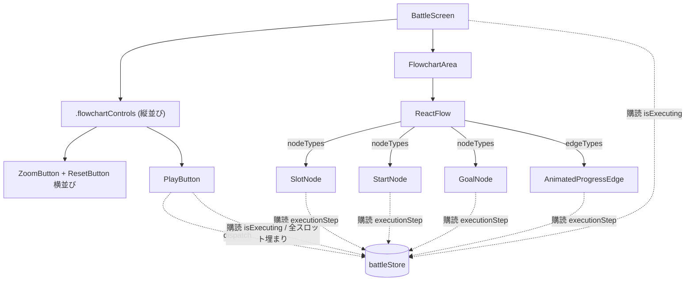
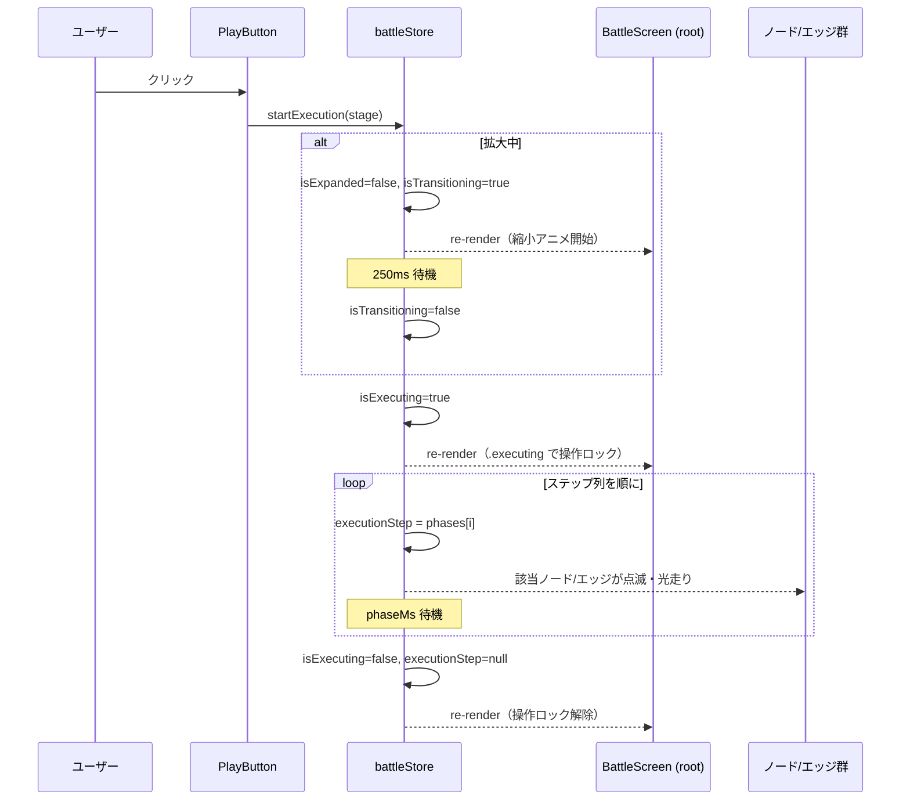
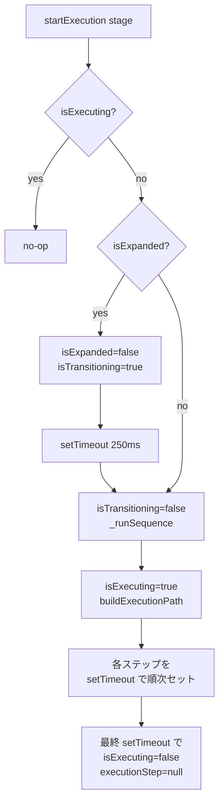

# 設計書: 実行ボタン（ビジュアル進行のみ）

## 概要

`battleStore` に **実行状態（`isExecuting`）と現在のハイライト位置（`executionStep`）** を追加し、実行開始時に「スタート → スロット → エッジ → ... → ゴール」というフェーズ列を `setTimeout` で時系列にセットしていく。各 React コンポーネント（`StartNode` / `SlotNode` / `GoalNode` / カスタムエッジ）は `executionStep` を購読し、自分が現在のフェーズ対象であればハイライト／点滅を行う。エッジ上の「光の点が走るアニメーション」は React Flow の **カスタムエッジ型** に SVG `<animateMotion>` を仕込んで実現する。

主要な設計判断は 4 つ：

1. **オーケストレーションは `battleStore` に閉じる**：`startExecution(stage)` が「自動縮小 → ステップ遷移 → 終了」までの一連を `setTimeout` で進める。React 側は状態を購読して見た目に反映するだけ
2. **状態は単純な「現在のフェーズ」**：アニメーションの細部（点滅回数、色フェードカーブ）は CSS / SVG 側に閉じ、ストアは `{ type: 'node' | 'edge', id }` という最小の状態だけを持つ
3. **エッジ上の光の点は SVG `<animateMotion>`**：React Flow のカスタムエッジ型を作り、アクティブなときに `<circle>` をパスに沿って動かす。CSS の dasharray アニメーションより「点が進む」表現に近く、実装も短い
4. **拡大時の自動縮小は「ストア内オーケストレーション」**：`PlayButton` は `startExecution()` を呼ぶだけで、拡大状態の判定・縮小アニメーション待ちはストア側で担う（呼び出し側がフラグ管理しなくてよい）

## アーキテクチャ

### コンポーネント

| コンポーネント | 責務 |
|--------------|------|
| `PlayButton`（新規） | ZoomButton/ResetButton 直下に配置される細長いボタン。配置完了時のみ有効。クリックで `startExecution(stage)` を呼ぶ |
| `play.svg`（新規） | 緑色の再生アイコン（縦線 1 本＋右向き三角形） |
| `battleStore`（拡張） | `isExecuting` / `executionStep` 状態と、`startExecution` / `_advanceStep` / `finishExecution` アクションを追加 |
| `AnimatedProgressEdge`（新規） | React Flow のカスタムエッジ型。アクティブなとき SVG `<circle>` ＋ `<animateMotion>` でパスに沿って光の点を走らせる |
| `StartNode` / `SlotNode` / `GoalNode`（変更） | `executionStep` を購読して、自分がアクティブなときハイライト／点滅 CSS クラスを付ける |
| `BattleScreen`（変更） | フローチャート右上のボタングループに `PlayButton` を追加。`isExecuting` 中はルートに `.executing` クラスを付与し、`pointer-events: none` で操作をロック |
| `BattleScreen.module.css`（変更） | `.flowchartControls` を縦並びに対応（既存の横並び＋下に `PlayButton`）、`.executing` クラスを追加 |
| `FlowchartArea`（変更） | `edgeTypes` に新エッジ型を登録し、`edgesToFlowEdges` で各エッジに `type: 'animated-progress'` を付与 |

### データモデル

`battleStore` の状態に追加：

```js
{
  // 既存フィールド
  isExecuting: boolean,            // 実行中フラグ。初期 false
  executionStep: ExecutionStep | null, // 現在ハイライト中の対象。実行外は null
}

/**
 * @typedef {Object} ExecutionStep
 * @property {'node' | 'edge'} type   ノード（マーカー or スロット）かエッジか
 * @property {string} id              対応する node id または edge id
 */
```

### API / インターフェース

**`battleStore` のアクション**

| 関数 | 引数 | 役割 |
|---|---|---|
| `startExecution(stage)` | `stage: StageDef` | 実行を開始する。拡大中なら自動縮小を挟み、完了後にステップ列を `setTimeout` で進める。`isExecuting` 中なら no-op（連打防止） |

**ヘルパー関数（`battleStore` 内）**

```js
/**
 * stage の `start` / `slots` / `goal` / `edges` から、ハイライトを進める順序の
 * フェーズ列を構築する。エッジの `source` / `target` を辿る単純な一本道前提。
 *
 * Returns:
 *   ExecutionStep[]: [{type:'node',id:'start'}, {type:'edge',id:'e-start-1'},
 *                     {type:'node',id:'slot-1'}, ..., {type:'node',id:'goal'}]
 */
function buildExecutionPath(stage) { ... }
```

**派生セレクタ**

```js
/**
 * 全スロットがカードで埋まっているか。実行ボタンの有効化判定に使う。
 */
function selectAllSlotsFilled(state) {
  return Object.values(state.slotAssignments).every((card) => card !== null);
}
```

スロットが 1 つも無い `stage` でも `every` は `true` を返すので、その場合は「埋まっていると見なす」ことになる。これは挙動として問題ない（実行しても 0 ステップで終わる）。

**コンポーネントインターフェース**

```jsx
<PlayButton stage={stage} />   // stage はステップ列構築のために必要
```

## データフロー

### コンポーネント関係



### 実行シーケンス



### `startExecution` の処理ロジック



## 実装方針

### `PlayButton` コンポーネント

- ストアから以下を購読：
  - `isExecuting`（実行中なら disabled）
  - `isTransitioning`（拡大切替中なら disabled）
  - `selectAllSlotsFilled`（全スロット埋まりでなければ disabled）
- いずれかが true（または filled でない）のとき `disabled` 属性を付与
- クリックで `startExecution(stage)` を呼ぶ
- 内部に `` を表示、`aria-label="実行"`

### `play.svg` の設計

- viewBox `0 0 24 24`、緑単色（`#66dd6e` 想定。背景 `#1f1f28` に対してコントラスト十分）
- 構成：
  - 縦線 1 本：x=4、y=4〜20、stroke-width 3、`stroke-linecap: round`
  - 右向き三角形：頂点 (9, 4)、(9, 20)、(20, 12)、塗りつぶし
- 結果として「左に縦線、その右に三角形の左辺」が並んで二重線に見える

### `battleStore` の拡張

新規定数：

```js
const TRANSITION_DURATION_MS = 250;  // 既存
const EXECUTION_PER_CARD_MS = 2000;  // カード 1 枚あたりの所要時間
```

`startExecution` の擬似実装：

```js
startExecution: (stage) => {
  const state = get();
  if (state.isExecuting || state.isTransitioning) return;
  if (!selectAllSlotsFilled(state)) return;

  const beginSequence = () => {
    const phases = buildExecutionPath(stage);
    const totalMs = state.handCardsCountAtPlay * EXECUTION_PER_CARD_MS;
    // 配置済みカード数 N = スロット数（要件2より）
    const N = stage.slots.length;
    const T = N * EXECUTION_PER_CARD_MS;
    const phaseMs = T / phases.length;

    set({ isExecuting: true });
    phases.forEach((phase, i) => {
      setTimeout(() => set({ executionStep: phase }), i * phaseMs);
    });
    setTimeout(() => {
      set({ isExecuting: false, executionStep: null });
    }, phases.length * phaseMs);
  };

  if (state.isExpanded) {
    set({ isExpanded: false, isTransitioning: true });
    setTimeout(() => {
      set({ isTransitioning: false });
      beginSequence();
    }, TRANSITION_DURATION_MS);
  } else {
    beginSequence();
  }
}
```

`buildExecutionPath`：

```js
function buildExecutionPath(stage) {
  // 1. エッジ source -> { target, edgeId } のマップ
  const next = {};
  for (const e of stage.edges) {
    next[e.source] = { target: e.target, edgeId: e.id };
  }
  // 2. 'start' から 'goal' まで辿ってフェーズ列を組み立て
  const phases = [];
  let currentNode = 'start';
  while (true) {
    phases.push({ type: 'node', id: currentNode });
    if (currentNode === 'goal') break;
    const trans = next[currentNode];
    if (!trans) break;  // ガード（スタートからゴールまで繋がっていない）
    phases.push({ type: 'edge', id: trans.edgeId });
    currentNode = trans.target;
  }
  return phases;
}
```

### ノードのハイライト／点滅

各ノードコンポーネント（`StartNode` / `SlotNode` / `GoalNode`）で：

```jsx
const isActive = useBattleStore(
  (s) => s.executionStep?.type === 'node' && s.executionStep?.id === MY_ID
);
// MY_ID は SlotNode なら props.id、Start/Goal は 'start' / 'goal'

const className = [styles.marker, isActive && styles.active].filter(Boolean).join(' ');
```

`SlotNode` の場合は `DraggableCard` も巻き込んで点滅させる。`SlotNode` の親に `.active` クラスが付いたら、CSS で内側の `.filled` のカード描画にも影響を波及させる：

```css
.slot.active.filled {
  animation: blink 200ms ease-in-out 3;
  /* 200ms × 3 = 600ms だが phaseMs に応じて調整するため CSS 変数経由が良い */
}

@keyframes blink {
  0%, 100% { filter: brightness(1); }
  50% { filter: brightness(1.6) drop-shadow(0 0 8px #fff); }
}
```

`StartNode` / `GoalNode` の `.active` 時は枠の発光やアイコン本体のフラッシュで「ハイライト」を表現。

### エッジ上の光の点アニメーション

`AnimatedProgressEdge`（カスタムエッジ）の擬似実装：

```jsx
import { getStraightPath } from '@xyflow/react';

function AnimatedProgressEdge({ id, sourceX, sourceY, targetX, targetY, markerEnd }) {
  const [edgePath] = getStraightPath({ sourceX, sourceY, targetX, targetY });
  const isActive = useBattleStore(
    (s) => s.executionStep?.type === 'edge' && s.executionStep?.id === id
  );
  const phaseMs = useBattleStore((s) => s.currentPhaseMs ?? 666);  // 動的計算 or 簡略化

  return (
    <>
      <path
        id={id}
        className="react-flow__edge-path"
        d={edgePath}
        markerEnd={markerEnd}
      />
      {isActive && (
        <circle r="4" fill="#66dd6e">
          <animateMotion
            dur={`${phaseMs}ms`}
            path={edgePath}
            fill="freeze"
          />
        </circle>
      )}
    </>
  );
}
```

ポイント：

- `getStraightPath` はノード間の直線パスの `d` 文字列を返す React Flow のヘルパー
- `<animateMotion>` の `path` 属性に `d` を渡すと、内側の `<circle>` がそのパスに沿って移動する
- `dur` をフェーズ時間に揃えれば、エッジフェーズの開始から終了でちょうど光の点が左から右に移動する
- `fill="freeze"` でアニメーション完了後に終端位置に留まる（次フェーズで `isActive` が false になり消える）

`phaseMs` の取得：実装中に「`executionStep` から計算する」「ストアに `currentPhaseMs` を持たせる」のどちらかに決める。シンプルさを優先するなら、ストアに固定値（例：`N=3` の場合 `phaseMs ≈ 666` を実行時に算出して保存）を持たせる方針。

### 実行中の操作ロック

- `BattleScreen` ルート `<section>` に `isExecuting` のとき `.executing` クラスを付与
- CSS：`.root.executing { pointer-events: none; }`（既存の `.transitioning` と同じ仕組み）
- ボタン側でも `disabled` 属性で無効化（外観上「押せない」と分かるように）

`PlayButton` / `ResetButton` / `ZoomButton` 全てに `disabled` 属性を渡す。`ResetButton` / `ZoomButton` は現状 `disabled` を受け取っていないので、各ボタンで `useBattleStore((s) => s.isExecuting || s.isTransitioning)` を読み取って自前で `disabled` 化する。

### `BattleScreen.module.css` の `.flowchartControls` 縦並び化

既存：

```css
.flowchartControls {
  position: absolute;
  top: 0.5rem;
  right: 0.5rem;
  z-index: 10;
  display: flex;
  gap: 0.5rem;
}
```

変更：

```css
.flowchartControls {
  position: absolute;
  top: 0.5rem;
  right: 0.5rem;
  z-index: 10;
  display: flex;
  flex-direction: column;       /* 縦並びに変更 */
  align-items: stretch;         /* PlayButton が横幅を伸ばすために stretch */
  gap: 0.5rem;
}

.flowchartControls > .topRow {  /* ZoomButton + ResetButton を横並びにラップ */
  display: flex;
  gap: 0.5rem;
}
```

JSX 側で `<div className={styles.topRow}><ZoomButton /><ResetButton /></div>` のように小さくラップして縦並び 2 段にする：

```jsx
<div className={styles.flowchartControls}>
  <div className={styles.topRow}>
    <ZoomButton />
    <ResetButton stage={stage} />
  </div>
  <PlayButton stage={stage} />
</div>
```

### コンポーネント配置とファイル命名

```
frontend/
├── public/
│   └── icons/
│       └── flowchart/
│           └── play.svg                              （新規）
└── src/
    ├── stores/
    │   └── battleStore.js                            （変更：isExecuting/executionStep/startExecution/buildExecutionPath）
    └── features/battle/
        ├── BattleScreen.jsx                          （変更：.executing クラス付与、PlayButton 追加、controls の縦 2 段化）
        ├── BattleScreen.module.css                   （変更：.executing、.flowchartControls 縦並び、.topRow）
        └── flowchart/
            ├── PlayButton.jsx                        （新規）
            ├── PlayButton.module.css                 （新規）
            ├── AnimatedProgressEdge.jsx              （新規）
            ├── FlowchartArea.jsx                     （変更：edgeTypes 登録、エッジに type: 'animated-progress'）
            ├── StartNode.jsx                         （変更：executionStep 購読、.active 反映）
            ├── StartNode.module.css                  （変更：.active のハイライト CSS）
            ├── SlotNode.jsx                          （変更：executionStep 購読、.active 反映）
            ├── SlotNode.module.css                   （変更：.active のカード点滅 CSS）
            ├── GoalNode.jsx                          （変更：executionStep 購読、.active 反映）
            ├── GoalNode.module.css                   （変更：.active のハイライト CSS）
            ├── ResetButton.jsx                       （変更：isExecuting/isTransitioning で disabled 化）
            └── ZoomButton.jsx                        （変更：isExecuting/isTransitioning で disabled 化）
```

## 依存関係

| パッケージ | 用途 | 導入済み？ |
|---|---|---|
| `@xyflow/react` | カスタムエッジ型（`getStraightPath`、`edgeTypes` プロップ） | はい |
| `zustand` | `battleStore` 拡張 | はい |

新規パッケージの導入はなし。SVG `<animateMotion>` はブラウザネイティブ機能で外部ライブラリ不要。

## トレードオフと検討した代替案

- **決定内容**：オーケストレーション（拡大→縮小→実行→終了）を `battleStore` に閉じる
  **理由**：`PlayButton` から見ると `startExecution(stage)` を呼ぶだけで完結し、UI コンポーネント側でフラグの段階管理（拡大中？ → 縮小完了待ち → 実行開始）を書かなくて済む。複数の React コンポーネントが同じシーケンスをトリガーするように将来拡張しても、ロジックがストア 1 箇所に集約される
  **検討した代替案**：`PlayButton` の `onClick` ハンドラで `if (isExpanded) toggleExpand(); setTimeout(startExecution, 250); else startExecution()` のように呼び出し側でオーケストレートする案。条件分岐が呼び出し側に漏れて、テストや別箇所での再利用が難しい

- **決定内容**：エッジ上の光の点は SVG `<animateMotion>` を使う
  **理由**：「点が経路に沿って移動する」表現にネイティブで対応する SVG 機能で、フレームワーク非依存・追加ライブラリ不要。React Flow のカスタムエッジが SVG パスを返す仕組みと素直に組み合わせられる
  **検討した代替案**：(a) CSS `stroke-dasharray` ＋ `stroke-dashoffset` の流れアニメーション。「線がうごめく」表現になり「点が進む」とは別物。(b) `requestAnimationFrame` で `getPointAtLength` を呼んで JS から手動配置。柔軟だがコード量が多くなる。(c) Framer Motion の `motion.svg` でパスアニメ。導入済みだが本機能のためだけに使うと依存度が上がる

- **決定内容**：実行状態は `isExecuting`（フラグ）と `executionStep`（現在位置）の 2 値だけにする
  **理由**：アニメーションの細部（色フェード、点滅回数、輝度）は CSS / SVG に閉じる。ストアが「今どのフェーズ」を持つだけにすれば、各 UI コンポーネントは「自分が対象か」を `===` 1 回で判定でき、購読粒度が細かくて再描画も最小に保てる
  **検討した代替案**：ストアに `phases: ExecutionStep[]` の配列を持って index で進める案。デバッグはしやすいが、ストアが知っておく必要のない情報（過去のフェーズ）まで持つことになる

- **決定内容**：全スロット埋まり判定はセレクタ関数（`selectAllSlotsFilled`）で行う
  **理由**：ストア状態に派生値を直接持たせる（例：`isAllFilled: boolean`）と、`slotAssignments` 更新のたびに同期する責任が増える。セレクタなら自動で最新を計算でき、Zustand の購読の仕組みで再描画も適切
  **検討した代替案**：ストア状態に `isAllFilled` を持つ案。同期忘れによるバグの温床

- **決定内容**：`flowchartControls` を縦並び 2 段（横並び 2 個 ＋ 細長 1 個）にする
  **理由**：実行ボタンを「ZoomButton/ResetButton 直下」に置く要件 1-1 を素直に満たし、横幅も既存ボタン群と整合。`flex-direction: column` ＋ 内側の `.topRow` で 2 段構成が一目瞭然
  **検討した代替案**：実行ボタンを別の `position: absolute` で配置する案。座標計算が必要になり、レスポンシブ性も落ちる
