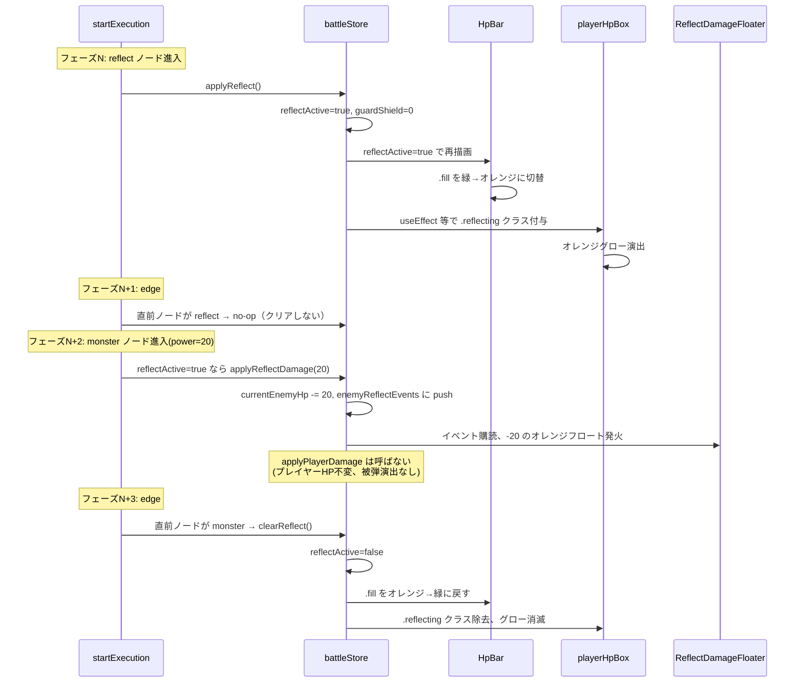
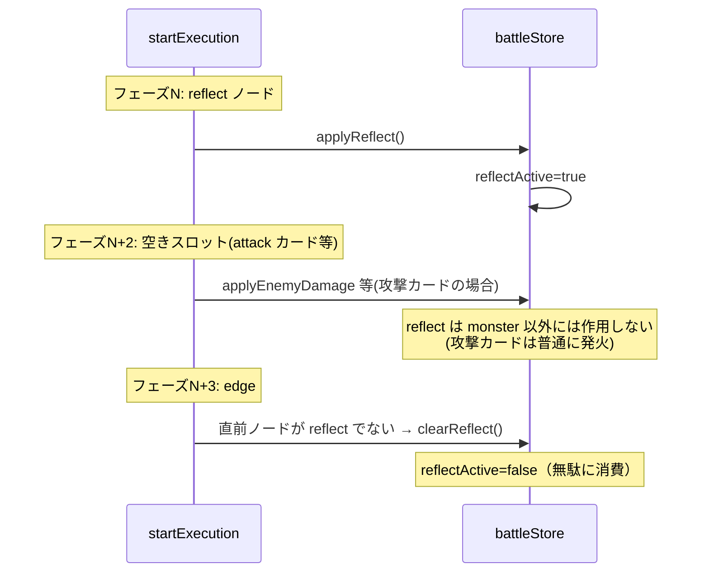
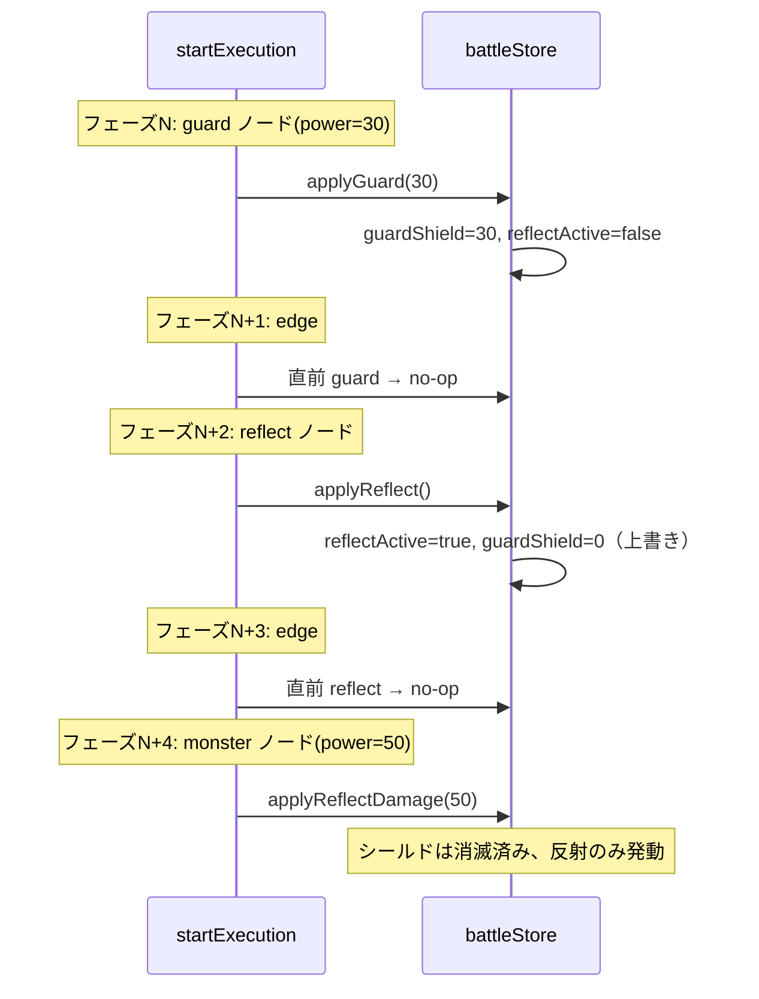

# 設計書: カウンター（reflect）カード効果（reflect-card-effect）

## 概要

本機能は (1) `battleStore` に `reflectActive`（boolean）と `enemyReflectEvents`（配列）の 2 つの状態を追加し、(2) `startExecution` のフェーズ駆動ロジックに「カウンターカード通過時のリフレクト状態付与」「モンスターカード到達時の反射成立処理」「エッジフェーズでのリフレクトクリア」を組み込み、(3) `HpBar` に `reflectActive` プロパティを追加して `.fill` をオレンジ色に切り替え、(4) `BattleScreen` に HP 数値の分子オレンジ表示・`playerHpBox` のオレンジグロー・`ReflectDamageFloater` のマウントを統合する、という 4 つの柱で実装する。

リフレクトの寿命管理は既存のフェーズ駆動モデル（`guard-card-effect` で確立済み）に乗せ、「ノードフェーズで効果発火・モンスターなら反射 → 次のエッジフェーズで残量クリア」というタイミング設計とする。`guard-card-effect` の `clearGuard` ロジックと同形のエッジ判定を追加するだけで対応できる。

反射ダメージのフロート演出は、既存の赤系 `DamageFloater`（通常攻撃ダメージ用）と完全に独立した `ReflectDamageFloater` を新規作成する。両者は別キュー（`enemyDamageEvents` / `enemyReflectEvents`）と別フロート系統で動作するため、フロートの色（赤 vs オレンジ）で「通常攻撃」と「反射」をプレイヤーが視覚的に区別できる。

## アーキテクチャ

### コンポーネント

| コンポーネント | 責務 |
|---|---|
| `battleStore` | `reflectActive` / `enemyReflectEvents` の状態管理、`applyReflect` / `applyReflectDamage` / `clearReflect` / `dismissEnemyReflectEvent` アクション。既存の `applyGuard` に「`reflectActive` を `false` クリア」を追加してバフ排他制御を担保 |
| `startExecution`（`battleStore` 内） | ノードフェーズで `reflect` 分岐（`applyReflect`）、`monster` 分岐で `reflectActive` 判定 → `applyReflectDamage` または既存 `consumeShieldOnDamage` の振り分け、エッジフェーズで「直前ノードが reflect でない」場合に `clearReflect` |
| `HpBar`（`components/HpBar.jsx`） | optional な `reflectActive` プロパティを追加。`true` のとき `.fill` に `reflect` クラスを付与してオレンジ色に切り替え |
| `HpBar.module.css` | `.fill.reflect` クラス追加（オレンジ系）、`.fill` の `transition` に `background` を追加 |
| `BattleScreen.jsx`（プレイヤー領域） | `reflectActive` 購読、`HpBar` に渡す、HP 数値の分子オレンジ表示、`playerHpBox` のオレンジグロー、`ReflectDamageFloater` の敵エリアマウント |
| `BattleScreen.module.css` | `.hpNumeratorReflect`（分子色）、`.playerHpBox.reflecting`（オレンジグロー） |
| `ReflectDamageFloater.jsx`（新規） | `enemyReflectEvents` を購読し、各イベントを `<span>` で `-amount` のオレンジ色フロートとして描画 |
| `ReflectDamageFloater.module.css`（新規） | 既存 `DamageFloater.module.css` と同形だが色をオレンジに変更 |

### データモデル

`battleStore` への追加フィールド:

| フィールド | 型 | 初期値 | 説明 |
|---|---|---|---|
| `reflectActive` | boolean | `false` | リフレクト状態が有効かどうか。`true` の間は次のモンスターカードを反射する |
| `enemyReflectEvents` | Array<{id, amount}> | `[]` | 反射ダメージ演出のイベントキュー。`ReflectDamageFloater` が購読 |
| `_enemyReflectCounter` | number | `0` | 内部カウンター。`er-${count}` 形式で id 生成（敵側 `d-` / プレイヤー側 `pd-` / ヒール `ph-` と区別） |

新規アクション:

| アクション | 引数 | 振る舞い |
|---|---|---|
| `applyReflect` | なし | `set({ reflectActive: true, guardShield: 0 })`。リフレクトを有効化し、guard と排他制御 |
| `applyReflectDamage` | `amount: number` | `currentEnemyHp` を `amount` 減算（0 クランプ）、`enemyReflectEvents` に新規イベントを push |
| `clearReflect` | なし | `set({ reflectActive: false })`。エッジフェーズで呼ばれる |
| `dismissEnemyReflectEvent` | `id: string` | 指定 id を `enemyReflectEvents` から取り除く |

既存アクションの変更:

| アクション | 変更点 |
|---|---|
| `applyGuard(amount)` | `set({ guardShield: amount, reflectActive: false })`。reflect を排他クリア（要件 6-2） |
| `initializeBattle(stage)` | set ブロックに `reflectActive: false, enemyReflectEvents: []` を追加 |
| `startExecution.beginSequence` | set ブロックに同上を追加 |
| `retryFromFail()` | set ブロックに同上を追加 |
| `applyPlayerDamage(amount)` | 死亡検知ブロックに `reflectActive: false` を追加 |

### API / インターフェース

**`HpBar.jsx`（拡張）:**
```js
function HpBar({ currentHp, maxHp, shield = 0, reflectActive = false }) {
  // reflectActive が true のとき、.fill に .reflect クラスを付与してオレンジ色に
}
```

**`ReflectDamageFloater.jsx`（新規）:**
```js
function ReflectDamageFloater() {
  const events = useBattleStore((s) => s.enemyReflectEvents);
  const dismiss = useBattleStore((s) => s.dismissEnemyReflectEvent);
  // 各イベントをオレンジ色のフロートとして描画、アニメ完了で dismiss
}
```

**`battleStore` 新規アクションのシグネチャ:**
```js
applyReflect() => void
applyReflectDamage(amount: number) => void
clearReflect() => void
dismissEnemyReflectEvent(id: string) => void
```

## データフロー

### パターン 1: カウンター → モンスター（反射成立）



### パターン 2: カウンター → 空きスロット／別カード（リフレクト失効）



### パターン 3: ガード + カウンター連続（上書き、参考のみ）



## 実装方針

### 1. `battleStore` への状態とアクション追加

**初期状態に追加:**
```js
reflectActive: false,
enemyReflectEvents: [],
_enemyReflectCounter: 0,
```

**`initializeBattle` / `retryFromFail` / `startExecution.beginSequence` の各 set ブロックに追加:**
```js
reflectActive: false,
enemyReflectEvents: [],
```
（`_enemyReflectCounter` は意図的にクリアしない。id の単調増加性を保ち、React の key 衝突を防ぐ）

**`applyPlayerDamage` の死亡検知ブロックに追加:**
```js
if (nextHp === 0 && state.isExecuting) {
  // ...既存
  result.reflectActive = false;
}
```

**新規アクション:**
```js
applyReflect: () => set({ reflectActive: true, guardShield: 0 }),

applyReflectDamage: (amount) => set((state) => {
  const nextHp = Math.max(0, state.currentEnemyHp - amount);
  const id = `er-${state._enemyReflectCounter}`;
  return {
    currentEnemyHp: nextHp,
    enemyReflectEvents: [...state.enemyReflectEvents, { id, amount }],
    _enemyReflectCounter: state._enemyReflectCounter + 1,
  };
}),

clearReflect: () => set({ reflectActive: false }),

dismissEnemyReflectEvent: (id) => set((state) => ({
  enemyReflectEvents: state.enemyReflectEvents.filter((e) => e.id !== id),
})),
```

**既存 `applyGuard` の修正:**
```js
applyGuard: (amount) => set({ guardShield: amount, reflectActive: false }),
```
（要件 6-2: reflect を排他クリア）

### 2. `startExecution` のフェーズ処理拡張

既存のノードフェーズ分岐に以下を追加・変更する:

```js
if (phase.type === 'node') {
  const card = get().slotAssignments[phase.id];
  if (card && card.id === 'attack' && card.power > 0) {
    get().applyEnemyDamage(card.power);
  }
  if (card && card.id === 'monster' && card.power > 0) {
    if (get().reflectActive) {
      get().applyReflectDamage(card.power);  // 新規：反射
    } else {
      get().consumeShieldOnDamage(card.power);  // 既存
    }
  }
  if (card && card.id === 'heal' && card.power > 0) {
    get().applyPlayerHeal(card.power);
  }
  if (card && card.id === 'guard' && card.power > 0) {
    get().applyGuard(card.power);
  }
  if (card && card.id === 'reflect') {
    get().applyReflect();  // 新規
  }
}
```

**注：** `reflect` カードの分岐は `card.power > 0` のガードを使わない（reflect カードは `power` を持たない設計のため、ガード式が常に `false` になってしまう）。代わりに `card.id === 'reflect'` の存在チェックだけで分岐する。

エッジフェーズに reflect クリア処理を追加:

```js
if (phase.type === 'edge') {
  const prevPhase = phases[i - 1];
  if (prevPhase && prevPhase.type === 'node') {
    const prevCard = get().slotAssignments[prevPhase.id];
    const isPrevGuard = prevCard && prevCard.id === 'guard';
    const isPrevReflect = prevCard && prevCard.id === 'reflect';
    if (!isPrevGuard && get().guardShield > 0) {
      get().clearGuard();
    }
    if (!isPrevReflect && get().reflectActive) {
      get().clearReflect();  // 新規
    }
  }
}
```

### 3. `HpBar` の拡張（`reflectActive` プロパティ追加）

**`HpBar.jsx`:**
```jsx
function HpBar({ currentHp, maxHp, shield = 0, reflectActive = false }) {
  // ...既存のシールド計算
  const fillClassName = reflectActive
    ? `${styles.fill} ${styles.reflect}`
    : styles.fill;
  return (
    <div className={styles.frame} style={{ '--shield-scale': scale }}>
      <div className={fillClassName} style={{ width: `${hpRatio * 100}%` }} />
      {/* shield 描画は既存 */}
    </div>
  );
}
```

**`HpBar.module.css` 追加・変更:**
```css
.fill {
  /* 既存 */
  transition: width 0.25s ease-out, background 0.25s ease-out;
}

.fill.reflect {
  background: #ff8c42;
}
```

`background` を `transition` に含めることで、緑↔オレンジの色変化が滑らかになる。

### 4. `BattleScreen` の統合

**`reflectActive` 購読の追加:**
```js
const reflectActive = useBattleStore((s) => s.reflectActive);
```

**HpBar 呼び出しに `reflectActive` を渡す:**
```jsx
<HpBar
  currentHp={currentPlayerHp}
  maxHp={maxPlayerHp}
  shield={guardShield}
  reflectActive={reflectActive}
/>
```

**HP 数値の分子クラス判定を 3 分岐に拡張:**
```jsx
<span className={styles.hpText}>
  <span
    className={
      guardShield > 0
        ? styles.hpNumeratorShielded
        : reflectActive
          ? styles.hpNumeratorReflect
          : undefined
    }
  >
    {currentPlayerHp + guardShield}
  </span>
  /{maxPlayerHp}
</span>
```

shield と reflect は排他なので、`guardShield > 0` を優先評価する三項演算子チェーンで分岐。

**`playerHpBox` の className 配列に `reflecting` を追加:**
```jsx
className={[
  styles.playerHpBox,
  isPlayerHit && styles.hit,
  isPlayerHealed && styles.healed,
  isShielded && styles.shielded,
  reflectActive && styles.reflecting,
].filter(Boolean).join(' ')}
```

**敵エリアに `ReflectDamageFloater` をマウント:**
既存の `<DamageFloater />` の **直下** または **直後** に追加:
```jsx
<DamageFloater />
<ReflectDamageFloater />
```

**`BattleScreen.module.css` 追加:**
```css
.hpNumeratorReflect {
  color: #ff8c42;
  text-shadow: 0 0 4px rgba(255, 140, 66, 0.6);
  transition: color 0.25s ease-out;
}

.playerHpBox.reflecting {
  box-shadow: 0 0 12px 4px rgba(255, 140, 66, 0.7);
  transition: box-shadow 0.25s ease-out;
}
```

`reflectActive` は状態が継続している間（次のノードを通り終わるまで）ずっと `true` なので、`.reflecting` クラスも継続的に付与される。`transition: box-shadow` により、付与・除去の瞬間にグローがフェードイン／フェードアウトする。

### 5. `ReflectDamageFloater` の新規作成

**ファイル位置:** `frontend/src/features/battle/enemy/ReflectDamageFloater.jsx` および `ReflectDamageFloater.module.css`

**`ReflectDamageFloater.jsx`（既存 `DamageFloater` を踏襲）:**
```jsx
import useBattleStore from '../../../stores/battleStore';
import styles from './ReflectDamageFloater.module.css';

function ReflectDamageFloater() {
  const events = useBattleStore((s) => s.enemyReflectEvents);
  const dismiss = useBattleStore((s) => s.dismissEnemyReflectEvent);
  return (
    <div className={styles.layer}>
      {events.map((e) => (
        <span
          key={e.id}
          className={styles.number}
          onAnimationEnd={() => dismiss(e.id)}
        >
          -{e.amount}
        </span>
      ))}
    </div>
  );
}

export default ReflectDamageFloater;
```

**`ReflectDamageFloater.module.css`（既存をベースに色変更）:**
```css
.layer {
  position: absolute;
  inset: 0;
  pointer-events: none;
  display: flex;
  align-items: center;
  justify-content: center;
}

.number {
  position: absolute;
  font-family: 'Press Start 2P', 'Courier New', Courier, monospace;
  font-size: 1.5rem;
  color: #ff8c42;
  text-shadow: 0 0 4px #000, 0 2px 0 #000;
  animation: reflectFloat 0.8s ease-out forwards;
}

@keyframes reflectFloat {
  0%   { transform: translateY(0)     scale(1.0); opacity: 1; }
  20%  { transform: translateY(-12px) scale(1.15); opacity: 1; }
  100% { transform: translateY(-48px) scale(1.0); opacity: 0; }
}
```

既存 `DamageFloater` と完全に同じアニメーション・レイアウトで、色だけオレンジ（`#ff8c42`）に変更。これにより「赤系の通常攻撃ダメージ」と「オレンジ系の反射ダメージ」が同じ位置・同じ動きで区別される。

## 依存関係

| パッケージ | 用途 | 導入済み？ |
|---|---|---|
| なし | 新規パッケージ不要 | - |

既存の `zustand`、React、CSS Modules、既存の battleStore / HpBar / BattleScreen / DamageFloater 体系のみで完結する。

## トレードオフと検討した代替案

- **決定内容**：`ReflectDamageFloater` を新規コンポーネントとして独立させる（既存 `DamageFloater` を拡張しない）
  **理由**：「通常攻撃で敵にダメージ」と「反射で敵にダメージ」は意味的に別系統で、フロートの色を変えて区別したい。既存 `DamageFloater` に色フラグを渡す方式だと、ダメージイベントオブジェクトのスキーマ変更と既存呼び出し箇所の互換確認が必要になり、影響範囲が広がる。独立コンポーネントなら新規ファイル 2 個（`.jsx` / `.module.css`）と新規アクション 2 個（`applyReflectDamage` / `dismissEnemyReflectEvent`）の追加だけで完結し、既存の attack カードルートに一切影響しない。
  **検討した代替案**：
  - **代替 1: `DamageFloater` に `isReflect` フラグを追加**：既存 `enemyDamageEvents` の各要素にフラグを追加する案。`applyEnemyDamage` のシグネチャ変更が必要。
  - **代替 2: 色を `enemyDamageEvents` の `color` フィールドで管理**：ロジック層に視覚情報を持ち込む形になり、関心の分離が崩れる。

- **決定内容**：`applyGuard` / `applyReflect` の中で「もう一方のバフをクリアする」排他制御を組み込む
  **理由**：将来 `[guard] → [reflect] → [monster]` のようなパターンが出てきても、`startExecution` 側のロジックを変更せずに正しく動作する。アクションが「自己完結」しているため、呼び出し側がバフ排他を意識しなくてよい。
  **検討した代替案**：
  - **代替 1: `startExecution` で `applyReflect` 呼び出し前に `clearGuard()` を呼ぶ**：呼び出し側の責務になり、新しいバフカードが追加されるたびに排他制御の組み合わせが増える。
  - **代替 2: バフ間の優先順位を別の「バフ管理レイヤ」で集中管理**：規模が小さいため過剰設計。

- **決定内容**：`reflect` カードは `card.id === 'reflect'` の存在チェックだけで分岐する（`card.power > 0` のガードを使わない）
  **理由**：`reflect` カードは設計上 `power` フィールドを持たない（`stages.json` で `{ "id": "reflect" }` のみ）。`power > 0` ガードを使うと `undefined > 0` が `false` で常にスキップされてしまう。
  **検討した代替案**：
  - **代替 1: `reflect` カードにダミー power（例 1）を持たせる**：`stages.json` 側にダミー値が増え、画面上のカード描画で意図しない数値が出るリスクがある（現状 `Card.jsx` は power 未定義なら描画しないため、ダミー値は表示される）。
  - **代替 2: `applyReflect` に `amount` 引数を取り、`card.power > 0` のガードを使う**：意味のない引数を持つアクションになる。

- **決定内容**：エッジフェーズの `clearGuard` / `clearReflect` 判定を 1 つのブロック内で並列に書く
  **理由**：両者はバフカードの「次のノード通過後にクリア」という共通の責務を持ち、コードが対称的に並ぶことで「同じパターンの 2 つのバフ」という構造が読み取りやすい。将来 3 つ目のバフカードが追加されたときも、同じパターンの判定行を 1 行追加するだけで対応できる。
  **検討した代替案**：
  - **代替 1: バフリストを配列で管理し、汎用的なクリア処理にする**：規模が小さいため過剰設計。

## トレーサビリティ確認

| 要件 | 対応する設計セクション |
|---|---|
| 1-1（reflectActive を true にセット） | 実装方針 1（`applyReflect`）、実装方針 2（`startExecution` の `reflect` 分岐） |
| 1-2（HP バー .fill をオレンジに） | 実装方針 3（`HpBar` の `reflectActive` プロパティ + `.fill.reflect` クラス） |
| 1-3（playerHpBox にグロー） | 実装方針 4（`.reflecting` クラス + CSS） |
| 1-4（分子をオレンジ表示） | 実装方針 4（`hpNumeratorReflect` クラスの条件付与） |
| 2-1（反射ダメージ適用） | 実装方針 1（`applyReflectDamage`）、実装方針 2（monster 分岐で `reflectActive` 判定） |
| 2-2（プレイヤー HP 不変・被弾演出なし） | 実装方針 2（`applyReflectDamage` は `applyPlayerDamage` を呼ばない） |
| 2-3（オレンジフロート発火） | 実装方針 1（`enemyReflectEvents` への push）、実装方針 5（`ReflectDamageFloater`） |
| 2-4（赤フロート発火しない） | 実装方針 2（`applyEnemyDamage` ルートを通らない） |
| 2-5（反射で敵 HP=0 → 勝利演出） | 実装方針 1（`applyReflectDamage` で `currentEnemyHp` 減算）、既存の `startExecution` 完了タイマーが勝利判定 |
| 3-1（モンスター以外なら敵 HP 不変） | 実装方針 2（`reflect` 分岐は monster ノードのみで効果発火） |
| 3-2（他カードの効果は従来通り） | 実装方針 2（独立 if 分岐構造） |
| 4-1（次のエッジで clearReflect） | 実装方針 2（エッジフェーズの `clearReflect` 呼び出し） |
| 4-2（.fill 緑に戻る） | 実装方針 3（`reflectActive=false` で `.reflect` クラス除去 + transition） |
| 4-3（分子色を通常に戻す） | 実装方針 4（条件付与の解除 + CSS transition） |
| 4-4（グローのフェードアウト） | 実装方針 4（`.reflecting` 除去 + `transition: box-shadow`） |
| 5-1〜5-4（初期化・リセット時のクリア） | 実装方針 1（4 箇所への `reflectActive: false, enemyReflectEvents: []` 追加） |
| 6-1（reflect で guard 上書き） | 実装方針 1（`applyReflect` 内で `guardShield: 0`） |
| 6-2（guard で reflect 上書き） | 実装方針 1（`applyGuard` の修正で `reflectActive: false`） |
| 7-1（enemyReflectEvents に push） | 実装方針 1（`applyReflectDamage`） |
| 7-2（ReflectDamageFloater 描画） | 実装方針 5（新規コンポーネント） |
| 7-3（dismissEnemyReflectEvent） | 実装方針 1（新規アクション）、実装方針 5（`onAnimationEnd` で呼ぶ） |
| 7-4（既存 DamageFloater と独立） | 実装方針 5（別キュー・別フロート系統） |
| 8-1（attack 維持） | 実装方針 2（`attack` 分岐は変更なし） |
| 8-2（heal 維持） | 実装方針 2（`heal` 分岐は変更なし、reflect は不干渉） |
| 8-3（guard 維持、reflect でない場合） | 実装方針 2（`guard` 分岐は変更なし） |
| 8-4（reflect → 空きスロットの他カード） | 実装方針 2（独立 if 分岐 + エッジでの clearReflect） |
| 8-5（勝利判定は reflectActive に非依存） | 実装方針 2（既存の `currentEnemyHp === 0` 判定をそのまま使う） |
| 8-6（Fail 中断機構の維持） | 実装方針 1（死亡検知ブロックに `reflectActive: false` のみ追加） |
