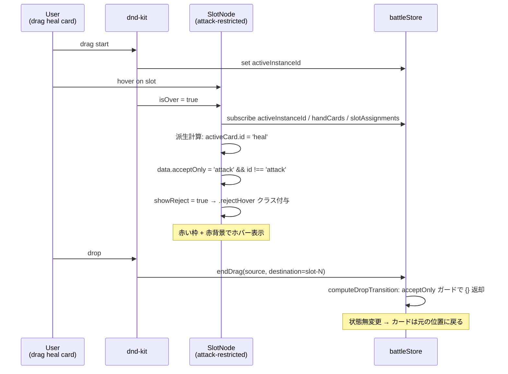
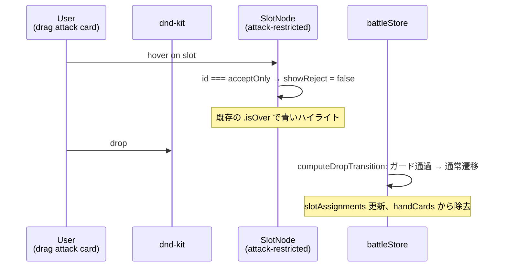

# 設計書: カード種別制限スロット（restricted-slot）

## 概要

既存の `lockedCard`（事前配置・変更不可）と並列で、「プレイヤー配置可能だが特定の id のカードしか受け入れない」スロットを導入する。スロット定義に `acceptOnly: 'attack' | 'guard' | 'heal'` を追加し、ローダーが両形式（線形 `slots` ／ flow）で同じフィールド名を吸収。`battleStore.slotMetadata`（新規 state）にステージ初期化時の静的情報として保存し、`computeDropTransition` がドロップ可否を判定する。`SlotNode` は右上に種別アイコン（HP/Guard バーと意匠統一の 12×12 インライン SVG）を常時表示し、不一致カードのホバー時に赤ハイライト（`.rejectHover`）を当てる。`lockedCard` と `acceptOnly` の両方が指定された場合はローダーで `console.warn` を出し `lockedCard` を優先（acceptOnly を無視）するため、データ整合の責務を 1 箇所に集約する。

## アーキテクチャ

### コンポーネント

| コンポーネント | 種別 | 責務 |
|---|---|---|
| `stages.json` | データ | スロット定義に `acceptOnly` フィールドを追加（任意） |
| `stagesLoader.js` | **既存改修** | `expandSlots` と `processSubFlow` で `acceptOnly` を転記。`lockedCard` 併用時は warning + `lockedCard` 優先 |
| `battleStore.js` | **既存改修** | 新規 state `slotMetadata: { [slotId]: { acceptOnly } }` を追加し、`initializeBattle` で構築。`computeDropTransition` に `acceptOnly` ガードを追加 |
| `FlowchartArea.jsx` | **既存改修** | `slotsToNodes` で `data: { acceptOnly }` を React Flow node に渡す |
| `SlotNode.jsx` | **既存改修** | `data.acceptOnly` を受け取り、右上にアイコン表示。ドラッグ中カードの id と比較して `.rejectHover` クラスを条件付与 |
| `SlotNode.module.css` | **既存改修** | `.rejectHover`（赤枠/赤背景）と `.acceptIcon`（右上絶対配置）を追加 |
| `RestrictedSlotIcon.jsx` | **新規** | `type` props（`'attack' \| 'guard' \| 'heal'`）に応じた SVG アイコンを返す純粋関数コンポーネント |

### データモデル

#### `stages.json` のスロット定義（拡張後）

```jsonc
{
  "id": "slot-1",                                  // 既存
  "position": { "x": 80, "y": 120 },                // 既存
  "lockedCard": { "id": "monster", "power": 30 },   // 既存（任意）
  "acceptOnly": "attack"                            // 新規（任意、"attack" | "guard" | "heal"）
}
```

`lockedCard` と `acceptOnly` は **排他**（要件 2）。両方指定時はローダーが warning を出し `acceptOnly` を破棄。

#### `battleStore` の状態

| 状態 | 型 | 用途 | 変更 |
|---|---|---|---|
| `slotAssignments` | `{ [slotId]: CardInstance \| null }` | 各スロットに実際に置かれているカード | 既存（変更なし） |
| `slotMetadata` | `{ [slotId]: { acceptOnly?: string } }` | スロット側の静的メタ情報。`initializeBattle` で 1 回だけ構築、以後不変 | **新規** |
| `activeInstanceId` | `string \| null` | ドラッグ中の `CardInstance` の `instanceId` | 既存（変更なし） |

`slotMetadata` を `slotAssignments` と分けている理由：
- `slotAssignments` は実行中に動的に変化する（カード配置・移動）
- `slotMetadata` はステージ定義から派生する静的情報
- 別管理にすることで `slotAssignments` の更新時に毎回 acceptOnly を運ぶ必要がなくなる

### API / インターフェース

#### `computeDropTransition` の早期リターンガード（拡張後）

```js
function computeDropTransition(state, { instanceId, source, destination }) {
  // 1. 手札 → スロット外 → 何もしない（既存）
  // 2. 同一位置 drop → 何もしない（既存）
  // 3. ドラッグ元スロットがロックカード → 何もしない（既存）
  // 4. ドロップ先スロットがロックカード → 何もしない（既存）
  // 5. ドロップ先スロットの acceptOnly と カード id が不一致 → 何もしない（新規）
  // ... 既存の遷移ロジック
}
```

ガード 5 の実装イメージ：

```js
if (destination !== null) {
  const meta = state.slotMetadata[destination];
  if (meta?.acceptOnly) {
    const draggedCard = findCardByInstanceId(state, instanceId);
    if (draggedCard && draggedCard.id !== meta.acceptOnly) {
      return {};
    }
  }
}
```

`findCardByInstanceId` は手札・スロット割当の両方を走査するヘルパー（`BattleScreen.selectActiveCard` と同じロジックを内部関数化）。

#### `SlotNode` の `data` props（拡張後）

| props | 型 | 説明 |
|---|---|---|
| `id` | string | スロット ID（既存） |
| `data` | object | `{ acceptOnly?: string }`（新規キー追加） |

#### `RestrictedSlotIcon` の API

| props | 型 | 説明 |
|---|---|---|
| `type` | `'attack' \| 'guard' \| 'heal'` | 表示するアイコン種別 |

戻り値: 種別に対応する `<svg>` 要素。`viewBox="0 0 14 14"` ／ `shape-rendering: crispEdges` ／ `pointer-events: none`。

## データフロー

### ステージ初期化からスロット描画まで

```mermaid
flowchart LR
    JSON[stages.json<br/>slot.acceptOnly] --> Loader[stagesLoader.js<br/>expandSlots / processSubFlow]
    Loader -->|slot.acceptOnly 転記| Store[battleStore<br/>initializeBattle で<br/>slotMetadata 構築]
    Loader -->|slots[]| FA[FlowchartArea<br/>slotsToNodes で<br/>data に acceptOnly 注入]
    FA -->|node.data| SN[SlotNode<br/>右上アイコン描画 +<br/>rejectHover 判定]
    Store -.参照.-> Drop[computeDropTransition<br/>ガード 5]
```

### ドロップ拒否シーケンス（不一致カードを restricted slot に重ねた場合）



### 一致カードのドロップ（通常通り受け入れ）



## 実装方針

### 1. stages.json データモデルの拡張

スロット要素に optional な `acceptOnly` フィールドを追加。値は `'attack'` / `'guard'` / `'heal'` のいずれかの文字列。

ステージ JSON 例（線形ステージ）:
```jsonc
{
  "slots": [
    {},
    { "acceptOnly": "attack" },
    { "acceptOnly": "heal" },
    {}
  ]
}
```

flow 形式：
```jsonc
{
  "flow": [
    { "acceptOnly": "attack" },
    {},
    { "condition": "...", "true": [...], "false": [...] }
  ]
}
```

### 2. stagesLoader.js の改修

#### `expandSlots`（線形ステージ用）

```js
function expandSlots(slots, stageId) {
  return slots.map((raw, index) => {
    const id = raw.id ?? `slot-${index + 1}`;
    const position = raw.position ?? { x: ..., y: ... };
    const expanded = { id, position };

    if (raw.lockedCard && raw.acceptOnly) {
      console.warn(
        `[stagesLoader] stage "${stageId}" slot "${id}": both lockedCard and acceptOnly are set. Ignoring acceptOnly.`
      );
      expanded.lockedCard = raw.lockedCard;
    } else if (raw.lockedCard) {
      expanded.lockedCard = raw.lockedCard;
    } else if (raw.acceptOnly) {
      if (!isValidAcceptOnly(raw.acceptOnly)) {
        console.warn(
          `[stagesLoader] stage "${stageId}" slot "${id}": invalid acceptOnly "${raw.acceptOnly}". Ignoring.`
        );
      } else {
        expanded.acceptOnly = raw.acceptOnly;
      }
    }
    return expanded;
  });
}

function isValidAcceptOnly(value) {
  return value === 'attack' || value === 'guard' || value === 'heal';
}
```

`stageId` 引数を新たに渡す（`expandStage` 側で `Object.entries(...)` のキーから渡す）。

#### `processSubFlow` の通常スロット else 分岐

```js
} else {
  ctx.slotCounter += 1;
  const slotId = `slot-${ctx.slotCounter}`;
  const slot = {
    id: slotId,
    position: { x: SLOT_X_START + column * SLOT_X_STEP, y: yLevel },
  };
  // lockedCard / acceptOnly の排他処理
  if (item.lockedCard && item.acceptOnly) {
    console.warn(`[stagesLoader] ... both set, ignoring acceptOnly.`);
    slot.lockedCard = item.lockedCard;
  } else if (item.lockedCard) {
    slot.lockedCard = item.lockedCard;
  } else if (item.acceptOnly) {
    if (isValidAcceptOnly(item.acceptOnly)) {
      slot.acceptOnly = item.acceptOnly;
    } else {
      console.warn(`[stagesLoader] ... invalid acceptOnly value, ignoring.`);
    }
  }
  ctx.slots.push(slot);
  // ... 既存のエッジ追加・endings 更新・column インクリメント
}
```

ヘルパー `isValidAcceptOnly` はモジュールトップで共有。

### 3. battleStore.js の改修

#### state に `slotMetadata` 追加

```js
// 初期値
slotMetadata: {},
```

#### `initializeBattle` で構築

```js
const slotMetadata = {};
for (const slot of stage.slots) {
  if (slot.acceptOnly) {
    slotMetadata[slot.id] = { acceptOnly: slot.acceptOnly };
  }
}
set({ ..., slotMetadata });
```

`lockedCard` 持ちスロットは `slotMetadata` に入れない（ローダー側で acceptOnly が既に破棄されているため）。

#### `computeDropTransition` にガード追加

`destCard?.locked` ガードの直後に挿入：

```js
if (destination !== null) {
  const destCard = state.slotAssignments[destination];
  if (destCard?.locked) {
    return {};
  }
  // 新規ガード
  const meta = state.slotMetadata[destination];
  if (meta?.acceptOnly) {
    const draggedCard = findCardByInstanceId(state, instanceId);
    if (draggedCard && draggedCard.id !== meta.acceptOnly) {
      return {};
    }
  }
}
```

`findCardByInstanceId` は内部ヘルパー（`computeDropTransition` の上か同ファイル内に定義）:

```js
function findCardByInstanceId(state, instanceId) {
  const fromHand = state.handCards.find((c) => c.instanceId === instanceId);
  if (fromHand) return fromHand;
  for (const card of Object.values(state.slotAssignments)) {
    if (card && card.instanceId === instanceId) return card;
  }
  return null;
}
```

`BattleScreen.selectActiveCard` と同じロジックだが、こちらは `state` を引数で受け取る純関数版。`selectActiveCard` は React のセレクタとして残す（用途が異なる）。

### 4. FlowchartArea.jsx の改修

`slotsToNodes` を拡張して `data.acceptOnly` を含める：

```js
function slotsToNodes(slots) {
  return slots.map((slot) => ({
    id: slot.id,
    type: 'slot',
    position: slot.position,
    data: { acceptOnly: slot.acceptOnly },
  }));
}
```

`acceptOnly` が `undefined` のスロットは `data.acceptOnly === undefined` で SlotNode 側がアイコン非表示にする。

### 5. SlotNode.jsx の改修

#### activeCard.id の派生計算

```jsx
const activeCardId = useBattleStore((s) => {
  const aid = s.activeInstanceId;
  if (!aid) return null;
  const fromHand = s.handCards.find((c) => c.instanceId === aid);
  if (fromHand) return fromHand.id;
  for (const card of Object.values(s.slotAssignments)) {
    if (card && card.instanceId === aid) return card.id;
  }
  return null;
});
```

#### showReject の判定

```jsx
const acceptOnly = data?.acceptOnly;
const showReject =
  isOver &&
  acceptOnly &&
  activeCardId !== null &&
  activeCardId !== acceptOnly;
```

#### className 配列に追加

```jsx
const className = [
  styles.slot,
  showAsFilled && styles.filled,
  isDragActive && styles.dropTarget,
  isOver && !showReject && styles.isOver,  // isOver は accept 時のみ
  showReject && styles.rejectHover,         // 拒否時は別クラス
  // ... 既存クラス
].filter(Boolean).join(' ');
```

`.isOver` と `.rejectHover` は排他（同時に付かない）。

#### アイコン描画

```jsx
return (
  <div ref={setNodeRef} className={className}>
    {/* 既存の Handle + DraggableCard + Handle */}
    {acceptOnly && <RestrictedSlotIcon type={acceptOnly} />}
  </div>
);
```

`RestrictedSlotIcon` 側で `position: absolute; top: 2px; right: 2px;` の絶対配置。

### 6. SlotNode.module.css の追加

```css
/* 不一致カードのホバー時に赤枠 */
.slot.rejectHover {
  border-color: #ff4d4d;
  background: rgba(255, 77, 77, 0.08);
}

/* filled 状態でも outline で赤を出す */
.slot.filled.rejectHover {
  outline: 2px solid #ff4d4d;
  outline-offset: 2px;
  border-radius: 6px;
  background: rgba(255, 77, 77, 0.08);
}
```

`.isOver` の青系（既存）と対をなす赤系。`outline` の使い分けは `.isOver` 既存パターン踏襲。

### 7. RestrictedSlotIcon.jsx の新規作成

`frontend/src/features/battle/flowchart/RestrictedSlotIcon.jsx`：

```jsx
import styles from './RestrictedSlotIcon.module.css';

function RestrictedSlotIcon({ type }) {
  if (type === 'attack') return <AttackIcon />;
  if (type === 'guard') return <GuardIcon />;
  if (type === 'heal') return <HealIcon />;
  return null;
}

function AttackIcon() {
  // attack カードの簡略化 + 赤色（剣を上向きに配置）
  return (
    <svg viewBox="0 0 14 14" className={styles.icon} shapeRendering="crispEdges">
      <rect x="6" y="1" width="2" height="7" fill="#ff4d4d" />
      <rect x="3" y="7" width="8" height="2" fill="#ff4d4d" />
      <rect x="6" y="9" width="2" height="4" fill="#8a2a2a" />
    </svg>
  );
}

function GuardIcon() {
  // GuardBar.jsx の盾アイコンと同形・同色（#4a8ef0）
  return (
    <svg viewBox="0 0 14 14" className={styles.icon} shapeRendering="crispEdges">
      <rect x="3" y="2" width="8" height="2" fill="#4a8ef0" />
      <rect x="2" y="4" width="10" height="6" fill="#4a8ef0" />
      <rect x="3" y="10" width="8" height="1" fill="#4a8ef0" />
      <rect x="4" y="11" width="6" height="1" fill="#4a8ef0" />
      <rect x="5" y="12" width="4" height="1" fill="#4a8ef0" />
    </svg>
  );
}

function HealIcon() {
  // BattleScreen.jsx の CrossIcon と同形・同色（#3ad430）
  return (
    <svg viewBox="0 0 14 14" className={styles.icon} shapeRendering="crispEdges">
      <rect x="5" y="2" width="4" height="10" fill="#3ad430" />
      <rect x="2" y="5" width="10" height="4" fill="#3ad430" />
    </svg>
  );
}

export default RestrictedSlotIcon;
```

#### RestrictedSlotIcon.module.css

```css
.icon {
  position: absolute;
  top: 2px;
  right: 2px;
  width: 12px;
  height: 12px;
  pointer-events: none;
  z-index: 2;
}
```

スロットの内側右上に絶対配置。`pointer-events: none` でドラッグ操作を奪わない。`z-index: 2` で配置済みカード（DraggableCard）より前面に。

## 依存関係

| パッケージ | 用途 | 導入済み？ |
|---|---|---|
| 既存のみ | React / CSS Modules / zustand / dnd-kit / @xyflow/react | はい |

新規依存ゼロ。

## トレーサビリティ確認

| 要件 | 対応設計セクション |
|---|---|
| 1-1〜1-6（acceptOnly データモデル） | 「実装方針 / 1, 2」、`stagesLoader.js` の `expandSlots` / `processSubFlow` 拡張 |
| 2-1〜2-4（lockedCard 排他） | 「実装方針 / 2」、ローダー内の if/else if 構造で warning + lockedCard 優先 |
| 3-1〜3-7（視覚アイコン表示） | 「実装方針 / 7」、RestrictedSlotIcon 新規 + 絶対配置 CSS |
| 4-1〜4-5（ドロップ拒否） | 「実装方針 / 3, 5, 6」、`computeDropTransition` ガード + `.rejectHover` クラス |
| 5-1〜5-3（実行時挙動） | 既存実行ロジックを変更しないため設計セクション不要（要件 6 と対応） |
| 6-1〜6-4（既存挙動非破壊） | 全実装方針で「acceptOnly が undefined のとき」は既存挙動を維持する分岐構造を採用 |

## トレードオフと検討した代替案

### 決定 1: `slotMetadata` を `slotAssignments` と別 state にする

- **理由**: `slotAssignments` は実行中に頻繁に変化する（カード移動・ガード吸収など影響を受けない）が、`acceptOnly` はステージ初期化後不変。別管理にすることで「state 更新時に毎回静的情報を運び直す」必要がなくなり、`set({ slotAssignments: ... })` の影響範囲を最小化できる。
- **検討した代替案**: `slotAssignments[slotId]` に `{ card: ..., acceptOnly: ... }` の入れ子構造で保持。`null` チェックや既存コードへの影響が大きく、互換性確保のコストが高いため不採用。

### 決定 2: `acceptOnly` を React Flow node の `data` 経由で `SlotNode` に渡す

- **理由**: 描画用途では `slotMetadata` 直接購読より、props 経由のほうが React Flow の慣習に沿う。`ConditionNode` も `data: { expression, label }` で同じパターン。
- **検討した代替案**: `SlotNode` 内で `useBattleStore` から `slotMetadata[id]?.acceptOnly` を直接購読。`slotMetadata` が初期化後不変なので reactivity は要らないが、props で渡すほうが「SlotNode の責務がどこから来るか」が明示的になる。

### 決定 3: lockedCard と acceptOnly の両方指定時は **lockedCard 優先**

- **理由**: `lockedCard` 持ちスロットはそもそもドラッグ対象外（`destCard.locked` のガードで先に弾かれる）なので、`acceptOnly` を残す意味がない。「prepopulated card がある時点でカード受け入れ機能は無効」が自然な解釈。さらに、要件 1 ユーザー回答で「排他」が選ばれた意図とも一致。
- **検討した代替案**: 両方残して `acceptOnly` を「lockedCard を取り除いた後の制限」と解釈。あり得るが、現状 lockedCard を取り除く手段がないため意味のないオプション。将来「locked カードを破壊するカード効果」が出てきたら再考。

### 決定 4: アイコンを `RestrictedSlotIcon` の独立コンポーネントに切り出す

- **理由**: 3 種類の SVG をパターンマッチで切り替える小さな責務なので、SlotNode 内のインライン関数より独立ファイルのほうが見通しが良い。将来 4 種目（例: reflect 専用）を足すときも 1 ファイル内で完結する。
- **検討した代替案**: SlotNode 内に 3 つの SVG をインライン展開。SlotNode の JSX が縦に長くなり、ノード本体のロジックがアイコン定義に埋もれる。

### 決定 5: 不一致時の視覚フィードバックを `.rejectHover` 専用クラスにする

- **理由**: 既存の `.isOver`（青系）と排他にすることで「受け入れ可能 / 不可」が一目で対比できる。`!showReject && styles.isOver` のクラス選択ロジックで、片方しか付かない設計。
- **検討した代替案**: `.isOver` を維持しつつ追加で `.rejectHint` を上乗せ。CSS 特異性の管理が複雑化し、トランジション競合（青枠 → 赤枠の切替がカク付く）の懸念が残るため不採用。
