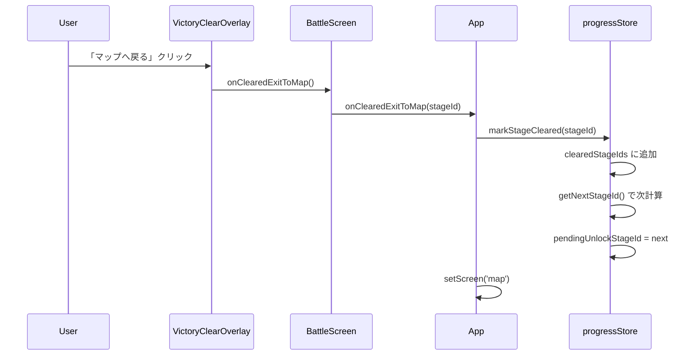
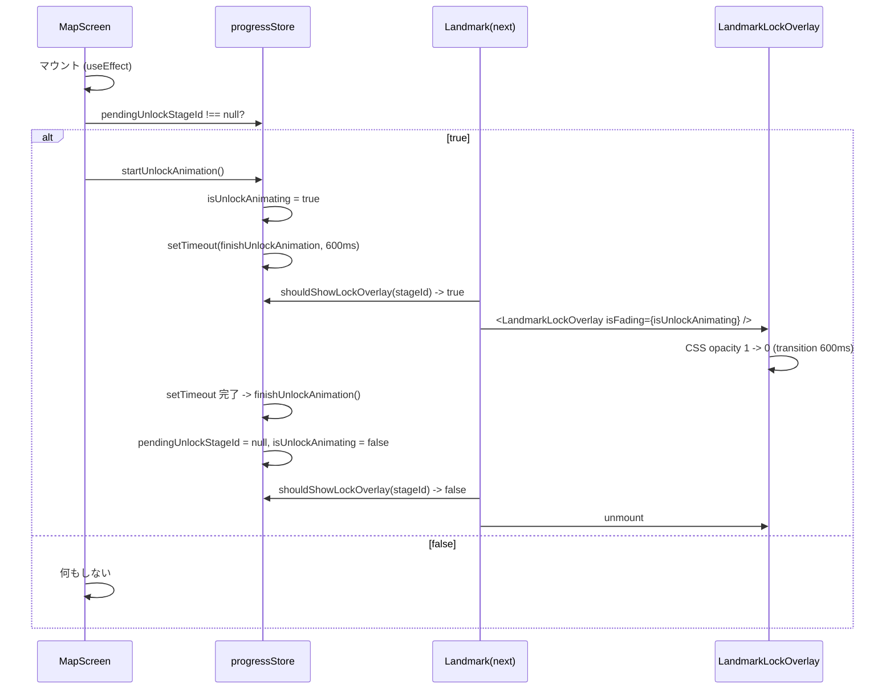
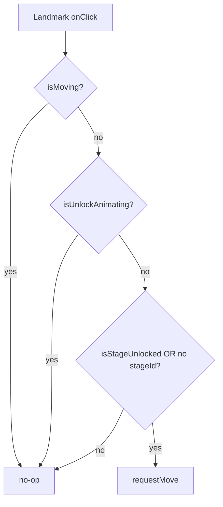

# 設計書: ステージ解放機能

## 概要

進行状態（クリア済みステージ・解放アニメーション中フラグ）を新規 zustand ストア `progressStore` に集約し、既存の `mapStore`（移動）・`battleStore`（戦闘）と並列に置く。マップ画面の `Landmark` は同ストアを購読し、未解放ランドマークではクリックを抑止して `LandmarkScroll` に新規コンポーネント `LandmarkLockOverlay`（インライン SVG：対角の鎖 2 本＋中央の南京錠）を重ねて表示する。クリア済みステージでは `LandmarkDetail` 上部に「クリア済み」ラベルを追加する。

解放アニメーションは「マップ画面再表示時に `pendingUnlockStageId` が立っていたら opacity 0 へフェードアウトし、その間は全マップ操作を無効化する」フローで実装する。クリアトリガーは `VictoryClearOverlay` の「マップへ戻る」ボタンに限定し、`App.jsx` の `onExitToMap` 経路に `markStageCleared(stageId)` を 1 行差し込む。

## アーキテクチャ

### コンポーネント

| コンポーネント | 種別 | 責務 |
|--------------|------|------|
| `progressStore` | 新規 zustand ストア | クリア済み `stageId` 集合・`pendingUnlockStageId`・`isUnlockAnimating` を保持。クリア記録・次ステージ計算・解放アニメ制御のアクションを公開する |
| `LandmarkLockOverlay` | 新規 React コンポーネント | 対角の鎖 2 本＋中央の南京錠をインライン SVG で描画する `<g>`。`isFading` prop を受けて opacity を 1 → 0 にトランジションさせる |
| `parseStageId` | 新規 純関数 | `"1-2"` → `{world: "1", number: 2}` に分解する。次ステージ ID 計算用 |
| `getNextStageId` | 新規 純関数 | `stagesData` と現 `stageId` から `{world}-{number+1}` を返す。存在しなければ `null` |
| `LandmarkScroll` | 既存・修正 | `isLocked` prop を受け、`true` のとき `LandmarkLockOverlay` を子要素として重ねる |
| `Landmark` | 既存・修正 | `progressStore` から解放状態・アニメ状態を購読し、未解放／アニメ中はクリック・たたかうを抑止する。`pendingUnlockStageId === stageId` のとき LockOverlay を `isFading=true` でマウントする |
| `LandmarkDetail` | 既存・修正 | `isCleared` prop を受け、`true` のとき難易度ラベルの上に「クリア済み」テキストを表示する |
| `MapScreen` | 既存・修正 | マウント時 useEffect で `pendingUnlockStageId !== null` を検出し、`startUnlockAnimation()` を呼び出す |
| `App.jsx` | 既存・修正 | `BattleScreen` に `onClearedExitToMap(stageId)` コールバックを渡し、`VictoryClearOverlay` 経由の退出のみクリア記録に紐づける |
| `BattleScreen` | 既存・修正 | 勝利演出経由の退出（`VictoryClearOverlay`）と通常退出（右上 `BackToMapButton`）を別経路にして親へ通知する |

### データモデル

#### `progressStore` の状態

```ts
type ProgressState = {
  clearedStageIds: string[];          // 順序保持のため配列。集合的判定は include で行う
  pendingUnlockStageId: string | null; // 直近のクリアで新たに解放されたステージ。アニメ完了後に null に戻す
  isUnlockAnimating: boolean;          // 解放アニメ再生中フラグ。マップ全体のクリック抑止にも使う
};

type ProgressActions = {
  markStageCleared: (stageId: string) => void;  // クリア記録＋次ステージ判定＋pendingUnlockStageId セット
  startUnlockAnimation: () => void;              // MapScreen マウント時に呼ぶ。isUnlockAnimating = true、setTimeout で finish を予約
  finishUnlockAnimation: () => void;             // setTimeout 完了時に呼ぶ。pendingUnlockStageId = null、isUnlockAnimating = false
};

type ProgressSelectors = {
  isStageCleared: (state, stageId) => boolean;
  isStageUnlocked: (state, stageId) => boolean; // 末尾 "-1" or 直前ステージが clearedStageIds に含まれる
  shouldShowLockOverlay: (state, stageId) => boolean; // 未解放 OR pendingUnlockStageId === stageId
};
```

初期値はすべて空・`null`・`false`。`isStageUnlocked` は派生計算で十分なため、解放済み集合をストアに持たない（クリア集合から導出する）。

#### `clearedStageIds` の更新ルール

`markStageCleared(stageId)`：
- `clearedStageIds.includes(stageId)` なら何もしない（要件 3-2）
- 含まなければ末尾に追加し、`getNextStageId(stageId)` を計算
- 次ステージが存在し、かつ未だ解放されていない（直前ステージが今回追加された）ならば `pendingUnlockStageId = nextStageId` を設定（要件 4-1, 4-3）
- 次ステージが存在しない（最終ステージ）なら `pendingUnlockStageId` は変更しない（要件 4-2）

### API / インターフェース

```js
// stores/progressStore.js
import { create } from 'zustand';

const useProgressStore = create((set, get) => ({
  clearedStageIds: [],
  pendingUnlockStageId: null,
  isUnlockAnimating: false,

  markStageCleared: (stageId) => { /* ... */ },
  startUnlockAnimation: () => { /* set + setTimeout */ },
  finishUnlockAnimation: () => { /* set null/false */ },
}));

export const isStageClearedSelector = (stageId) => (state) =>
  state.clearedStageIds.includes(stageId);

export const isStageUnlockedSelector = (stageId) => (state) => {
  const parsed = parseStageId(stageId);
  if (parsed?.number === 1) return true;
  const prev = `${parsed.world}-${parsed.number - 1}`;
  return state.clearedStageIds.includes(prev);
};

export const shouldShowLockSelector = (stageId) => (state) =>
  !isStageUnlockedSelector(stageId)(state) || state.pendingUnlockStageId === stageId;

export default useProgressStore;
```

```js
// features/map/parseStageId.js
export function parseStageId(stageId) {
  const m = /^(\w+)-(\d+)$/.exec(stageId);
  if (!m) return null;
  return { world: m[1], number: Number(m[2]) };
}
```

```js
// features/map/getNextStageId.js
export function getNextStageId(stagesData, stageId) {
  const parsed = parseStageId(stageId);
  if (!parsed) return null;
  const next = `${parsed.world}-${parsed.number + 1}`;
  return stagesData.stages[next] ? next : null;
}
```

## データフロー

### 1. クリア記録 → 解放トリガー



### 2. マップ表示 → 解放アニメーション



### 3. クリック抑止判定



## 実装方針

### `progressStore`（新規）

`stores/` 配下に `progressStore.js` を新設。`mapStore` / `battleStore` と同じ構造で、`create` で初期状態とアクションを 1 ファイル 1 ストアにまとめる。CLAUDE.md の「1 ファイル 1 クラス」規約は zustand ストアにも適用する。`startUnlockAnimation` の `setTimeout` は `battleStore.startVictorySequence` で既に使われている方式を踏襲し、外部タイマー管理ライブラリは導入しない。

`UNLOCK_FADE_DURATION_MS = 600` をモジュール内定数として定義し、CSS の `transition-duration` と同期させる（`battleStore` の `TRANSITION_DURATION_MS` と同じ規約）。

### `LandmarkLockOverlay`（新規）

`features/map/LandmarkLockOverlay.jsx` + `.module.css` を新設。`LandmarkScroll` と同じ座標系（中心 (0,0)、半幅 80・半高 16 の矩形領域）にスケールを合わせ、`<g>` ルートで返す。

- **対角の鎖 2 本**：`(-80,-16) → (80,16)` と `(-80,16) → (80,-16)` の 2 本の対角線に沿って、楕円形のリングを 5〜6 個ずつ等間隔に並べる。リングは `<ellipse>` で `rx=4, ry=2.5` 程度、`fill: #2a2a2a, stroke: #4a4a4a, stroke-width: 1`。SVG の `<g transform="rotate(...)">` でリングを線方向へ向ける。
- **中央の南京錠**：本体は `<rect>` で `x=-9, y=-2, width=18, height=14, rx=2`、塗り `#1a1a1a`、ストローク `#5a5a5a`。シャックル（U 字部分）は `<path d="M -6 -2 A 6 6 0 0 1 6 -2" stroke="#5a5a5a" stroke-width="2" fill="none">`。鍵穴は `<circle cx=0 cy=4 r=1.5 fill="#5a5a5a">` ＋ 下に細い `<rect>`。
- **半透明オーバーレイ**：Scroll 全体に `<rect x=-80 y=-16 width=160 height=32 fill="rgba(0,0,0,0.45)" rx=4>` を最背面に置き、「鎖がかかって暗くなった」感じを出す（要件外だが視覚的バランスのため自然と入る選択肢）。

ルート `<g>` に `data-fading` 属性を付与。CSS で：

```css
.overlay { opacity: 1; transition: opacity 600ms ease-out; pointer-events: none; }
.overlay[data-fading="true"] { opacity: 0; }
```

`isFading=true` で `data-fading="true"` を付け、`onTransitionEnd` を上位（`Landmark`）でハンドルする方式は取らず、アニメ完了の合図は `progressStore.startUnlockAnimation` 内の `setTimeout` で一元管理する（タイマーと CSS 期間が同じ定数を共有）。これで CSS と JS のどちらが先に終わってもストア状態がブレない。

`pointer-events: none` によりロック上のクリックは下層に抜けるが、その下層も `Landmark` 全体の click を抑止しているため要件 2-3 を満たす。

### `LandmarkScroll`（修正）

`label` に加えて `isLocked` (boolean) prop を受け取り、`true` のとき `<LandmarkLockOverlay isFading={...} />` を子に配置する。フェード制御に必要な `isFading` も props で受け、自身は配置に専念して状態は持たない。

### `Landmark`（修正）

`progressStore` を 3 つのセレクタで購読：
- `isUnlocked = useProgressStore(isStageUnlockedSelector(stageId))`
- `isCleared = useProgressStore(isStageClearedSelector(stageId))`
- `pendingUnlockStageId` と `isUnlockAnimating` を直接購読

導出値：
- `shouldShowLock = stageId && !isUnlocked` または `pendingUnlockStageId === stageId`
- `isFading = pendingUnlockStageId === stageId && isUnlockAnimating`
- `isClickable = !isMoving && !isUnlockAnimating && (!stageId || isUnlocked)`

`stageId` を持たないランドマーク（`village_gate` 等）には `shouldShowLock = false`、`isClickable = !isMoving && !isUnlockAnimating` を適用（要件 1-3）。

`handleClick` の早期リターン条件を `if (isMoving || isUnlockAnimating || (stageId && !isUnlocked)) return;` に拡張する。`handleFight` も同様に `(stageId && !isUnlocked)` ガードを追加（要件 2-2）。

### `LandmarkDetail`（修正）

`isCleared` prop を追加。`true` のとき、現在の上半分（難易度ラベル＋星）の上にもう 1 行「クリア済み」を表示するため、パネル全体の高さを少し広げるか、難易度ラベルの上の余白に挟み込む。設計上は後者の「既存の y 座標は触らず、`-halfHeight + 12` あたりに小さめのテキストを追加」を採用し、レイアウト変更を最小限に留める。テキストは緑系（例：`#5cb85c`）で「クリア済み」と表示し、未クリア時は要素自体を描画しない。

### `MapScreen`（修正）

新規 useEffect：

```jsx
useEffect(() => {
  const { pendingUnlockStageId, isUnlockAnimating, startUnlockAnimation } =
    useProgressStore.getState();
  if (pendingUnlockStageId !== null && !isUnlockAnimating) {
    startUnlockAnimation();
  }
}, []);
```

マウントごとに 1 度だけ実行。空依存配列は要件 7-2 を満たすために必須（バトル ↔ マップを行き来しても再実行されるが、再マウントごとに最新状態を見る挙動はむしろ望ましい）。

### `BattleScreen` + `App.jsx`（修正）

現状の `onExitToMap` を 2 経路に分割：
- `onClearedExitToMap(stageId)` — `VictoryClearOverlay` から発火（要件 3-1）
- `onExitToMap` — 右上 `BackToMapButton` から発火（要件 3-3：クリア記録しない）

`App.jsx` 側は `markStageCleared(stageId)` を `onClearedExitToMap` のハンドラ内で呼び出してから `setScreen('map')` する。

実装上の選択肢として、コールバックを 1 本にしたまま `BattleScreen` 側で「勝利経由の退出かどうか」を判定して `App.jsx` に伝える方法もあるが、画面遷移と進行記録は別関心であるため、コールバック分割の方が読みやすい。

## 依存関係

| パッケージ | 用途 | 導入済み？ |
|----------|------|----------|
| `zustand` | `progressStore` の作成 | ✅ |
| `react` | コンポーネント／useEffect | ✅ |

新規パッケージは不要。

## トレードオフと検討した代替案

- **決定**：`progressStore` を新規作成 / **理由**：`mapStore`（移動）・`battleStore`（戦闘）と関心が異なる（画面横断の進行管理）。同居させると再マウント時の初期化ロジックが複雑化する（`mapStore.initializeMap` の「未初期化のときだけ初期化」と進行記録は両立させたいが、進行記録は初期化したくない）。
- **決定**：`unlockedStageIds` を別フィールドで持たず派生計算する / **理由**：「直前ステージがクリア済みなら解放」のルールが単純で、二重管理の同期バグを防げる。アクセス頻度（マウント時の各 Landmark で 1 回ずつ）でも性能上の問題はない（クリアステージ数は数十オーダー）。
- **決定**：解放アニメ完了の合図を JS の `setTimeout` で出す / **理由**：`onTransitionEnd` は対象要素が複数あったとき（同時に複数解放するシナリオは現状無いが将来あり得る）の集約が面倒。CSS の `transition-duration` と同じ JS 定数を共有することで「タイマーが先・CSS が後」「逆」のいずれでも整合する。
- **決定**：`LandmarkLockOverlay` を独立コンポーネントに分離 / **理由**：CLAUDE.md の「1 ファイル 1 クラス」規約に従う。`LandmarkScroll` 内部で SVG を直書きすると、「ステージ名バナー」と「ロック装飾」という 2 関心が混在する。
- **決定**：「クリア済み」ラベルは `LandmarkDetail` 内部で条件付き描画 / **理由**：別コンポーネントに切り出すほどのロジックは無く、`isCleared` prop 1 つで切り替える方が読みやすい。レイアウトの y 座標調整も同ファイル内で完結する。
- **棄却した代替**：解放状態を localStorage に永続化 / **理由**：要件 7 で明示的に対象外と決定。将来追加する際は zustand の `persist` ミドルウェアを 1 行差し込めば済む構造になっている。
- **棄却した代替**：解放トリガーを「敵 HP が 0 になった瞬間」とする / **理由**：要件 3-1 で `VictoryClearOverlay` の「マップへ戻る」のみと決定。プレイヤーが勝利演出を見ずに右上のテストボタンで離脱した場合をクリア扱いしないため。
