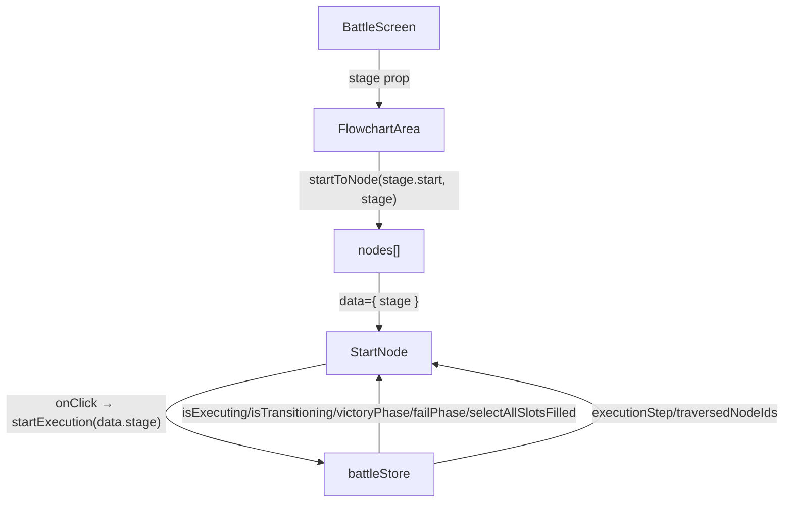
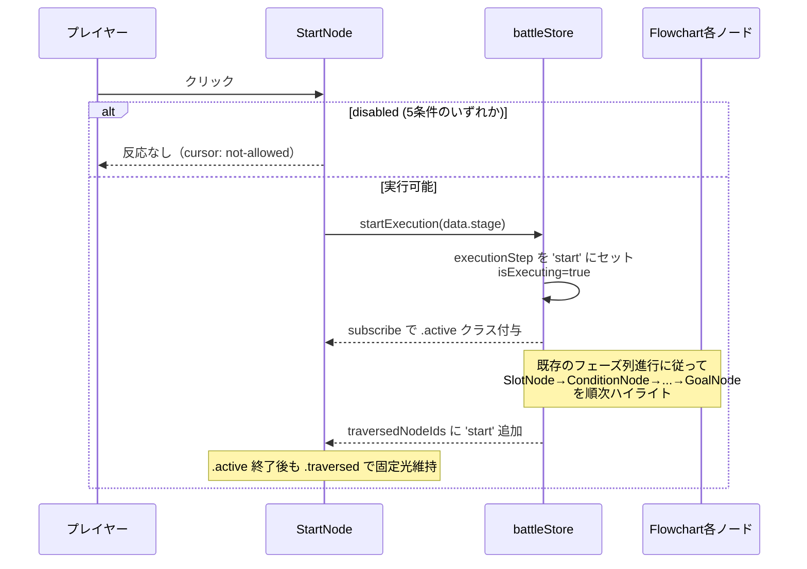

# 設計書: StartNode 実行トリガー化

## 概要

React Flow カスタムノードとして既に存在する `StartNode` を `<div>` から `<button type="button">` に置き換え、クリックハンドラとして `battleStore.startExecution(stage)` を発火させる。`stage` は React Flow の `data` prop 経由で `FlowchartArea` から `StartNode` に渡す（store に新規に持たせない）。実行可否（disabled）の判定ロジックは旧 `PlayButton` から StartNode に移植する（store のセレクタ・状態は流用）。視覚面では旧 `start.svg`（白い矢印）を `play.svg`（緑色の再生マーク、PlayButton と同素材）に差し替え、PlayButton 用 CSS の disabled スタイル（`opacity: 0.4` + `cursor: not-allowed`）と等価のスタイルを `StartNode.module.css` に追加する。旧 `PlayButton.jsx` / `PlayButton.module.css` および `BattleScreen.jsx` の利用箇所を削除し、機能の二重化を排除する。

## アーキテクチャ

### コンポーネント

| コンポーネント | 責務 |
|--------------|------|
| `StartNode`（改修） | `<button type="button">` を返し、5条件（実行中・拡大遷移中・未配置スロットあり・勝利演出中・失敗演出中）で `disabled` を判定。`onClick` で `startExecution(data.stage)` を発火。`data.stage` は React Flow `data` prop 経由で受け取る |
| `FlowchartArea`（軽微変更） | `startToNode(start)` の戻り値に `data: { stage }` を埋め込み、StartNode に `stage` を伝達 |
| `BattleScreen`（軽微変更） | `PlayButton` の import と JSX 利用箇所（`<PlayButton stage={stage} />`）を削除。`.flowchartControls` の DOM 構造は維持（次仕様の別ボタン配置場所として残す） |
| `PlayButton`（削除） | `PlayButton.jsx` と `PlayButton.module.css` を物理削除 |

### データモデル

新規の型・スキーマは追加しない。既存の `battleStore` の状態とアクションをそのまま再利用する:

| 名前 | 型 | 用途 |
|---|---|---|
| `isExecuting` | `boolean` | 実行中フラグ。`disabled` 判定 |
| `isTransitioning` | `boolean` | 拡大/縮小遷移中フラグ。`disabled` 判定 |
| `victoryPhase` | `string \| null` | 勝利演出フェーズ。`null` 以外で `disabled` |
| `failPhase` | `string \| null` | 失敗演出フェーズ。`null` 以外で `disabled` |
| `selectAllSlotsFilled` | セレクタ `(s) => boolean` | 全スロット配置済みかを派生計算。`false` で `disabled` |
| `startExecution(stage)` | アクション | 実行開始。クリック時に発火 |
| `executionStep` | `{type, id} \| null` | 現在フェーズ。`.active` 判定（既存どおり） |
| `traversedNodeIds` | `string[]` | 通過済みノード ID。`.traversed` 判定（既存どおり） |

### API / インターフェース

#### `StartNode` の新シグネチャ

```javascript
function StartNode({ data }) {
  // data.stage: object — React Flow data prop 経由で渡される
}
```

#### `startToNode(start, stage)` の改修シグネチャ

`FlowchartArea.jsx` の既存関数:

```javascript
// Before
function startToNode(start) {
  if (!start) return null;
  return { id: 'start', type: 'start', position: start.position, data: {} };
}

// After
function startToNode(start, stage) {
  if (!start) return null;
  return { id: 'start', type: 'start', position: start.position, data: { stage } };
}
```

呼び出し側（同ファイル内）の `startToNode(stage.start)` を `startToNode(stage.start, stage)` に変更。

## データフロー





## 実装方針

### Hook 構成（StartNode）

旧 PlayButton と StartNode の `useBattleStore` 呼び出しをマージする。状態購読は **個別セレクタごとに分割**（既存パターンに合わせる）して、関係ない state 変化での再描画を避ける:

```javascript
const isExecuting = useBattleStore((s) => s.isExecuting);
const isTransitioning = useBattleStore((s) => s.isTransitioning);
const allFilled = useBattleStore(selectAllSlotsFilled);
const victoryPhase = useBattleStore((s) => s.victoryPhase);
const failPhase = useBattleStore((s) => s.failPhase);
const startExecution = useBattleStore((s) => s.startExecution);
const isActive = useBattleStore(
  (s) => s.executionStep?.type === 'node' && s.executionStep?.id === 'start',
);
const isTraversed = useBattleStore((s) => s.traversedNodeIds.includes('start'));

const isDisabled = isExecuting || isTransitioning || !allFilled
  || victoryPhase !== null || failPhase !== null;
```

### クリックハンドラ

シンプルに `data.stage` を渡すだけ:

```javascript
const handleClick = () => {
  startExecution(data.stage);
};
```

`disabled` 属性付き `<button>` ならクリックイベント自体が発火しないため、追加ガードは不要。

### React Flow との衝突回避

#### `pointer-events: auto` の付与

既存 `SlotNode.module.css` のコメント:
> 親の React Flow NodeWrapper は nodesDraggable=false / elementsSelectable=false の組み合わせで `pointer-events: none` をインライン付与する

このため `StartNode.module.css` の `.marker` も `pointer-events: auto` に変更する必要がある。現状 `pointer-events: none` なので明示的に上書き。

#### Handle の維持

右辺の `source` Handle は `<button>` の中の絶対配置要素として動作する。Handle 自体は `pointer-events: none` + `opacity: 0` で不可視のままなので、button のクリック領域を邪魔しない。

### CSS の更新（`StartNode.module.css`）

#### 既存の `.marker` 構造を `<button>` 互換に

```css
.marker {
  /* 既存 */
  width: 80px;
  height: 120px;
  border: 2px solid #4a4a52;
  border-radius: 6px;
  background: #15151c;
  box-sizing: border-box;
  display: flex;
  align-items: center;
  justify-content: center;
  /* 新規・変更 */
  pointer-events: auto;        /* React Flow NodeWrapper の none を上書き */
  cursor: pointer;             /* button らしさ */
  padding: 0;                  /* button のデフォルトを潰す */
  font: inherit;               /* button のデフォルトを潰す */
  color: inherit;              /* button のデフォルトを潰す */
  transition: opacity 0.15s;   /* disabled 切替を滑らかに */
}
```

#### `:disabled` セレクタを追加

```css
.marker:disabled {
  opacity: 0.4;
  cursor: not-allowed;
}
```

#### `.active` / `.traversed` は既存のまま流用

`@keyframes startGoalHighlight` と `.marker.traversed { filter: ... }` は無変更で動く。

### アイコン差し替え

JSX:
```jsx
// Before


// After

```

`alt=""` にするのは「装飾画像」として扱うため。意味は親 `<button>` の `aria-label="実行"` に集約する。

`.icon` クラスの寸法 `48×48` は維持。`play.svg` の viewBox 24×24 が等比拡大されるだけなので、見え方の調整は実機で行う（必要なら 40〜56 の範囲で微調整）。

### PlayButton の削除

| 対象 | 操作 |
|---|---|
| `frontend/src/features/battle/flowchart/PlayButton.jsx` | ファイル削除 |
| `frontend/src/features/battle/flowchart/PlayButton.module.css` | ファイル削除 |
| `frontend/src/features/battle/BattleScreen.jsx` line 14 | `import PlayButton from './flowchart/PlayButton';` 削除 |
| `frontend/src/features/battle/BattleScreen.jsx` line 567 | `<PlayButton stage={stage} />` 削除 |
| `BattleScreen.module.css` の `.flowchartControls` | 維持（次仕様の別ボタン配置場所） |

### アクセシビリティ

`<button type="button">` を使うことで以下が標準で達成される:
- フォーカス可能（`tabIndex` 不要）
- Enter / Space キーで click イベント発火
- `disabled` 属性でキーボード経由の発火も阻止
- スクリーンリーダーが「ボタン」と認識

`aria-label="実行"` は旧 PlayButton から踏襲。

### 既存 docstring の更新

`StartNode.jsx` の docstring を以下の方針で書き直す（teaching モード規約により Claude が直接 Edit する）:

- 「ドロップ対象にならない `<div>`」→「クリック可能な `<button>`」へ表現変更
- `startExecution` 発火・disabled 判定の説明追加
- `play-button` 仕様への参照を整理（PlayButton 削除に伴い「旧 PlayButton 仕様」と明記、または `start-node-execution` 仕様への参照に置き換え）

`PlayButton.jsx` 削除に伴い、他ファイルの docstring が `PlayButton` を参照していたら同時に修正（要件4-5）。grep で検出してから更新する。

## 依存関係

| パッケージ | 用途 | 導入済み？ |
|----------|------|----------|
| `@xyflow/react` | `Handle`, `Position` を引き続き使用 | はい（既存） |
| `zustand` | `useBattleStore` を引き続き使用 | はい（既存） |

新規依存なし。

## トレードオフと検討した代替案

- **決定内容**：`stage` を React Flow `data` prop 経由で StartNode に渡す
  **理由**：StartNode の責務はノード単体で完結すべきで、`battleStore` に `stage` を持たせると初期化順序や永続化（`MapScreen` ↔ `BattleScreen` 遷移）に新しい問題を持ち込む。`data` prop は React Flow の標準的なノード初期化機構であり、`FlowchartArea` 1 箇所での変更だけで済む
  **検討した代替案**：(a) `battleStore` に `currentStage` を追加して全コンポーネントから参照可能にする → 影響範囲が大きく、`initializeBattle` のライフサイクルとの整合チェックが増える。(b) `StartNode` を Context Provider 経由で stage を受け取る形に → 既存パターンと乖離し、テスト・デバッグの複雑さが増す

- **決定内容**：旧 `start.svg` ファイル自体は削除せず残す
  **理由**：本仕様では `play.svg` への参照差し替えのみで完結し、`start.svg` を残しても害はない。将来「右向き矢印」アイコンを別の場所で再利用する可能性もあるため、安全側に倒す（要件4 でも `start.svg` の削除は明記していない）
  **検討した代替案**：`start.svg` も同時削除 → 復元コストはあるが、不要ファイルが残る潔癖さの問題。実害は無いので保留

- **決定内容**：`disabled` 時の `.active` / `.traversed` 演出と `opacity: 0.4` を併存させる
  **理由**：実行中は StartNode が `.active`（短時間）→ `.traversed`（長時間）になるが、同時に `isExecuting=true` で `disabled` も成立する。視覚的には「半透明だが光っている」という状態になり違和感が出る可能性がある。ただし要件 2-6 で「disabled なら視覚的に無効状態を表示する」と明示しており、また実行中は注目が他ノードに移っているため StartNode の半透明発光は問題になりにくい。実装後の実機確認で違和感が強ければ別仕様で調整
  **検討した代替案**：`.active` / `.traversed` がついている間は `opacity: 0.4` を打ち消す → CSS の優先順位調整が必要になり、disabled の意味が「クリック不可」と「視覚的に無効」で乖離する。要件の単純さを優先

- **決定内容**：`<button>` の native disabled を主、`aria-disabled` は使わない
  **理由**：`disabled` 属性はクリック・キーボード・フォーカスをすべてブロックする HTML 標準機構で、追加の JS ガードが不要。`aria-disabled` は ARIA ロールだけが「無効」と伝わり、実際のクリックは通ってしまうので二重実装が必要
  **検討した代替案**：`aria-disabled="true"` + `onClick` 内ガード → ガード漏れのリスクと、tab フォーカスが当たり続ける UX のデメリット

## トレーサビリティ

| 要件 | 対応する設計セクション |
|---|---|
| 1: クリック実行トリガー化 | コンポーネント表（StartNode 改修）、データフロー、実装方針「Hook 構成」「クリックハンドラ」 |
| 2: 実行可否判定 | 実装方針「Hook 構成」（`isDisabled` 算出）、CSS「`:disabled` セレクタ追加」 |
| 3: アイコン差し替え | 実装方針「アイコン差し替え」 |
| 4: PlayButton 完全削除 | 実装方針「PlayButton の削除」（5項目すべてカバー） |
| 5: 既存 StartNode 機能の維持 | 実装方針「Handle の維持」「CSS（既存 `.active` / `.traversed` 流用）」、コンポーネント表（FlowchartArea 軽微変更で位置不変） |
| 6: アクセシビリティ | 実装方針「アクセシビリティ」 |
| 7: 既存他機能との非干渉 | コンポーネント表（BattleScreen の `.flowchartControls` 維持）、トレードオフ「disabled 時の演出併存」 |

全7要件が設計に対応しています。孤立した要件はありません。
