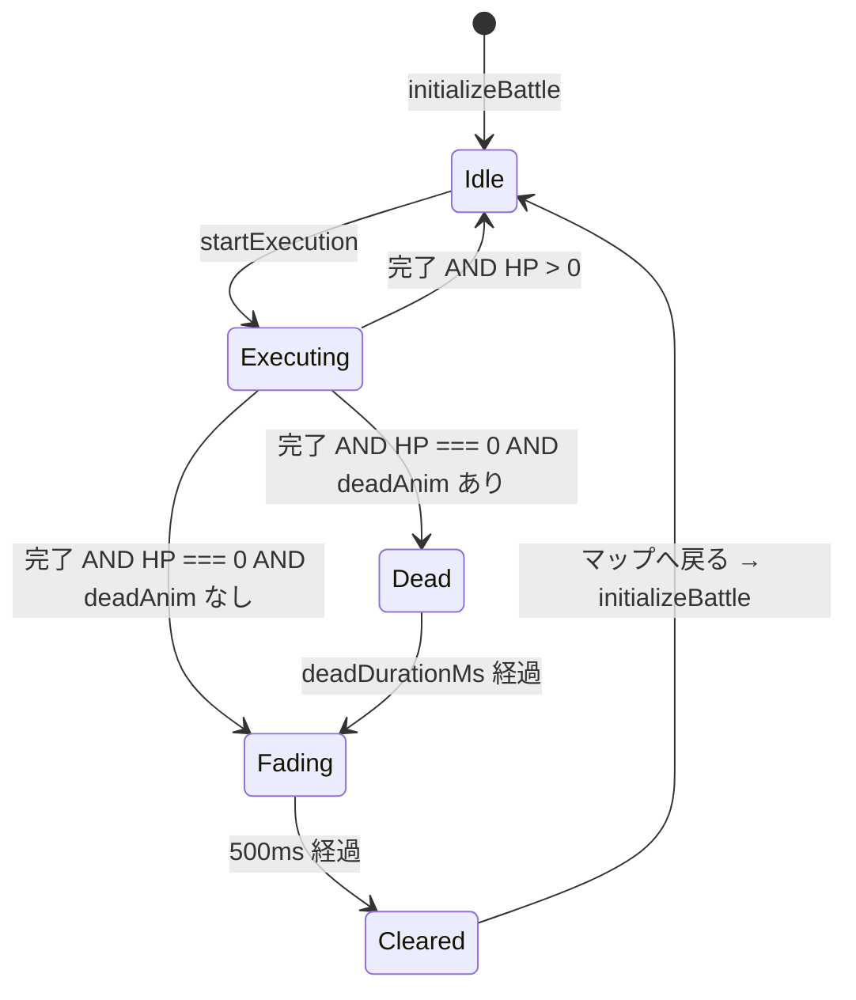
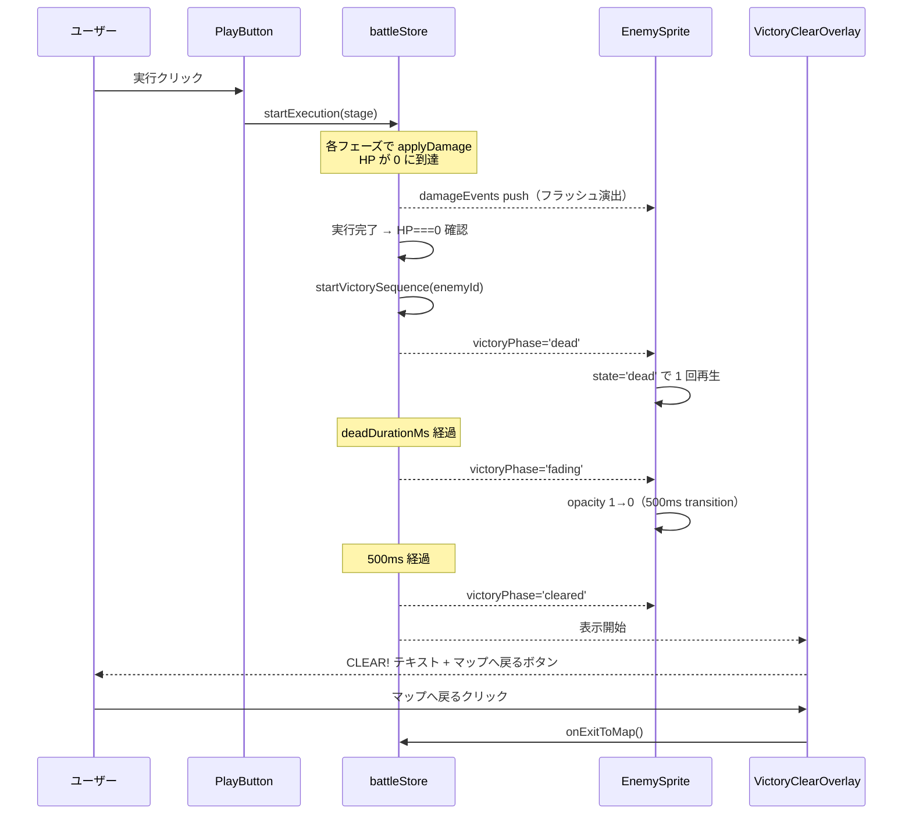
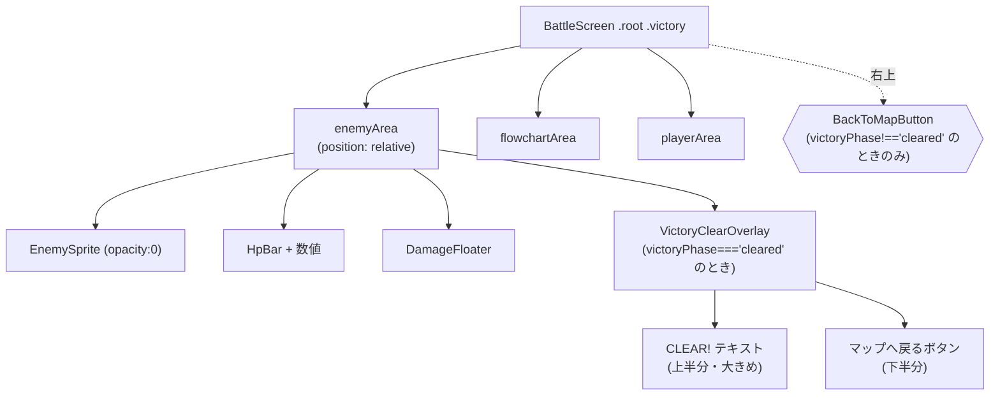

# 設計書: 勝利時 CLEAR! 演出

## 概要

勝利演出の進行を `battleStore` の単一フィールド `victoryPhase` (`null | 'dead' | 'fading' | 'cleared'`) で表現する。実行シーケンスの完了時点で敵 HP が 0 なら、`startExecution` が `setTimeout` チェーンでこのフィールドを `'dead' → 'fading' → 'cleared'` と遷移させ、それを購読する各コンポーネント（敵スプライト・新設の `VictoryClearOverlay`・各種ボタン）が見た目と操作可否を切り替える。dead アニメーションが未実装の敵では先頭フェーズをスキップして `'fading'` から開始する。

CLEAR! テキストとマップへ戻るボタンは、敵エリアに重ねる新コンポーネント `VictoryClearOverlay` 1 箇所に集約する。通常時の右上「マップへ戻る」ボタンは `victoryPhase === 'cleared'` のときに非表示にし、オーバーレイ側のボタンと位置の入れ替えを実現する。操作無効化は既存の `.root.executing` と同じ手法（`pointer-events: none` を `.root` に付与し、有効化したい要素にだけ `auto` を再指定）を `.root.victory` クラスで踏襲する。

## アーキテクチャ

### コンポーネント

| コンポーネント | 責務 |
|--------------|------|
| `battleStore`（拡張） | `victoryPhase` 状態と遷移アクション `startVictorySequence(enemyId)` を提供。`startExecution` 末尾で勝利判定し、HP=0 なら `startVictorySequence` を起動 |
| `EnemySprite`（拡張） | `victoryPhase` を購読。`'dead'` 時は dead 状態のスプライト（loop=false）を表示。`'fading'` / `'cleared'` 時は `.fading` クラスで opacity 0 へトランジション |
| `VictoryClearOverlay`（新規） | `victoryPhase === 'cleared'` のとき敵エリアに絶対配置で重なり、上半分に「CLEAR!」、下半分にマップへ戻るボタンを表示 |
| `BackToMapButton`（既存・流用） | 右上配置版。`victoryPhase === 'cleared'` のときは BattleScreen 側で非表示にする。`VictoryClearOverlay` 内ではこれを再利用せず、独自スタイルで再描画する（位置・サイズが大きく異なるため） |
| `BattleScreen`（拡張） | `victoryPhase` に応じて `.root` に `.victory` クラスを付与し、`VictoryClearOverlay` を条件付きレンダー。右上 `BackToMapButton` を `victoryPhase !== 'cleared'` のときだけ描画 |
| `PlayButton` / `ResetButton` / `ZoomButton`（拡張） | `disabled` 条件に `victoryPhase !== null` を追加 |
| `enemies.json`（拡張） | `knight` / `wolf` / `golem` に `dead` アニメ定義を追加（`loop: false`） |

### データモデル

`battleStore` に以下を追加：

```js
victoryPhase: null,  // 'dead' | 'fading' | 'cleared' | null
```

| 値 | 意味 | EnemySprite が描画するもの | VictoryClearOverlay 表示 | 右上 BackToMapButton |
|---|---|---|---|---|
| `null` | 通常状態 | idle ループ | 非表示 | 表示・有効 |
| `'dead'` | dead アニメ再生中 | dead 状態 1 回再生（loop=false） | 非表示 | 表示・無効 |
| `'fading'` | 透過中 | dead 最終フレーム（または idle）を `opacity` 0 へトランジション | 非表示 | 表示・無効 |
| `'cleared'` | 勝利確定 | 透明（非表示） | 表示 | **非表示** |

`enemies.json` に追加するエントリの形：

```json
"dead": {
  "frameCount": 5,
  "frameDurationMs": 250,
  "loop": false
}
```

| 敵 | フレーム数 | 1 フレーム時間 |
|---|---:|---:|
| `knight` | 5 | 250ms |
| `wolf` | 6 | 250ms |
| `golem` | 6 | 250ms |
| `slime` | （未実装＝定義なし、暫定スキップ分岐で吸収） | - |

### API / インターフェース

#### `battleStore` の追加アクション

```js
/**
 * 勝利演出シーケンスを開始する。
 *
 * Args:
 *   enemyId (string): 倒した敵 ID。dead アニメ定義の有無判定に使う。
 */
startVictorySequence: (enemyId) => void
```

内部処理：
1. 敵定義の `animations.dead` を引いて、存在すれば `frameCount × frameDurationMs` を `deadDurationMs` として算出。なければ `0` で `'dead'` フェーズをスキップ。
2. `set({ victoryPhase: deadAnim ? 'dead' : 'fading' })`
3. `setTimeout(() => set({ victoryPhase: 'fading' }), deadDurationMs)` （deadAnim がある場合のみ）
4. `setTimeout(() => set({ victoryPhase: 'cleared' }), deadDurationMs + VICTORY_FADE_DURATION_MS)` （`VICTORY_FADE_DURATION_MS = 500`）

#### `startExecution` の変更点

実行シーケンスの末尾 `setTimeout` の中で勝利判定を追加：

```js
setTimeout(() => {
  set({ isExecuting: false, executionStep: null, currentPhaseMs: null });
  if (get().currentEnemyHp === 0) {
    get().startVictorySequence(stage.enemyId);
  }
}, phases.length * phaseMs);
```

#### `initializeBattle` の変更点

`victoryPhase: null` を初期化に追加（要件 7-1）。

#### `VictoryClearOverlay` のインターフェース

```jsx
/**
 * Args:
 *   onExitToMap (function): マップへ戻るボタンクリック時のハンドラ。
 */
function VictoryClearOverlay({ onExitToMap })
```

レンダリング条件は親側（BattleScreen）で `victoryPhase === 'cleared'` を判定して条件付きレンダーする。

## データフロー

### 状態遷移（dead アニメあり）



### シーケンス（実行終了 → CLEAR! 表示まで）



### コンポーネント階層（CLEAR! 中）



## 実装方針

### 状態管理：単一 enum で表現

`isVictory` ブール値ではなく `victoryPhase` を選んだのは、3 つの可視状態（dead 再生・フェード・CLEAR! 表示）が線形に進むため。フラグを複数立てると「dead と fading が同時に true の隙間」のような不正状態が表現可能になり、レンダリング側の条件分岐が増える。enum 1 個ならスプライトの描画モードと CLEAR! オーバーレイの可視性の両方が排他的に決まる。

### dead アニメ完了タイミングの検出

`useSpriteAnimation` フックには完了コールバックがない（既存実装）。これを拡張するか、外部で `frameCount × frameDurationMs` を計算して `setTimeout` で次フェーズへ遷移するかの選択。**後者を採用**：

- フックの責務（フレーム index 提供）を変えずに済む
- `enemies.json` の値だけで遷移時間が決まり、ストア側に閉じる
- `loop: false` の挙動（最終フレームで停止）は既存どおり活用できる

deadDurationMs はあくまで「最終フレームに到達するまでの時間」で、最終フレームの停止表示時間は含めない。最終フレームを 1 フレーム分余分に見せたい要望が出たら、ストア側の遅延を `+ frameDurationMs` するだけで対応できる（拡張しやすい）。

### フェードアウトの実装

`EnemySprite.module.css` に `.fading` クラスを追加し、`opacity: 0; transition: opacity 0.5s ease-out` を当てる。`victoryPhase` が `'fading'` または `'cleared'` のときに `` へ付与する。

`'dead'` から `'fading'` への遷移は state 文字列の変化（`state="dead"` のまま class を `.fading` 付与）で済む。`` 要素は同じインスタンスのまま class が増えるので、CSS transition が滑らかに発火する。

なお、`useSpriteAnimation` は `frameCount` / `frameDurationMs` / `loop` の変化を検知して frameIndex をリセットする。`'dead' → 'fading'` の遷移時に `state` プロップは `'dead'` のまま据え置き、loop=false により最終フレームで停止しているフレームをそのままフェードする。

### dead 未実装の敵（slime）の分岐

`startVictorySequence` の冒頭で `enemy.animations.dead` が存在するか判定し、無ければ `victoryPhase` を直接 `'fading'` から開始する。EnemySprite 側では `state="dead"` を渡されても定義がなければ既存ロジック（`if (!animation) return null`）で `null` を返してしまうため、**未実装時は `state` プロップを `"idle"` のまま据え置く**ことで idle スプライトを使ったままフェードできる。

実装上は EnemySprite に渡す `state` プロップを以下のように決める（BattleScreen 側）：

```jsx
const enemy = enemiesData.enemies.find(e => e.id === stage.enemyId);
const hasDeadAnim = Boolean(enemy?.animations?.dead);
const spriteState = victoryPhase === 'dead' || (victoryPhase && hasDeadAnim) ? 'dead' : 'idle';
```

または、より単純に：

```jsx
const spriteState = victoryPhase && hasDeadAnim ? 'dead' : 'idle';
```

将来 slime 用 dead 画像が用意され `enemies.json` にエントリが追加されれば、判定の `hasDeadAnim` が自動で true になり、コードを変更せずに dead 再生分岐へ載る（要件 2 備考の「将来撤去」予定の根拠）。

### CLEAR! テキストのフォントとサイズ

既存 `.hpText` は `'Press Start 2P'` を使用し、Google Fonts 経由で `index.html` に読み込まれている（`DotGothic16` も併載）。CLEAR! 用には同じ `'Press Start 2P'` を採用してドット感を統一する。サイズは `.hpText` が `0.75rem` なのに対し CLEAR! は **`2.5rem`〜`3rem` 相当**（敵エリアの高さ・幅に応じて clamp）で大きく見せる。

### 操作無効化の設計

| 対象 | 無効化手法 |
|---|---|
| カードのドラッグ | `.root.victory` に `pointer-events: none`。手札・スロット領域は子要素として継承で無効化 |
| PlayButton / ResetButton / ZoomButton | 各コンポーネントの `disabled` 条件に `victoryPhase !== null` を追加 |
| 右上 BackToMapButton（dead/fading 中） | `.root.victory` の `pointer-events: none` で無効化（DOM は残す） |
| 右上 BackToMapButton（cleared 時） | BattleScreen 側で非レンダー（消える） |
| VictoryClearOverlay 内のボタン | オーバーレイ自身に `pointer-events: auto` を再付与し、`.root.victory` の継承を打ち消す |

これは既存の `.root.executing` パターン（実行中も同じく `pointer-events: none`）と同じ流儀なので、新たな仕組みを増やさない。

### `VictoryClearOverlay` の配置

敵エリア（`.enemyArea`）に絶対配置で重ねる。エリアは既に `position: relative`（`DamageFloater` 用基準点）が付いているので、追加の親側変更は不要。

```css
/* VictoryClearOverlay.module.css の骨子 */
.overlay {
  position: absolute;
  inset: 0;
  display: flex;
  flex-direction: column;
  align-items: center;
  justify-content: center;
  pointer-events: auto;  /* .root.victory の none を打ち消す */
  z-index: 15;           /* DamageFloater より上、BackToMapButton(20) より下 */
}
.clearText {
  flex: 1;
  display: flex;
  align-items: flex-end;
  font-family: 'Press Start 2P', Courier, monospace;
  font-size: clamp(2rem, 6vw, 3rem);
  color: #ffe27a;            /* 黄系で勝利感 */
  text-shadow: 2px 2px 0 #0b0b10;  /* ピクセル風縁取り */
  padding-bottom: 0.5rem;
}
.buttonRow {
  flex: 1;
  display: flex;
  align-items: flex-start;
  padding-top: 0.5rem;
}
```

CLEAR! テキストとボタンの上下比が「上半分・下半分」に分かれるよう `flex: 1` で等分し、テキストは下端揃え・ボタンは上端揃えにすることで中央寄りに視覚的に集まる。

## 依存関係

| パッケージ | 用途 | 導入済み？ |
|----------|------|----------|
| `react` | コンポーネント実装 | はい |
| `zustand` | ストア拡張 | はい |
| `'Press Start 2P'`（Google Fonts） | CLEAR! テキストのフォント | はい（`index.html` で読込済み） |

新規パッケージ導入なし。

## トレードオフと検討した代替案

- **決定**：勝利フェーズを単一 enum (`victoryPhase`) で表現
  **理由**：3 段階の可視状態が線形なので、boolean 複数より排他的に管理しやすい
  **検討した代替案**：`isDead` / `isFading` / `isCleared` の 3 つの boolean。状態の組み合わせが 8 通りに膨らみ、不正組み合わせのバグ余地が出るため不採用

- **決定**：dead アニメ完了は `setTimeout(deadDurationMs)` で外部計測
  **理由**：`useSpriteAnimation` の責務（フレーム提供）を変えずに済み、`enemies.json` の値だけでタイミング決定が完結する
  **検討した代替案**：`useSpriteAnimation` に `onComplete` コールバックを追加。コンポーネント単位でしか発火できず、ストア側へ橋渡しが必要になる。逆方向の依存（store → component → store）が増えるため不採用

- **決定**：右上 BackToMapButton はオーバーレイ表示時に非レンダー（unmount）
  **理由**：CSS の display:none で隠すと両方のボタンが DOM に並ぶ状態になり、誤って両方が `pointer-events: auto` になる事故が起きやすい。条件レンダーで物理的に外す方が安全
  **検討した代替案**：両方常時レンダーで visibility 切替。`.root.victory` の pointer-events 制御と組み合わせると規則が増えるため不採用

- **決定**：`VictoryClearOverlay` 内のマップへ戻るボタンは既存 `BackToMapButton` を再利用せず独自スタイルで再描画
  **理由**：右上配置版とは位置・サイズ・想定されるボタン感（誘導したい主役 vs デバッグ用）が異なる。同じコンポーネントに両用途を混ぜるとプロップが膨らむ
  **検討した代替案**：`BackToMapButton` に `placement` プロップを追加して内部で分岐。CSS 量はかえって増え、関心の分離も曖昧になるため不採用

- **決定**：`slime` の dead 状態は `enemies.json` に追加せず、ストア側の判定で `'fading'` から開始
  **理由**：要件 2 備考のとおり暫定対応。ダミーデータをコミットすると、画像が用意された時点で消し忘れる。判定 1 行で済むのでコード側の暫定処理が分かりやすい
  **検討した代替案**：slime に idle と同じ画像を dead として複製してダミーで埋める。アセットの嘘が混ざるため不採用
