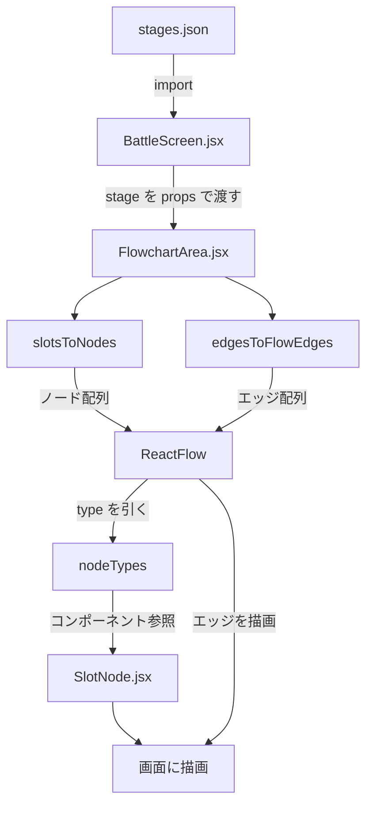

# フローチャートが描画されるまでの流れ

戦闘画面中段のフローチャート領域に空きスロットとエッジが描画される
仕組みを、データの流れに沿って説明する。

## 全体像



## ステップごとの流れ

### 1. ステージ定義を JSON で持つ

`frontend/src/data/stages.json` に、スロットの ID と位置、エッジの始点/終点が
静的に定義されている。ビルド時に Vite がバンドルに含めるので実行時に
fetch する必要はない。

```json
{
  "stages": {
    "1-1": {
      "slots": [
        { "id": "slot-1", "position": { "x": 80,  "y": 120 } },
        { "id": "slot-2", "position": { "x": 280, "y": 120 } },
        { "id": "slot-3", "position": { "x": 480, "y": 120 } }
      ],
      "edges": [
        { "id": "e1-2", "source": "slot-1", "target": "slot-2" },
        { "id": "e2-3", "source": "slot-2", "target": "slot-3" }
      ]
    }
  }
}
```

### 2. `BattleScreen` が先頭ステージを `FlowchartArea` に渡す

`BattleScreen.jsx` は JSON を import し、`stages['1-1']` を props で
`FlowchartArea` に渡す。現在は 1 ステージ固定だが、将来ステージ切り替えが
入ったときはここが「ストアから現在のステージを選ぶ」責務に変わる。

```jsx
import stagesData from '../../data/stages.json';
const stage = stagesData.stages['1-1'];

<FlowchartArea stage={stage} />
```

### 3. `FlowchartArea` が React Flow 用の形式に変換する

`FlowchartArea.jsx` は受け取った `stage` を、React Flow が要求する
ノード配列・エッジ配列に変換する。変換は 2 つのヘルパー関数で行う。

#### 3-1. `slotsToNodes` — スロット → React Flow ノード

各スロットに `type: 'slot'` を付与する。この `type` が後段で「どの
コンポーネントで描画するか」を決める手がかりになる。

```js
slots.map((slot) => ({
  id: slot.id,
  type: 'slot',       // ← SlotNode で描画する印
  position: slot.position,
  data: {},
}));
```

#### 3-2. `edgesToFlowEdges` — エッジ → React Flow エッジ

- `source`/`target` のスロットが存在しないエッジは silent に除外（`console.warn` のみ）。
- `markerEnd: MarkerType.ArrowClosed` を付けて矢印付きの線にする。

```js
edges
  .filter((e) => slotIds.has(e.source) && slotIds.has(e.target))
  .map((e) => ({
    id: e.id,
    source: e.source,
    target: e.target,
    markerEnd: { type: MarkerType.ArrowClosed },
  }));
```

不整合データで画面全体が落ちないようにするためのガードレールで、
開発時はコンソール警告で検知できる。

### 4. `nodeTypes` で「type → 描画コンポーネント」を対応づける

`FlowchartArea.jsx` のモジュールトップに以下の辞書を定義している。

```js
import SlotNode from './SlotNode';
const nodeTypes = { slot: SlotNode };
```

この辞書を `<ReactFlow nodeTypes={nodeTypes} />` として渡すことで、
React Flow は「`type: 'slot'` のノードに出会ったら `SlotNode` で
描画する」という対応表を手に入れる。

> 補足：`SlotNode` の後ろに `()` が付いていない点に注意。ここでは
> 関数そのもの（関数への参照）を辞書の値として渡しており、React Flow
> が描画のタイミングで自分で `<SlotNode />` として実行する。

### 5. `<ReactFlow />` がキャンバスを描画する

`FlowchartArea` は変換したノード/エッジを `<ReactFlow />` に渡す。
本スペックは描画専用なので、パン・ズーム・ドラッグ・選択は全て無効化し、
`fitView` で初期表示時にグラフ全体が領域に収まるようにしている。

```jsx
<ReactFlow
  nodes={nodes}
  edges={edges}
  nodeTypes={nodeTypes}
  nodesDraggable={false}
  nodesConnectable={false}
  elementsSelectable={false}
  panOnDrag={false}
  zoomOnScroll={false}
  zoomOnPinch={false}
  zoomOnDoubleClick={false}
  fitView
  proOptions={{ hideAttribution: true }}
/>
```

### 6. `SlotNode` が 1 つのスロットを描画する

React Flow はノードごとに `nodeTypes[node.type]` を引き、該当コンポーネントを
呼び出す。`SlotNode` は点線枠の `div` と、エッジ接続用の `Handle` を返す。

```jsx
function SlotNode() {
  return (
    <div className={styles.slot}>
      <Handle type="target" position={Position.Left}  ... />
      <Handle type="source" position={Position.Right} ... />
    </div>
  );
}
```

`Handle` はエッジが「どこに繋がるか」を React Flow に教える接続点。
ユーザーがドラッグで接続を作る用途ではないため CSS で視覚的には
非表示にしているが、エッジの始点・終点の位置決めには必須。

### 7. 画面に反映される

React Flow は
- ノードの `position` に従って各 `SlotNode` を SVG/HTML で配置し、
- エッジの `source`/`target` のスロットの Handle 同士を線で結び、
- `markerEnd` の設定に従って終点に矢印を描画する。

結果として、戦闘画面中段に「点線枠のカード3枚が矢印で繋がった図」が
表示される。

## 関連ファイル一覧

| ファイル | 役割 |
|---|---|
| `frontend/src/data/stages.json` | スロットとエッジの静的定義 |
| `frontend/src/features/battle/BattleScreen.jsx` | ステージデータを読み込み `FlowchartArea` に渡す |
| `frontend/src/features/battle/BattleScreen.module.css` | 3 段レイアウトと中段の領域確保 |
| `frontend/src/features/battle/flowchart/FlowchartArea.jsx` | React Flow キャンバス・データ変換・インタラクション制御 |
| `frontend/src/features/battle/flowchart/FlowchartArea.module.css` | キャンバスを親要素いっぱいに広げる |
| `frontend/src/features/battle/flowchart/SlotNode.jsx` | 1 スロットの描画（点線枠 + Handle） |
| `frontend/src/features/battle/flowchart/SlotNode.module.css` | 空きスロットの見た目（点線・角丸・背景） |

## 関連する設計ドキュメント

- 要件定義: `.specs/flowchart-rendering/requirements.md`
- 設計書: `.specs/flowchart-rendering/design.md`
- タスク一覧: `.specs/flowchart-rendering/tasks.md`
